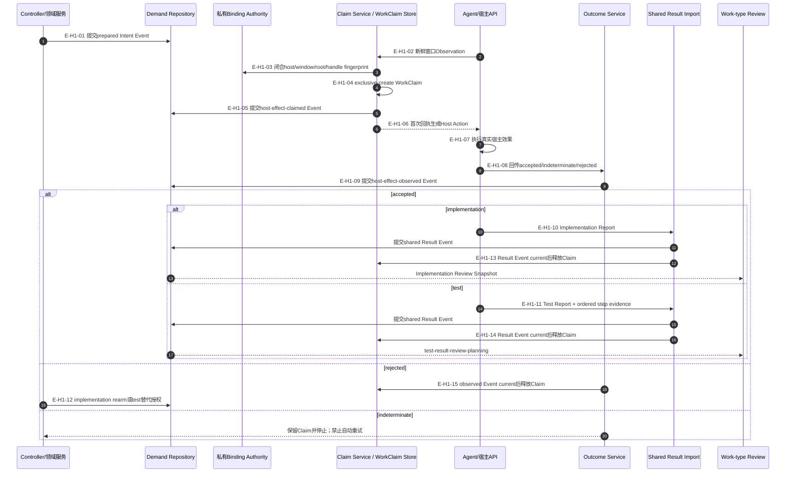

# Agent宿主效果握手

### 本图术语说明

| 术语 | 解释 |
| --- | --- |
| handle fingerprint | 对raw handle的不可逆闭合比较值；注册请求/私有Binding可见原值，Action、Event、投影和公开结果不携带 |
| 首次回执 | `committed` Claim Event回执；idempotent重放不重复签发Action |
| host effect | 创建/发送到窗口等真实外部副作用，不由事件文件本身执行 |
| indeterminate | 不能安全判断效果是否发生，必须人工/显式恢复 |
| workType | `implementation | test`判别来源；共享Claim/Observation/Result Event，但Report、lineage和Review判断不同 |
| test替代授权 | 仅在`rejected-before-effect + unavailable`后追加同一Test attempt的新Delivery Intent，不是自动重试 |

## H1边级证据

| 边编号 | 代码证据 | 核验结论 |
| --- | --- | --- |
| `E-H1-01`–`E-H1-06` | Preparation、Claim Authority/Service、Binding Store | Claim文件和claimed Event先于首次Action；idempotent重放不再签发 |
| `E-H1-07`–`E-H1-09` | Agent与Outcome Service | Agent执行外部效果；Wakeflow只记录观察 |
| `E-H1-10`、`E-H1-11`、`E-H1-13`、`E-H1-14` | Shared Result Import | accepted来源提交Result Event后精确释放Claim |
| `E-H1-12`、`E-H1-15` | Outcome/Rearm/Test Preparation | rejected Event后释放Claim，再显式rearm或replacement；indeterminate保留Claim |

## 停止边界

Claim、Outcome与Rearm已作为公共MCP工具发布；它们只管理Wakeflow事实，Agent仍是唯一宿主效果执行者。
