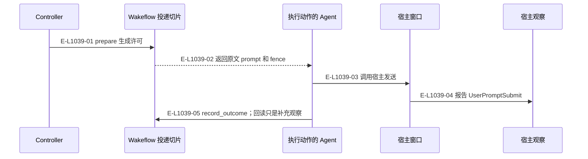
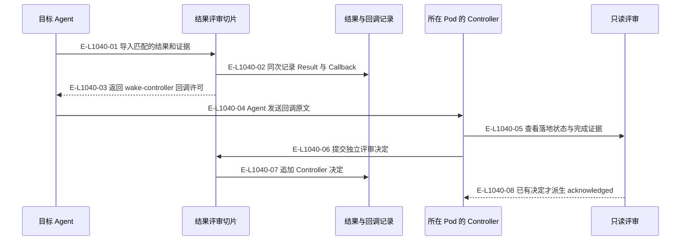

# 宿主握手：向下投递与向上回调

启动、投递、回调和关闭分别有内容、动作及观察；不合并为一个后台宿主执行器。

> 核验基线：`1480271`（L1 observation 第十片已落地，20 个公共工具、18 个一次性场景）。工作树另有并行未提交改动（宿主 hook 通道等），本图不描绘；来源指纹按当前工作树计算。本文说明实现事实，未宣称双宿主真实会话已经验证。

## 向目标窗口投递

### 本图术语说明

| 术语 | 本图含义 |
| --- | --- |
| permit | 供 Agent 使用的投递内容与围栏；重放不是新一次发送授权。 |
| fence | claimId、claimDigest 与流修订构成的准入令牌。 |
| hook | 宿主回交的会话/提示提交/完成观察记录，保存在宿主本地根。 |

### 节点与实现定位

| 节点 | 文件 / 符号 | 责任 |
| --- | --- | --- |
| controller | Agent / 用户 / 外部效果或条件视图 | Controller |
| wf | `src/capabilities/delivery/service.ts` | Wakeflow 投递切片 |
| agent | Agent / 用户 / 外部效果或条件视图 | 执行动作的 Agent |
| host | Agent / 用户 / 外部效果或条件视图 | 宿主窗口 |
| hook | `src/kernel/hook-observations.ts` | 宿主观察 |

### 本图边级证据

| 编号 | 代码定位 | 测试 / 核验 | 关系依据 |
| --- | --- | --- | --- |
| E-L1039-01 | `src/capabilities/delivery/service.ts#executePrepareDeliveryRequest` | `tests/capabilities/delivery/service.test.ts` | prepare 生成许可 |
| E-L1039-02 | `src/capabilities/delivery/service.ts#prepareResult` | `tests/capabilities/delivery/service.test.ts` | 返回原文 prompt 和 fence |
| E-L1039-03 | `src/capabilities/delivery/service.ts#permitBody` | `tests/capabilities/delivery/service.test.ts` | 调用宿主发送 |
| E-L1039-04 | `src/kernel/hook-observations.ts#writeHostHookObservation` | `tests/capabilities/delivery/service.test.ts` | 报告 UserPromptSubmit |
| E-L1039-05 | `src/capabilities/delivery/service.ts#executeRecordDeliveryOutcomeRequest` | `tests/capabilities/delivery/service.test.ts` | record_outcome；回读只是补充观察 |

## 固定回调唤醒所在 Pod 的 Controller

### 本图术语说明

| 术语 | 本图含义 |
| --- | --- |
| 回调 | 结果导入返回的 wake-controller 传输内容；送达不等于接受结果。 |
| Pod | 完整窗口组与每仓执行位置；main 是 primary Pod。 |
| hook | 宿主回交的会话/提示提交/完成观察记录，保存在宿主本地根。 |

### 节点与实现定位

| 节点 | 文件 / 符号 | 责任 |
| --- | --- | --- |
| target | Agent / 用户 / 外部效果或条件视图 | 目标 Agent |
| review | `src/capabilities/result-review/service.ts` | 结果评审切片 |
| event | `src/governance/demand/event-sourcing/demand-event-sourcing-command-handler.ts` | 结果与回调记录 |
| controller | Agent / 用户 / 外部效果或条件视图 | 所在 Pod 的 Controller |
| inspect | `src/capabilities/result-review/service.ts` | 只读评审 |

### 本图边级证据

| 编号 | 代码定位 | 测试 / 核验 | 关系依据 |
| --- | --- | --- | --- |
| E-L1040-01 | `src/capabilities/result-review/service.ts#executeImport` | `tests/capabilities/result-review/service.test.ts` | 导入匹配的结果和证据 |
| E-L1040-02 | `src/capabilities/result-review/service.ts#executeImport` | `tests/capabilities/result-review/service.test.ts` | 同次记录 Result 与 Callback |
| E-L1040-03 | `src/capabilities/result-review/service.ts#importResult` | `tests/capabilities/result-review/service.test.ts` | 返回 wake-controller 回调许可 |
| E-L1040-04 | `src/capabilities/result-review/prompt.ts` | `tests/capabilities/result-review/service.test.ts` | Agent 发送回调原文 |
| E-L1040-05 | `src/capabilities/result-review/service.ts#inspectReview` | `tests/capabilities/result-review/service.test.ts` | 查看落地状态与完成证据 |
| E-L1040-06 | `src/capabilities/result-review/service.ts#executeImplementationDecision` | `tests/capabilities/result-review/service.test.ts` | 提交独立评审决定 |
| E-L1040-07 | `src/capabilities/result-review/service.ts#executeImplementationDecision` | `tests/capabilities/result-review/service.test.ts` | 追加 Controller 决定 |
| E-L1040-08 | `src/capabilities/result-review/service.ts#inspectReview` | `tests/capabilities/result-review/service.test.ts` | 已有决定才派生 acknowledged |

## 守卫、恢复与验证范围

inspect 始终只读。acknowledged 由已有决定派生，不是第一次查询偷偷写事件。回调重发经 rearm_delivery，静默与代际上限仍有效；旧绑定变化须重新对照当前 Controller。

涉及的测试与核验入口：

- `tests/capabilities/delivery/service.test.ts`。
- `tests/capabilities/result-review/service.test.ts`。

## 下钻与相关视图

- [本专题总览](./README.md)
- [图谱总索引](../README.md)
- [核验与剩余范围](../01-diagram-review-ledger.md)
