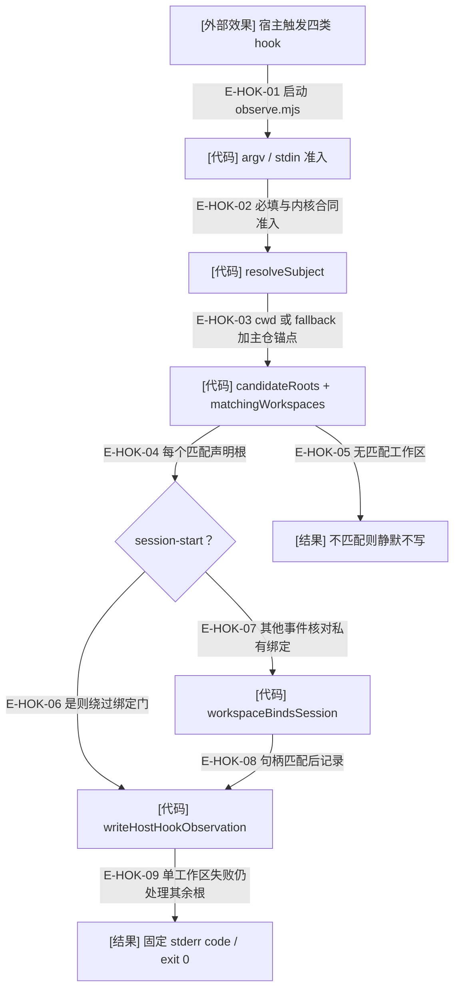
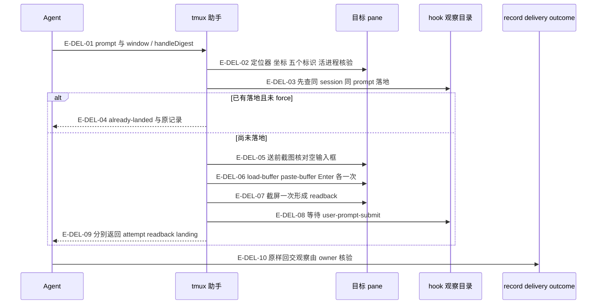
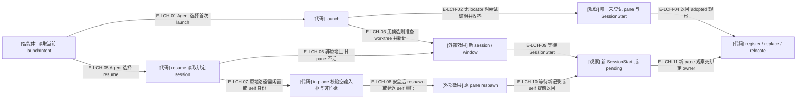

# 宿主握手：创建、投递与观察

当前实现有两条传输路径：Codex 的 Agent 调宿主线程工具，Claude 的 Agent 运行维护安装的 tmux 助手。MCP 不直接创建窗口或发送提示；Claude 助手内部确实执行进程与 Git 操作，因此不能笼统写成“整个插件从不 spawn”。

## Hook 如何定位并写入

```mermaid
flowchart TB
  accTitle: Hook 从宿主事件到工作区观察的准入路径
  accDescr: Hook 校验固定参数和必填载荷，按 cwd 与 worktree 主仓库发现当前格式声明工作区，session-start 直接记录，其他事件必须经过已绑定会话门，最终由内核写观察。
  H["[外部效果] 宿主触发四类 hook"]
  P["[代码] argv / stdin 准入"]
  S["[代码] resolveSubject"]
  C["[代码] candidateRoots + matchingWorkspaces"]
  G{"session-start？"}
  B["[代码] workspaceBindsSession"]
  W["[代码] writeHostHookObservation"]
  N["[结果] 不匹配则静默不写"]
  F["[结果] 固定 stderr code / exit 0"]
  H -->|"E-HOK-01 启动 observe.mjs"| P
  P -->|"E-HOK-02 必填与内核合同准入"| S
  S -->|"E-HOK-03 cwd 或 fallback 加主仓锚点"| C
  C -->|"E-HOK-04 每个匹配声明根"| G
  C -->|"E-HOK-05 无匹配工作区"| N
  G -->|"E-HOK-06 是则绕过绑定门"| W
  G -->|"E-HOK-07 其他事件核对私有绑定"| B
  B -->|"E-HOK-08 句柄匹配后记录"| W
  W -->|"E-HOK-09 单工作区失败仍处理其余根"| F
```

### 本图术语说明

| 术语 | 含义 |
| --- | --- |
| 四类 hook | SessionStart / UserPromptSubmit / Stop / SessionEnd 分别映射 session-start / user-prompt-submit / stop / session-end。 |
| subject | realpath(cwd)；cwd 消失才使用绝对 CLAUDE_PROJECT_DIR；worktree 指针只读，不执行 git。 |
| 声明匹配 | 候选根来自锚点及最多八级祖先、祖先的直接子目录；读取配置身份及 repositories/supportSurfaces 路径。 |
| 绑定门 | session-start 允许发现待登记会话；后三种事件只写入已持有 session_id 的工作区。 |
| 退化可选字段 | turnId/transcript 不合内核合同变 null；无效可选字段不丢弃已成立的会话事实。 |

### 本图边级证据

| 编号 | 代码证据 | 测试证据 |
| --- | --- | --- |
| E-HOK-01 | `src/hosts/codex/codex-hook-fragment.ts#CODEX_HOOK_FRAGMENT` 与 `src/hosts/claude-code/claude-code-hook-fragment.ts#CLAUDE_CODE_HOOK_FRAGMENT`；`src/entrypoints/wakeflow-hook-observer.ts#main`。 | `tests/entrypoints/wakeflow-hook-observer.test.ts#spawnLauncher` |
| E-HOK-02 | `src/entrypoints/wakeflow-hook-observer.ts#parseHost` / parsePayload / recordInput。 | `tests/entrypoints/wakeflow-hook-observer.test.ts#runWakeflowHookObserver` |
| E-HOK-03 | `src/entrypoints/wakeflow-hook-observer.ts#resolveSubject` 只读 gitdir 指针。 | `tests/entrypoints/wakeflow-hook-observer.test.ts#addWorktree` |
| E-HOK-04 | `src/entrypoints/wakeflow-hook-observer.ts#matchingWorkspaces` 按结构化配置路径判等/子树/主仓。 | `tests/entrypoints/wakeflow-hook-observer.test.ts#runWakeflowHookObserver` |
| E-HOK-05 | `src/entrypoints/wakeflow-hook-observer.ts#observe` 对空匹配返回 code:null。 | `tests/entrypoints/wakeflow-hook-observer.test.ts#runWakeflowHookObserver` |
| E-HOK-06 | observe 对 session-start 不执行 workspaceBindsSession。 | `tests/entrypoints/wakeflow-hook-observer.test.ts#writeBinding` |
| E-HOK-07 | `src/entrypoints/wakeflow-hook-observer.ts#workspaceBindsSession` 读取 handle.value。 | `tests/entrypoints/wakeflow-hook-observer.test.ts#writeBinding` |
| E-HOK-08 | `src/entrypoints/wakeflow-hook-observer.ts#writeObservation` 打开 RootedDirectory 并调用 `src/kernel/hook-observations.ts#writeHostHookObservation`；写入器规范比较旧v1可选字段后判断current。 | `tests/entrypoints/wakeflow-hook-observer.test.ts#readBack`；`tests/kernel/hook-observations.test.ts#writeHostHookObservation` |
| E-HOK-09 | observe 保留已写列表；`src/entrypoints/wakeflow-hook-observer.ts#registerProcessGuards` 单次登记固定 stderr。 | `tests/entrypoints/wakeflow-hook-observer.test.ts#registerProcessGuards` |

配置轻读只接受当前 `WakeflowConfig` 版本 2；版本不符跳过候选，不迁移或补写配置。hook 的制品摘要只证明观察脚本，不能证明该会话的常驻 MCP 或已加载技能版本。

观察入口的读取是有界诊断发现，不是完整 workspace inventory：候选子目录至多 1024 个、绑定候选至多 4096 个、目录流至多 65536 项。达到上限仍处理已收集候选，因此无记录不能证明宿主不存在。Stop 只说明宿主结束了某一回合；中断/API 失败缺 Stop 时不能伪造完成。SessionEnd 也不能当实时活性心跳。

写入幂等按规范事实比较，不能要求所有历史字节都带后来新增的可选键。`src/kernel/hook-observations.ts#sameObservationDocument` 将缺失artifactManifestDigest的旧v1记录解析为null，再渲染比较；`writeHostHookObservation` 重试时优先沿用旧平面位置，返回current且原路径/字节不变。新记录才写UTC日/摘要前缀分片；同名不同事实仍以observation-conflict拒绝。`tests/kernel/hook-observations.test.ts#writeHostHookObservation` 同时断言current、旧路径和旧字节保持。

## Claude 投递：先定位，再发一次，再等证据

```mermaid
sequenceDiagram
  accTitle: Claude 一次投递的发送与落地证据分离
  accDescr: Agent 持有许可后运行助手，助手先验证 pane 和既有落地记录，再检查可用输入框，只粘贴回车一次，屏幕回读与 hook 落地分别返回，由结果记录能力判断。
  participant A as Agent
  participant H as tmux 助手
  participant P as 目标 pane
  participant O as hook 观察目录
  participant W as record delivery outcome
  A->>H: E-DEL-01 prompt 与 window / handleDigest
  H->>P: E-DEL-02 定位器 坐标 五个标识 活进程核验
  H->>O: E-DEL-03 先查同 session 同 prompt 落地
  alt 已有落地且未 force
    H-->>A: E-DEL-04 already-landed 与原记录
  else 尚未落地
    H->>P: E-DEL-05 送前截图核对空输入框
    H->>P: E-DEL-06 load-buffer paste-buffer Enter 各一次
    H->>P: E-DEL-07 截屏一次形成 readback
    H->>O: E-DEL-08 等待 user-prompt-submit
    H-->>A: E-DEL-09 分别返回 attempt readback landing
  end
  A->>W: E-DEL-10 原样回交观察由 owner 核验
```

### 本图术语说明

| 术语 | 含义 |
| --- | --- |
| 定位器 | 私有 window locator 的 tmux 坐标与 bindingId/locatorId；关联 pane 必须恰好一个。 |
| 送前拒绝 | 无输入框、菜单/信任/权限对话、已有输入均不粘贴；force 不绕过此门。 |
| attempt | load-buffer 失败为 failed-before-send；paste 或 Enter 失败为 unknown；发送成功为 sent。 |
| readback | 首行标记或行数匹配的折叠粘贴指示出现在屏幕，仅是屏幕证据。 |
| landing | 目标绑定 session 的 user-prompt-submit 记录匹配规范 promptDigest，才是 hook 落地证据。 |

### 本图边级证据

| 编号 | 代码证据 | 测试证据 |
| --- | --- | --- |
| E-DEL-01 | `src/hosts/claude-code/claude-code-agent-text-profile.ts#CLAUDE_CODE_AGENT_TEXT_PLACEHOLDERS` deliveryAction；助手源为 `src/hosts/claude-code/claude-code-tmux-asset.ts#CLAUDE_CODE_TMUX_ASSET_CONTENT`，内部 commandDeliver。 | `tests/hosts/claude-code/claude-code-tmux-asset.test.ts#runHelper` |
| E-DEL-02 | 同一资产内 locateDeliveryPane 对坐标或标识相关 pane 计数，再检查进程/句柄摘要。 | `tests/hosts/claude-code/claude-code-tmux-asset.test.ts#runHelper` |
| E-DEL-03 | 同一资产 commandDeliver 在 paste 前 observeLanding(...,0)。 | `tests/hosts/claude-code/claude-code-tmux-asset.test.ts#CLAUDE_CODE_TMUX_ASSET_CONTENT` |
| E-DEL-04 | commandDeliver 的 already-landed 分支返回 beforeSend 与现有 landing，不再发第二遍。 | `tests/hosts/claude-code/claude-code-tmux-asset.test.ts#runHelper` |
| E-DEL-05 | commandDeliver 调 promptAssessment；force 不跳过输入框判断。 | `tests/hosts/claude-code/claude-code-tmux-asset.test.ts#runHelper` |
| E-DEL-06 | 资产内 pasteAndSubmit 将 load / paste / enter 的失败阶段分开。 | `tests/hosts/claude-code/claude-code-tmux-asset.test.ts#tmuxLog` |
| E-DEL-07 | 资产内 readbackObservation 与 pastedIndicatorAgrees；屏幕摘要只公开 sha256。 | `tests/hosts/claude-code/claude-code-tmux-asset.test.ts#runHelper` |
| E-DEL-08 | 资产内 observeLanding → latestHookRecord，支持 UTC 日/摘要前缀分片；不可读候选拒绝。 | `tests/hosts/claude-code/claude-code-tmux-asset.test.ts#runHelper` |
| E-DEL-09 | commandDeliver 构造 attempt/readback/landing 三个独立字段。 | `tests/hosts/claude-code/claude-code-tmux-asset.test.ts#runHelper` |
| E-DEL-10 | `src/capabilities/delivery/service.ts#executeRecordDeliveryOutcomeRequest` 是状态 owner；助手自己不写 delivery 事件。 | 未覆盖：本页桩测试证明助手输出与序列，跨真实 Claude 会话和公共记录工具的联验本轮未执行。 |

Codex 走不同传输：`src/hosts/codex/codex-agent-text-profile.ts#CODEX_AGENT_TEXT_PLACEHOLDERS` 要求 Agent 发送一次并保留thread send返回，`src/capabilities/delivery/decide.ts#sendReturnProvesLanding` 按profile的host-thread能力准入，不按宿主名推断。两条路径的Controller接受都在结果导入/评审之后。Codex 的创建与执行目录现已拆分：[外层项目聊天与执行根](./project-chats-and-execution-roots.md)。

### 回交时遇到不完整hook查询

`src/capabilities/delivery/service.ts#sessionRecords` 把complete:false、skipped>0分别转换为observation-query-incomplete/unavailable。`src/capabilities/delivery/service.ts#observedOutcomeDecision` 仅捕获这两种错误，使用空hook集合重新调用decideOutcome；只有真正独立成立的证据才可继续。它不把查询错误降级为一次普通的“没有找到”。

| 回交来源 | 不完整hook查询下的当前结果 | 测试证据 |
| --- | --- | --- |
| Codex发送成功返回，attempt为sent且有evidenceDigest | host-send-return可独立判accepted；不修改损坏或未知观察文件。 | `tests/capabilities/delivery/service.test.ts#recordFixtureDeliveryOutcome` |
| 当前indeterminate，Controller明确判未落地并给rationale | controller-resolution可判rejected-before-send，提交结果后释放仍属于本围栏的claim。 | `tests/capabilities/delivery/service.test.ts#recordFixtureDeliveryOutcome` |
| Controller要求accepted但引用hook无法在完整集合中核实 | 仍拒绝；`src/capabilities/delivery/decide.ts#resolutionDecision` 要求hookRecordId及resolutionRecordFound。 | 未覆盖：本页未新增这一组合的执行断言，结论来自明确准入条件。 |
| 只有Agent声明、屏幕readback或failed-before-send声明 | 原观察错误继续上抛，不追加一个基于缺失证据的outcome。 | `tests/capabilities/delivery/service.test.ts#recordFixtureDeliveryOutcome` |

取消、其他I/O失败不在该回退范围内。这里的Decision.accepted表示“准入这一决定”，不是一律得到投递accepted；Controller否定落地分支的实际disposition仍是rejected-before-send。

## Claude 新建、收养和续接

```mermaid
flowchart LR
  accTitle: Claude 会话启动与续接的分支边界
  accDescr: launch 优先收养有 hook 证明的未登记 pane，否则按意图创建；resume 在绑定会话上选择新 pane 或原地重启，原地重启有忙碌守卫，所有观察最终交绑定工具复核。
  A["[智能体] 读取当前 launchIntent"]
  L["[代码] launch"]
  D["[观察] 唯一未登记 pane 与 SessionStart"]
  N["[外部效果] 新 session / window"]
  R["[代码] resume 读取绑定 session"]
  I["[代码] in-place 校验空输入框与非忙碌"]
  S["[外部效果] 原 pane respawn"]
  O["[观察] 新 SessionStart 或 pending"]
  B["[代码] register / replace / relocate"]
  A -->|"E-LCH-01 Agent 选择首次 launch"| L
  L -->|"E-LCH-02 无 locator 时尝试证明并收养"| D
  L -->|"E-LCH-03 无候选则准备 worktree 并新建"| N
  D -->|"E-LCH-04 返回 adopted 观察"| B
  A -->|"E-LCH-05 Agent 选择 resume"| R
  R -->|"E-LCH-06 非原地且旧 pane 不活"| N
  R -->|"E-LCH-07 原地路径需闲置或 self 身份"| I
  I -->|"E-LCH-08 安全后 respawn 或延迟 self 重启"| S
  N -->|"E-LCH-09 等待 SessionStart"| O
  S -->|"E-LCH-10 等待新记录或 self 提前返回"| O
  O -->|"E-LCH-11 新 pane 观察交绑定 owner"| B
```

### 本图术语说明

| 术语 | 含义 |
| --- | --- |
| 收养 | launch 找到恰好一个带 program/host/window 标识、没有 binding/locator 标识的活 Claude pane，并有该进程会话的 SessionStart 记录；不重复创建。 |
| 新 pane 续接 | resume 用既有绑定 session 与 --resume 启动；成功观察用于 relocate，随后 mark。 |
| 原地续接 | 同一 pane 内重启同一 session，保留坐标/绑定/标识；不需要 relocate 或 mark。图末边只指新 pane。 |
| self 重启 | 助手正运行在目标 pane 时，校验 CLAUDE_CODE_SESSION_ID 后安排两秒后重启，先返回 scheduled；它不是即时成功证明。 |
| pending | hook 尚未到，但 pane 仍活；pane 已死则 launch-exited/resume-exited，不能当待登记成功。 |

### 本图边级证据

| 编号 | 代码证据 | 测试证据 |
| --- | --- | --- |
| E-LCH-01 | `src/hosts/claude-code/claude-code-agent-text-profile.ts#CLAUDE_CODE_AGENT_TEXT_PLACEHOLDERS` windowLaunch 指向当前 inspect/维护意图。 | `tests/hosts/claude-code/claude-code-tmux-asset.test.ts#launchIntent` |
| E-LCH-02 | `src/hosts/claude-code/claude-code-tmux-asset.ts#CLAUDE_CODE_TMUX_ASSET_CONTENT` 内 adoptionCandidate 与 sessionIdOfProcess。 | `tests/hosts/claude-code/claude-code-tmux-asset.test.ts#runHelper` |
| E-LCH-03 | 资产内 commandLaunch / prepareWorktree / openTmuxWindow；local-head 从仓库 HEAD 创建，已有分支无检出则拒绝。 | `tests/hosts/claude-code/claude-code-tmux-asset.test.ts#realGitPath` |
| E-LCH-04 | commandLaunch 的 adopted 分支返回原 session 与当前 intentDigest。 | `tests/hosts/claude-code/claude-code-tmux-asset.test.ts#runHelper` |
| E-LCH-05 | commandResume 读取窗口绑定私有 handle，而不是新造会话身份。 | `tests/hosts/claude-code/claude-code-tmux-asset.test.ts#writeBinding` |
| E-LCH-06 | assertLocatorNotLive；非 in-place resume 创建新 pane。 | `tests/hosts/claude-code/claude-code-tmux-asset.test.ts#runHelper` |
| E-LCH-07 | resumeInPlace / idleAssessment；self 分支按进程环境身份核对，不用当前正在工作的屏幕作闲置证明。 | `tests/hosts/claude-code/claude-code-tmux-asset.test.ts#runHelper` |
| E-LCH-08 | respawnArguments 与 scheduleSelfRespawn；force 不绕过 idleAssessment。 | `tests/hosts/claude-code/claude-code-tmux-asset.test.ts#waitForTmuxCall` |
| E-LCH-09 | waitForSessionStart / waitForNewSessionStart，超时后 assertPaneAlive。 | `tests/hosts/claude-code/claude-code-tmux-asset.test.ts#runHelper` |
| E-LCH-10 | 原地非 self 等新 hook，self 仅 scheduled 提前返回；后续会话重新 verify。 | `tests/hosts/claude-code/claude-code-tmux-asset.test.ts#waitForTmuxCall` |
| E-LCH-11 | `src/capabilities/endpoint/service.ts#executeWindowBindingRequest` 核验观察；资产命令仅输出 JSON。 | 未覆盖：本页没有把桩会话的输出当成完整真实端点登记联验。 |

### 需要保留的限制

hook 查询只代表保留期内可读记录；没有 prompt 记录的旧会话会被 resume-never-conversed 拒绝，这不等于证明它一生从未对话。tmux 助手的 nudge 只在末尾 API Error 且空输入时发送一句，返回的屏幕诊断不能成为任务接受证据。close 必须同时匹配定位器坐标与五个标识；无法唯一证明则返回 unknown。teardown 的 force 是显式危险覆盖参数，流程图不将它列为常规恢复步骤。

测试方法：助手资产字节由 node 执行；tmux/claude 大多是记录 argv 的桩；local-head 用例调用真实 Git。此页说明已存在的断言，未声称本轮运行真实宿主。

## 返回 Controller 的 callback 不是第二次任务投递

目标导入报告时，`src/capabilities/result-review/service.ts#executeImport` 调 issueCallback 生成第一代 callback，再把它与结果一起提交，返回 send-prompt-to-window 许可。Agent 使用宿主传输发送，代码没有替 Agent 发消息；这个许可没有工作 claim。rc.4 将目标、报告摘要与分支引用成内联 JSON 数据，且先声明“本回调不携带任何授权”。宿主把内容显示为 user 消息也不会改变数据来源。

| 观察或动作 | 谁产生 | 真实消费与边界 |
| --- | --- | --- |
| callback 签发 | result-review 导入服务 | 证明结果事件已绑定回调文本、摘要、窗口和签发代际，不证明发送或落地。 |
| callback 落地 | Controller 会话的 user-prompt-submit hook | inspect 与决定服务从当前窗口绑定会话读匹配摘要及 issuedAt 后的记录；host send 返回不直接生成这份 hook 事实。 |
| targetCompletion | 目标会话的 stop / turn-complete | 结果评审按 recordedAt ≥ reportedAt 选首条；不能用 Controller 的回调记录代替目标完成。 |
| callback acknowledged | 读侧看到当前 review decision | inspect 只推导，不写“已读”；blocked / escalated 决定也可 acknowledged，而非仅 accept。 |
| 业务 acceptance | Controller 独立检查后提交 review decision | 重新核业务基线、观察和判断合同；回调未落地不构成 accept 的必需条件，目标完成观察仍是 accept 的门。 |

以上边界由 `tests/capabilities/result-review/prompt.test.ts#renderWakeControllerPrompt`、`tests/capabilities/result-review/decide.test.ts#deriveCallbackLanding`、`tests/capabilities/result-review/decide.test.ts#deriveTargetCompletion` 与 `tests/capabilities/result-review/service.test.ts#inspectFixtureReview` 的实际断言支撑。它们没有运行真实宿主发送；callback 重发和只读停止分支见[回调信任与评审](../07-review-rework-completion/callback-trust-and-review.md)。

[返回总览](./README.md) · [公共 MCP](./runtime-call-flow.md) · [端点权威](../12-endpoint/README.md)
