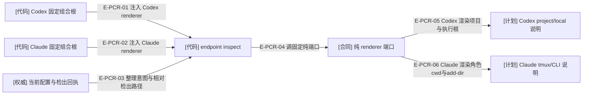
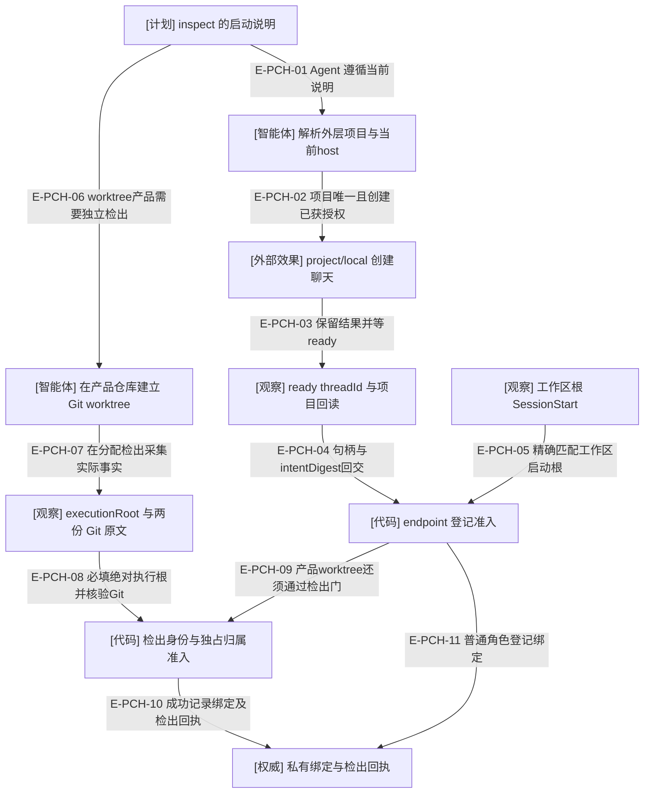

# 项目聊天、启动根与执行根分别负责什么

Codex 当前生成的是**同一外层 Workspace 项目里的 project/local 角色聊天**。聊天从工作区根启动，但 Design 草稿在 Design surface、实现工作在分配的产品检出、测试在测试合同指定位置执行。角色来自配置 windowId 与唯一绑定，不来自聊天标题或初始 cwd；项目归属也不扩大角色写入权限。

| 事实 | Producer 与核验位置 | 不可替代的另一事实 |
| --- | --- | --- |
| 项目归属 | Agent 按规范工作区路径和当前 host 查项目，创建后由宿主回读 projectId；列表暂缺时直接 UI 确认并披露 | SessionStart.cwd、标题、配置 windowId 均不证明侧栏归属；运行时绑定请求也不保存 projectId。 |
| 启动根 | Codex 的 SessionStart 必须是工作区根；`sessionRootMatcher` 按 launch.kind 判断 | 角色执行根可以不同，不能反过来放宽 SessionStart 根准入。 |
| 执行根 | 普通角色用配置 root；Pod 产品用经过 Git 身份校验的 worktree.executionRoot | 聊天项目的 worktree 环境属于外层项目主仓库，不替代产品仓库 Git worktree。 |
| 逻辑身份 | 私有 Binding 绑定 windowId 与 ready threadId；clientThreadId 不可作为 handle | UI 归档不等于 Git 检出清理；工作区登记也不等于 Controller 接受任务。 |

## 程序生成的是宿主说明

### 本图术语说明

| 术语 | 含义 |
| --- | --- |
| renderer | `WakeflowWindowLaunchInstructionsRenderer` 接收领域事实并返回 JsonObject；没有宿主调用、项目查找或绑定写入。 |
| project/local | `create_thread` 的目标类型和环境；说明中 projectId 是待宿主解析的占位符，不是 Wakeflow 缓存值。 |
| attachedWorktrees | Test 所需检出的回执视图；receipt-missing 没有路径，不能捏造或从聊天 cwd 推出。 |
| Claude cwd | 会话本身仍从配置角色根或真实 worktree 启动；其执行根来自 SessionStart，不接收额外覆盖。 |

### 本图边级证据

| 编号 | 代码证据 | 测试证据 |
| --- | --- | --- |
| E-PCR-01 | `src/entrypoints/codex-wakeflow-mcp.ts#CODEX_HOST_FACADE` 注入 `src/hosts/codex/codex-window-launch-instructions.ts#renderCodexWindowLaunchInstructions`。 | `tests/capabilities/endpoint/service.test.ts#renderCodexWindowLaunchInstructions`；未覆盖：此测试直接组合 facade，入口注入另由源码核验。 |
| E-PCR-02 | `src/entrypoints/claude-code-wakeflow-mcp.ts#CLAUDE_CODE_HOST_FACADE` 注入 `src/hosts/claude-code/claude-code-window-launch-instructions.ts#renderClaudeCodeWindowLaunchInstructions`。 | `tests/capabilities/endpoint/service.test.ts#renderClaudeCodeWindowLaunchInstructions`；未覆盖：同上，未把组合源码视为现场创建证据。 |
| E-PCR-03 | `src/capabilities/endpoint/service.ts#attachedWorktreeViews` 由回执生成路径；executionInstructions 读取当前 snapshot.model。 | `tests/capabilities/pod/service.test.ts#executeWindowBindingRequest` |
| E-PCR-04 | `src/capabilities/endpoint/service.ts#executionInstructions` 调 facade.renderLaunchInstructions；端口定义在 `src/workspace/window-runtime/wakeflow-window-launch-instructions.ts#WakeflowWindowLaunchInstructionsRenderer`。 | `tests/capabilities/endpoint/service.test.ts#executeWindowBindingRequest` |
| E-PCR-05 | `src/hosts/codex/codex-window-launch-instructions.ts#renderCodexWindowLaunchInstructions` 输出 projectRoot/sessionRoot 点、独立 executionRoot、project/local 和用户选择的 model/thinking。 | `tests/capabilities/endpoint/service.test.ts#renderCodexWindowLaunchInstructions`；`tests/capabilities/pod/service.test.ts#renderCodexWindowLaunchInstructions` |
| E-PCR-06 | `src/hosts/claude-code/claude-code-window-launch-instructions.ts#renderClaudeCodeWindowLaunchInstructions` 调 claudeAddDirArguments，输出 role/default/profile 偏好与 tmux cwd。 | `tests/capabilities/endpoint/service.test.ts#renderClaudeCodeWindowLaunchInstructions` |

## Agent 动作与运行时登记的分界

### 本图术语说明

| 术语 | 含义 |
| --- | --- |
| 项目回读 | 宿主或直接 UI 的观察责任，当前 MCP 登记 Schema 没有 projectId 字段；图不声称程序验证了 UI 项目归属。 |
| ready | 真实 threadId 才是登记句柄；pending clientThreadId 不可冒用，含混创建结果必须先查再重试。 |
| Git 原文 | 在执行检出采集 `git worktree list --porcelain` 和 `git rev-parse --git-common-dir`；只进私有观察，公共结果脱敏。 |
| 双向指针 | 检出 `.git`、公共 Git 目录与 worktrees 反向指针一致；主检出、他仓检出或其他 Pod 占用均拒绝。 |

### 本图边级证据

| 编号 | 代码 / 规程证据 | 测试证据 |
| --- | --- | --- |
| E-PCH-01 | `src/hosts/codex/codex-agent-text-profile.ts#WINDOW_LAUNCH` 与 `src/hosts/codex/codex-window-launch-instructions.ts#renderCodexWindowLaunchInstructions` 指定读取顺序和项目解析。 | `tests/artifacts/agent-text-live-guidance.test.ts#CODEX_AGENT_TEXT_PLACEHOLDERS` 检查说明文本；未覆盖：真实项目查找未在此测试运行。 |
| E-PCH-02 | WINDOW_LAUNCH 要求 project/local、项目按路径和host唯一定位；缺项目时停止。 | `tests/artifacts/agent-text-live-guidance.test.ts#CODEX_AGENT_TEXT_PLACEHOLDERS`；未覆盖：这是 Agent 规程，不是运行时调用。 |
| E-PCH-03 | 同一文本要求保留创建结果、ready threadId、项目回读与含混时不重复创建。 | `tests/artifacts/agent-text-live-guidance.test.ts#CODEX_AGENT_TEXT_PLACEHOLDERS`；未覆盖：自动断言未打开真实桌面聊天。 |
| E-PCH-04 | `src/capabilities/endpoint/service.ts#executeWindowBindingRequest` 的 register/replace 消费 creationObservation。 | `tests/capabilities/endpoint/service.test.ts#executeWindowBindingRequest` |
| E-PCH-05 | `src/capabilities/endpoint/service.ts#sessionRootMatcher` 的 project-thread 分支只匹配 context.root.absolutePath。 | `tests/capabilities/endpoint/service.test.ts#writeHostHookObservation`，所有角色子目录 hook 拒绝、工作区根 hook 接受。 |
| E-PCH-06 | `src/hosts/codex/codex-agent-text-profile.ts#WORKTREE_LAUNCH` 指定产品本地 HEAD 与 git worktree add，聊天保持外层 project/local。 | `tests/artifacts/agent-text-live-guidance.test.ts#CODEX_AGENT_TEXT_PLACEHOLDERS` |
| E-PCH-07 | `src/hosts/codex/codex-window-launch-instructions.ts#renderCodexWindowLaunchInstructions` 的 worktree.registration 规定 pwd 与 Git 原文。 | `tests/capabilities/pod/service.test.ts#git` 在一次性真实 Git 检出采集。 |
| E-PCH-08 | `src/capabilities/endpoint/service.ts#admitWorktree` 按 launch.kind 选择 executionRoot；项目聊天要求显式绝对路径，Claude 拒绝额外覆盖。 | `tests/capabilities/pod/service.test.ts#executeWindowBindingRequest` 验证缺失和相对根拒绝；未覆盖：该用例未单测 Claude 额外覆盖拒绝。 |
| E-PCH-09 | admitWorktree 调 `src/kernel/pod-worktree-receipts.ts#admitPodWorktreeObservation` 并用 findPodWorktreeReceiptByPath 检查占用。 | `tests/capabilities/pod/service.test.ts#executeWindowBindingRequest`，主检出与他Pod占用被拒。 |
| E-PCH-10 | `src/capabilities/endpoint/service.ts#recordWorktree` 以绑定身份写检出回执。 | `tests/capabilities/pod/service.test.ts#executeWindowBindingRequest` |
| E-PCH-11 | `src/capabilities/endpoint/service.ts#admitWorktree` 非worktree意图返回null，登记路径继续创建/重放普通绑定。 | `tests/capabilities/endpoint/service.test.ts#executeWindowBindingRequest` |

自动测试证明说明形状、SessionStart 根准入与真实 Git 身份检查；它们不证明桌面项目关联成功。现有 host adapter 也没有“窗口 MCP 实例 ↔ 已安装制品”的可信关联，hook 的 observerManifestDigest 不得补位为该证明。

[宿主总览](./README.md) · [绑定与占用](../12-endpoint/README.md) · [执行根准入下钻](../12-endpoint/execution-roots.md) · [投递与执行路径](../06-implementation-delivery-review/README.md)
