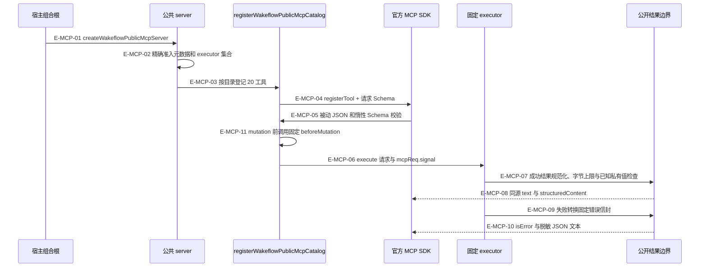

# MCP：准入、取消和公开结果

协议生命周期由官方 MCP SDK 承担；Wakeflow 不另实现 JSON-RPC 会话状态机。当前 worktree 把 SDK 请求取消信号一直传到固定 executor 与领域 owner，关闭进程的三个信号共用同一 closePromise。

### 本图术语说明

| 术语 | 含义 |
| --- | --- |
| 精确准入 | 只允许 serverName、serverVersion、登记表要求的全部 executor 和可选 beforeMutation；未知字段、缺失字段、Proxy function 拒绝。 |
| 被动 JSON | 先清除带行为对象的可能性，避免执行 accessor/Proxy；再由同一 Schema 校验器准入。 |
| signal | SDK 签发的请求生命周期对象；取消到达等待锁的 owner 后应停止，不能只丢弃回复。 |
| canonicalize | text 与 structuredContent 从同一规范 JSON 表示生成，避免两份输出不一致。 |
| 错误边界 | 只暴露稳定 code/reason/path 等合同字段；连这些字段越过脱敏边界也退回 unexpected。 |

### 本图边级证据

| 编号 | 代码证据 | 测试证据 |
| --- | --- | --- |
| E-MCP-01 | `src/entrypoints/codex-wakeflow-mcp.ts#createCodexWakeflowMcpServer`、`src/entrypoints/claude-code-wakeflow-mcp.ts#createClaudeCodeWakeflowMcpServer` 调公共根。 | `tests/entrypoints/wakeflow-public-mcp-cancellation.test.ts#createCodexWakeflowMcpServer` |
| E-MCP-02 | `src/entrypoints/wakeflow-public-mcp-server-configuration.ts#parseCreateWakeflowPublicMcpServerOptions` 对比排序字段集合。 | 间接覆盖：`tests/entrypoints/wakeflow-public-mcp-catalog.test.ts#createWakeflowPublicMcpServer` 构造公共根。 |
| E-MCP-03 | `src/entrypoints/wakeflow-public-mcp-server.ts#createWakeflowPublicMcpServer` 将 admitted executors 交登记层。 | `tests/entrypoints/wakeflow-public-mcp-catalog-binding.test.ts#WAKEFLOW_PUBLIC_TOOL_CATALOG` |
| E-MCP-04 | `src/entrypoints/wakeflow-public-mcp-tool.ts#registerWakeflowPublicMcpCatalog` 用 fromJsonSchema，仅公布 inputSchema。 | `tests/entrypoints/wakeflow-public-mcp-catalog-binding.test.ts#registerWakeflowPublicMcpCatalog` |
| E-MCP-05 | `src/entrypoints/wakeflow-public-mcp-tool.ts#WAKEFLOW_JSON_SCHEMA_VALIDATOR` 组合 parseJsonValue 与 createRuntimeJsonSchemaValidator。 | `tests/entrypoints/wakeflow-public-mcp-catalog-binding.test.ts#registerWakeflowPublicMcpCatalog` |
| E-MCP-06 | registerWakeflowPublicMcpCatalog 的 callback 冻结 {signal: context.mcpReq.signal}。 | `tests/entrypoints/wakeflow-public-mcp-cancellation.test.ts#createClaudeCodeWakeflowMcpServer`；两宿主真实 SDK 取消后 claim 不提交。 |
| E-MCP-07 | `src/entrypoints/wakeflow-public-mcp-tool.ts#successfulToolResult` 先规范化、限制大小，再检查 home 脱敏。 | 间接覆盖：`tests/entrypoints/wakeflow-public-mcp-error-envelope.test.ts#connectWakeflowMcpTestClient` 经 SDK 调用。 |
| E-MCP-08 | successfulToolResult 以 JSON.parse(text) 构造 structuredContent。 | 间接覆盖：`tests/entrypoints/wakeflow-public-mcp-lifecycle.test.ts#connectWakeflowMcpServerForTest` 走协议返回。 |
| E-MCP-09 | `src/entrypoints/wakeflow-public-mcp-tool.ts#redactedErrorEnvelope` 选择 WakeflowError / legacy own-data / unexpected。 | `tests/entrypoints/wakeflow-public-mcp-error-envelope.test.ts#WakeflowError` |
| E-MCP-10 | `src/entrypoints/wakeflow-public-mcp-tool.ts#failedToolResult` 返回 isError:true，不回显 stack。 | `tests/entrypoints/wakeflow-public-mcp-error-envelope.test.ts#wakeflowMcpTextContent` |
| E-MCP-11 | `src/entrypoints/wakeflow-public-mcp-tool.ts#registerWakeflowPublicMcpCatalog` 排除 readOnlyHint、mode preview、operation inspect 后调用注入的 beforeMutation；两宿主固定注入 `src/entrypoints/wakeflow-artifact-identity.ts#resolveWakeflowArtifactIdentity` 的 assertUnchanged。 | `tests/entrypoints/wakeflow-artifact-mutation-guard.test.ts#createWakeflowPublicMcpServer`；`tests/entrypoints/wakeflow-artifact-mutation-guard.test.ts#resolveWakeflowArtifactIdentity` |

### 制品守卫的精确范围

生成制品启动时固定 manifest 的字节摘要。mutation 分派前重新读取同一制品根：缺失返回 `runtime-artifact-unavailable`，不同返回 `runtime-artifact-outdated`；executor 尚未被调用。未生成的源码测试布局且启动时无 manifest 时跳过守卫。这个机制核对 manifest 字节，不重新散列每份载荷、不识别宿主选择的另一个安装目录，也不证明其他窗口的 MCP 已重载。`beforeMutation` 是固定组合根的进程内函数，不是 Agent 可提交的请求字段。

### 取消与关闭的边界

`src/entrypoints/wakeflow-mcp-stdio.ts#runWakeflowMcpStdio` 使用 serveStdio，收到 SIGINT/SIGTERM/SIGHUP 后移除监听器并只调用一次 handle.close。失败只向 stderr 输出固定摘要。`tests/entrypoints/wakeflow-mcp-stdio.test.ts#StdioClientTransport` 启动实际 stdio 子进程，验证请求被取消且异步结算结束；这里的入口函数名放在测试生成脚本字符串中，所以测试锚点落在实际被测试用到的 transport。

`tests/entrypoints/wakeflow-public-mcp-cancellation.test.ts#withRootedExclusiveFileLock` 持有 requirement claim 锁，经 SDK 发 apply 然后取消，证明锁仍未释放时请求上下文已关闭；释放锁后 revision/digest 仍不变。这比“client 收到 rejected Promise”更接近实际副作用边界。

两个返回来源必须区别：公共结果 Schema 由各领域 owner 校验，登记层只处理通用公开格式/脱敏；legacyErrorDetails 仍是当前文件中保留的旧错误形状转换，不将其描述成已经完全删除。

登记层的 PROCESS_REDACTION_BOUNDARY 只包含进程 home；领域 command shell 另行添加工作区根与切片提供的私有值。`src/kernel/redaction.ts#assertPublicJson` 命中后拒绝或退回固定错误，不运行通用凭证正则，也不替用户自动删改敏感文本。内容级检查由需求/结果/证据所属能力调用，见[内核隐私扫描边界](../11-kernel/privacy-boundary.md)。

[返回总览](./README.md) · [宿主效果与观察](./host-effect-handshake.md)
