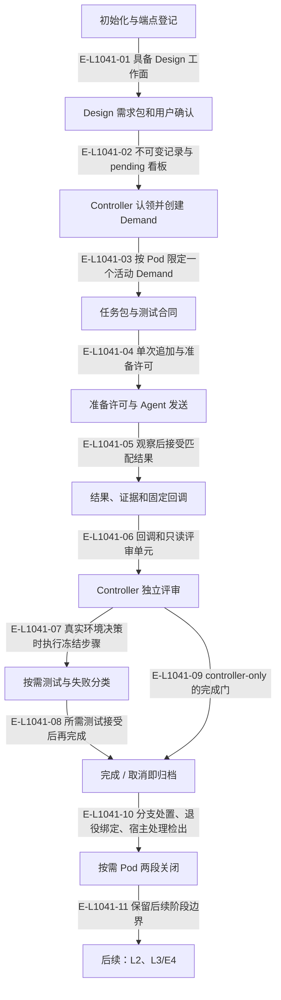

# 业务主线：需求包到归档和 Pod 关闭

本图表达跨角色的工作顺序，各个耐久对象的状态在下钻页分开。主线现已覆盖完成归档、继续和 Pod；全局观察、L2 双宿主真实投递和 L3/E4 切换仍是后续工作。

> 核验基线：`1480271`（L1 observation 第十片已落地，20 个公共工具、18 个一次性场景）。工作树另有并行未提交改动（宿主 hook 通道等），本图不描绘；来源指纹按当前工作树计算。本文说明实现事实，未宣称双宿主真实会话已经验证。

## 九个已落地切片的业务接力

### 本图术语说明

| 术语 | 本图含义 |
| --- | --- |
| Demand | 一个需求的不可变身份和事件流；当前执行环境由 podId 指定。 |
| TaskPackage | 目标任务的不可变合同，内容来自已发布需求包。 |
| Pod | 完整窗口组与每仓执行位置；main 是 primary Pod。 |
| 回调 | 结果导入返回的 wake-controller 传输内容；送达不等于接受结果。 |
| verdict | 从逐步 expected/observed/evidence 记录派生的测试结论。 |

### 节点与实现定位

| 节点 | 文件 / 符号 | 责任 |
| --- | --- | --- |
| workspace | `src/capabilities/workspace/maintain-workspace.ts` | 初始化与端点登记 |
| design | `src/capabilities/requirement/service.ts` | Design 需求包和用户确认 |
| claim | `src/capabilities/demand/service.ts` | Controller 认领并创建 Demand |
| task | `src/capabilities/tasking/service.ts` | 任务包与测试合同 |
| delivery | `src/capabilities/delivery/service.ts` | 准备许可与 Agent 发送 |
| result | `src/capabilities/result-review/service.ts` | 结果、证据和固定回调 |
| review | `src/capabilities/result-review/service.ts` | Controller 独立评审 |
| testing | `src/capabilities/result-review/service.ts` | 按需测试与失败分类 |
| archive | `src/capabilities/demand/lifecycle.ts` | 完成 / 取消即归档 |
| pod | `src/capabilities/pod/service.ts` | 按需 Pod 两段关闭 |
| stop | `src/entrypoints/wakeflow-public-mcp-catalog.ts` | 后续：L2、L3/E4 |

### 本图边级证据

| 编号 | 代码定位 | 测试 / 核验 | 关系依据 |
| --- | --- | --- | --- |
| E-L1041-01 | `src/capabilities/workspace/maintain-workspace.ts` | `tests/scenarios/wakeflow-scenario-acceptance.test.ts` | 具备 Design 工作面 |
| E-L1041-02 | `src/capabilities/requirement/service.ts#applyPublish` | `tests/scenarios/wakeflow-scenario-acceptance.test.ts` | 不可变记录与 pending 看板 |
| E-L1041-03 | `src/capabilities/demand/service.ts#planCreate` | `tests/scenarios/wakeflow-scenario-acceptance.test.ts` | 按 Pod 限定一个活动 Demand |
| E-L1041-04 | `src/capabilities/delivery/service.ts#executePrepare` | `tests/scenarios/wakeflow-scenario-acceptance.test.ts` | 单次追加与准备许可 |
| E-L1041-05 | `src/capabilities/result-review/service.ts#executeImport` | `tests/scenarios/wakeflow-scenario-acceptance.test.ts` | 观察后接受匹配结果 |
| E-L1041-06 | `src/capabilities/result-review/service.ts#inspectReview` | `tests/scenarios/wakeflow-scenario-acceptance.test.ts` | 回调和只读评审单元 |
| E-L1041-07 | `src/capabilities/tasking/service.ts#buildTestPackage` | `tests/scenarios/wakeflow-scenario-acceptance.test.ts` | 真实环境决策时执行冻结步骤 |
| E-L1041-08 | `src/capabilities/demand/lifecycle.ts#planTerminal` | `tests/scenarios/wakeflow-scenario-acceptance.test.ts` | 所需测试接受后再完成 |
| E-L1041-09 | `src/capabilities/demand/lifecycle.ts#planTerminal` | `tests/scenarios/wakeflow-scenario-acceptance.test.ts` | controller-only 的完成门 |
| E-L1041-10 | `src/capabilities/pod/service.ts#planClose` | `tests/scenarios/wakeflow-scenario-acceptance.test.ts` | 分支处置、退役绑定、宿主处理检出 |
| E-L1041-11 | `src/entrypoints/wakeflow-public-mcp-catalog.ts` | `tests/entrypoints/wakeflow-public-mcp-catalog.test.ts` | 保留后续阶段边界 |

## 守卫、恢复与验证范围

返工、escalate/record-decision、continue 是旁路，不改变每次验收的责任。代码校验引用和谱系；最终行为真伪仍由 Controller 独立检查。16 个一次性工作区场景包含真实 Git worktree fixture，但不代表真实 Codex/Claude 会话端到端已验证。

涉及的测试与核验入口：

- `tests/entrypoints/wakeflow-public-mcp-catalog.test.ts`。
- `tests/scenarios/wakeflow-scenario-acceptance.test.ts`。

## 下钻与相关视图

- [按 owner 分开的状态与恢复](./state-and-recovery.md)
- [场景与验证矩阵](./review-evidence.md)
- [只读观察与核验](../16-observation/README.md)
- [图谱总索引](../README.md)
- [核验与剩余范围](../01-diagram-review-ledger.md)
