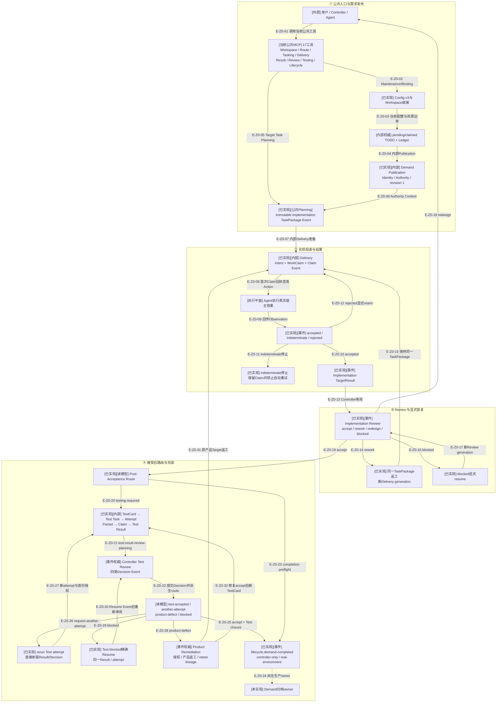

# Wakeflow端到端业务流程

> 本文是01–09文档包的组合视图，不重新解释每个文件。下层源码、Schema、Event、Authority和测试
> 才是实现事实；本文只提供从需求进入到成功完成的Review导航。
>
> 当前17个公共MCP工具覆盖已有Demand从Route到Completion的治理链；Demand Publication仍是内部Service，
> 因此尚不能通过公共工具从零创建Demand。
>
> **[未实现]** 当前TypeScript源码没有Demand归档owner；主链在`lifecycle.demand-completed`停止。

## 当前结论

当前候选实现已经形成一条内部可解释业务链：配置与Workspace初始化后，Publication从精确
`pending-claim` TODO创建Demand根，并在根发布后把该TODO CAS为claimed；
Controller规划不可变TaskPackage；Delivery准备Intent并由Agent执行真实宿主效果；Result被导入事件流；
Controller对implementation决定accept/rework/redesign/blocked；接受后按策略进入真实环境Testing或成功Completion。
Testing已经闭合到Test Result、独立Controller Test Review Decision Event与四类route；Test accept进入
real-environment Completion，request-another-attempt创建rerun，Test blocked由共享Resume精确恢复；产品缺陷
进入Remediation Authorization、原产品Target返工、重新accept和新TestCard代际。除Demand Publication外，
这些阶段均由17工具中的真实owner公开；Server不会自动串联，Controller按Route逐步调用。

这条链的各段都采用“preview/严格计划 → apply重新准入 → Event权威 → 可重建投影”的模式，并在外部
宿主效果前插入Intent、WorkClaim和Claim Event。任何`indeterminate`效果、陈旧plan、冲突权威或不完整
恢复证据都会失败关闭。

## Z0：端到端主流程与当前停止边界

### 本图术语说明

| 图中术语 | 解释 |
| --- | --- |
| 当前公共MCP | 已在固定Codex/Claude组合根注册、具有公开Schema和真实消费者的17个工具 |
| 内部纵切 | 当前仅Demand Publication仍有Service但没有Public tool |
| Authority Context | 某一操作重新打开并闭合的Config、Demand、Ledger、TODO、Binding或测试事实集合 |
| Claim回执 | 首次成功提交host-effect-claimed Event的结果；只有它能签发一次性Host Action |
| generation | Delivery、宿主效果或Review的显式代际，防止返工/恢复误用旧事实 |
| completion-preflight | 所有必要目标接受、测试策略满足、TODO仍claimed且无WorkClaim的完成准入读模型 |
| Controller Test Review | 独立于implementation Review的Test conclusion/Evidence充分性判断；Event、四类route及accept/another消费者已闭合 |
| Test closure | real-environment Completion使用的TestCard、最终attempt、Result、Decision和Test窗口精确来源元组 |
| `currentTestCard` | 当前Test代际槽位；product-defect历史Target保留原Card tuple但退出该槽位 |
| 归档owner | 成功完成后移动/封存Demand资源并拥有恢复策略的生产职责；当前尚不存在 |

## Z0边级证据

| 边编号 | 实际关系 | 审阅结论 |
| --- | --- | --- |
| `E-Z0-01`–`E-Z0-03` | 17个公共工具与Workspace | 双宿主真实入口；Route决定后续owner |
| `E-Z0-04` | Demand Publication | 内部Service先发布Demand根，再把精确TODO CAS为claimed；无公共入口 |
| `E-Z0-05`、`E-Z0-06` | implementation/test Task Planning | 同一公共工具preview/apply；test只接受最小owner派生选择 |
| `E-Z0-07`–`E-Z0-13` | Delivery、宿主效果、Result | 公共owners记录Event；indeterminate保留Claim停止，不回到Delivery |
| `E-Z0-14`–`E-Z0-19` | Implementation Review与返工/恢复 | Inspection/Decision/Resume公开，判断仍由Controller拥有 |
| `E-Z0-20`–`E-Z0-32` | Testing、Review、rerun、Remediation与Completion | 四类Test Decision均有consumer；产品修复后形成新Test代际 |
| `E-Z0-23`、`E-Z0-24` | Completion与归档 | controller-only/real-environment Completion已实现；归档仍缺失 |

## 阶段与权威映射

| 阶段 | 当前入口 | 状态权威 | 可重建视图 | 文档下钻 |
| --- | --- | --- | --- | --- |
| Workspace准备 | 公共Maintenance/Binding | Config、Maintenance intent/journal、Binding | Active/Window投影 | [03](../03-configuration-workspace/README.md) |
| Demand发布 | 内部Publication Service | Identity、Authority、revision 1、TODO lineage | Aggregate | [04](../04-governance-event-sourcing/README.md) |
| Task规划 | 公共Target Task Planning，implementation/test判别请求 | `target-task-planned` Event中的TaskPackage | 0600 TaskPackage投影 | [05](../05-tasking-slice/README.md) |
| 实现投递 | 公共Delivery/Claim/Outcome工具 + Agent | Intent、WorkClaim、claim/observation Events | Agent Host Action | [06](../06-implementation-delivery-review/README.md) |
| Result/Review | 公共Import/Inspection/Decision/Resume工具 | workType TargetResult、Decision/Resume Events | Review Snapshot/Route | [06](../06-implementation-delivery-review/README.md) |
| 返工/完成 | 公共Remediation/Completion工具 | 同TaskPackage新代际、Authorization/`demand-completed` Events | Completion Plan/Route | [07](../07-review-rework-completion/README.md) |
| 真实测试 | 公共Card/Task/Delivery/Review工具 | TestCard、Intent、Claim、Result与Test Review Events | Dispatch Packet/Review input | [08](../08-real-environment-testing/README.md) |
| 宿主接缝 | MCP + Agent | 私有Binding、Event权威 | 脱敏projection/Observation | [09](../09-public-mcp-host-seams/README.md) |

## 正常路径

1. Maintenance使Config、静态资源和宿主本地布局达到可复验状态。
2. 精确`pending-claim` TODO与Ledger关系经Publication创建Demand根和初始Event，随后由同一transaction CAS为claimed。
3. Controller preview/apply生成不可变TaskPackage Event及文件投影。
4. Delivery准备Intent，Agent窗口观察与Binding闭合后创建WorkClaim和Claim Event。
5. Agent执行一次性Host Action；Outcome Event记录真实观察。
6. accepted效果允许导入TargetResult；Controller基于完整事件流Snapshot决定。
7. rework回到同一TaskPackage的新Delivery代际；blocked等待显式Resume；redesign回到设计/规划。
8. 全部产品目标接受后，Route按testing mode进入Testing或Completion。
9. Testing完成Test Result后进入独立Test Review；accept进入Completion，another-attempt创建rerun，blocked精确Resume，
   product-defect授权原产品Target返工，修复accept后创建新TestCard代际。
10. controller-only与real-environment Completion都可提交`lifecycle.demand-completed`；TestCard和attempt历史保留。

## 当前不可称为“端到端公共能力”的原因

- 公共MCP没有Demand Publication工具，无法从零开始建立Demand。
- Research Completion和Implementation Redesign仍是显式blocker。
- 本轮没有执行真实Codex/Claude宿主效果、双宿主插件smoke或旧JS等价对照；TypeScript完整门已通过。
- `demand-completed`之后没有TypeScript归档生产者、合同或恢复路径。

## 核验基线

| 项目 | 读取值 |
| --- | --- |
| 下层文档 | 01–09共27份Markdown证据 |
| 组合指纹 | `48b4c587f797c9fefe6b6317f72d8a36e876921c88b2dd7b926e8f3a4a422dbd` |
| TypeScript基线 | `d17602e`；902 pass、710模块/4967依赖、99 Schema/207 refs |
| 完整发布门 | 未执行；候选manifest明确`releaseEligible=false` |

## 下钻入口

- [异常、幂等与恢复路径](./state-and-recovery.md)
- [端到端证据矩阵](./review-evidence.md)
- [图集总路线](../README.md)
