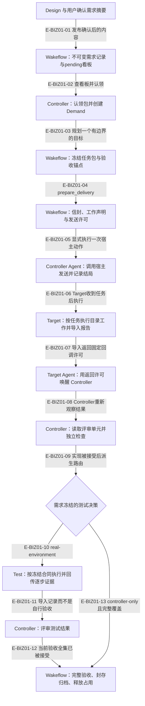

# 业务接力：从用户确认到可追溯归档

这是跨角色的业务顺序图。箭头表示下一次有依据的动作，不表示 Wakeflow 自动打开窗口、发送消息或替 Controller 判断。失败、返工、等待用户、取消和恢复分别在下钻图中展开。

```mermaid
flowchart TB
  accTitle: 用户与四类窗口的成功主线
  accDescr: Design将已确认内容发布，Controller认领和规划，Agent执行宿主发送，Target导入结果，Controller独立评审，按需求决定是否进行真实环境测试，最后完整核验与归档。
  designRole["Design 与用户确认需求摘要"]
  requirementFact["Wakeflow：不可变需求记录与pending看板"]
  controllerClaim["Controller：认领包并创建 Demand"]
  taskFact["Wakeflow：冻结任务包与验收锚点"]
  deliveryPermit["Wakeflow：信封、工作声明与发送许可"]
  agentSend["Controller Agent：调用宿主发送并记录结局"]
  targetWork["Target：按任务执行目录工作并导入报告"]
  callbackSend["Target Agent：用返回许可唤醒 Controller"]
  reviewRole["Controller：读取评审单元并独立检查"]
  testingRoute{"需求冻结的测试决策"}
  testRole["Test：按冻结合同执行并回传逐步证据"]
  testReview["Controller：评审测试结果"]
  completeDemand["Wakeflow：完整验收、封存归档、释放占用"]
  designRole -->|"E-BIZ01-01 发布确认后的内容"| requirementFact
  requirementFact -->|"E-BIZ01-02 查看板并认领"| controllerClaim
  controllerClaim -->|"E-BIZ01-03 规划一个有边界的目标"| taskFact
  taskFact -->|"E-BIZ01-04 prepare_delivery"| deliveryPermit
  deliveryPermit -->|"E-BIZ01-05 显式执行一次宿主动作"| agentSend
  agentSend -->|"E-BIZ01-06 Target收到任务后执行"| targetWork
  targetWork -->|"E-BIZ01-07 导入返回固定回调许可"| callbackSend
  callbackSend -->|"E-BIZ01-08 Controller重新观察结果"| reviewRole
  reviewRole -->|"E-BIZ01-09 实现被接受后派生路由"| testingRoute
  testingRoute -->|"E-BIZ01-10 real-environment"| testRole
  testRole -->|"E-BIZ01-11 导入记录而不是自行验收"| testReview
  testReview -->|"E-BIZ01-12 当前验收全集已被接受"| completeDemand
  testingRoute -->|"E-BIZ01-13 controller-only且完整覆盖"| completeDemand
```

### 本图术语说明

| 术语 | 含义 |
| --- | --- |
| 需求记录 / 看板 | 前者不可变；后者独立持有pending、claimed等认领状态。 |
| TaskPackage | 完整任务合同、需求成员/锚点、谱系、工作位置；prompt只承担即时目标与返回指针。 |
| 落地 | Codex发送返回或匹配目标hook所证明的事实；Claude粘贴和readback本身不能证明。 |
| 导入 / 接受 | 导入保存Target报告；接受是Controller独立检查之后的另一条决定。 |
| testing decision | 来自需求和冻结authority，不是运行时随意新增的审批层。 |

### 本图边级证据

| 编号 | 代码定位 | 测试 / 核验 | 关系依据 |
| --- | --- | --- | --- |
| E-BIZ01-01 | `src/capabilities/requirement/service.ts#applyPublish` | 间接覆盖：`tests/capabilities/requirement/service.test.ts#executeRequirementPublicationRequest`（确认、不可变记录与看板发布） | 内容与确认先于认领。 |
| E-BIZ01-02 | `src/capabilities/demand/service.ts#applyCreate` | 间接覆盖：`tests/capabilities/demand/service.test.ts#createTargetTaskPlanningWorkspaceFixture`（认领创建事务） | 当前pod占用在锁内复验。 |
| E-BIZ01-03 | `src/capabilities/tasking/service.ts#execute` | 间接覆盖：`tests/capabilities/tasking/service.test.ts#planFixtureTargetTask`（任务包写入事件） | 不是从简短prompt反推任务上下文。 |
| E-BIZ01-04 | `src/capabilities/delivery/service.ts#executePrepare` | 间接覆盖：`tests/capabilities/delivery/service.test.ts#prepareFixtureDelivery`（信封与许可） | Wakeflow准备内容，不执行发送。 |
| E-BIZ01-05 | `src/capabilities/delivery/service.ts#permitBody` | 未覆盖：宿主发送由Agent工具执行，单元测试和一次性场景不能替代真实宿主会话。 | 程序返回hostAction，由Agent执行。 |
| E-BIZ01-06 | `src/capabilities/delivery/service.ts#executeOutcome` | 间接覆盖：`tests/capabilities/delivery/service.test.ts#recordFixtureDeliveryOutcome`（落地和不确定分支） | 主线只示例已送达；prompt明确执行目录，阅读条目仍相对该目录；其他结局见投递页。 |
| E-BIZ01-07 | `src/capabilities/result-review/service.ts#executeImport` | 间接覆盖：`tests/capabilities/result-review/service.test.ts#importFixtureImplementationResult`（结果与callback合同） | 回调由Target Agent另行发送。 |
| E-BIZ01-08 | `src/capabilities/result-review/service.ts#inspectReview` | 间接覆盖：`tests/capabilities/result-review/service.test.ts#inspectFixtureReview`（评审单元） | 回调落地不自动记录accept；没有回调落地也不等同不能评审。 |
| E-BIZ01-09 | `src/governance/review/demand-post-acceptance-route.ts#buildDemandPostAcceptanceRoute` | 间接覆盖：`tests/capabilities/result-review/service.test.ts#executeImplementationReviewDecisionRequest`（实现接受后的路由） | 判断由Controller写入，路由由事实派生。 |
| E-BIZ01-10 | `src/capabilities/tasking/service.ts#buildTestPackage` | 间接覆盖：`tests/capabilities/tasking/service.test.ts#planFixtureTestTask`（冻结测试合同） | 指定环境、步骤、基线和尝试上限。 |
| E-BIZ01-11 | `src/capabilities/result-review/service.ts#executeImport` | 间接覆盖：`tests/capabilities/result-review/service.test.ts#importFixtureTestResult`（测试报告导入与逐步记录） | Test导入事实；后续测试决定由Controller另行提交。 |
| E-BIZ01-12 | `src/capabilities/demand/lifecycle.ts#planTerminal` | 间接覆盖：`tests/capabilities/demand/acceptance-coverage.test.ts#executeDemandCompletionRequest`（真实环境覆盖不足拒绝） | 当前接受的测试合同必须覆盖需求全集。 |
| E-BIZ01-13 | `src/governance/demand/demand-acceptance-coverage.ts#readDemandAcceptanceCoverage` | 间接覆盖：`tests/capabilities/demand/acceptance-coverage.test.ts#executeDemandCompletionRequest`（实现锚点覆盖全集） | 不能用少数已完成任务推定整个需求完成。 |

## 顺着问题下钻

| 现在的问题 | 阅读位置 | 重点区别 |
| --- | --- | --- |
| 窗口没登记 / 工作位置不对 | [端点](../12-endpoint/README.md)、[Pod](../15-pod/README.md) | 逻辑窗口、私有宿主句柄、检出回执和实际位置 |
| 发送返回了但没有运行证据 | [投递结局](../06-implementation-delivery-review/runtime-call-flow.md) | accepted / rejected-before-send / indeterminate；独立发送证据回退 |
| 报告写着完成但不能接受 | [评审](../07-review-rework-completion/README.md) | 结果内容、Target完成hook、评审单元摘要和独立检查 |
| 测试失败下一步是什么 | [测试分类](../08-real-environment-testing/runtime-call-flow.md) | 产品缺陷、测试工具、环境、flaky、缺证据与用户决定 |
| 中断、残留或取消失败 | [状态与恢复](./state-and-recovery.md) | 事件提交点、日志、候选、工作声明和完整历史 |
| 看板/状态页与事实不一致 | [观察与投影](../16-observation/README.md) | 只读观察、派生页面和真正业务权威 |
| 想并行开展另一项工作 | [Pod](../15-pod/README.md) | 独立完整窗口组；同pod一个活动Demand，未结事务也占用 |

research 使用文档证据完成语义，不走实现与测试任务主线。无 document 的 research 取消、等待用户决定时取消及混合失败的产品缺陷窄授权已按当前代码和回归闭合；取消仍保留归档完整性与隐私等门，修复授权也不让其他失败自动通过。详见[修复闭环与限制](./review-evidence.md)。

本轮还分开核对两处输入边界：需求 preview 的隐私命中不再依赖可能截断的 blockers 列表来决定是否回显摘要；Target callback 的引用数据不会因宿主 user 角色而获得授权，inspect 也不会确认回调或接受结果。分别见[需求披露判定](../13-requirement/privacy-preview.md)和[回调信任与评审](../07-review-rework-completion/callback-trust-and-review.md)。

[总体架构](../01-overall-architecture/README.md) · [需求包](../13-requirement/README.md) · [受管证据](../14-evidence/README.md)。

## 当前项目与执行范围

Codex角色聊天共用外层Workspace项目，并从Workspace启动；执行命令时使用角色目录或已准入产品检出，任务阅读路径相对该执行根。项目归属、真实SessionStart、私有绑定与worktree证据分别核对，不用cwd推断侧栏归属；宿主尚未返回新聊天时保留原创建结果并查明，避免重复创建。

已修复的混合失败授权、research无成果取消和等待决定取消，见[修复闭环与限制](./review-evidence.md)。修复不会把自动运行结果变成Controller的独立接受决定。

[项目聊天和执行根](../09-public-mcp-host-seams/project-chats-and-execution-roots.md) · [工作区准入](../11-kernel/workspace-operation-scope.md) · [运行证据的主体](../16-observation/runtime-evidence.md)。
