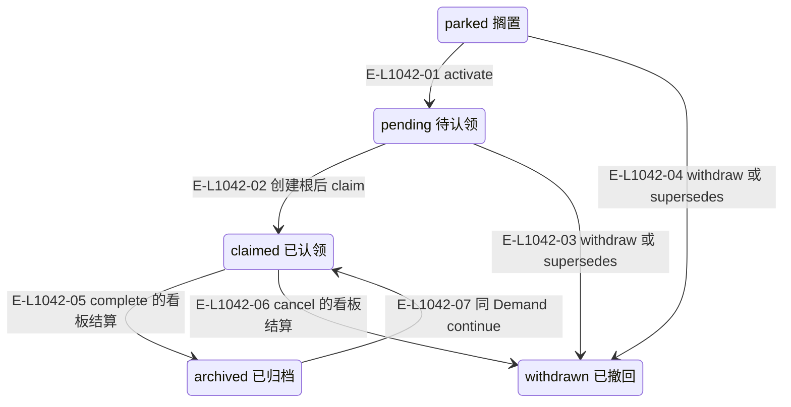
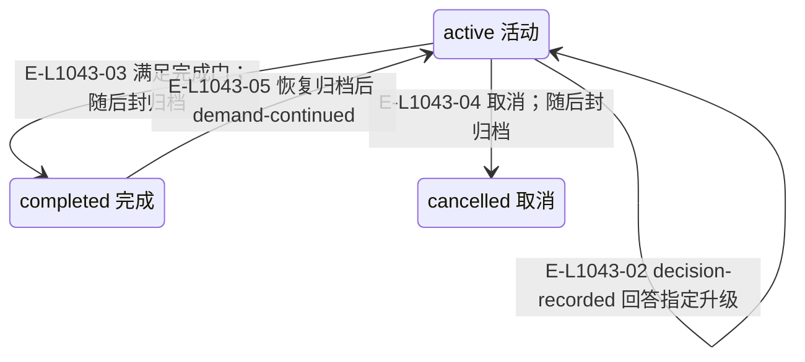
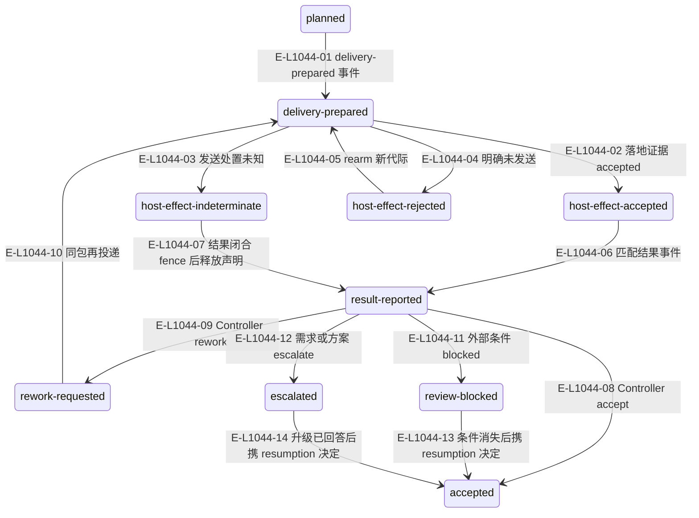
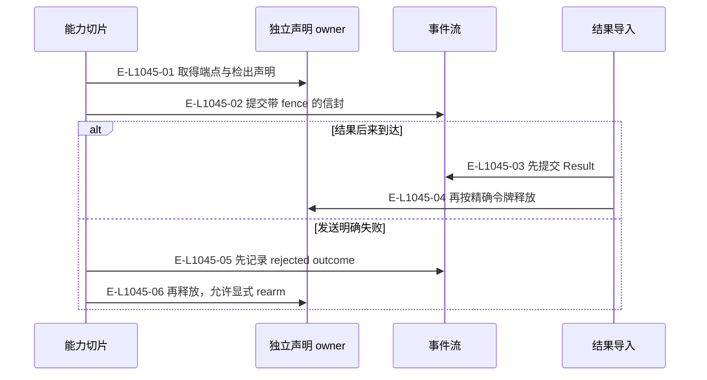

# 状态索引：每个 owner 保持自己的事实

以下状态分图。Demand lifecycle 不包含 archived；归档是不可变负载和活动根退休的物理结果。Review Snapshot 和 next 只作投影。

> 核验基线：`7ba1f38`；核验时实现代码均已提交，本轮图谱更新另列。开发阶段为 L1 九片已落地，observation 尚未开始。本文说明实现事实，未宣称双宿主真实会话已经验证。

## 需求包认领状态

### 本图术语说明

| 术语 | 本图含义 |
| --- | --- |
| CAS | 比较已观察的摘要/修订后提交；来源已改变则拒绝。 |
| Demand | 一个需求的不可变身份和事件流；当前执行环境由 podId 指定。 |

### 节点与实现定位

| 节点 | 文件 / 符号 | 责任 |
| --- | --- | --- |
| pending | `src/kernel/requirement-board.ts` | pending 待认领 |
| parked | `src/kernel/requirement-board.ts` | parked 搁置 |
| claimed | `src/kernel/requirement-board.ts` | claimed 已认领 |
| withdrawn | `src/kernel/requirement-board.ts` | withdrawn 已撤回 |
| archived | `src/kernel/requirement-board.ts` | archived 已归档 |

### 本图边级证据

| 编号 | 代码定位 | 测试 / 核验 | 关系依据 |
| --- | --- | --- | --- |
| E-L1042-01 | `src/kernel/requirement-board.ts#activateRequirementClaim` | `tests/capabilities/requirement/service.test.ts` | activate |
| E-L1042-02 | `src/kernel/requirement-board.ts#claimRequirementPackage` | `tests/capabilities/demand/service.test.ts` | 创建根后 claim |
| E-L1042-03 | `src/kernel/requirement-board.ts#withdrawRequirementClaim` | `tests/capabilities/requirement/service.test.ts` | withdraw 或 supersedes |
| E-L1042-04 | `src/kernel/requirement-board.ts#withdrawRequirementClaim` | `tests/capabilities/requirement/service.test.ts` | withdraw 或 supersedes |
| E-L1042-05 | `src/capabilities/demand/lifecycle.ts#settlePackage` | `tests/capabilities/demand/service.test.ts` | complete 的看板结算 |
| E-L1042-06 | `src/capabilities/demand/lifecycle.ts#settlePackage` | `tests/capabilities/demand/service.test.ts` | cancel 的看板结算 |
| E-L1042-07 | `src/kernel/requirement-board.ts#reclaimRequirementPackage` | `tests/capabilities/demand/service.test.ts` | 同 Demand continue |

## Demand lifecycle 与决定标记

### 本图术语说明

| 术语 | 本图含义 |
| --- | --- |
| Demand | 一个需求的不可变身份和事件流；当前执行环境由 podId 指定。 |
| commit | 一次不可变事件提交批；文件槽位以预期修订防止并发覆盖。 |
| projection | 根据权威重建的视图，不反向决定事实。 |

### 节点与实现定位

| 节点 | 文件 / 符号 | 责任 |
| --- | --- | --- |
| active | `src/governance/demand/model/demand-aggregate-state.ts` | active 活动 |
| completed | `src/governance/demand/model/demand-aggregate-state.ts` | completed 完成 |
| cancelled | `src/governance/demand/model/demand-aggregate-state.ts` | cancelled 取消 |

### 本图边级证据

| 编号 | 代码定位 | 测试 / 核验 | 关系依据 |
| --- | --- | --- | --- |
| E-L1043-01 | `src/governance/demand/model/demand-aggregate-state.ts#escalateDemandAggregateState` | `tests/capabilities/demand/service.test.ts` | escalate 设置 awaitingDecision |
| E-L1043-02 | `src/governance/demand/model/demand-aggregate-state.ts#recordDecisionInDemandAggregateState` | `tests/capabilities/demand/service.test.ts` | decision-recorded 回答指定升级 |
| E-L1043-03 | `src/governance/demand/model/demand-aggregate-state.ts#completeDemandAggregateState` | `tests/capabilities/demand/service.test.ts` | 满足完成门；随后封归档 |
| E-L1043-04 | `src/governance/demand/model/demand-aggregate-state.ts#cancelDemandAggregateState` | `tests/capabilities/demand/service.test.ts` | 取消；随后封归档 |
| E-L1043-05 | `src/governance/demand/model/demand-aggregate-state.ts#continueDemandAggregateState` | `tests/capabilities/demand/service.test.ts` | 恢复归档后 demand-continued |

## 实现目标的投递与评审阶段

### 本图术语说明

| 术语 | 本图含义 |
| --- | --- |
| fence | claimId、claimDigest 与流修订构成的准入令牌。 |
| claim | 端点注意力及产品检出的工作声明，释放必须匹配当前令牌。 |
| Demand | 一个需求的不可变身份和事件流；当前执行环境由 podId 指定。 |

### 节点与实现定位

| 节点 | 文件 / 符号 | 责任 |
| --- | --- | --- |
| planned | `src/governance/demand/model/demand-aggregate-state.ts` | planned |
| prepared | `src/governance/demand/model/demand-aggregate-state.ts` | delivery-prepared |
| acceptedEffect | `src/governance/demand/model/demand-aggregate-state.ts` | host-effect-accepted |
| unknownEffect | `src/governance/demand/model/demand-aggregate-state.ts` | host-effect-indeterminate |
| rejected | `src/governance/demand/model/demand-aggregate-state.ts` | host-effect-rejected |
| reported | `src/governance/demand/model/demand-aggregate-state.ts` | result-reported |
| accepted | `src/governance/demand/model/demand-aggregate-state.ts` | accepted |
| rework | `src/governance/demand/model/demand-aggregate-state.ts` | rework-requested |
| blocked | `src/governance/demand/model/demand-aggregate-state.ts` | review-blocked |
| escalated | `src/governance/demand/model/demand-aggregate-state.ts` | escalated |

### 本图边级证据

| 编号 | 代码定位 | 测试 / 核验 | 关系依据 |
| --- | --- | --- | --- |
| E-L1044-01 | `src/capabilities/delivery/service.ts#executePrepare` | `tests/capabilities/delivery/service.test.ts` | delivery-prepared 事件 |
| E-L1044-02 | `src/capabilities/delivery/service.ts#executeOutcome` | `tests/capabilities/delivery/service.test.ts` | 落地证据 accepted |
| E-L1044-03 | `src/capabilities/delivery/service.ts#executeOutcome` | `tests/capabilities/delivery/service.test.ts` | 发送处置未知 |
| E-L1044-04 | `src/capabilities/delivery/service.ts#executeOutcome` | `tests/capabilities/delivery/service.test.ts` | 明确未发送 |
| E-L1044-05 | `src/capabilities/delivery/service.ts#executeRearm` | `tests/capabilities/delivery/service.test.ts` | rearm 新代际 |
| E-L1044-06 | `src/capabilities/result-review/service.ts#executeImport` | `tests/capabilities/result-review/service.test.ts` | 匹配结果事件 |
| E-L1044-07 | `src/capabilities/result-review/service.ts#executeImport` | `tests/capabilities/result-review/service.test.ts` | 结果闭合 fence 后释放声明 |
| E-L1044-08 | `src/capabilities/result-review/service.ts#executeImplementationDecision` | `tests/capabilities/result-review/service.test.ts` | Controller accept |
| E-L1044-09 | `src/capabilities/result-review/service.ts#executeImplementationDecision` | `tests/capabilities/result-review/service.test.ts` | Controller rework |
| E-L1044-10 | `src/capabilities/delivery/service.ts#executePrepare` | `tests/capabilities/delivery/service.test.ts` | 同包再投递 |
| E-L1044-11 | `src/capabilities/result-review/service.ts#executeImplementationDecision` | `tests/capabilities/result-review/service.test.ts` | 外部条件 blocked |
| E-L1044-12 | `src/capabilities/result-review/service.ts#executeImplementationDecision` | `tests/capabilities/result-review/service.test.ts` | 需求或方案 escalate |
| E-L1044-13 | `src/capabilities/result-review/service.ts#executeImplementationDecision` | `tests/capabilities/result-review/service.test.ts` | 条件消失后携 resumption 决定 |
| E-L1044-14 | `src/capabilities/result-review/service.ts#executeImplementationDecision` | `tests/capabilities/result-review/service.test.ts` | 升级已回答后携 resumption 决定 |

## 声明与提交失败的恢复边界

### 本图术语说明

| 术语 | 本图含义 |
| --- | --- |
| claim | 端点注意力及产品检出的工作声明，释放必须匹配当前令牌。 |
| fence | claimId、claimDigest 与流修订构成的准入令牌。 |
| commit | 一次不可变事件提交批；文件槽位以预期修订防止并发覆盖。 |

### 节点与实现定位

| 节点 | 文件 / 符号 | 责任 |
| --- | --- | --- |
| slice | `src/capabilities/delivery/service.ts` | 能力切片 |
| claim | `src/kernel/work-claims.ts` | 独立声明 owner |
| event | `src/governance/demand/event-sourcing/demand-event-sourcing-command-handler.ts` | 事件流 |
| result | `src/capabilities/result-review/service.ts` | 结果导入 |

### 本图边级证据

| 编号 | 代码定位 | 测试 / 核验 | 关系依据 |
| --- | --- | --- | --- |
| E-L1045-01 | `src/kernel/work-claims.ts#takeWorkClaim` | `tests/capabilities/delivery/service.test.ts` | 取得端点与检出声明 |
| E-L1045-02 | `src/capabilities/delivery/service.ts#executePrepare` | `tests/capabilities/delivery/service.test.ts` | 提交带 fence 的信封 |
| E-L1045-03 | `src/capabilities/result-review/service.ts#executeImport` | `tests/capabilities/result-review/service.test.ts` | 先提交 Result |
| E-L1045-04 | `src/capabilities/result-review/service.ts#releaseFence` | `tests/capabilities/result-review/service.test.ts` | 再按精确令牌释放 |
| E-L1045-05 | `src/capabilities/delivery/service.ts#executeOutcome` | `tests/capabilities/delivery/service.test.ts` | 先记录 rejected outcome |
| E-L1045-06 | `src/capabilities/delivery/service.ts#releaseClaimFor` | `tests/capabilities/delivery/service.test.ts` | 再释放，允许显式 rearm |

## 守卫、恢复与验证范围

最后一张是跨 owner 时序，不是另一个状态机。实现目标图是精选阶段；superseded 谱系、测试目标阶段及 blocked/escalated 的恢复守卫分别见任务与评审专题。

涉及的测试与核验入口：

- `tests/capabilities/delivery/service.test.ts`。
- `tests/capabilities/demand/service.test.ts`。
- `tests/capabilities/requirement/service.test.ts`。
- `tests/capabilities/result-review/service.test.ts`。

## 下钻与相关视图

- [本专题总览](./README.md)
- [图谱总索引](../README.md)
- [核验与剩余范围](../01-diagram-review-ledger.md)
