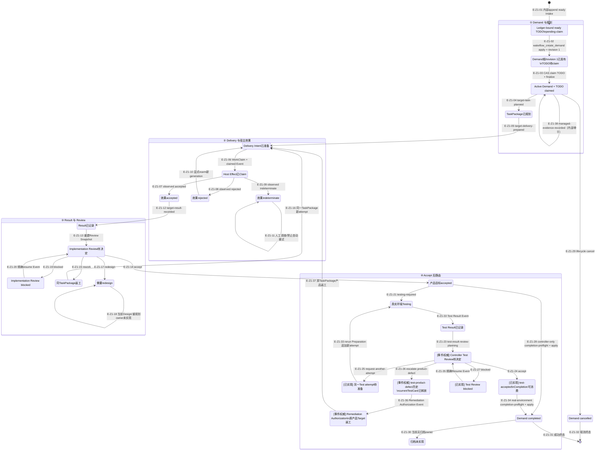

# 端到端异常、幂等与恢复路径

## Z1：业务状态与显式恢复

### 本图术语说明

| 术语 | 解释 |
| --- | --- |
| CAS claim | TODO集合与item摘要仍匹配时的条件claim |
| Publication authority | 发布失败后对exact transaction效果的最强证明；`recoverable`要求存在可重读且完全一致的sidecar |
| rearm | 仅对精确rejected效果尾部开放新宿主效果代际 |
| 人工调查 | indeterminate没有自动转换；需要外部证据和显式新命令 |
| 同TaskPackage新attempt | 保留原执行合同，只增加返工上下文和Delivery代际 |
| Controller Test Review | Test conclusion、Evidence充分性和四类Decision的独立Service/Event；不复用implementation判断矩阵 |
| Test completion closure | Test accept后Route携带Card、最终attempt、Result、Decision与Test窗口来源；Completion只投影mode并保留历史 |
| currentTestCard | 当前可规划/执行Test合同槽位；product-defect Target保留历史但不再占用该槽位 |
| managed-evidence-recorded | 保存完整Manifest的第15个Demand Event；Aggregate只增加Evidence ID与Manifest/payload双摘要，生命周期仍为active |
| lifecycle cancel | 已存在的取消Event终态；不是成功Completion或归档 |

### 本图边级证据索引

| 边编号 | 状态转换 | 主要下钻证据 |
| --- | --- | --- |
| `E-Z1-01` | ready Intake进入Pending TODO | `createTodoIntake` + `createInitialTodoState`；当前仅内部append owner，无Public producer |
| `E-Z1-02` | pending-claim TODO → Demand根已发布 | 公共exact apply委托Publication stage创建Identity/Authority/revision 1并整体发布根 |
| `E-Z1-03` | Demand根已发布 → Active Demand + TODO claimed | Publication在根存在后CAS claim精确TODO并退休marker/sidecar |
| `E-Z1-04` | Active Demand → TaskPackage已规划 | [Tasking垂直切片](../05-tasking-slice/README.md) |
| `E-Z1-05` | TaskPackage已规划 → Delivery Intent已准备 | [实现投递主链](../06-implementation-delivery-review/README.md) |
| `E-Z1-06` | Delivery Intent已准备 → Host Effect已Claim | [Delivery准备与宿主动作](../06-implementation-delivery-review/runtime-call-flow.md) |
| `E-Z1-07` | Claim → accepted | 宿主效果Observation严格闭合 |
| `E-Z1-08` | Claim → rejected | 宿主效果Observation严格闭合 |
| `E-Z1-09` | Claim → indeterminate | 宿主效果Observation严格闭合 |
| `E-Z1-10` | rejected → 新Delivery代际 | [返工与blocked恢复](../07-review-rework-completion/runtime-call-flow.md) |
| `E-Z1-11` | indeterminate保持停止 | 禁止猜测效果结果和自动重试 |
| `E-Z1-12` | accepted → Result已记录 | [宿主观察与TargetResult](../06-implementation-delivery-review/runtime-call-flow.md) |
| `E-Z1-13` | Result已记录 → Review待决定 | 完整Event Stream重建Review Snapshot |
| `E-Z1-14` | Implementation Review → accepted | Controller Implementation Review Decision Event |
| `E-Z1-15` | Implementation Review → rework | Controller Implementation Review Decision Event |
| `E-Z1-16` | rework → 新Delivery attempt | 保留同一TaskPackage的Rework Context |
| `E-Z1-17` | Implementation Review → redesign | Controller Implementation Review Decision Event |
| `E-Z1-18` | redesign保持阻塞 | Controller Route暴露Design blocker；当前没有重规划owner |
| `E-Z1-19` | Review → blocked | blocked Review generation |
| `E-Z1-20` | blocked → Review待决定 | 精确Resume Event |
| `E-Z1-21` | accepted → Testing | Authority测试策略 |
| `E-Z1-22` | Testing → Test Result已记录 | [真实环境测试](../08-real-environment-testing/README.md) |
| `E-Z1-23` | Test Result → Test Review待决定 | `test-result-review-planning` route |
| `E-Z1-24` | Test Review → accepted | shared Decision Event与`test-accepted` route |
| `E-Z1-25` | Test Review → 另一attempt待准备 | `test-another-attempt-planning` route |
| `E-Z1-26` | Test Review → 产品缺陷升级 | `test-product-defect-escalated`选择Remediation owner |
| `E-Z1-27` | Test Review → blocked | `test-review-blocked`持久状态 |
| `E-Z1-28` | implementation accepted → Demand completed | controller-only [Completion preview/apply](../07-review-rework-completion/runtime-call-flow.md) |
| `E-Z1-29` | Active Demand → cancelled | lifecycle cancel Event |
| `E-Z1-30` | completed → 归档缺口 | 当前无归档owner、Schema或测试 |
| `E-Z1-31` | completed → 成功终态 | demand-completed Event |
| `E-Z1-32` | cancelled → 取消终态 | lifecycle cancel Event |
| `E-Z1-33` | another-attempt → Testing | rerun Preparation绑定直接前驱Result/Decision并追加新attempt与首份授权 |
| `E-Z1-34` | test-accepted → Demand completed | real-environment Completion复验Test closure/Test窗口Claim并保留Card/attempt lineage |
| `E-Z1-35` | Test blocked → Test Review待决定 | 共享Resume Service复验workType/Decision/Result并保留同一attempt |
| `E-Z1-36` | product-defect → Remediation | currentTestCard释放、历史Target保留；Authorization Event绑定失败检查与baseline |
| `E-Z1-37` | Remediation → 产品返工Delivery | 原产品Target进入`product-defect-rework-requested`并保持同一TaskPackage |
| `E-Z1-38` | Active Demand → Active Demand | `wakeflow_record_evidence`经内部Application按journal→stage→Event→final→journal退休记录完整Manifest并返回metadata receipt |

## 跨层恢复矩阵

| 失败点 | 已有权威 | 恢复入口 | 禁止行为 |
| --- | --- | --- | --- |
| Maintenance step中断 | intent + journal checkpoint | `recover(operationId)` | 重新使用旧preview直接执行 |
| Demand首次发布中断 | 同级exact publication sidecar | 公共`wakeflow_create_demand recover(demandId)`委托`recoverDemandPublication` | 把`unknown`当成安全重试，或删除已发布根倒退 |
| Event append候选残留 | candidate + 固定sequence槽位 | `recoverAppendCandidates` | 覆盖不同Commit |
| Snapshot损坏 | Commit/Event完整流 | load回退完整重放 | 在读取中静默修复历史 |
| Managed Evidence Event重放 | Commit中的完整Manifest + Aggregate双摘要selector | Demand完整重放 | 把Event存在解释成payload/Manifest资源已经发布 |
| Managed Evidence事务中断 | Transaction + 四态Inventory + exact Commit观察 | Event前续接stage或stale退休；Event后只前向final；末端无journal返回healthy | 删除Event、Event后重读source、或未闭合就退休journal |
| Managed Evidence健康闭包 | Manifest关闭的final摘要集合 + Aggregate selector + Demand/Program/Authority身份 | healthy Root Authority；payload复验deferred | 只凭合法目录名接受foreign、顶层/Manifest损坏或无Event的final |
| TaskPackage投影缺失 | 唯一规划Event | Projection Store materialize | 调用方伪造投影文件 |
| Binding已写、projection失败 | 私有Binding current | 独立重建registered projection | 回滚Binding并重用handle |
| Host effect rejected | observed Event | 显式rearm | 自动重复Host Action |
| Host effect indeterminate | claimed/observed Event | 外部调查后显式决策 | 猜测失败并重试 |
| Review blocked | blocked Decision Event | 精确Resume Event | 绕过Resume提交下一决定 |
| Test accepted后Completion中断 | Test Decision Event + 带Test closure的`completion-preflight` | `DemandCompletionService.apply`同plan恢复 | 删除或改写TestCard/attempt历史 |
| 另一Test attempt准备中断 | `test-another-attempt-requested`状态 + rerun plan/commitId | `TestDeliveryPreparationService.apply`同plan恢复 | 在Review Service中提前创建attempt或重新选择setup语义 |
| 产品缺陷升级 | `test-product-defect`历史Target + currentTestCard absent | Remediation Service按同Decision/Route/affected targets幂等提交Authorization并进入产品返工 | 自动重开未授权Target或复用旧Card rerun |
| Test Review blocked | `test-review-blocked`状态 | 共享`ControllerTargetReviewResumeService`精确Resume | 不核对workType/Decision kind或消耗attempt |
| Completion apply重试 | completion commitId/Event | 同plan幂等apply | 重新生成Completion身份 |

## 全局幂等键

| 范围 | 幂等身份/预期 |
| --- | --- |
| Maintenance | operation ID + intent digest + journal successor |
| Ledger Authority Publication | exact Plan/digest + immutable Record ID + compact intent/tree plan；Recover只使用持久stage/final证据 |
| TODO Intake Publication | exact Plan/digest + Config/Collection digest + target Intake；Recover只消费同TODO transaction |
| Demand Publication | 完整transaction digest + expected TODO collection/state digest + Demand/Event/Commit IDs |
| Demand Event | commitId + commandDigest + expected stream revision |
| Managed Evidence Event | transaction digest + commitId/commandDigest/expected revision + evidenceId/Manifest/payload摘要；Application已固定Event/final/journal顺序 |
| Task/Delivery/Result/Review | 确定派生ID + source摘要 + generation |
| WorkClaim | claimId + window/target/intent/action绑定 |
| Projection | Event来源 + 确定文档摘要 |
| Completion | commitId + planDigest + Completion digest |

## 未实现边界

成功Completion之后没有归档状态、存储owner、Schema、测试或恢复入口。Research Completion和
Implementation Redesign也仍是明确缺口。Demand Publication Public已进入提交`f7c005d`，但尚未执行插件release gate；
Managed Evidence已有零写capture Planning、Event/Aggregate selector、无phase Transaction、可恢复Application、按需Reader及metadata-only Public；
Reader bytes仍不公开。A4 Inspection与A5 Intake已公开，A6 Demand只消费Intake refs；page token只绑定读snapshot，Intake transaction只绑定exact mutation plan。Auto Claim仍无执行consumer，因此本图不画自动领取路径。
A3 Ledger producer现在可经Public Intake形成新的Ledger-bound TODO并进入Demand；各owner保持分步调用，不合并为跨根Saga。
图中停止节点不是未来实现设计。
