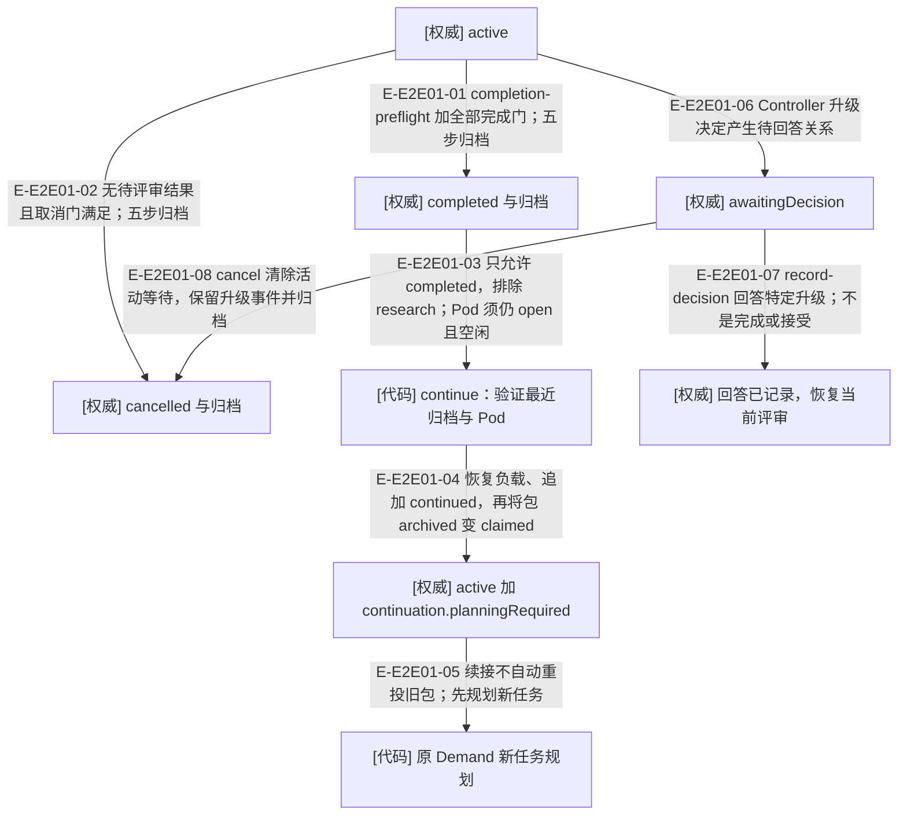

# 全链路状态与恢复：同名重试背后的不同权威

> 2026-10-03 当前工作树语义复核；含未提交实现。HEAD 只定位已提交基线，来源指纹覆盖本页实际引用的文件。图谱不拥有业务状态。本页的测试锚点表示已核对的覆盖入口，运行结果见本轮总台账。

```mermaid
flowchart TB
  accTitle: Demand 终态与续接的持久关系
  accDescr: Demand 终态与续接的持久关系；每条关系由当前实现的调用或条件支持，错误停止与恢复保持显式。
  A["[权威] active"]
  B["[权威] completed 与归档"]
  C["[权威] cancelled 与归档"]
  D["[代码] continue：验证最近归档与 Pod"]
  F["[权威] active 加 continuation.planningRequired"]
  H["[代码] 原 Demand 新任务规划"]
  I["[权威] awaitingDecision"]
  J["[权威] 回答已记录，恢复当前评审"]
  A -->|"E-E2E01-01 completion-preflight 加全部完成门；五步归档"| B
  A -->|"E-E2E01-02 无待评审结果且取消门满足；五步归档"| C
  B -->|"E-E2E01-03 只允许 completed，排除 research；Pod 须仍 open 且空闲"| D
  D -->|"E-E2E01-04 恢复负载、追加 continued，再将包 archived 变 claimed"| F
  F -->|"E-E2E01-05 续接不自动重投旧包；先规划新任务"| H
  A -->|"E-E2E01-06 Controller 升级决定产生待回答关系"| I
  I -->|"E-E2E01-07 record-decision 回答特定升级；不是完成或接受"| J
  I -->|"E-E2E01-08 cancel 清除活动等待，保留升级事件并归档"| C
```

### 本图术语说明

| 术语 | 本图含义 |
| --- | --- |
| [代码] | 确定性服务、守卫或纯决定；失败会拒绝转换。 |
| [权威] | 持久事实；只能由指定写入者改变。 |
| [视图] | 由权威派生的可重建数据，不授权写入。 |
| continuation.planningRequired | 已完成 Demand 重开后的新规划要求；不是重写历史事件。 |
| awaitingDecision | 事件中的持久待答升级；与生命周期 active 并存。 |

### 本图边级证据

| 编号 | 代码证据 | 测试证据 | 关系与边界 |
| --- | --- | --- | --- |
| E-E2E01-01 | `src/capabilities/demand/lifecycle.ts#executeDemandCompletionRequest` | 间接覆盖：`tests/capabilities/demand/service.test.ts#executeDemandCompletionRequest`（经公共切片入口执行此内部关系） | completion-preflight 加全部完成门；五步归档 |
| E-E2E01-02 | `src/capabilities/demand/lifecycle.ts#executeDemandCancellationRequest` | 间接覆盖：`tests/capabilities/demand/service.test.ts#executeDemandCancellationRequest`（经公共切片入口执行此内部关系） | 无待评审结果且取消门满足；五步归档 |
| E-E2E01-03 | `src/capabilities/demand/decide.ts#deriveContinueBlockers` | 间接覆盖：`tests/capabilities/demand/service.test.ts#executeDemandContinuationRequest`（经公共切片入口执行此内部关系） | 只允许 completed，排除 research；Pod 须仍 open 且空闲 |
| E-E2E01-04 | `src/capabilities/demand/lifecycle.ts#applyContinueLocked` | 间接覆盖：`tests/capabilities/demand/service.test.ts#executeDemandContinuationRequest`（经公共切片入口执行此内部关系） | 恢复负载、追加 continued，再将包 archived 变 claimed |
| E-E2E01-05 | `src/capabilities/demand/context.ts#nextAfterMutation` | 间接覆盖：`tests/capabilities/demand/service.test.ts#executeTargetTaskPlanningPublicRequest`（经公共切片入口执行此内部关系） | 续接不自动重投旧包；先规划新任务 |
| E-E2E01-06 | `src/capabilities/result-review/service.ts#executeImplementationDecision` | 间接覆盖：`tests/capabilities/result-review/service.test.ts#executeImplementationReviewDecisionRequest`（经公共切片入口执行此内部关系） | Controller 升级决定产生待回答关系 |
| E-E2E01-07 | `src/capabilities/demand/lifecycle.ts#applyDecision` | 间接覆盖：`tests/capabilities/result-review/service.test.ts#executeDemandContinuationRequest`（经公共切片入口执行此内部关系） | record-decision 回答特定升级；不是完成或接受 |
| E-E2E01-08 | `src/governance/demand/model/demand-aggregate-state.ts#cancelDemandAggregateState` | `tests/governance/demand/demand-aggregate-state.test.ts#cancelDemandAggregateState`；间接覆盖：`tests/capabilities/demand/service.test.ts#executeDemandCancellationRequest`（待答取消及前后中断恢复） | 活动等待被取消结束，旧升级保留，未生成用户回答。 |

## 恢复入口按权威区分

| 发生了什么 | 可以使用的入口 | 不可据此推断 |
| --- | --- | --- |
| 首次发布中断 | create recover / 自包含 publication sidecar | 不能只因 final 根存在就认为认领已完成 |
| 追加候选残留 | 维护 reconcile 的只读计划及 digest 绑定 apply | 不能重写已链接 commit 或删除活跃拥有者候选 |
| 已提交结果但声明未释放 | 原幂等 import 回放补释放 | 不得释放已易主的窗口声明 |
| 投递 rejected-before-send | rearm；用尽后 prepare 新信封 | 不产生新 TaskPackage，不增加测试逻辑次数 |
| 结果待评审且回调 silent | callback rearm，无 claim/fence | 不产生 Controller acceptance |
| 完成/取消中断 | 原 action recover / 根外 lifecycle journal | 不回滚领域终态；按日志前向收敛 |
| blocked / escalated | 特定 resumption；升级先 record-decision | 不会自动继续执行或重复验收 |
| completed 想扩展 | continue 三步恢复事务 | cancelled 和 research 不可 continue |

取消并不强制杀死宿主会话；它追加 Wakeflow 终态、归档和释放工作声明。宿主 transport 与 Demand 状态权威分离。后到的旧结果会因根或状态准入失败而被拒。

## 验证的真实边界

当前验收覆盖从冻结 requirement 文本和已接受事件派生，不写入旧 aggregate，不改历史摘要。Pod 锁与根外意图共同保持“一 Pod 一 Demand”；读取损坏或无法归属的残留必须保守阻塞。自动化测试包含事件候选/链接后真实进程死亡，生命周期覆盖终态追加前与终态后归档阻断的受控中断。不能把所有恢复边界概称为“全链路崩溃已测”。

[终态五步细图](../07-review-rework-completion/state-and-recovery.md) · [追加候选恢复](../04-governance-event-sourcing/state-and-recovery.md) · [投递恢复](../06-implementation-delivery-review/state-and-recovery.md)

回调恢复只适用于仍未评审的 result-reported / test-result-reported：当前绑定会话无落地、严格超过十分钟且代际未耗尽才可显式重发。blocked/escalated 已有决定时不进入 callback rearm；读取 inspect 不会建立确认或接受记录。见[回调代际与只读停止点](../07-review-rework-completion/callback-trust-and-review.md)。

本页 continuation 的实际字段为 `continuation.planningRequired`；优先级在 `src/governance/controller/demand-controller-route.ts#routeBasis`：terminal → awaitingDecision → continuation 先规划 → research/实现目标 → 测试或完成。它是派生 route，不是新的状态权威。

无研究成果也可取消：取消只豁免工作声明已释放、成功验收覆盖及研究成果三道完成条件；包认领、活动根审计、证据完整性和隐私等门仍然有效。当前取消归档保留失败的 verify 记录，不把取消伪装成成功完成。普通 apply/recover/append 的共享工作区作用域与各 Pod/事件/CAS 锁共同约束并发；preview 与 inspect 保持只读入口。

## 继续阅读

[本专题总览](./README.md) · [终态调用](../07-review-rework-completion/runtime-call-flow.md) · [逐文件审阅记录](../../plans/review-2026-10-03/demand-delivery.md) · [图谱入口](../README.md)
