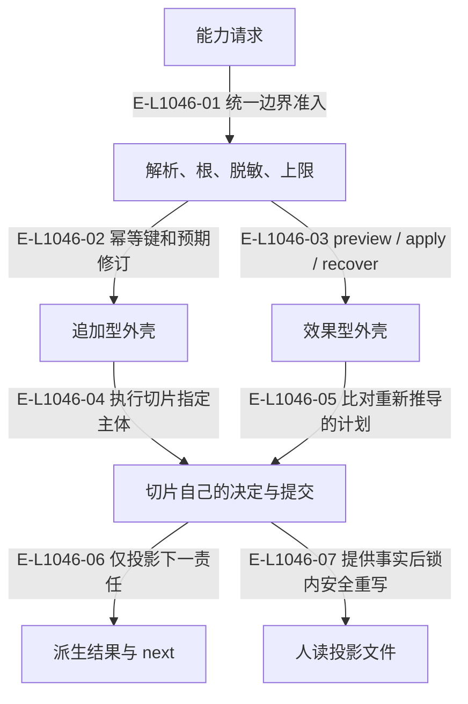

# 内核：可复用的调用与准入机制

内核承接通用机械边界，能力切片保留业务决定。目录和 next 表不是全局业务状态机。本基线新增 active-projection：内核只负责人读投影文件的渲染与安全重写，事实由调用方提供。

> 核验基线：`1480271`（L1 observation 第十片已落地，20 个公共工具、18 个一次性场景）。工作树另有并行未提交改动（宿主 hook 通道等），本图不描绘；来源指纹按当前工作树计算。本文说明实现事实，未宣称双宿主真实会话已经验证。

## 共同命令外壳与两种变更形状

### 本图术语说明

| 术语 | 本图含义 |
| --- | --- |
| CAS | 比较已观察的摘要/修订后提交；来源已改变则拒绝。 |
| next | 根据当前事实派生的下一责任与建议工具。 |
| projection | 根据权威重建的视图，不反向决定事实。 |

### 节点与实现定位

| 节点 | 文件 / 符号 | 责任 |
| --- | --- | --- |
| request | `src/kernel/command-shell.ts` | 能力请求 |
| shell | `src/kernel/command-shell.ts` | 解析、根、脱敏、上限 |
| append | `src/kernel/append-command.ts` | 追加型外壳 |
| effect | `src/kernel/publication-transaction.ts` | 效果型外壳 |
| owner | `src/capabilities/tasking/service.ts` | 切片自己的决定与提交 |
| next | `src/kernel/next-projection.ts` | 派生结果与 next |
| projection | `src/kernel/active-projection.ts#publishActiveProjection` | 人读投影文件 |

### 本图边级证据

| 编号 | 代码定位 | 测试 / 核验 | 关系依据 |
| --- | --- | --- | --- |
| E-L1046-01 | `src/kernel/command-shell.ts#runCommandShell` | `tests/kernel/command-shell.test.ts` | 统一边界准入 |
| E-L1046-02 | `src/kernel/append-command.ts#runAppendCommand` | `tests/capabilities/tasking/service.test.ts` | 幂等键和预期修订 |
| E-L1046-03 | `src/kernel/publication-transaction.ts#runPublicationTransaction` | `tests/capabilities/workspace/maintain-workspace.test.ts` | preview / apply / recover |
| E-L1046-04 | `src/kernel/append-command.ts#runAppendCommand` | `tests/capabilities/tasking/service.test.ts` | 执行切片指定主体 |
| E-L1046-05 | `src/kernel/publication-transaction.ts#runPublicationTransaction` | `tests/capabilities/workspace/maintain-workspace.test.ts` | 比对重新推导的计划 |
| E-L1046-06 | `src/kernel/next-projection.ts#deriveNextProjection` | `tests/capabilities/demand/service.test.ts` | 仅投影下一责任 |
| E-L1046-07 | `src/kernel/active-projection.ts#publishActiveProjection` | `tests/kernel/active-projection.test.ts` | 提供事实后锁内安全重写 |

## 守卫、恢复与验证范围

幂等绑定进入事件流，不另设一个无消费者的 idempotency-store。PublicationTransaction 外壳不取代各领域的锁和日志；hook、work-claim、worktree receipt 分别持有自己的物理记录。active-projection 不读配置也不读事件流：事实由调用方给出，任一目标不安全时整轮零写，只有每个文件都带标记的 Demand 页目录才会退休；页面是导航，不是权威。

涉及的测试与核验入口：

- `tests/capabilities/demand/service.test.ts`。
- `tests/capabilities/tasking/service.test.ts`。
- `tests/capabilities/workspace/maintain-workspace.test.ts`。
- `tests/kernel/active-projection.test.ts`。
- `tests/kernel/command-shell.test.ts`。

## 下钻与相关视图

- [文件直接导入](./file-dependencies.md)
- [运行调用与恢复](./runtime-call-flow.md)
- [只读观察与核验](../16-observation/README.md)
- [图谱总索引](../README.md)
- [核验与剩余范围](../01-diagram-review-ledger.md)
