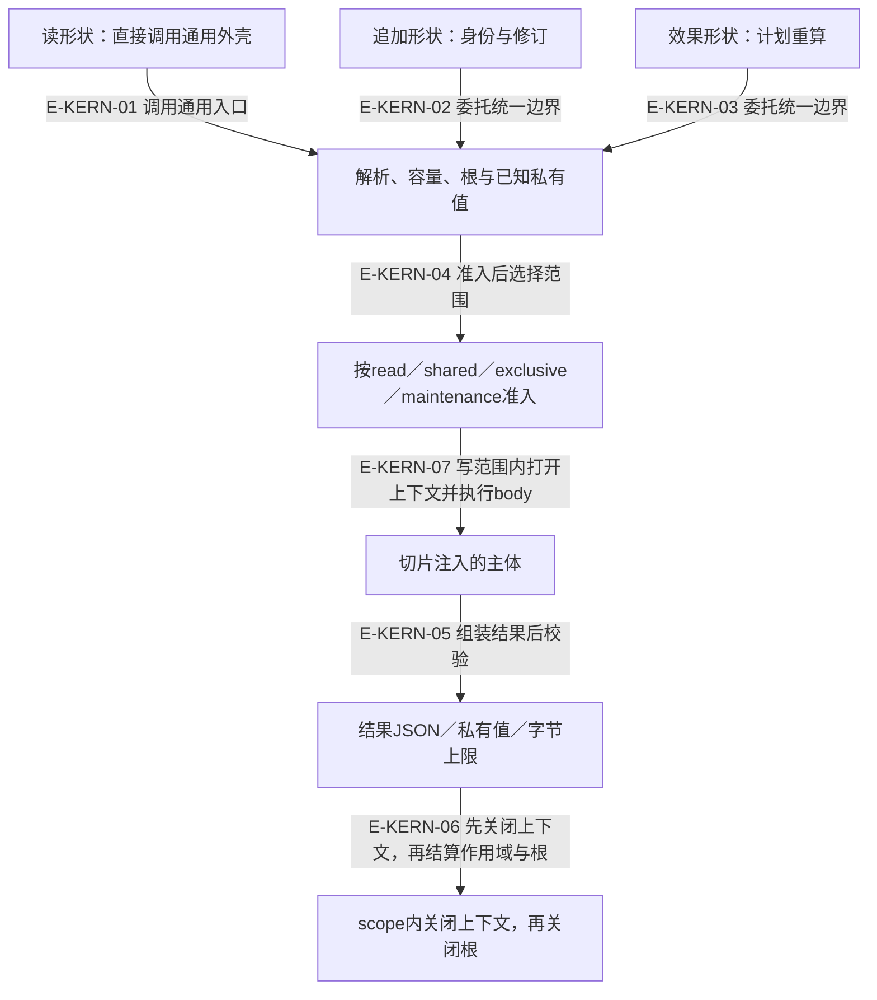

# 内核：共用机械边界与领域权限

> 核验于 2026-10-03，基线 `d8fafff` 加当前未提交工作树。图表达实际源码分支，未提交实现标为进行中；不把开发阶段计划当作运行事实。来源与测试锚点按本文精确范围列出。

内核提供可复用的准入、身份、协调与投影原语。业务允许什么由切片或治理 owner 决定；内核不拥有一个总业务状态机。

## 公共命令的实际调用边界

```mermaid
flowchart TB
  accTitle: 公共命令的实际调用边界
  accDescr: 所有三种形状最后进入同一个命令外壳，领域主体在已准入根与私有值边界内执行。
  read["读形状：直接调用通用外壳"]
  append["追加形状：身份与修订"]
  effect["效果形状：计划重算"]
  shell["解析、容量、根与已知私有值"]
  scope["按read／shared／exclusive／maintenance准入"]
  body["切片注入的主体"]
  result["结果JSON／私有值／字节上限"]
  close["scope内关闭上下文，再关闭根"]
  read -->|"E-KERN-01 调用通用入口"| shell
  append -->|"E-KERN-02 委托统一边界"| shell
  effect -->|"E-KERN-03 委托统一边界"| shell
  shell -->|"E-KERN-04 准入后选择范围"| scope
  scope -->|"E-KERN-07 写范围内打开上下文并执行body"| body
  body -->|"E-KERN-05 组装结果后校验"| result
  result -->|"E-KERN-06 先关闭上下文，再结算作用域与根"| close
```

### 本图术语说明

| 术语 | 本图含义 |
| --- | --- |
| 外壳 | 只组织调用生命周期，具体业务提交由注入主体完成。 |
| 准入 | 请求JSON、Schema、容量、根与私有值扫描通过后才调用领域主体。 |
| 私有值边界 | 扫描已知根和句柄字符串；不是文本内容隐私分类器。 |

### 节点与源码定位

| 节点 | 文件 / 符号 | 职责 |
| --- | --- | --- |
| read | `src/kernel/command-shell.ts#runCommandShell` | 读形状：直接调用通用外壳 |
| append | `src/kernel/append-command.ts#runAppendCommand` | 追加形状：身份与修订 |
| effect | `src/kernel/publication-transaction.ts#runPublicationTransaction` | 效果形状：计划重算 |
| shell | `src/kernel/command-shell.ts#runCommandShell` | 解析、容量、根与已知私有值 |
| scope | `src/kernel/command-shell.ts#runCommandShell` | 根据形状选择范围，再打开上下文 |
| body | `src/capabilities/evidence/service.ts#executeRecordEvidenceRequest` | 切片注入的主体 |
| result | `src/kernel/command-shell.ts#runCommandShell` | 结果JSON／私有值／字节上限 |
| close | `src/kernel/command-shell.ts#runCommandShell` | scope内关闭上下文，再关闭根 |

### 本图边级证据

| 编号 | 代码证据 | 测试证据 | 关系依据 |
| --- | --- | --- | --- |
| E-KERN-01 | `src/kernel/command-shell.ts#runCommandShell` | `tests/kernel/command-shell.test.ts#runCommandShell` | 调用通用入口 |
| E-KERN-02 | `src/kernel/append-command.ts#runAppendCommand` | `tests/kernel/append-command.test.ts#runAppendCommand` | 委托统一边界 |
| E-KERN-03 | `src/kernel/publication-transaction.ts#runPublicationTransaction` | `tests/kernel/publication-transaction.test.ts#runPublicationTransaction` | 委托统一边界 |
| E-KERN-04 | `src/kernel/command-shell.ts#runCommandShell` | `tests/kernel/command-shell.test.ts#runCommandShell` | 准入后选择范围 |
| E-KERN-07 | `src/kernel/command-shell.ts#runCommandShell` | 间接覆盖：`tests/capabilities/workspace/operation-scope.test.ts#executeCodexWakeflowMaintenance`，维护与投影交错证明上下文受准入范围保护 | 写范围内打开上下文并执行body |
| E-KERN-05 | `src/kernel/command-shell.ts#runCommandShell` | `tests/kernel/command-shell.test.ts#runCommandShell` | 组装结果后校验 |
| E-KERN-06 | `src/kernel/command-shell.ts#runCommandShell`、`src/kernel/command-shell.ts#releaseCommandShell` | `tests/kernel/command-shell.test.ts#runCommandShell` | execute 内上下文关闭错误不覆盖已有 body 错误；退出作用域后的根关闭也只补首个失败。租约结算有独立错误优先级，见下文。 |

## 所有权与容量

| 能力 | 输入与输出 | 写入边界 | 不应推断 |
| --- | --- | --- | --- |
| `src/kernel/workspace-operation-scope.ts#withWorkspaceOperationScope` | 根＋shared/exclusive＋闭包→有界执行 | 私有读写租约；维护残留阻挡入场 | 不替代事件CAS、Config权威或Controller决定 |
| `src/kernel/ids.ts#deriveDemandCommitId` | Demand与幂等键→稳定commitId | 无 | 身份派生不证明提交成功 |
| `src/kernel/work-claims.ts#takeWorkClaim` | 当前窗口与holder→围栏摘要 | 窗口唯一0600声明 | 2小时不是TTL自动过期 |
| `src/kernel/pod-mutation-lock.ts#withPodMutation` | podId与短操作→互斥执行 | 私有锁；已证明inactive才退休 | 锁不是Pod状态权威 |
| `src/kernel/event-stream/stream-index.ts#readLatestStreamIndex` | 不可变提交索引→可用检查点或null | 可重建索引，损坏回退 | 索引不替代事件流 |
| `src/kernel/requirement-acceptance.ts#parseAcceptanceCriteria` | 验收H2顶层列表→ac序号 | 无 | 不能用表格或段落替代列表合同 |
| `src/kernel/active-projection.ts#publishActiveProjection` | 调用方事实→标记页面 | 锁内CAS、完整观察才退休 | 页面不拥有Demand状态 |

`src/kernel/limits.ts#WAKEFLOW_LIMITS` 当前请求2MiB、结果24MiB、prompt65536个UTF-16码元、分页256项。源码注释中的未来4MiB结果预算不属于当前实现。`src/kernel/privacy-scan.ts#scanPrivacy`与`src/kernel/redaction.ts#assertPublicJson`是不同边界：前者查内容类别，后者拒绝已知私有字符串。

本轮内容扫描统一了凭证规则、路径语境、CSI 装饰视图与原文位置，UUID 允许前缀还需完整词边界；这些变化不会把 command shell 变成自动的凭证输出扫描器。需求、报告与证据仍各自选择消费策略；未知编码或不透明载荷也不能仅因空命中列表而被称为不含秘密。详见[扫描器、调用方和披露边界](./privacy-boundary.md)。

“主体错误优先”只适用于 command shell 自己合并上下文/根关闭错误的步骤。外层读写租约在 finally 中精确释放；若释放也失败，其错误可覆盖原来的 latch 或业务错误。未确认的替换节点仍保留，详见[许可交接与双失败](../02-foundation/admission-races-and-recovery.md)。

[工作区读写准入](./workspace-operation-scope.md) · [Hook记录与完整读取](./hook-history.md) · [投影恢复](../16-observation/projection-recovery.md)

## 继续阅读

[文件导入](./file-dependencies.md) · [运行分支](./runtime-call-flow.md) · [本模块总览](./README.md) · [全局入口](../README.md) · [本轮增量审阅](../../plans/review-2026-10-03/coordination.md) · [前轮完整审阅](../../plans/review-2026-10-02/coordination-evidence.md)
