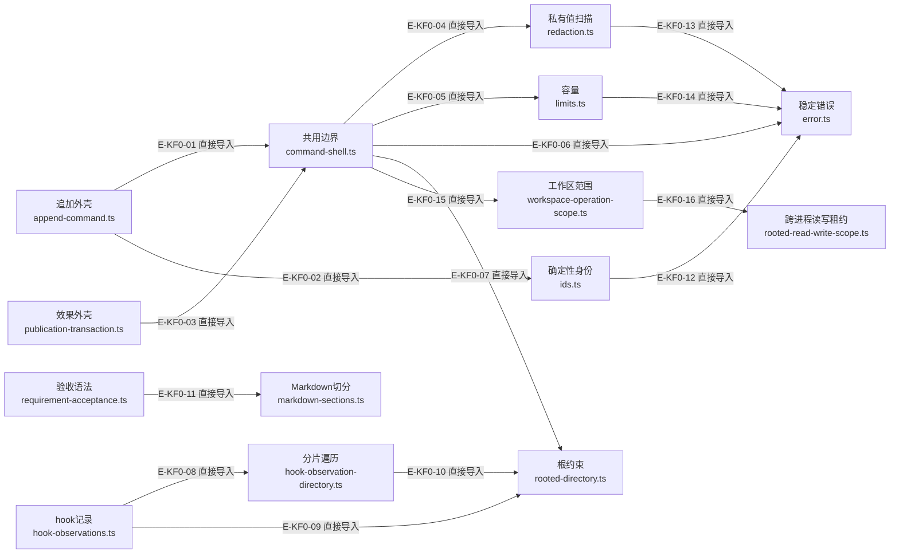

# 内核：两种外壳与证据机制的静态依赖

> 核验于 2026-10-03，基线 `d8fafff` 加当前未提交工作树。图表达实际源码分支，未提交实现标为进行中；不把开发阶段计划当作运行事实。来源与测试锚点按本文精确范围列出。

本图是从当前TypeScript AST选出的直接导入子图；每条边再对照已读源码用途。它只证明耦合方向，不证明调用顺序、状态转移或Agent授权。

## 内核：两种外壳与证据机制的静态依赖

```mermaid
flowchart LR
  accTitle: 内核：两种外壳与证据机制的静态依赖
  accDescr: 文件直接import关系的审阅精选视图，运行调用与状态分支在独立页面。
  f0["追加外壳<br/>append-command.ts"]
  f1["效果外壳<br/>publication-transaction.ts"]
  f2["共用边界<br/>command-shell.ts"]
  f3["确定性身份<br/>ids.ts"]
  f4["私有值扫描<br/>redaction.ts"]
  f5["容量<br/>limits.ts"]
  f6["稳定错误<br/>error.ts"]
  f7["hook记录<br/>hook-observations.ts"]
  f8["分片遍历<br/>hook-observation-directory.ts"]
  f9["根约束<br/>rooted-directory.ts"]
  f10["验收语法<br/>requirement-acceptance.ts"]
  f11["Markdown切分<br/>markdown-sections.ts"]
  f12["工作区范围<br/>workspace-operation-scope.ts"]
  f13["跨进程读写租约<br/>rooted-read-write-scope.ts"]
  f0 -->|"E-KF0-01 直接导入"| f2
  f0 -->|"E-KF0-02 直接导入"| f3
  f1 -->|"E-KF0-03 直接导入"| f2
  f2 -->|"E-KF0-04 直接导入"| f4
  f2 -->|"E-KF0-05 直接导入"| f5
  f2 -->|"E-KF0-06 直接导入"| f6
  f2 -->|"E-KF0-07 直接导入"| f9
  f7 -->|"E-KF0-08 直接导入"| f8
  f7 -->|"E-KF0-09 直接导入"| f9
  f8 -->|"E-KF0-10 直接导入"| f9
  f10 -->|"E-KF0-11 直接导入"| f11
  f3 -->|"E-KF0-12 直接导入"| f6
  f4 -->|"E-KF0-13 直接导入"| f6
  f5 -->|"E-KF0-14 直接导入"| f6
  f2 -->|"E-KF0-15 直接导入"| f12
  f12 -->|"E-KF0-16 直接导入"| f13
```

### 本图术语说明

| 术语 | 本图含义 |
| --- | --- |
| 直接导入 | 包含实际import或显式re-export；类型依赖同样算结构依赖。 |
| 精选范围 | 按模块入口裁剪；被省略的依赖仍在逐文件台账和全局导入数据中。 |

### 节点与源码定位

| 节点 | 文件 / 符号 | 职责 |
| --- | --- | --- |
| f0 | `src/kernel/append-command.ts` | 追加外壳 append-command.ts |
| f1 | `src/kernel/publication-transaction.ts` | 效果外壳 publication-transaction.ts |
| f2 | `src/kernel/command-shell.ts` | 共用边界 command-shell.ts |
| f3 | `src/kernel/ids.ts` | 确定性身份 ids.ts |
| f4 | `src/kernel/redaction.ts` | 私有值扫描 redaction.ts |
| f5 | `src/kernel/limits.ts` | 容量 limits.ts |
| f6 | `src/kernel/error.ts` | 稳定错误 error.ts |
| f7 | `src/kernel/hook-observations.ts` | hook记录 hook-observations.ts |
| f8 | `src/kernel/hook-observation-directory.ts` | 分片遍历 hook-observation-directory.ts |
| f9 | `src/foundation/filesystem/rooted-directory.ts` | 根约束 rooted-directory.ts |
| f10 | `src/kernel/requirement-acceptance.ts` | 验收语法 requirement-acceptance.ts |
| f11 | `src/kernel/markdown-sections.ts` | Markdown切分 markdown-sections.ts |
| f12 | `src/kernel/workspace-operation-scope.ts` | 工作区范围 |
| f13 | `src/foundation/filesystem/rooted-read-write-scope.ts` | 跨进程读写租约 |

### 本图边级证据

| 编号 | 代码证据 | 测试证据 | 关系依据 |
| --- | --- | --- | --- |
| E-KF0-01 | `src/kernel/append-command.ts` | 未覆盖：此边是静态导入，由源码 AST 校验；运行测试不代替导入证据 | 直接导入 |
| E-KF0-02 | `src/kernel/append-command.ts` | 未覆盖：此边是静态导入，由源码 AST 校验；运行测试不代替导入证据 | 直接导入 |
| E-KF0-03 | `src/kernel/publication-transaction.ts` | 未覆盖：此边是静态导入，由源码 AST 校验；运行测试不代替导入证据 | 直接导入 |
| E-KF0-04 | `src/kernel/command-shell.ts` | 未覆盖：此边是静态导入，由源码 AST 校验；运行测试不代替导入证据 | 直接导入 |
| E-KF0-05 | `src/kernel/command-shell.ts` | 未覆盖：此边是静态导入，由源码 AST 校验；运行测试不代替导入证据 | 直接导入 |
| E-KF0-06 | `src/kernel/command-shell.ts` | 未覆盖：此边是静态导入，由源码 AST 校验；运行测试不代替导入证据 | 直接导入 |
| E-KF0-07 | `src/kernel/command-shell.ts` | 未覆盖：此边是静态导入，由源码 AST 校验；运行测试不代替导入证据 | 直接导入 |
| E-KF0-08 | `src/kernel/hook-observations.ts` | 未覆盖：此边是静态导入，由源码 AST 校验；运行测试不代替导入证据 | 直接导入 |
| E-KF0-09 | `src/kernel/hook-observations.ts` | 未覆盖：此边是静态导入，由源码 AST 校验；运行测试不代替导入证据 | 直接导入 |
| E-KF0-10 | `src/kernel/hook-observation-directory.ts` | 未覆盖：此边是静态导入，由源码 AST 校验；运行测试不代替导入证据 | 直接导入 |
| E-KF0-11 | `src/kernel/requirement-acceptance.ts` | 未覆盖：此边是静态导入，由源码 AST 校验；运行测试不代替导入证据 | 直接导入 |
| E-KF0-12 | `src/kernel/ids.ts` | 未覆盖：此边是静态导入，由源码 AST 校验；运行测试不代替导入证据 | 直接导入 |
| E-KF0-13 | `src/kernel/redaction.ts` | 未覆盖：此边是静态导入，由源码 AST 校验；运行测试不代替导入证据 | 直接导入 |
| E-KF0-14 | `src/kernel/limits.ts` | 未覆盖：此边是静态导入，由源码 AST 校验；运行测试不代替导入证据 | 直接导入 |
| E-KF0-15 | `src/kernel/command-shell.ts` | 未覆盖：静态导入由源码 AST 校验，运行测试不代替导入证据 | 直接导入 |
| E-KF0-16 | `src/kernel/workspace-operation-scope.ts` | 未覆盖：静态导入由源码 AST 校验，运行测试不代替导入证据 | 直接导入 |

## 阅读边界

完整内核文件另见逐文件台账。新增 workspace-operation-scope 把公共 writer 与维护准入接在同一 Foundation 读写协调能力上。work-claim、Pod锁、board、投影和索引分别拥有物理机制，不因为都依赖RootedDirectory而成为一张业务状态机。

Schema是可移植wire源；`tooling/codegen/schema-types.ts`生成`src/contracts/generated/identity/wakeflow-durable-id-kind.generated.ts`等派生合同。生成文件只核实来源与生成链，不计作手写文件语义审阅；`package.json`的schema:build/schema:check负责生成与漂移检测。

## 继续阅读

[文件导入](./file-dependencies.md) · [运行分支](./runtime-call-flow.md) · [本模块总览](./README.md) · [全局入口](../README.md) · [本轮增量审阅](../../plans/review-2026-10-03/coordination.md) · [前轮完整审阅](../../plans/review-2026-10-02/coordination-evidence.md)
