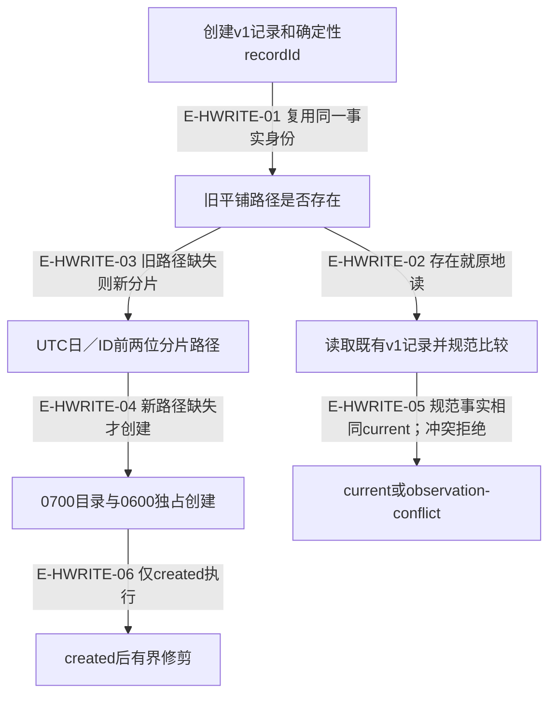
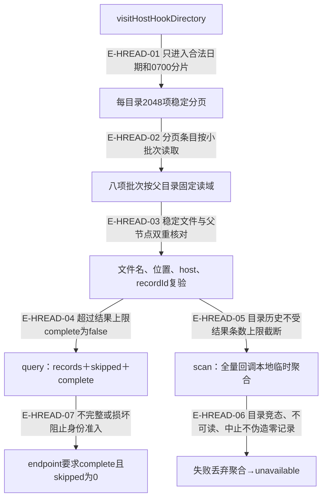

# Hook：分片、完整读取与有界保留

> 核验于 2026-10-03，基线 `d8fafff` 加当前未提交工作树。图表达实际源码分支，未提交实现标为进行中；不把开发阶段计划当作运行事实。来源与测试锚点按本文精确范围列出。

[进行中] 本页纳入当前未提交的hook分片与读取完整性修复。记录仍为v1，新增布局不迁移旧文件；保留期限与扫描内存预算是两个独立约束。

## 写入：旧记录就地重放，新记录进入分片

### 本图术语说明

| 术语 | 本图含义 |
| --- | --- |
| v1 | 时间必须毫秒精度，raw sessionId/cwd只存在私有记录。 |
| 分片 | UTC日目录与recordId前两位目录；不是新的业务状态。 |
| current | 严格解析后相同的v1事实；旧可选字段缺省null，原字节既不重写也不迁移。 |

### 节点与源码定位

| 节点 | 文件 / 符号 | 职责 |
| --- | --- | --- |
| a | `src/kernel/hook-observations.ts#createHostHookObservation` | 创建v1记录和确定性recordId |
| b | `src/kernel/hook-observations.ts#writeHostHookObservation` | 旧平铺路径是否存在 |
| c | `src/kernel/hook-observations.ts#writeHostHookObservation` | 读取既有v1记录并规范比较 |
| d | `src/kernel/hook-observation-directory.ts#partitionedHostHookRef` | UTC日／ID前两位分片路径 |
| e | `src/kernel/hook-observations.ts#createHostHookObservationFile` | 0700目录与0600独占创建 |
| f | `src/kernel/hook-observations.ts#writeHostHookObservation` | current或observation-conflict |
| g | `src/kernel/hook-observations.ts#pruneExpiredHostHookObservations` | created后有界修剪 |

### 本图边级证据

| 编号 | 代码证据 | 测试证据 | 关系依据 |
| --- | --- | --- | --- |
| E-HWRITE-01 | `src/kernel/hook-observations.ts#writeHostHookObservation` | `tests/kernel/hook-observations.test.ts#writeHostHookObservation` | 复用同一事实身份 |
| E-HWRITE-02 | `src/kernel/hook-observations.ts#writeHostHookObservation` | `tests/kernel/hook-observations.test.ts#writeHostHookObservation` | 存在就原地读 |
| E-HWRITE-03 | `src/kernel/hook-observations.ts#writeHostHookObservation` | `tests/kernel/hook-observations.test.ts#writeHostHookObservation` | 旧路径缺失则新分片 |
| E-HWRITE-04 | `src/kernel/hook-observations.ts#materializeHostHookDirectory` | `tests/kernel/hook-observations.test.ts#writeHostHookObservation` | 新路径缺失才创建 |
| E-HWRITE-05 | `src/kernel/hook-observations.ts#writeHostHookObservation` | `tests/kernel/hook-observations.test.ts#writeHostHookObservation` | 规范事实相同current；冲突拒绝 |
| E-HWRITE-06 | `src/kernel/hook-observations.ts#writeHostHookObservation` | `tests/kernel/hook-observations.test.ts#writeHostHookObservation` | 仅created执行 |

## 读取：完整扫描与有限返回分开

### 本图术语说明

| 术语 | 本图含义 |
| --- | --- |
| complete | 仅说明匹配集合是否超出query返回上限；skipped是另一可信度维度。 |
| scan | 结果总数无16384目录上限；会话聚合仍最多16384个会话。 |
| skipped | 非法或损坏项计数；过滤掉、已消失、已知原子stage不算损坏。 |

### 节点与源码定位

| 节点 | 文件 / 符号 | 职责 |
| --- | --- | --- |
| a | `src/kernel/hook-observation-directory.ts#visitHostHookDirectory` | visitHostHookDirectory |
| b | `src/kernel/hook-observation-directory.ts#visitDirectory` | 每目录2048项稳定分页 |
| c | `src/kernel/hook-observations.ts#scanScopedBatch` | 八项批次按父目录固定读域 |
| d | `src/kernel/hook-observations.ts#readCandidateRecord` | 文件名、位置、host、recordId复验 |
| e | `src/kernel/hook-observations.ts#readHostHookObservations` | query：records＋skipped＋complete |
| f | `src/kernel/hook-observations.ts#scanHostHookObservations` | scan：全量回调本地临时聚合 |
| g | `src/governance/observation/workspace-observation.ts#observeHostHooks` | 失败丢弃聚合→unavailable |
| h | `src/capabilities/endpoint/service.ts#loadHookSessions` | endpoint要求complete且skipped为0 |

### 本图边级证据

| 编号 | 代码证据 | 测试证据 | 关系依据 |
| --- | --- | --- | --- |
| E-HREAD-01 | `src/kernel/hook-observation-directory.ts#visitHostHookDirectory` | 间接覆盖：`tests/kernel/hook-observations.test.ts#readHostHookObservations`，公共执行器覆盖该内部调用 | 只进入合法日期和0700分片 |
| E-HREAD-02 | `src/kernel/hook-observations.ts#scanObservations` | `tests/kernel/hook-observations.test.ts#scanHostHookObservations` | 分页条目按小批次读取 |
| E-HREAD-03 | `src/kernel/hook-observations.ts#scanEntry` | `tests/kernel/hook-observations.test.ts#readHostHookObservations` | 稳定文件与父节点双重核对 |
| E-HREAD-04 | `src/kernel/hook-observations.ts#readObservations` | `tests/kernel/hook-observations.test.ts#readHostHookObservations` | 超过结果上限complete为false |
| E-HREAD-05 | `src/kernel/hook-observations.ts#scanHostHookObservations` | `tests/kernel/hook-observations.test.ts#scanHostHookObservations` | 目录历史不受结果条数上限截断 |
| E-HREAD-06 | `src/governance/observation/workspace-observation.ts#observeHostHooks` | 间接覆盖：`tests/governance/observation/workspace-observation.test.ts#observeWorkspace`，公共执行器覆盖该内部调用 | 目录竞态、不可读、中止不伪造零记录 |
| E-HREAD-07 | `src/capabilities/endpoint/service.ts#loadHookSessions` | 间接覆盖：`tests/capabilities/endpoint/service.test.ts#executeWindowBindingRequest`，公共执行器覆盖该内部调用 | 不完整或损坏阻止身份准入 |

## 可选v1字段与幂等比较

前轮2026-10-02后续复核已确认`src/kernel/hook-observations.ts#sameObservationDocument`：旧记录缺少可选artifactManifestDigest时解析成null，再与新请求的规范记录比较；返回current但保留旧文件原字节。不是任意JSON语义宽松比较，键集、身份和字段关系仍经严格v1解析。相关测试直接断言current、原平铺位置与旧bytes不变。

## 观察器身份不等于目标运行身份

记录仍保留 `artifactManifestDigest` 字段，表示写入 hook 的观察器所用制品。公开 status v2 把它命名为 `lastObservation.observerManifestDigest`，不再借 session-start 推断窗口 MCP 服务或已加载指令的 current/stale；目标窗口运行身份保持 `unverified`。这是观察输出的语义修正，不是 hook v1 文件迁移。见[运行身份的证据分责](../16-observation/runtime-evidence.md)。

## 保留与恢复规则

`src/kernel/hook-observations.ts#pruneExpiredHostHookObservations`每次新写入最多检查4096项，以8并发精确unlink；记录截止时间为新记录与本批其他最新记录较早者减30天。未访问条目可保留更久。一个未来时间跳变不能单次清空近期证据。已知create/0600原子stage只有所有者inactive且超过10分钟才允许退休；未知名、模式异常与不匹配位置不被自动删。

扫描并非跨全部目录的全局事务快照；它逐目录固定分页身份并稳定读记录。正在修剪后消失的候选不计skipped，换成其他内容的候选计skipped；中止会继续上抛。写入后被取消也不意味着新记录回滚。

测试直接覆盖16385条旧平铺有效记录的完整扫描、目标查询、单记录读取、重试不迁移与有限结果complete=false。真实宿主是否触发hook仍依赖宿主接缝验证，不能用这些文件测试代替。

## 继续阅读

[文件导入](./file-dependencies.md) · [运行分支](./runtime-call-flow.md) · [本模块总览](./README.md) · [全局入口](../README.md) · [本轮增量审阅](../../plans/review-2026-10-03/coordination.md) · [前轮完整审阅](../../plans/review-2026-10-02/coordination-evidence.md)
