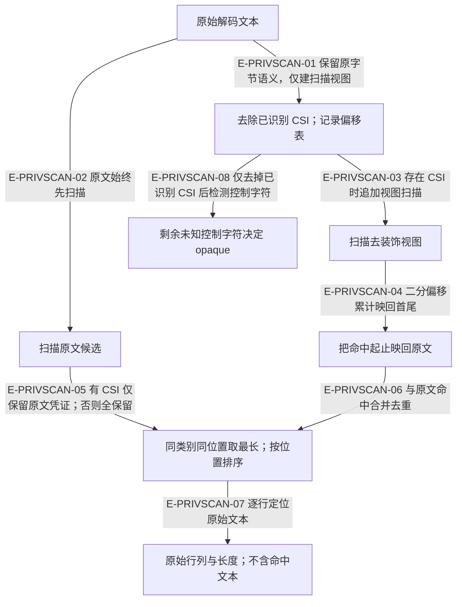
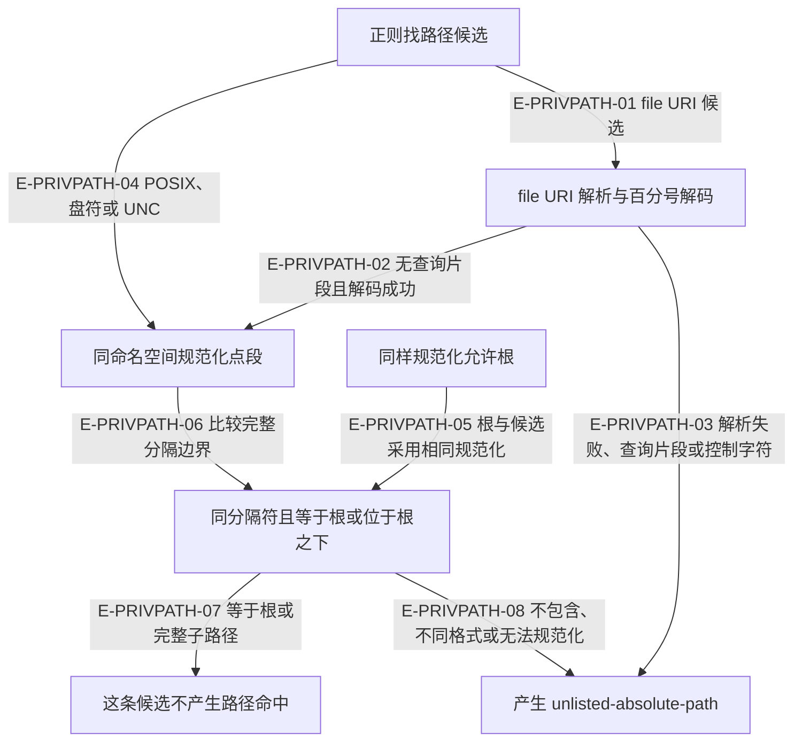

# 隐私扫描：原文位置、路径策略与公共边界

> rc.4 基线经本轮复核更新到 rc.5 候选工作树。所有扫描样例均为合成内容；扫描属于词法启发式，空命中不能证明任意文本或二进制不含秘密。

隐私扫描 `privacy-scan.ts` 与私有值边界 `redaction.ts` 是两种机制。前者识别有限类别的文本特征，后者在已经准入的 JSON 键和值中查找已知私有字符串。它们都拒绝命中，不会自动替换秘密或净化载荷。

## 扫描视图与原始位置：不改写被审阅文本

### 本图术语说明

| 术语 | 含义 |
| --- | --- |
| CSI | 终端控制序列的一种；本模块只移除正则识别的 CSI，不是完整终端解释器。 |
| UTF-16 列 | 从1开始，按 JavaScript 码元计数；不是字节偏移，也不是视觉字符列。 |
| opaque | 仍含未知控制字符的文本标记；不是“完全不可扫描”的同义词。 |
| 原始长度 | 覆盖命中首尾之间的原文码元，包含中间被移除的 CSI；首尾之外的装饰不计。 |

### 节点与源码定位

| 节点 | 文件 / 符号 |
| --- | --- |
| raw | `src/kernel/privacy-scan.ts#scanPrivacyText` |
| view | `src/kernel/privacy-scan.ts#withoutCsi` |
| rawHits | `src/kernel/privacy-scan.ts#scanMatches` |
| viewHits | `src/kernel/privacy-scan.ts#scanMatches` |
| mapped | `src/kernel/privacy-scan.ts#originalIndex` |
| merged | `src/kernel/privacy-scan.ts#scanPrivacyText` |
| located | `src/kernel/privacy-scan.ts#createLocator` |
| opaque | `src/kernel/privacy-scan.ts#scanPrivacyText` |

### 本图边级证据

| 编号 | 代码证据 | 测试证据 | 具体范围 |
| --- | --- | --- | --- |
| E-PRIVSCAN-01 | `src/kernel/privacy-scan.ts#withoutCsi` | `tests/kernel/privacy-scan.test.ts#scanPrivacyText` | CSI 用例验证装饰去除及无命中时 opaque=false；未修改来源文本。 |
| E-PRIVSCAN-02 | `src/kernel/privacy-scan.ts#scanPrivacyText` | `tests/kernel/privacy-scan.test.ts#scanPrivacyText` | 未知控制文本的凭证仍可命中；没有承诺任意控制序列内部都可解析。 |
| E-PRIVSCAN-03 | `src/kernel/privacy-scan.ts#scanPrivacyText` | `tests/kernel/privacy-scan.test.ts#scanPrivacyText` | 跨两段 CSI 的 DATABASE_PASSWORD 被识别。 |
| E-PRIVSCAN-04 | `src/kernel/privacy-scan.ts#originalIndex` | `tests/kernel/privacy-scan.test.ts#scanPrivacyText` | 断言原行2、UTF16列6与包含内部CSI的跨度。 |
| E-PRIVSCAN-05 | `src/kernel/privacy-scan.ts#scanPrivacyText` | `tests/kernel/privacy-scan.test.ts#scanPrivacyText` | 允许根被 CSI 分隔时按去装饰路径判定；原文凭证保留规则由源码直接核验。 |
| E-PRIVSCAN-06 | `src/kernel/privacy-scan.ts#scanPrivacyText` | `tests/kernel/privacy-scan.test.ts#scanPrivacyText` | 现有测试涵盖断开的凭证及路径；同位置最长命中去重未单独断言。 |
| E-PRIVSCAN-07 | `src/kernel/privacy-scan.ts#createLocator` | `tests/kernel/privacy-scan.test.ts#scanPrivacy` | 基础凭证测试断言类别、行、列；输出不含合成凭证正文。 |
| E-PRIVSCAN-08 | `src/kernel/privacy-scan.ts#scanPrivacyText` | `tests/kernel/privacy-scan.test.ts#scanPrivacyText` | NUL、OSC 仍 opaque；opaque 不会取消可解码文本扫描。 |

## 绝对路径白名单：词法包含关系与格式分支

### 本图术语说明

| 术语 | 含义 |
| --- | --- |
| 词法包含 | 只按字符串和路径语法判断，不证明真实路径、符号链接、所有权或访问权限。 |
| 命名空间 | POSIX 与 Windows 路径分开；Windows 盘符和 UNC 用 path.win32。 |
| file URI | 拒绝带 query/hash 的白名单匹配；hostname 转 UNC，已编码路径先解码。 |
| 候选 | 启发式正则的命中，不是全语言路径语法。中文紧邻系统路径有额外规则，普通 Unicode 斜杠列表和 JS 正则有误报回归测试。 |

### 节点与源码定位

| 节点 | 文件 / 符号 |
| --- | --- |
| lex | `src/kernel/privacy-scan.ts#scanMatches` |
| uri | `src/kernel/privacy-scan.ts#fileUriPath` |
| normal | `src/kernel/privacy-scan.ts#normalizePath` |
| roots | `src/kernel/privacy-scan.ts#scanPrivacyText` |
| compare | `src/kernel/privacy-scan.ts#pathIsAllowed` |
| allow | `src/kernel/privacy-scan.ts#pathIsAllowed` |
| finding | `src/kernel/privacy-scan.ts#scanMatches` |

### 本图边级证据

| 编号 | 代码证据 | 测试证据 | 具体范围 |
| --- | --- | --- | --- |
| E-PRIVPATH-01 | `src/kernel/privacy-scan.ts#normalizePath` | `tests/kernel/privacy-scan.test.ts#scanPrivacy` | 测试含允许 URI、编码的父级逃逸及含查询串的拒绝。 |
| E-PRIVPATH-02 | `src/kernel/privacy-scan.ts#fileUriPath` | `tests/kernel/privacy-scan.test.ts#scanPrivacy` | URI 到路径转换后再做词法包含；不进行磁盘读取。 |
| E-PRIVPATH-03 | `src/kernel/privacy-scan.ts#pathIsAllowed` | `tests/kernel/privacy-scan.test.ts#scanPrivacy` | 查询串有直接测试；畸形百分号和控制字符路径分支未单独覆盖。 |
| E-PRIVPATH-04 | `src/kernel/privacy-scan.ts#normalizePath` | `tests/kernel/privacy-scan.test.ts#scanPrivacy` | 测试检查盘符、正斜杠盘符与 UNC，以及点段逃逸。 |
| E-PRIVPATH-05 | `src/kernel/privacy-scan.ts#pathIsAllowed` | `tests/kernel/privacy-scan.test.ts#scanPrivacy` | 允许根末尾斜杠与包含检查有测试；无效根被丢弃由源码核验。 |
| E-PRIVPATH-06 | `src/kernel/privacy-scan.ts#pathIsAllowed` | `tests/kernel/privacy-scan.test.ts#scanPrivacy` | work 与 work-other 不能共享白名单；路径比较保持大小写敏感。 |
| E-PRIVPATH-07 | `src/kernel/privacy-scan.ts#pathIsAllowed` | `tests/kernel/privacy-scan.test.ts#scanPrivacy` | 直接验证允许路径、内部点段归一与 URI。 |
| E-PRIVPATH-08 | `src/kernel/privacy-scan.ts#pathIsAllowed` | `tests/kernel/privacy-scan.test.ts#scanPrivacy` | HOME 与波浪线不展开，匹配到后仍属于未允许路径。 |

## 调用方策略不同

| 消费者 | 使用的结果 | 当前行为与证据 |
| --- | --- | --- |
| 需求发布 | `scanPrivacy`，再过滤路径类别 | `src/capabilities/requirement/decide.ts#privacyBlockers` 允许站内路由，但显式文件定位器与标准系统目录仍阻塞。每段先截32，独立privacyHit不受总发布诊断去重截64影响。详见[需求预览](../13-requirement/privacy-preview.md)。 |
| 受管证据 | `scanPrivacyText` 与 `opaque` | `src/governance/evidence/managed-evidence-capture-planning-service.ts#classifyContent` 对可解码文本持续扫描；已识别凭证不可由内容确认覆盖。无效 UTF-8 的成员只标 opaque，详见[捕获门](../14-evidence/privacy-and-source-consistency.md)。 |
| 目标报告 | `scanPrivacy` 的类别集合 | `src/capabilities/result-review/decide.ts#derivePrivacyRules` 去重排序，任一规则使导入阻塞；`tests/capabilities/result-review/decide.test.ts#derivePrivacyRules` 包含结构化凭证、普通路径与盘符；CSI 机制由内核测试覆盖。 |
| 归档载荷 | 仅凭证类别 | `src/capabilities/demand/decide.ts#payloadPrivacyBlockers` 忽略路径和 UUID，最多返回16项；`tests/capabilities/demand/decide.test.ts#payloadPrivacyBlockers` 检查凭证与 CSI。 |
| 公共 JSON 边界 | 已知私有值子串 | `src/kernel/redaction.ts#locatePrivateText` 查键和值；`tests/kernel/redaction.test.ts#locatePrivateText` 检查嵌套路径与私有键。与凭证正则无关。 |

`src/kernel/command-shell.ts#runCommandShell` 在请求去掉明确豁免字段后检查根与用户 home；打开上下文后才补切片私有值，并在返回前检查整个结果。`tests/kernel/command-shell.test.ts#runCommandShell` 与 `tests/kernel/redaction.test.ts#assertPublicJson` 证明请求/输出边界不同。已知值子串检查不会补出未知密码，也不会证明没有新私有值。

## 实测缺口与保守说明

- **UUID 前缀缺口已修复并独立复核。** `UUID_PATTERN` 现在采集下划线或连字符前缀后的 UUID，`uuidIsPrefixed` 要求非空、完整已知前缀且前面是词边界。未知前缀和在已知前缀前粘接其他词均不能获得豁免。新 `tests/kernel/privacy-scan.test.ts#scanPrivacy` 回归与本轮后态探针均覆盖；前态漏检结果保留。
- UUID识别仍有明确候选边界：直接粘接字母数字、或后跟字母数字/下划线/连字符的复合文本不采集为UUID；新测试显式保留这种行为。因此修复不等于识别任意混合标识符中的UUID。
- 文本规则不解析所有语言、URL 参数编码、二进制格式或任意控制指令；不做熵检测。普通路由/正则不误报的回归只覆盖列出的样例。
- `isSystemAbsolutePath` 是需求文案的系统路径分类器，不是证据白名单，也不做物理权限检查。

[本轮详细审阅与探针结果](../../plans/review-2026-10-03-rc4/privacy-evidence.md) · [内核入口](./README.md) · [证据捕获门](../14-evidence/privacy-and-source-consistency.md)
