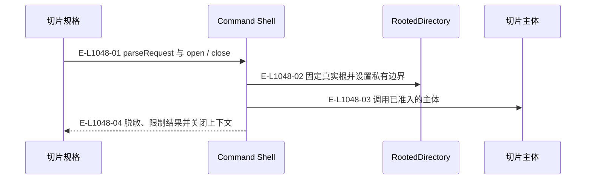
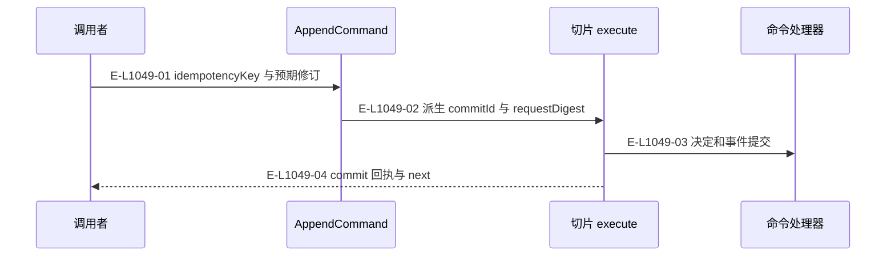
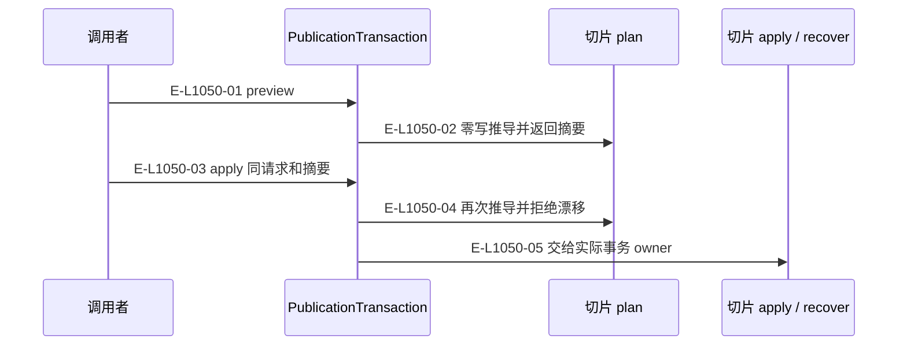

# 内核：命令外壳、追加与效果

三个小图分别说明共有边界、追加特有参数与效果计划重算。

> 核验基线：`1480271`（L1 observation 第十片已落地，20 个公共工具、18 个一次性场景）。工作树另有并行未提交改动（宿主 hook 通道等），本图不描绘；来源指纹按当前工作树计算。本文说明实现事实，未宣称双宿主真实会话已经验证。

## 共有命令外壳

### 本图术语说明

| 术语 | 本图含义 |
| --- | --- |
| CAS | 比较已观察的摘要/修订后提交；来源已改变则拒绝。 |
| projection | 根据权威重建的视图，不反向决定事实。 |

### 节点与实现定位

| 节点 | 文件 / 符号 | 责任 |
| --- | --- | --- |
| slice | Agent / 用户 / 外部效果或条件视图 | 切片规格 |
| shell | `src/kernel/command-shell.ts` | Command Shell |
| root | `src/foundation/filesystem/rooted-directory.ts` | RootedDirectory |
| body | Agent / 用户 / 外部效果或条件视图 | 切片主体 |

### 本图边级证据

| 编号 | 代码定位 | 测试 / 核验 | 关系依据 |
| --- | --- | --- | --- |
| E-L1048-01 | `src/kernel/command-shell.ts#runCommandShell` | `tests/kernel/command-shell.test.ts` | parseRequest 与 open / close |
| E-L1048-02 | `src/kernel/command-shell.ts#runCommandShell` | `tests/kernel/command-shell.test.ts` | 固定真实根并设置私有边界 |
| E-L1048-03 | `src/kernel/command-shell.ts#runCommandShell` | `tests/kernel/command-shell.test.ts` | 调用已准入的主体 |
| E-L1048-04 | `src/kernel/command-shell.ts#runCommandShell` | `tests/kernel/command-shell.test.ts` | 脱敏、限制结果并关闭上下文 |

## 追加外壳的身份绑定

### 本图术语说明

| 术语 | 本图含义 |
| --- | --- |
| commit | 一次不可变事件提交批；文件槽位以预期修订防止并发覆盖。 |
| CAS | 比较已观察的摘要/修订后提交；来源已改变则拒绝。 |
| next | 根据当前事实派生的下一责任与建议工具。 |

### 节点与实现定位

| 节点 | 文件 / 符号 | 责任 |
| --- | --- | --- |
| caller | Agent / 用户 / 外部效果或条件视图 | 调用者 |
| append | `src/kernel/append-command.ts` | AppendCommand |
| slice | `src/capabilities/tasking/service.ts` | 切片 execute |
| event | `src/governance/demand/event-sourcing/demand-event-sourcing-command-handler.ts` | 命令处理器 |

### 本图边级证据

| 编号 | 代码定位 | 测试 / 核验 | 关系依据 |
| --- | --- | --- | --- |
| E-L1049-01 | `src/kernel/append-command.ts#runAppendCommand` | `tests/capabilities/tasking/service.test.ts` | idempotencyKey 与预期修订 |
| E-L1049-02 | `src/kernel/append-command.ts#runAppendCommand` | `tests/capabilities/tasking/service.test.ts` | 派生 commitId 与 requestDigest |
| E-L1049-03 | `src/capabilities/tasking/service.ts#execute` | `tests/capabilities/tasking/service.test.ts` | 决定和事件提交 |
| E-L1049-04 | `src/capabilities/tasking/service.ts#assembleResult` | `tests/capabilities/tasking/service.test.ts` | commit 回执与 next |

## 效果外壳的计划重算

### 本图术语说明

| 术语 | 本图含义 |
| --- | --- |
| CAS | 比较已观察的摘要/修订后提交；来源已改变则拒绝。 |
| next | 根据当前事实派生的下一责任与建议工具。 |

### 节点与实现定位

| 节点 | 文件 / 符号 | 责任 |
| --- | --- | --- |
| caller | Agent / 用户 / 外部效果或条件视图 | 调用者 |
| effect | `src/kernel/publication-transaction.ts` | PublicationTransaction |
| plan | Agent / 用户 / 外部效果或条件视图 | 切片 plan |
| apply | Agent / 用户 / 外部效果或条件视图 | 切片 apply / recover |

### 本图边级证据

| 编号 | 代码定位 | 测试 / 核验 | 关系依据 |
| --- | --- | --- | --- |
| E-L1050-01 | `src/kernel/publication-transaction.ts#runPublicationTransaction` | `tests/capabilities/workspace/maintain-workspace.test.ts` | preview |
| E-L1050-02 | `src/kernel/publication-transaction.ts#runPhase` | `tests/capabilities/workspace/maintain-workspace.test.ts` | 零写推导并返回摘要 |
| E-L1050-03 | `src/kernel/publication-transaction.ts#runPublicationTransaction` | `tests/capabilities/workspace/maintain-workspace.test.ts` | apply 同请求和摘要 |
| E-L1050-04 | `src/kernel/publication-transaction.ts#runPhase` | `tests/capabilities/workspace/maintain-workspace.test.ts` | 再次推导并拒绝漂移 |
| E-L1050-05 | `src/kernel/publication-transaction.ts#runPhase` | `tests/capabilities/workspace/maintain-workspace.test.ts` | 交给实际事务 owner |

## 守卫、恢复与验证范围

效果计划摘要不是授权令牌。恢复只能消费原事务标识与其记录，不能在恢复时任意换目标。

涉及的测试与核验入口：

- `tests/capabilities/tasking/service.test.ts`。
- `tests/capabilities/workspace/maintain-workspace.test.ts`。
- `tests/kernel/command-shell.test.ts`。

## 下钻与相关视图

- [本专题总览](./README.md)
- [图谱总索引](../README.md)
- [核验与剩余范围](../01-diagram-review-ledger.md)
