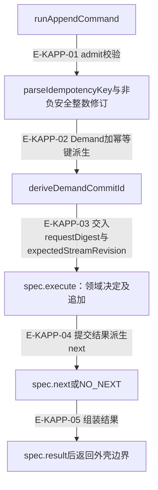
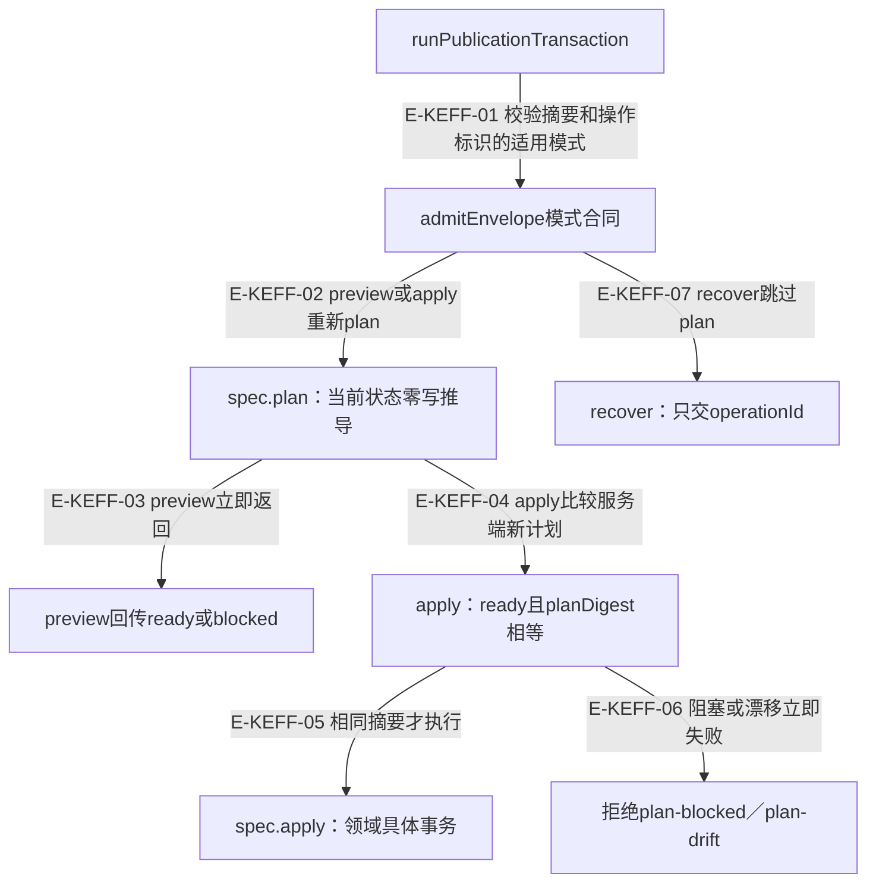

# 内核：追加与效果的精确调用形状

> 核验于 2026-10-03，基线 `d8fafff` 加当前未提交工作树。图表达实际源码分支，未提交实现标为进行中；不把开发阶段计划当作运行事实。来源与测试锚点按本文精确范围列出。

追加命令外壳不持久化幂等表；效果外壳不拥有各领域日志。下面分别展示这两种真实调用形状。

## 追加形状：稳定身份交给真正提交者

```mermaid
flowchart TB
  accTitle: 追加形状：稳定身份交给真正提交者
  accDescr: 追加外壳校验幂等键与修订，派生身份后调用切片，由切片自己的事件提交决定幂等和并发结局。
  a["runAppendCommand"]
  b["parseIdempotencyKey与非负安全整数修订"]
  c["deriveDemandCommitId"]
  d["spec.execute：领域决定及追加"]
  e["spec.next或NO_NEXT"]
  f["spec.result后返回外壳边界"]
  a -->|"E-KAPP-01 admit校验"| b
  b -->|"E-KAPP-02 Demand加幂等键派生"| c
  c -->|"E-KAPP-03 交入requestDigest与expectedStreamRevision"| d
  d -->|"E-KAPP-04 提交结果派生next"| e
  e -->|"E-KAPP-05 组装结果"| f
```

### 本图术语说明

| 术语 | 本图含义 |
| --- | --- |
| 幂等键 | 客户端稳定短标识；相同Demand和键得到相同commitId。 |
| requestDigest | 请求去掉root后的规范JSON摘要。 |
| next | 下一责任建议；不是自动执行授权。 |

### 节点与源码定位

| 节点 | 文件 / 符号 | 职责 |
| --- | --- | --- |
| a | `src/kernel/append-command.ts#runAppendCommand` | runAppendCommand |
| b | `src/kernel/ids.ts#parseIdempotencyKey` | parseIdempotencyKey与非负安全整数修订 |
| c | `src/kernel/ids.ts#deriveDemandCommitId` | deriveDemandCommitId |
| d | `src/kernel/append-command.ts#AppendCommandSpec` | spec.execute：领域决定及追加 |
| e | `src/kernel/append-command.ts#runAppendCommand` | spec.next或NO_NEXT |
| f | `src/kernel/append-command.ts#runAppendCommand` | spec.result后返回外壳边界 |

### 本图边级证据

| 编号 | 代码证据 | 测试证据 | 关系依据 |
| --- | --- | --- | --- |
| E-KAPP-01 | `src/kernel/append-command.ts#runAppendCommand` | `tests/kernel/append-command.test.ts#runAppendCommand` | admit校验 |
| E-KAPP-02 | `src/kernel/append-command.ts#runAppendCommand` | `tests/kernel/ids.test.ts#deriveDemandCommitId` | Demand加幂等键派生 |
| E-KAPP-03 | `src/kernel/append-command.ts#runAppendCommand` | `tests/kernel/append-command.test.ts#runAppendCommand` | 交入requestDigest与expectedStreamRevision |
| E-KAPP-04 | `src/kernel/append-command.ts#runAppendCommand` | `tests/kernel/append-command.test.ts#runAppendCommand` | 提交结果派生next |
| E-KAPP-05 | `src/kernel/append-command.ts#runAppendCommand` | `tests/kernel/append-command.test.ts#runAppendCommand` | 组装结果 |

## 效果形状：模式准入与计划重算

```mermaid
flowchart TB
  accTitle: 效果形状：模式准入与计划重算
  accDescr: preview只返回计划，apply在当前状态重算，只有就绪且摘要相同才调用领域apply；recover单独交给领域owner。
  a["runPublicationTransaction"]
  b["admitEnvelope模式合同"]
  p["spec.plan：当前状态零写推导"]
  v["preview回传ready或blocked"]
  c["apply：ready且planDigest相等"]
  d["spec.apply：领域具体事务"]
  r["recover：只交operationId"]
  x["拒绝plan-blocked／plan-drift"]
  a -->|"E-KEFF-01 校验摘要和操作标识的适用模式"| b
  b -->|"E-KEFF-02 preview或apply重新plan"| p
  p -->|"E-KEFF-03 preview立即返回"| v
  p -->|"E-KEFF-04 apply比较服务端新计划"| c
  c -->|"E-KEFF-05 相同摘要才执行"| d
  c -->|"E-KEFF-06 阻塞或漂移立即失败"| x
  b -->|"E-KEFF-07 recover跳过plan"| r
```

### 本图术语说明

| 术语 | 本图含义 |
| --- | --- |
| planDigest | 对当前服务端计划的绑定，不是权限令牌。 |
| recover | 每个领域对操作标识的解释不同，不存在统一的业务恢复状态机。 |

### 节点与源码定位

| 节点 | 文件 / 符号 | 职责 |
| --- | --- | --- |
| a | `src/kernel/publication-transaction.ts#runPublicationTransaction` | runPublicationTransaction |
| b | `src/kernel/publication-transaction.ts#admitEnvelope` | admitEnvelope模式合同 |
| p | `src/kernel/publication-transaction.ts#runPhase` | spec.plan：当前状态零写推导 |
| v | `src/kernel/publication-transaction.ts#PublicationTransactionPhase` | preview回传ready或blocked |
| c | `src/kernel/publication-transaction.ts#runPhase` | apply：ready且planDigest相等 |
| d | `src/kernel/publication-transaction.ts#PublicationTransactionSpec` | spec.apply：领域具体事务 |
| r | `src/kernel/publication-transaction.ts#runPhase` | recover：只交operationId |
| x | `src/kernel/publication-transaction.ts#runPhase` | 拒绝plan-blocked／plan-drift |

### 本图边级证据

| 编号 | 代码证据 | 测试证据 | 关系依据 |
| --- | --- | --- | --- |
| E-KEFF-01 | `src/kernel/publication-transaction.ts#admitEnvelope` | `tests/kernel/publication-transaction.test.ts#runPublicationTransaction` | 校验摘要和操作标识的适用模式 |
| E-KEFF-02 | `src/kernel/publication-transaction.ts#runPhase` | `tests/kernel/publication-transaction.test.ts#runPublicationTransaction` | preview或apply重新plan |
| E-KEFF-03 | `src/kernel/publication-transaction.ts#runPhase` | `tests/kernel/publication-transaction.test.ts#runPublicationTransaction` | preview立即返回 |
| E-KEFF-04 | `src/kernel/publication-transaction.ts#runPhase` | `tests/kernel/publication-transaction.test.ts#runPublicationTransaction` | apply比较服务端新计划 |
| E-KEFF-05 | `src/kernel/publication-transaction.ts#runPhase` | `tests/kernel/publication-transaction.test.ts#runPublicationTransaction` | 相同摘要才执行 |
| E-KEFF-06 | `src/kernel/publication-transaction.ts#runPhase` | `tests/kernel/publication-transaction.test.ts#runPublicationTransaction` | 阻塞或漂移立即失败 |
| E-KEFF-07 | `src/kernel/publication-transaction.ts#runPhase` | `tests/kernel/publication-transaction.test.ts#runPublicationTransaction` | recover跳过plan |

## 2026-10-03：执行范围也属于调用形状

追加固定 `shared`；效果的 preview 固定 `read`，apply/recover 使用 owner 声明的 `mutationScope`。`runCommandShell` 在上下文打开之前进入范围，主体、结果准入及上下文关闭均在范围内结算，根最后关闭。只读调用不写协调租约；维护由自己的 gate 和 exclusive 范围负责准入，不能理解为免锁执行。详见[准入与借用分支](./workspace-operation-scope.md)。

## 读写与错误边界

`src/kernel/command-shell.ts#runCommandShell`先打开真实工作区根，再运行形状admit；无效幂等键会在打开切片上下文之前被拒绝，不能把旧测试标题理解成“打开根之前”。输出是校验和拒绝，不是把任意结果改写成脱敏文本。durability只能进程内注入，生产默认fsync；请求中的同名字段不能更改持久化级别。

`src/kernel/error.ts#toWakeflowError`只为未归类错误公开unexpected/unhandled。错误cause留在本地；关闭失败仅在主体成功时成为本次错误。
## 继续阅读

[文件导入](./file-dependencies.md) · [运行分支](./runtime-call-flow.md) · [本模块总览](./README.md) · [全局入口](../README.md) · [本轮增量审阅](../../plans/review-2026-10-03/coordination.md) · [前轮完整审阅](../../plans/review-2026-10-02/coordination-evidence.md)
