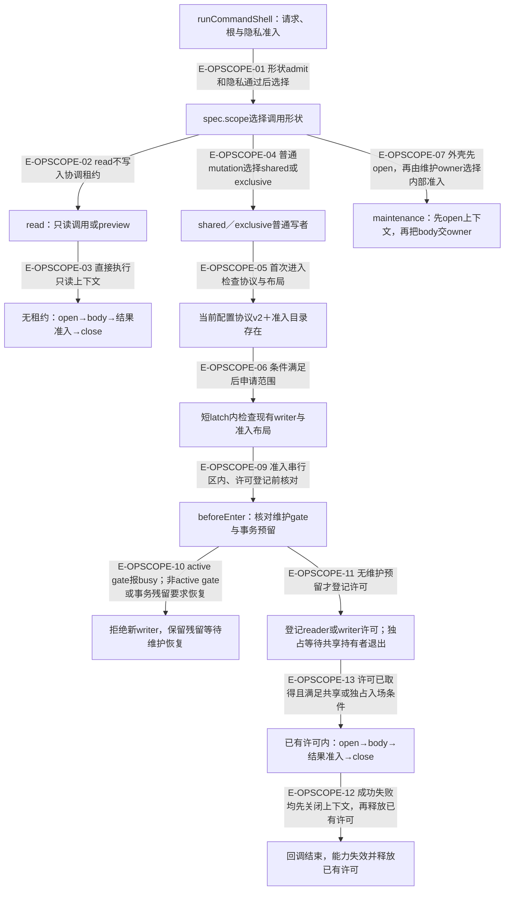
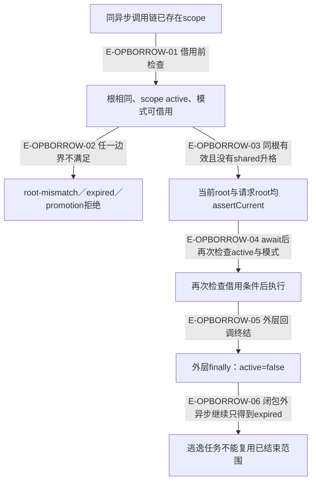

# 工作区操作范围：维护等待、运行准入与嵌套能力

2026-10-03工作树为普通shared/exclusive写入口增加跨进程准入，保护领域上下文加载到效果结算的生命期。maintenance形状把具体进入时机交给维护owner；业务权限、事件修订、声明围栏和Controller决定仍由原owner负责。

## 普通写者：取得许可后才打开领域上下文

### 本图术语说明

| 术语 | 本图含义 |
| --- | --- |
| shared | 正常运行的共享范围，多个运行操作可并存；不是读工具，也不免除领域锁。 |
| exclusive | 普通独占写者先登记writer许可以阻挡新shared，再等待既有shared退出，之后才执行回调。 |
| latch | 许可登记的短串行区；beforeEnter位于此区内、reader/writer许可创建之前。它不是包住全部业务执行的锁。 |
| maintenance | 外壳不会先替它取得scope；spec.open之后由owner的body分支决定。静态维护有gate加exclusive，Demand候选恢复显式exclusive，private-mode-convergence逐节点CAS、不入scope。 |
| 协议v2 | 普通writer只支持当前WakeflowConfig/schemaVersion；不是对旧工作区的静默升级许可。 |

### 节点与源码定位

| 节点 | 文件 / 符号 | 职责 |
| --- | --- | --- |
| a | `src/kernel/command-shell.ts#runCommandShell` | runCommandShell：请求、根与隐私准入 |
| m | `src/kernel/command-shell.ts#runCommandShell` | spec.scope选择调用形状 |
| r | `src/kernel/command-shell.ts#runCommandShell` | read：只读调用或preview |
| rc | `src/kernel/command-shell.ts#runCommandShell` | 无租约的上下文生命周期 |
| w | `src/kernel/workspace-operation-scope.ts#withWorkspaceOperationScope` | shared／exclusive普通写者 |
| p | `src/kernel/workspace-operation-scope.ts#prepareScope` | 当前配置协议v2＋准入目录存在 |
| g | `src/capabilities/workspace/maintain-workspace.ts#executeWakeflowMaintenancePublicRequest` | 上下文已开，再由维护body分支选择准入 |
| q | `src/foundation/filesystem/rooted-read-write-scope.ts#withRootedReadWriteScope` | 短latch内检查writer与布局 |
| b | `src/kernel/workspace-operation-scope.ts#assertNoMaintenanceReservation` | beforeEnter：许可登记前核对维护预留 |
| x | `src/kernel/workspace-operation-scope.ts#assertNoMaintenanceReservation` | 拒绝新writer，保留残留等待维护恢复 |
| k | `src/foundation/filesystem/rooted-read-write-scope.ts#withRootedReadWriteScope` | 登记许可；独占等待shared退尽 |
| c | `src/kernel/command-shell.ts#runCommandShell` | 已有许可内的上下文生命周期 |
| e | `src/kernel/workspace-operation-scope.ts#withWorkspaceOperationScope` | 回调结束，能力失效并释放已有许可 |

### 本图边级证据

| 编号 | 代码证据 | 测试证据 | 关系依据 |
| --- | --- | --- | --- |
| E-OPSCOPE-01 | `src/kernel/command-shell.ts#runCommandShell` | `tests/kernel/command-shell.test.ts#runCommandShell` | 形状admit和隐私通过后选择 |
| E-OPSCOPE-02 | `src/kernel/command-shell.ts#runCommandShell` | `tests/kernel/command-shell.test.ts#runCommandShell` | read不写入协调租约 |
| E-OPSCOPE-03 | `src/kernel/command-shell.ts#runCommandShell` | `tests/kernel/command-shell.test.ts#runCommandShell` | 直接执行只读上下文 |
| E-OPSCOPE-04 | `src/kernel/command-shell.ts#runCommandShell` | 间接覆盖：`tests/kernel/command-shell.test.ts#runCommandShell`（仅read外壳用例；普通写者分支由源码核验） | 普通mutation选择shared或exclusive |
| E-OPSCOPE-05 | `src/kernel/workspace-operation-scope.ts#prepareScope` | `tests/capabilities/workspace/operation-scope.test.ts#executeCodexWakeflowMaintenance` | 首次进入检查协议与布局 |
| E-OPSCOPE-06 | `src/kernel/workspace-operation-scope.ts#withWorkspaceOperationScope` | `tests/kernel/workspace-operation-scope.test.ts#withWorkspaceOperationScope` | 条件满足后申请范围 |
| E-OPSCOPE-07 | `src/kernel/command-shell.ts#runCommandShell`、`src/capabilities/workspace/maintain-workspace.ts#executeWakeflowMaintenancePublicRequest` | 间接覆盖：`tests/capabilities/workspace/operation-scope.test.ts#executeCodexWakeflowMaintenance`，公共维护执行器经shell打开上下文，再分派owner操作 | 外壳先open，再由维护owner选择内部准入 |
| E-OPSCOPE-09 | `src/foundation/filesystem/rooted-read-write-scope.ts#withRootedReadWriteScope` | 间接覆盖：`tests/kernel/workspace-operation-scope.test.ts#withWorkspaceOperationScope`，残留预留拒绝回调并保持无租约；精确先后另由直接调用顺序核验 | 准入串行区内、许可登记前核对 |
| E-OPSCOPE-10 | `src/kernel/workspace-operation-scope.ts#assertNoMaintenanceReservation` | `tests/kernel/workspace-operation-scope.test.ts#withWorkspaceOperationScope` | active gate报busy；非active gate或事务残留要求恢复 |
| E-OPSCOPE-11 | `src/foundation/filesystem/rooted-read-write-scope.ts#withRootedReadWriteScope` | `tests/foundation/filesystem/rooted-read-write-scope.test.ts#withRootedReadWriteScope` | 无维护预留才登记许可 |
| E-OPSCOPE-13 | `src/foundation/filesystem/rooted-read-write-scope.ts#withRootedReadWriteScope`、`src/kernel/command-shell.ts#runCommandShell` | 间接覆盖：`tests/foundation/filesystem/rooted-read-write-scope.test.ts#withRootedReadWriteScope`，共享重叠与独占排空断言；上下文打开位置由shell直接调用核验 | 许可已取得且满足共享或独占入场条件 |
| E-OPSCOPE-12 | `src/kernel/command-shell.ts#runCommandShell` | 间接覆盖：`tests/kernel/command-shell.test.ts#runCommandShell`（read路径验证上下文关闭；普通写者释放许可的包围次序由源码核验） | 仅普通writer已有许可的路径：先close上下文，再释放许可 |

本轮交叉复核撤销旧 `E-OPSCOPE-08`“所有maintenance持gate后进入exclusive”的泛化边，maintenance在本图终止于owner交接；其内部不同分支见[维护与配置基线](../03-configuration-workspace/operation-scope-and-config-baseline.md)。新增 `E-OPSCOPE-13` 明示许可登记/排空与领域上下文打开的先后；read节点不连接许可释放节点。

## 嵌套调用：借用有效能力，不升格也不越根

### 本图术语说明

| 术语 | 本图含义 |
| --- | --- |
| 借用 | exclusive可在同根借用shared；嵌套调用不重新申请租约，从而不自锁。 |
| active | 内存能力的回调生命期；不等价OS进程存活状态。 |
| 关闭根 | assertCurrent确保RootedDirectory能力仍可用；未把一个路径字符串当作开放文件能力。 |

### 节点与源码定位

| 节点 | 文件 / 符号 | 职责 |
| --- | --- | --- |
| a | `src/kernel/workspace-operation-scope.ts#withWorkspaceOperationScope` | 同异步调用链已存在scope |
| v | `src/kernel/workspace-operation-scope.ts#assertBorrowable` | 根相同、scope active、模式可借用 |
| x | `src/kernel/workspace-operation-scope.ts#assertBorrowable` | root-mismatch／expired／promotion拒绝 |
| r | `src/kernel/workspace-operation-scope.ts#withWorkspaceOperationScope` | 当前root与请求root均assertCurrent |
| c | `src/kernel/workspace-operation-scope.ts#withWorkspaceOperationScope` | 再次检查借用条件后执行 |
| f | `src/kernel/workspace-operation-scope.ts#withWorkspaceOperationScope` | 外层finally：active=false |
| l | `src/kernel/workspace-operation-scope.ts#assertBorrowable` | 逃逸任务不能复用已结束范围 |

### 本图边级证据

| 编号 | 代码证据 | 测试证据 | 关系依据 |
| --- | --- | --- | --- |
| E-OPBORROW-01 | `src/kernel/workspace-operation-scope.ts#withWorkspaceOperationScope` | `tests/kernel/workspace-operation-scope.test.ts#withWorkspaceOperationScope` | 借用前检查 |
| E-OPBORROW-02 | `src/kernel/workspace-operation-scope.ts#assertBorrowable` | `tests/kernel/workspace-operation-scope.test.ts#withWorkspaceOperationScope` | 任一边界不满足 |
| E-OPBORROW-03 | `src/kernel/workspace-operation-scope.ts#withWorkspaceOperationScope` | `tests/kernel/workspace-operation-scope.test.ts#withWorkspaceOperationScope` | 同根有效且没有shared升格 |
| E-OPBORROW-04 | `src/kernel/workspace-operation-scope.ts#withWorkspaceOperationScope` | `tests/kernel/workspace-operation-scope.test.ts#withWorkspaceOperationScope` | await后再次检查active与模式 |
| E-OPBORROW-05 | `src/kernel/workspace-operation-scope.ts#withWorkspaceOperationScope` | `tests/kernel/workspace-operation-scope.test.ts#withWorkspaceOperationScope` | 外层回调终结 |
| E-OPBORROW-06 | `src/kernel/workspace-operation-scope.ts#assertBorrowable` | `tests/kernel/workspace-operation-scope.test.ts#withWorkspaceOperationScope` | 闭包外异步继续只得到expired |

关闭根拒绝由 `tests/foundation/filesystem/rooted-directory.test.ts#RootedDirectory` 的关闭后I/O用例间接支持；scope专属测试直接覆盖升格、跨根与逃逸回调，未单独构造嵌套已关闭根。

## 错误、恢复和保护范围

新writer遇活动维护gate返回可重试 `maintenance-busy`；非active（失活或无法确认）gate或事务目录任何条目都要求 `maintenance-recovery-required`，不能因进程和租约已消失就越过intent/journal。维护恢复仍由原owner完成。取消映射 `io-failure/aborted`；底层scope错误映射 `concurrency-conflict/operation-scope-*`，只有timeout声明可重试。

已入场的普通writer继续结算；需要exclusive的维护分支等待其退出。静态维护已持gate时，未入场的新writer被该预留挡住；不能将此描述扩大为所有maintenance分支共用gate或scope。`read` 工具与preview不建立租约，也不获得跨目录原子快照保证。直接调用内部owner的代码必须自负准入合同，不能由公共shell图推断所有内部API都自动持有scope。

底层租约的文件协议、进程出生身份与失活证明见[Foundation读写准入](../02-foundation/read-write-admission.md)；这些证据不能泛化为所有stage恢复的共同实现。旧配置协议明确拒绝，当前没有迁移入口。

rc.4 已修复正常 reader 退出产生的 `residue-changed`：Foundation 本轮按仍占用，下一轮重观测，而不是把它直接透传为 `operation-scope-residue-changed`。新回归同时证明未知替换者仍被保护；这不是所有锁错误统一可重试。目录读取错误只有 source/expectation-changed 两类内部重试，底层抛出的 unsafe、recovery-required、release-failure 等仍拒绝准入，Kernel 不自动清理业务事实。

获取预算只覆盖准入，不限制回调运行时长。CF-01 的旧异常交接已经修复：Foundation 取得许可即在 latch 内保存外层 lease，使随后 latch 结算失败仍进入精确清理；shared/exclusive 与排空中的失败均有新回归。清理成功保留原错误，清理本身失败则外层 finally 的错误覆盖先前失败；未知替换者保持原字节并要求恢复。详见[异常交接与前后态证据](../02-foundation/admission-races-and-recovery.md)。这些断言不意味着所有 I/O 故障后目录都必然为空。

## 继续阅读

[模块总览](./README.md) · [本轮增量审阅](../../plans/review-2026-10-03/coordination.md) · [维护与配置切换](../03-configuration-workspace/operation-scope-and-config-baseline.md) · [总入口](../README.md)。
