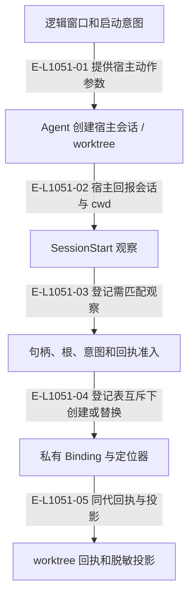

# 端点：逻辑窗口、绑定与 worktree 回执

逻辑窗口来自配置，私有 Binding 指向宿主句柄。登记以 SessionStart 与启动意图核对；worktree Pod 的产品窗口还要带物理回执。

> 核验基线：`1480271`（L1 observation 第十片已落地，20 个公共工具、18 个一次性场景）。工作树另有并行未提交改动（宿主 hook 通道等），本图不描绘；来源指纹按当前工作树计算。本文说明实现事实，未宣称双宿主真实会话已经验证。

## 端点登记与可验证的执行位置

### 本图术语说明

| 术语 | 本图含义 |
| --- | --- |
| Pod | 完整窗口组与每仓执行位置；main 是 primary Pod。 |
| hook | 宿主回交的会话/提示提交/完成观察记录，保存在宿主本地根。 |
| host | Codex 或 Claude Code；真实会话动作由 Agent 调用宿主完成。 |
| CAS | 比较已观察的摘要/修订后提交；来源已改变则拒绝。 |

### 节点与实现定位

| 节点 | 文件 / 符号 | 责任 |
| --- | --- | --- |
| intent | `src/capabilities/endpoint/service.ts` | 逻辑窗口和启动意图 |
| agent | Agent / 用户 / 外部效果或条件视图 | Agent 创建宿主会话 / worktree |
| hook | `src/kernel/hook-observations.ts` | SessionStart 观察 |
| admit | `src/capabilities/endpoint/decide.ts` | 句柄、根、意图和回执准入 |
| binding | `src/capabilities/endpoint/service.ts` | 私有 Binding 与定位器 |
| receipt | `src/kernel/pod-worktree-receipts.ts` | worktree 回执和脱敏投影 |

### 本图边级证据

| 编号 | 代码定位 | 测试 / 核验 | 关系依据 |
| --- | --- | --- | --- |
| E-L1051-01 | `src/capabilities/endpoint/service.ts#executionInstructions` | `tests/capabilities/endpoint/service.test.ts` | 提供宿主动作参数 |
| E-L1051-02 | `src/kernel/hook-observations.ts#writeHostHookObservation` | `tests/capabilities/endpoint/service.test.ts` | 宿主回报会话与 cwd |
| E-L1051-03 | `src/capabilities/endpoint/service.ts#loadHookSessions` | `tests/capabilities/endpoint/service.test.ts` | 登记需匹配观察 |
| E-L1051-04 | `src/capabilities/endpoint/service.ts#mutateBinding` | `tests/capabilities/endpoint/service.test.ts` | 登记表互斥下创建或替换 |
| E-L1051-05 | `src/kernel/pod-worktree-receipts.ts#writePodWorktreeReceipt` | `tests/capabilities/pod/service.test.ts` | 同代回执与投影 |

## 守卫、恢复与验证范围

五操作为 inspect、register、replace、decommission、release-claim。原始会话句柄与检出绝对路径只进宿主本地记录；工具返回摘要、逻辑身份与允许公开的分支事实。

涉及的测试与核验入口：

- `tests/capabilities/endpoint/service.test.ts`。
- `tests/capabilities/pod/service.test.ts`。

## 下钻与相关视图

- [文件直接导入](./file-dependencies.md)
- [运行调用与恢复](./runtime-call-flow.md)
- [图谱总索引](../README.md)
- [核验与剩余范围](../01-diagram-review-ledger.md)
