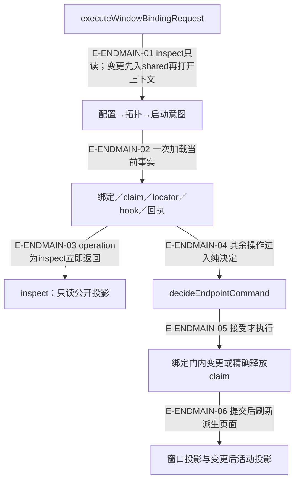

# 端点：六操作、身份代际与宿主事实

> 核验于 2026-10-03，基线 `d8fafff` 加当前未提交工作树。图表达实际源码分支，未提交实现标为进行中；不把开发阶段计划当作运行事实。来源与测试锚点按本文精确范围列出。

端点层把配置中的逻辑窗口绑定到一个已观察到的宿主会话。启动/恢复/关闭窗口和创建worktree由Agent通过宿主完成；此工具校验输入事实并保存绑定，不替宿主发起这些效果。

## 一次绑定调用：身份事实、决定、提交与投影

```mermaid
flowchart TB
  accTitle: 一次绑定调用：身份事实、决定、提交与投影
  accDescr: 公共执行器从Config与本地事实加载一份状态，inspect只返回，变更先经纯决定再在绑定登记门内提交。
  a["executeWindowBindingRequest"]
  b["配置→拓扑→启动意图"]
  c["绑定／claim／locator／hook／回执"]
  i["inspect：只读公开投影"]
  d["decideEndpointCommand"]
  m["绑定门内变更或精确释放claim"]
  p["窗口投影与变更后活动投影"]
  a -->|"E-ENDMAIN-01 inspect只读；变更先入shared再打开上下文"| b
  b -->|"E-ENDMAIN-02 一次加载当前事实"| c
  c -->|"E-ENDMAIN-03 operation为inspect立即返回"| i
  c -->|"E-ENDMAIN-04 其余操作进入纯决定"| d
  d -->|"E-ENDMAIN-05 接受才执行"| m
  m -->|"E-ENDMAIN-06 提交后刷新派生页面"| p
```

### 本图术语说明

| 术语 | 本图含义 |
| --- | --- |
| 逻辑窗口 | Config中的稳定windowId，不是宿主句柄。 |
| 绑定 | windowId与宿主handle的一代关系；bindingId变化表示换代。 |
| 启动意图 | 从当前配置及宿主profile重算的目标，不证明会话已创建。 |
| 投影 | 由Config和Binding重建的导航材料，不拥有身份。 |

### 节点与源码定位

| 节点 | 文件 / 符号 | 职责 |
| --- | --- | --- |
| a | `src/capabilities/endpoint/service.ts#executeWindowBindingRequest` | executeWindowBindingRequest |
| b | `src/capabilities/endpoint/service.ts#openContext` | 配置→拓扑→启动意图 |
| c | `src/capabilities/endpoint/service.ts#loadState` | 绑定／claim／locator／hook／回执 |
| i | `src/capabilities/endpoint/service.ts#inspectionResult` | inspect：只读公开投影 |
| d | `src/capabilities/endpoint/decide.ts#decideEndpointCommand` | decideEndpointCommand |
| m | `src/capabilities/endpoint/service.ts#executeOperation` | 绑定门内变更或精确释放claim |
| p | `src/capabilities/endpoint/projection.ts#publishProjectionDocument` | 窗口投影与变更后活动投影 |

### 本图边级证据

| 编号 | 代码证据 | 测试证据 | 关系依据 |
| --- | --- | --- | --- |
| E-ENDMAIN-01 | `src/capabilities/endpoint/service.ts#executeWindowBindingRequest` | `tests/capabilities/endpoint/service.test.ts#executeWindowBindingRequest` | inspect只读；变更先入shared再打开上下文 |
| E-ENDMAIN-02 | `src/capabilities/endpoint/service.ts#executeOperation` | `tests/capabilities/endpoint/service.test.ts#executeWindowBindingRequest` | 一次加载当前事实 |
| E-ENDMAIN-03 | `src/capabilities/endpoint/service.ts#executeOperation` | `tests/capabilities/endpoint/service.test.ts#executeWindowBindingRequest` | operation为inspect立即返回 |
| E-ENDMAIN-04 | `src/capabilities/endpoint/service.ts#executeOperation` | `tests/capabilities/endpoint/service.test.ts#executeWindowBindingRequest` | 其余操作进入纯决定 |
| E-ENDMAIN-05 | `src/capabilities/endpoint/service.ts#executeOperation` | `tests/capabilities/endpoint/service.test.ts#executeWindowBindingRequest` | 接受才执行 |
| E-ENDMAIN-06 | `src/capabilities/endpoint/service.ts#mutateBinding` | `tests/capabilities/endpoint/service.test.ts#executeWindowBindingRequest` | 提交后刷新派生页面 |

## 六种操作的精确边界

| 操作 | 准入与关键分支 | 保存的事实 |
| --- | --- | --- |
| inspect | 窗口存在；hook通道可完整读取 | 无写入；给出重新计算的启动参数 |
| register | 意图摘要一致、session-start符合宿主启动根规则；tmux需坐标；worktree需执行根与Git证据；同handle重放 | 新绑定；定位器；可补worktree回执 |
| replace | 旧bindingId/digest CAS；无claim；新handle不同；新会话准入 | 新bindingId与更晚registeredAt；换定位器和回执 |
| relocate | 同handle、旧绑定CAS、只适用tmux；claim可保留 | 绑定不动，只换定位器代际 |
| decommission | 旧绑定CAS、无claim；closed失败或post仍活拒绝 | 删除绑定与locator；更新未注册投影 |
| release-claim | claimDigest一致；过期 **或** session-end **或** liveness缺席 | 先写强制释放回执，再精确释放claim |

`src/capabilities/endpoint/decide.ts#decideReleaseClaim`的实际条件是OR。2小时阈值只打开人工/Agent发起的恢复调用，系统不会按时间自动释放；“过期且会话消失”的叙述比实现更严格。

## 身份与证据分层

| 对象 | 权威来源 | 消费者 | 权限 |
| --- | --- | --- | --- |
| Binding | window-runtime私有登记表 | 投递与观察 | 同宿主handle不能属于两个窗口 |
| Locator | `src/capabilities/endpoint/locator-store.ts#writeWindowLocator` | pane分类、投递、退役 | 私有tmux四元组；不证明pane仍活 |
| Hook | `src/kernel/hook-observations.ts#readHostHookObservations` | register/replace/relocate与退役 | session-start需符合宿主会话根；不完整或skipped拒绝 |
| Worktree receipt | `src/kernel/pod-worktree-receipts.ts#admitPodWorktreeObservation` | Pod状态、任务与证据来源 | 私有绝对路径；公开只回HEAD/branch/locked |
| Work claim | `src/kernel/work-claims.ts#inspectWorkClaim` | replace/decommission/release | 独立围栏；不进Binding记录 |

inspect给出的启动说明由宿主 `renderLaunchInstructions` 生成，仅是执行建议；decommission的manual-host-gate是本次观察的分级标签，不能画成Wakeflow自动读取Codex归档状态或新审批系统。

## 项目聊天根与角色执行根

Codex 的 `project-thread` profile 要求所有角色的 SessionStart 位于 Wakeflow 工作区项目根；角色目录是 `executionRoot`，不能以它伪造项目聊天来源。worktree 产品窗口必须另报绝对执行根，逐项核对 Git commonDir 与双向指针。Claude 的会话在角色目录启动，执行根沿用其 hook cwd。完整准入见[两种根与检出证据](./execution-roots.md)。

## 继续阅读

[文件导入](./file-dependencies.md) · [运行分支](./runtime-call-flow.md) · [本模块总览](./README.md) · [全局入口](../README.md) · [本轮增量审阅](../../plans/review-2026-10-03/coordination.md) · [前轮完整审阅](../../plans/review-2026-10-02/coordination-evidence.md)
