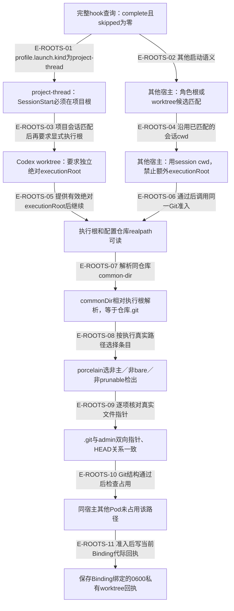

# 会话根与执行根：两种证据分别准入

项目聊天属于Wakeflow工作区，产品实现属于分配的检出；两种根在Codex中可以不同。代码依据host profile的 `launch.kind` 分支，不由共享service猜宿主名称。以下是register/replace的worktree准入链；inspect只生成说明，relocate不会写新的worktree回执。

## 从SessionStart到已核实的产品检出

### 本图术语说明

| 术语 | 本图含义 |
| --- | --- |
| 项目根 | project-thread的会话归属根；不是产品工作树选择证据。 |
| 执行根 | 工具实际工作的已分配产品检出，Codex worktree必须明确提交绝对路径，公开结果不泄露该路径。 |
| Git结构 | 真实.git/admin指针、common-dir和HEAD关系；不证明工作区干净、分支已合并或目标进程一直在该目录执行。 |
| receipt | 保存观察到的检出身份与Binding代际，实际检出仍由宿主/Agent管理。 |

### 节点与源码定位

| 节点 | 文件 / 符号 | 职责 |
| --- | --- | --- |
| a | `src/capabilities/endpoint/service.ts#loadHookSessions` | 完整hook查询：complete且skipped为零 |
| b | `src/capabilities/endpoint/service.ts#sessionRootMatcher` | project-thread：SessionStart必须在项目根 |
| c | `src/capabilities/endpoint/service.ts#sessionRootMatcher` | 其他宿主：角色根或worktree候选匹配 |
| d | `src/capabilities/endpoint/service.ts#admitWorktree` | Codex worktree：要求独立绝对executionRoot |
| e | `src/capabilities/endpoint/service.ts#admitWorktree` | 其他宿主：用session cwd，禁止额外executionRoot |
| f | `src/kernel/pod-worktree-receipts.ts#admitPodWorktreeObservation` | 执行根和配置仓库realpath可读 |
| g | `src/kernel/pod-worktree-receipts.ts#resolveCommonDir` | commonDir相对执行根解析，等于仓库.git |
| h | `src/kernel/pod-worktree-receipts.ts#selectExecutionEntry` | porcelain选非主／非bare／非prunable检出 |
| i | `src/kernel/pod-worktree-receipts.ts#verifyLinkedWorktree` | .git与admin双向指针、HEAD关系一致 |
| j | `src/capabilities/endpoint/service.ts#admitWorktree` | 同宿主其他Pod未占用该路径 |
| k | `src/capabilities/endpoint/service.ts#recordWorktree` | 保存Binding绑定的0600私有worktree回执 |

### 本图边级证据

| 编号 | 代码证据 | 测试证据 | 关系依据 |
| --- | --- | --- | --- |
| E-ROOTS-01 | `src/capabilities/endpoint/service.ts#sessionRootMatcher` | `tests/capabilities/endpoint/service.test.ts#executeWindowBindingRequest` | profile.launch.kind为project-thread |
| E-ROOTS-02 | `src/capabilities/endpoint/service.ts#sessionRootMatcher` | `tests/capabilities/endpoint/service.test.ts#executeWindowBindingRequest` | 其他启动语义 |
| E-ROOTS-03 | `src/capabilities/endpoint/service.ts#admitWorktree` | `tests/capabilities/pod/service.test.ts#executeWindowBindingRequest` | 项目会话匹配后再要求显式执行根；项目根不能隐式选择产品检出 |
| E-ROOTS-04 | `src/capabilities/endpoint/service.ts#admitWorktree` | 间接覆盖：`tests/kernel/pod-worktree-receipts.test.ts#admitPodWorktreeObservation`；服务的非project-thread禁止额外executionRoot分支当前无独立用例 | 沿用已匹配的会话cwd |
| E-ROOTS-05 | `src/capabilities/endpoint/service.ts#admitWorktree` | `tests/capabilities/pod/service.test.ts#executeWindowBindingRequest` | 提供有效绝对executionRoot后继续；缺失或相对路径在此拒绝，不能进入realpath检查 |
| E-ROOTS-06 | `src/capabilities/endpoint/service.ts#admitWorktree` | `tests/kernel/pod-worktree-receipts.test.ts#admitPodWorktreeObservation` | 通过后调用同一Git准入 |
| E-ROOTS-07 | `src/kernel/pod-worktree-receipts.ts#admitPodWorktreeObservation` | `tests/kernel/pod-worktree-receipts.test.ts#admitPodWorktreeObservation` | 解析同仓库common-dir |
| E-ROOTS-08 | `src/kernel/pod-worktree-receipts.ts#selectExecutionEntry` | `tests/kernel/pod-worktree-receipts.test.ts#admitPodWorktreeObservation` | 按执行真实路径选择条目 |
| E-ROOTS-09 | `src/kernel/pod-worktree-receipts.ts#verifyLinkedWorktree` | `tests/kernel/pod-worktree-receipts.test.ts#admitPodWorktreeObservation` | 逐项核对真实文件指针 |
| E-ROOTS-10 | `src/capabilities/endpoint/service.ts#admitWorktree` | `tests/capabilities/pod/service.test.ts#executeWindowBindingRequest` | Git结构通过后检查占用 |
| E-ROOTS-11 | `src/capabilities/endpoint/service.ts#recordWorktree` | `tests/capabilities/pod/service.test.ts#executeWindowBindingRequest` | 准入后写当前Binding代际回执 |

## 保证与限制

登记要求启动意图摘要一致和完整hook证据；项目子目录的SessionStart不能冒充项目聊天。产品检出另报执行根；executionRoot缺失或为相对路径时，在realpath检查之前直接拒绝。有效绝对执行根通过真实Git文件关系后才写回执，路径被另一同宿主Pod占用时拒绝。输入worktree观察可含私有路径，但公开回执只给HEAD、branch、detached和locked。

没有调用Git来验证对象图；attached branch检验的是HEAD引用文本一致，detached检验OID一致。`worktreeCheckoutPresent`后续只看目录与.git文件存在，不重新证明全部Git关联。绑定、定位器、回执和投影仍是分步写入，可经重放或对账修复，不能读成跨文件原子提交。

启动建议已经移到宿主注入的 `renderLaunchInstructions`：Codex建议创建项目local聊天并另分配执行目录；Claude按自己的启动能力生成命令。具体host启动实现见[项目聊天宿主接缝](../09-public-mcp-host-seams/project-chats-and-execution-roots.md)。

## 继续阅读

[模块总览](./README.md) · [本轮增量审阅](../../plans/review-2026-10-03/coordination.md) · [总入口](../README.md)。
