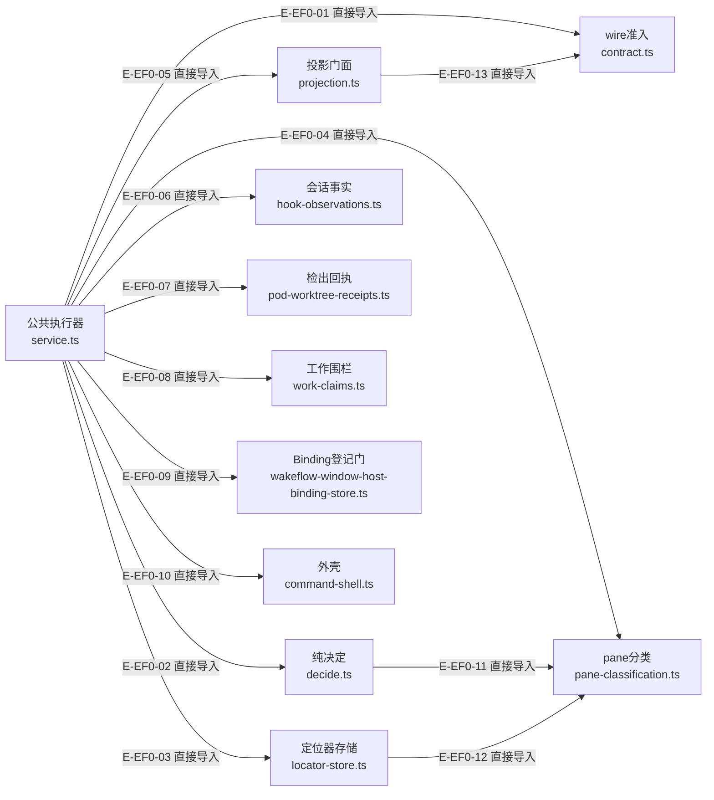

# 端点：命令、决定与私有记录的静态依赖

> 核验于 2026-10-03，基线 `d8fafff` 加当前未提交工作树。图表达实际源码分支，未提交实现标为进行中；不把开发阶段计划当作运行事实。来源与测试锚点按本文精确范围列出。

本图是从当前TypeScript AST选出的直接导入子图；每条边再对照已读源码用途。它只证明耦合方向，不证明调用顺序、状态转移或Agent授权。

## 端点：命令、决定与私有记录的静态依赖

```mermaid
flowchart LR
  accTitle: 端点：命令、决定与私有记录的静态依赖
  accDescr: 文件直接import关系的审阅精选视图，运行调用与状态分支在独立页面。
  f0["公共执行器<br/>service.ts"]
  f1["wire准入<br/>contract.ts"]
  f2["纯决定<br/>decide.ts"]
  f3["定位器存储<br/>locator-store.ts"]
  f4["pane分类<br/>pane-classification.ts"]
  f5["投影门面<br/>projection.ts"]
  f6["会话事实<br/>hook-observations.ts"]
  f7["检出回执<br/>pod-worktree-receipts.ts"]
  f8["工作围栏<br/>work-claims.ts"]
  f9["Binding登记门<br/>wakeflow-window-host-binding-store.ts"]
  f10["外壳<br/>command-shell.ts"]
  f0 -->|"E-EF0-01 直接导入"| f1
  f0 -->|"E-EF0-02 直接导入"| f2
  f0 -->|"E-EF0-03 直接导入"| f3
  f0 -->|"E-EF0-04 直接导入"| f4
  f0 -->|"E-EF0-05 直接导入"| f5
  f0 -->|"E-EF0-06 直接导入"| f6
  f0 -->|"E-EF0-07 直接导入"| f7
  f0 -->|"E-EF0-08 直接导入"| f8
  f0 -->|"E-EF0-09 直接导入"| f9
  f0 -->|"E-EF0-10 直接导入"| f10
  f2 -->|"E-EF0-11 直接导入"| f4
  f3 -->|"E-EF0-12 直接导入"| f4
  f5 -->|"E-EF0-13 直接导入"| f1
```

### 本图术语说明

| 术语 | 本图含义 |
| --- | --- |
| 直接导入 | 包含实际import或显式re-export；类型依赖同样算结构依赖。 |
| 精选范围 | 按模块入口裁剪；被省略的依赖仍在逐文件台账和全局导入数据中。 |

### 节点与源码定位

| 节点 | 文件 / 符号 | 职责 |
| --- | --- | --- |
| f0 | `src/capabilities/endpoint/service.ts` | 公共执行器 service.ts |
| f1 | `src/capabilities/endpoint/contract.ts` | wire准入 contract.ts |
| f2 | `src/capabilities/endpoint/decide.ts` | 纯决定 decide.ts |
| f3 | `src/capabilities/endpoint/locator-store.ts` | 定位器存储 locator-store.ts |
| f4 | `src/capabilities/endpoint/pane-classification.ts` | pane分类 pane-classification.ts |
| f5 | `src/capabilities/endpoint/projection.ts` | 投影门面 projection.ts |
| f6 | `src/kernel/hook-observations.ts` | 会话事实 hook-observations.ts |
| f7 | `src/kernel/pod-worktree-receipts.ts` | 检出回执 pod-worktree-receipts.ts |
| f8 | `src/kernel/work-claims.ts` | 工作围栏 work-claims.ts |
| f9 | `src/workspace/window-runtime/wakeflow-window-host-binding-store.ts` | Binding登记门 wakeflow-window-host-binding-store.ts |
| f10 | `src/kernel/command-shell.ts` | 外壳 command-shell.ts |

### 本图边级证据

| 编号 | 代码证据 | 测试证据 | 关系依据 |
| --- | --- | --- | --- |
| E-EF0-01 | `src/capabilities/endpoint/service.ts` | 未覆盖：此边是静态导入，由源码 AST 校验；运行测试不代替导入证据 | 直接导入 |
| E-EF0-02 | `src/capabilities/endpoint/service.ts` | 未覆盖：此边是静态导入，由源码 AST 校验；运行测试不代替导入证据 | 直接导入 |
| E-EF0-03 | `src/capabilities/endpoint/service.ts` | 未覆盖：此边是静态导入，由源码 AST 校验；运行测试不代替导入证据 | 直接导入 |
| E-EF0-04 | `src/capabilities/endpoint/service.ts` | 未覆盖：此边是静态导入，由源码 AST 校验；运行测试不代替导入证据 | 直接导入 |
| E-EF0-05 | `src/capabilities/endpoint/service.ts` | 未覆盖：此边是静态导入，由源码 AST 校验；运行测试不代替导入证据 | 直接导入 |
| E-EF0-06 | `src/capabilities/endpoint/service.ts` | 未覆盖：此边是静态导入，由源码 AST 校验；运行测试不代替导入证据 | 直接导入 |
| E-EF0-07 | `src/capabilities/endpoint/service.ts` | 未覆盖：此边是静态导入，由源码 AST 校验；运行测试不代替导入证据 | 直接导入 |
| E-EF0-08 | `src/capabilities/endpoint/service.ts` | 未覆盖：此边是静态导入，由源码 AST 校验；运行测试不代替导入证据 | 直接导入 |
| E-EF0-09 | `src/capabilities/endpoint/service.ts` | 未覆盖：此边是静态导入，由源码 AST 校验；运行测试不代替导入证据 | 直接导入 |
| E-EF0-10 | `src/capabilities/endpoint/service.ts` | 未覆盖：此边是静态导入，由源码 AST 校验；运行测试不代替导入证据 | 直接导入 |
| E-EF0-11 | `src/capabilities/endpoint/decide.ts` | 未覆盖：此边是静态导入，由源码 AST 校验；运行测试不代替导入证据 | 直接导入 |
| E-EF0-12 | `src/capabilities/endpoint/locator-store.ts` | 未覆盖：此边是静态导入，由源码 AST 校验；运行测试不代替导入证据 | 直接导入 |
| E-EF0-13 | `src/capabilities/endpoint/projection.ts` | 未覆盖：此边是静态导入，由源码 AST 校验；运行测试不代替导入证据 | 直接导入 |

共享 service 只接收 `renderLaunchInstructions` 函数及 `resourceProfile.launch.kind`；宿主说明代码由组合根注入，不在本图画一条不存在的 service→Codex/Claude 实现直接导入边。会话根与执行根的实际分支见[执行根](./execution-roots.md)。

## 阅读边界

该图只有直接import，六操作的分支和锁顺序见运行图。Host差异来自resource/identity profile；定位器tmux专属，公共代码不调用tmux。

Schema是可移植wire源；`tooling/codegen/schema-types.ts`生成`src/contracts/generated/identity/wakeflow-durable-id-kind.generated.ts`等派生合同。生成文件只核实来源与生成链，不计作手写文件语义审阅；`package.json`的schema:build/schema:check负责生成与漂移检测。

## 继续阅读

[文件导入](./file-dependencies.md) · [运行分支](./runtime-call-flow.md) · [本模块总览](./README.md) · [全局入口](../README.md) · [本轮增量审阅](../../plans/review-2026-10-03/coordination.md) · [前轮完整审阅](../../plans/review-2026-10-02/coordination-evidence.md)
