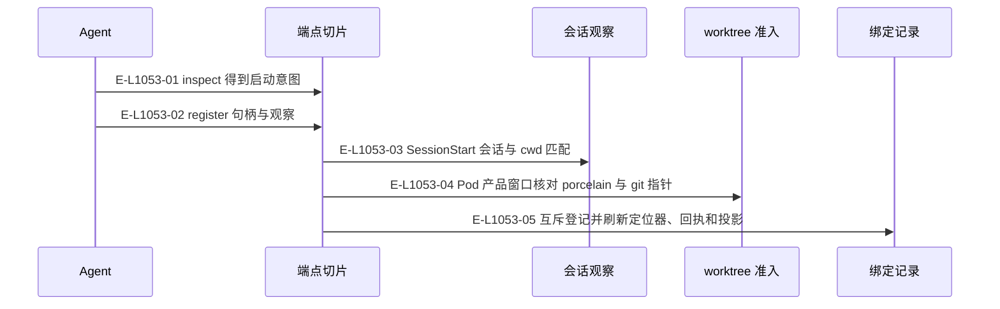
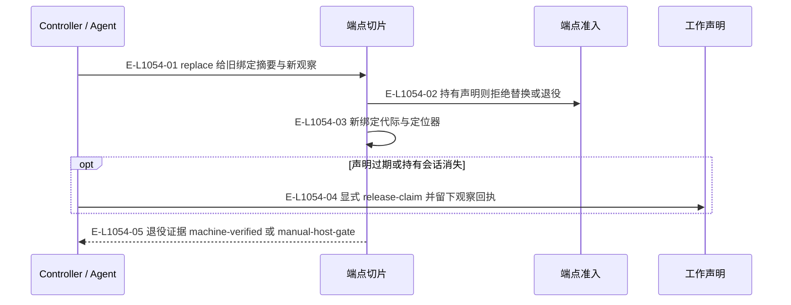

# 端点：登记、替换与恢复

各操作保持逻辑身份、宿主绑定代际与观察证据的区别。

> 核验基线：`1480271`（L1 observation 第十片已落地，20 个公共工具、18 个一次性场景）。工作树另有并行未提交改动（宿主 hook 通道等），本图不描绘；来源指纹按当前工作树计算。本文说明实现事实，未宣称双宿主真实会话已经验证。

## 登记与 worktree 回执核对

### 本图术语说明

| 术语 | 本图含义 |
| --- | --- |
| hook | 宿主回交的会话/提示提交/完成观察记录，保存在宿主本地根。 |
| Pod | 完整窗口组与每仓执行位置；main 是 primary Pod。 |
| CAS | 比较已观察的摘要/修订后提交；来源已改变则拒绝。 |

### 节点与实现定位

| 节点 | 文件 / 符号 | 责任 |
| --- | --- | --- |
| agent | Agent / 用户 / 外部效果或条件视图 | Agent |
| slice | `src/capabilities/endpoint/service.ts` | 端点切片 |
| hook | `src/kernel/hook-observations.ts` | 会话观察 |
| receipt | `src/kernel/pod-worktree-receipts.ts` | worktree 准入 |
| binding | `src/capabilities/endpoint/service.ts` | 绑定记录 |

### 本图边级证据

| 编号 | 代码定位 | 测试 / 核验 | 关系依据 |
| --- | --- | --- | --- |
| E-L1053-01 | `src/capabilities/endpoint/service.ts#executeWindowBindingRequest` | `tests/capabilities/endpoint/service.test.ts` | inspect 得到启动意图 |
| E-L1053-02 | `src/capabilities/endpoint/service.ts#executeWindowBindingRequest` | `tests/capabilities/endpoint/service.test.ts` | register 句柄与观察 |
| E-L1053-03 | `src/capabilities/endpoint/service.ts#loadHookSessions` | `tests/capabilities/endpoint/service.test.ts` | SessionStart 会话与 cwd 匹配 |
| E-L1053-04 | `src/kernel/pod-worktree-receipts.ts#admitPodWorktreeObservation` | `tests/capabilities/pod/service.test.ts` | Pod 产品窗口核对 porcelain 与 git 指针 |
| E-L1053-05 | `src/capabilities/endpoint/service.ts#mutateBinding` | `tests/capabilities/endpoint/service.test.ts` | 互斥登记并刷新定位器、回执和投影 |

## 替换、退役与声明恢复

### 本图术语说明

| 术语 | 本图含义 |
| --- | --- |
| claim | 端点注意力及产品检出的工作声明，释放必须匹配当前令牌。 |
| CAS | 比较已观察的摘要/修订后提交；来源已改变则拒绝。 |
| host | Codex 或 Claude Code；真实会话动作由 Agent 调用宿主完成。 |

### 节点与实现定位

| 节点 | 文件 / 符号 | 责任 |
| --- | --- | --- |
| controller | Agent / 用户 / 外部效果或条件视图 | Controller / Agent |
| slice | `src/capabilities/endpoint/service.ts` | 端点切片 |
| decide | `src/capabilities/endpoint/decide.ts` | 端点准入 |
| claim | `src/kernel/work-claims.ts` | 工作声明 |

### 本图边级证据

| 编号 | 代码定位 | 测试 / 核验 | 关系依据 |
| --- | --- | --- | --- |
| E-L1054-01 | `src/capabilities/endpoint/service.ts#executeWindowBindingRequest` | `tests/capabilities/endpoint/service.test.ts` | replace 给旧绑定摘要与新观察 |
| E-L1054-02 | `src/capabilities/endpoint/decide.ts#decideEndpointCommand` | `tests/capabilities/endpoint/service.test.ts` | 持有声明则拒绝替换或退役 |
| E-L1054-03 | `src/capabilities/endpoint/service.ts#applyReplace` | `tests/capabilities/endpoint/service.test.ts` | 新绑定代际与定位器 |
| E-L1054-04 | `src/capabilities/endpoint/service.ts#releaseClaim` | `tests/capabilities/endpoint/service.test.ts` | 显式 release-claim 并留下观察回执 |
| E-L1054-05 | `src/capabilities/endpoint/decide.ts#decideEndpointCommand` | `tests/capabilities/endpoint/service.test.ts` | 退役证据 machine-verified 或 manual-host-gate |

## 守卫、恢复与验证范围

声明时间只开放恢复资格，不自动释放。Claude pane 分类器保持固定顺序；Codex 关闭仍可处于人工门，不能由线程归档推断物理检出已经清理。

涉及的测试与核验入口：

- `tests/capabilities/endpoint/service.test.ts`。
- `tests/capabilities/pod/service.test.ts`。

## 下钻与相关视图

- [本专题总览](./README.md)
- [图谱总索引](../README.md)
- [核验与剩余范围](../01-diagram-review-ledger.md)
