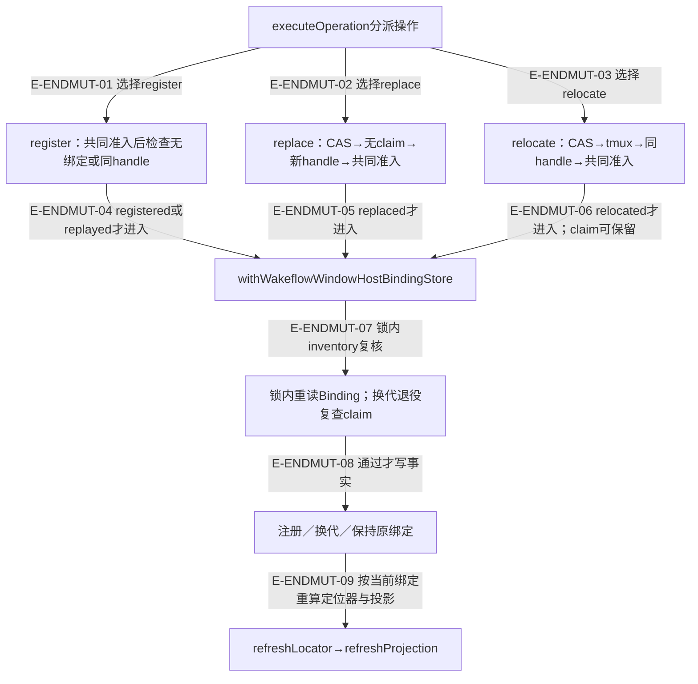
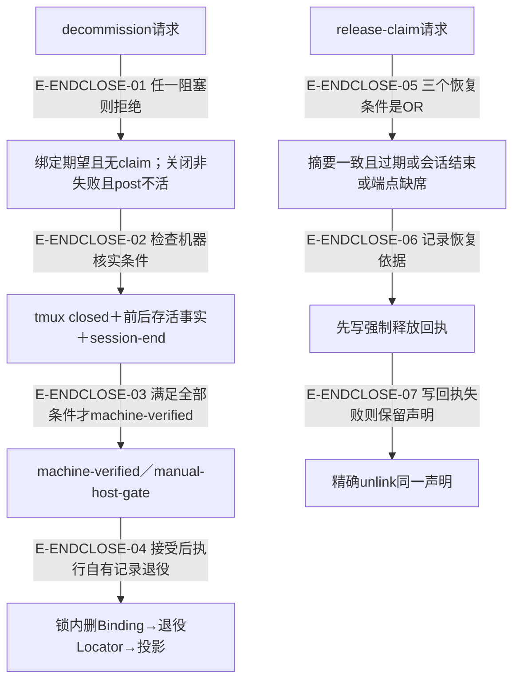

# 端点：登记、换代、退役与声明恢复

> 核验于 2026-10-03，基线 `d8fafff` 加当前未提交工作树。图表达实际源码分支，未提交实现标为进行中；不把开发阶段计划当作运行事实。来源与测试锚点按本文精确范围列出。

## 登记、换代、迁移的运行分支

```mermaid
flowchart TB
  accTitle: 登记、换代、迁移的运行分支
  accDescr: 各操作按自己的实际顺序准入，再进入绑定登记锁；共享条件不意味着所有操作采用同一个检查次序。
  a["executeOperation分派操作"]
  r["register：共同准入后检查无绑定或同handle"]
  x["replace：CAS→无claim→新handle→共同准入"]
  l["relocate：CAS→tmux→同handle→共同准入"]
  lock["withWakeflowWindowHostBindingStore"]
  check["锁内重读Binding；换代退役复查claim"]
  write["注册／换代／保持原绑定"]
  proj["refreshLocator→refreshProjection"]
  a -->|"E-ENDMUT-01 选择register"| r
  a -->|"E-ENDMUT-02 选择replace"| x
  a -->|"E-ENDMUT-03 选择relocate"| l
  r -->|"E-ENDMUT-04 registered或replayed才进入"| lock
  x -->|"E-ENDMUT-05 replaced才进入"| lock
  l -->|"E-ENDMUT-06 relocated才进入；claim可保留"| lock
  lock -->|"E-ENDMUT-07 锁内inventory复核"| check
  check -->|"E-ENDMUT-08 通过才写事实"| write
  write -->|"E-ENDMUT-09 按当前绑定重算定位器与投影"| proj
```

### 本图术语说明

| 术语 | 本图含义 |
| --- | --- |
| 共同准入 | launchIntentDigest、tmux坐标、worktree观察、session-start证据与handle唯一性。 |
| CAS | 比较旧bindingId/digest，锁内再次重读摘要。 |
| replayed | 同handle登记重试，可按当前观察补worktree回执。 |
| relocate | 会话未换，仅tmux位置变动。 |

### 节点与源码定位

| 节点 | 文件 / 符号 | 职责 |
| --- | --- | --- |
| a | `src/capabilities/endpoint/service.ts#executeOperation` | executeOperation分派操作 |
| r | `src/capabilities/endpoint/decide.ts#decideRegister` | register：共同准入后检查无绑定或同handle |
| x | `src/capabilities/endpoint/decide.ts#decideReplace` | replace：CAS→无claim→新handle→共同准入 |
| l | `src/capabilities/endpoint/decide.ts#decideRelocate` | relocate：CAS→tmux→同handle→共同准入 |
| lock | `src/capabilities/endpoint/service.ts#mutateBinding` | withWakeflowWindowHostBindingStore |
| check | `src/capabilities/endpoint/service.ts#assertUnchangedUnderLock` | 锁内重读Binding；换代退役复查claim |
| write | `src/capabilities/endpoint/service.ts#applyMutation` | 注册／换代／保持原绑定 |
| proj | `src/capabilities/endpoint/service.ts#mutateBinding` | refreshLocator→refreshProjection |

### 本图边级证据

| 编号 | 代码证据 | 测试证据 | 关系依据 |
| --- | --- | --- | --- |
| E-ENDMUT-01 | `src/capabilities/endpoint/decide.ts#decideEndpointCommand` | `tests/capabilities/endpoint/decide.test.ts#decideEndpointCommand` | 选择register |
| E-ENDMUT-02 | `src/capabilities/endpoint/decide.ts#decideEndpointCommand` | `tests/capabilities/endpoint/decide.test.ts#decideEndpointCommand` | 选择replace |
| E-ENDMUT-03 | `src/capabilities/endpoint/decide.ts#decideEndpointCommand` | `tests/capabilities/endpoint/decide.test.ts#decideEndpointCommand` | 选择relocate |
| E-ENDMUT-04 | `src/capabilities/endpoint/service.ts#mutateBinding` | `tests/capabilities/endpoint/service.test.ts#executeWindowBindingRequest` | registered或replayed才进入 |
| E-ENDMUT-05 | `src/capabilities/endpoint/service.ts#mutateBinding` | `tests/capabilities/endpoint/service.test.ts#executeWindowBindingRequest` | replaced才进入 |
| E-ENDMUT-06 | `src/capabilities/endpoint/service.ts#mutateBinding` | `tests/capabilities/endpoint/service.test.ts#executeWindowBindingRequest` | relocated才进入；claim可保留 |
| E-ENDMUT-07 | `src/capabilities/endpoint/service.ts#assertUnchangedUnderLock` | `tests/capabilities/endpoint/service.test.ts#executeWindowBindingRequest` | 锁内inventory复核 |
| E-ENDMUT-08 | `src/capabilities/endpoint/service.ts#applyMutation` | `tests/capabilities/endpoint/service.test.ts#executeWindowBindingRequest` | 通过才写事实 |
| E-ENDMUT-09 | `src/capabilities/endpoint/service.ts#mutateBinding` | `tests/capabilities/endpoint/service.test.ts#executeWindowBindingRequest` | 按当前绑定重算定位器与投影 |

## 关闭与工作声明释放分支

```mermaid
flowchart TB
  accTitle: 关闭与工作声明释放分支
  accDescr: 退役窗口和释放工作声明是独立操作，机器核实只在完整tmux证据时成立，回执先于声明删除。
  a["decommission请求"]
  b["绑定期望且无claim；关闭非失败且post不活"]
  m["tmux closed＋前后存活事实＋session-end"]
  h["machine-verified／manual-host-gate"]
  d["锁内删Binding→退役Locator→投影"]
  r["release-claim请求"]
  c["摘要一致且过期或会话结束或端点缺席"]
  p["先写强制释放回执"]
  u["精确unlink同一声明"]
  a -->|"E-ENDCLOSE-01 任一阻塞则拒绝"| b
  b -->|"E-ENDCLOSE-02 检查机器核实条件"| m
  m -->|"E-ENDCLOSE-03 满足全部条件才machine-verified"| h
  h -->|"E-ENDCLOSE-04 接受后执行自有记录退役"| d
  r -->|"E-ENDCLOSE-05 三个恢复条件是OR"| c
  c -->|"E-ENDCLOSE-06 记录恢复依据"| p
  p -->|"E-ENDCLOSE-07 写回执失败则保留声明"| u
```

### 本图术语说明

| 术语 | 本图含义 |
| --- | --- |
| 退役 | 退休Wakeflow绑定与locator；宿主关闭动作先由Agent完成。 |
| machine-verified | 由tmux前后观察与session-end共同支持的关闭级别。 |
| manual-host-gate | 机器条件未齐时的分级，不等于已完成宿主自动验证。 |

### 节点与源码定位

| 节点 | 文件 / 符号 | 职责 |
| --- | --- | --- |
| a | `src/capabilities/endpoint/decide.ts#decideDecommission` | decommission请求 |
| b | `src/capabilities/endpoint/decide.ts#decideDecommission` | 绑定期望且无claim；关闭非失败且post不活 |
| m | `src/capabilities/endpoint/decide.ts#decideDecommission` | tmux closed＋前后存活事实＋session-end |
| h | `src/capabilities/endpoint/decide.ts#decideDecommission` | machine-verified／manual-host-gate |
| d | `src/capabilities/endpoint/service.ts#applyDecommission` | 锁内删Binding→退役Locator→投影 |
| r | `src/capabilities/endpoint/decide.ts#decideReleaseClaim` | release-claim请求 |
| c | `src/capabilities/endpoint/decide.ts#decideReleaseClaim` | 摘要一致且过期或会话结束或端点缺席 |
| p | `src/capabilities/endpoint/service.ts#writeClaimReleaseReceipt` | 先写强制释放回执 |
| u | `src/capabilities/endpoint/service.ts#releaseClaim` | 精确unlink同一声明 |

### 本图边级证据

| 编号 | 代码证据 | 测试证据 | 关系依据 |
| --- | --- | --- | --- |
| E-ENDCLOSE-01 | `src/capabilities/endpoint/decide.ts#decideDecommission` | `tests/capabilities/endpoint/decide.test.ts#decideEndpointCommand` | 任一阻塞则拒绝 |
| E-ENDCLOSE-02 | `src/capabilities/endpoint/decide.ts#decideDecommission` | `tests/capabilities/endpoint/decide.test.ts#decideEndpointCommand` | 检查机器核实条件 |
| E-ENDCLOSE-03 | `src/capabilities/endpoint/decide.ts#decideDecommission` | `tests/capabilities/endpoint/decide.test.ts#decideEndpointCommand` | 满足全部条件才machine-verified |
| E-ENDCLOSE-04 | `src/capabilities/endpoint/service.ts#mutateBinding` | `tests/capabilities/endpoint/service.test.ts#executeWindowBindingRequest` | 接受后执行自有记录退役 |
| E-ENDCLOSE-05 | `src/capabilities/endpoint/decide.ts#decideReleaseClaim` | `tests/capabilities/endpoint/decide.test.ts#decideEndpointCommand` | 三个恢复条件是OR |
| E-ENDCLOSE-06 | `src/capabilities/endpoint/service.ts#releaseClaim` | `tests/capabilities/endpoint/service.test.ts#executeWindowBindingRequest` | 记录恢复依据 |
| E-ENDCLOSE-07 | `src/capabilities/endpoint/service.ts#releaseClaim` | `tests/capabilities/endpoint/service.test.ts#executeWindowBindingRequest` | 写回执失败则保留声明 |

## Worktree准入与未验证边界

`src/kernel/pod-worktree-receipts.ts#admitPodWorktreeObservation`要求已选 executionRoot 是非主检出、common-dir属于配置主仓库、.git/admin gitdir双向指针一致、HEAD与分支/提交一致。project-thread 的执行根来自独立绝对路径观察，SessionStart仍只证明项目根会话；其他宿主执行根来自会话cwd；`src/capabilities/endpoint/service.ts#admitWorktree`再拒绝同宿主另一Pod回执占用该路径。源码不执行Git或tmux。文件测试能证明解析和临时Git仓库指针关系，不能证明真实宿主UI完成启动。

变更先受工作区shared范围保护，再由绑定登记表锁与单文件CAS保护，完整性不是“所有记录一条原子事务”；register重放能补回执，窗口投影可对账。`src/capabilities/endpoint/service.ts#assertUnchangedUnderLock`注释明确：投递侧也需要在取得claim后复验Binding，单靠端点侧锁不构成两侧完整互斥。

[项目聊天与执行检出的独立准入](./execution-roots.md) · [工作区范围](../11-kernel/workspace-operation-scope.md)。工作区范围阻止并发配置维护，但不把绑定、回执、定位器和投影合成跨文件原子事务。

## 继续阅读

[文件导入](./file-dependencies.md) · [运行分支](./runtime-call-flow.md) · [本模块总览](./README.md) · [全局入口](../README.md) · [本轮增量审阅](../../plans/review-2026-10-03/coordination.md) · [前轮完整审阅](../../plans/review-2026-10-02/coordination-evidence.md)
