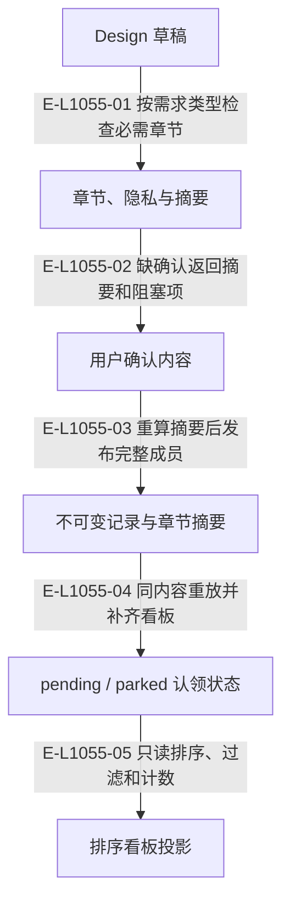

# 需求包：确认摘要、不可变记录与认领板

交接物为 requirement.md、landing.md 和可选文本附件。发布一次写入不可变 ledger 记录并上板；独立 Confirmation 和 TODO 摄入工具已经删除。

> 核验基线：`1480271`（L1 observation 第十片已落地，20 个公共工具、18 个一次性场景）。工作树另有并行未提交改动（宿主 hook 通道等），本图不描绘；来源指纹按当前工作树计算。本文说明实现事实，未宣称双宿主真实会话已经验证。

## 需求内容、确认与认领的不同事实

### 本图术语说明

| 术语 | 本图含义 |
| --- | --- |
| ledger | 长期不可变需求包与归档的存储根。 |
| CAS | 比较已观察的摘要/修订后提交；来源已改变则拒绝。 |
| projection | 根据权威重建的视图，不反向决定事实。 |

### 节点与实现定位

| 节点 | 文件 / 符号 | 责任 |
| --- | --- | --- |
| draft | `src/capabilities/requirement/service.ts` | Design 草稿 |
| preview | `src/capabilities/requirement/decide.ts` | 章节、隐私与摘要 |
| confirm | Agent / 用户 / 外部效果或条件视图 | 用户确认内容 |
| record | `src/governance/ledger/ledger-authority-store.ts` | 不可变记录与章节摘要 |
| board | `src/kernel/requirement-board.ts` | pending / parked 认领状态 |
| view | `src/capabilities/requirement/projection.ts` | 排序看板投影 |

### 本图边级证据

| 编号 | 代码定位 | 测试 / 核验 | 关系依据 |
| --- | --- | --- | --- |
| E-L1055-01 | `src/capabilities/requirement/decide.ts#analyzePackageDocuments` | `tests/capabilities/requirement/service.test.ts` | 按需求类型检查必需章节 |
| E-L1055-02 | `src/capabilities/requirement/service.ts#planPublish` | `tests/capabilities/requirement/service.test.ts` | 缺确认返回摘要和阻塞项 |
| E-L1055-03 | `src/capabilities/requirement/service.ts#applyPublish` | `tests/capabilities/requirement/service.test.ts` | 重算摘要后发布完整成员 |
| E-L1055-04 | `src/capabilities/requirement/service.ts#ensureClaimState` | `tests/capabilities/requirement/service.test.ts` | 同内容重放并补齐看板 |
| E-L1055-05 | `src/capabilities/requirement/service.ts#executeBoardInspectionRequest` | `tests/capabilities/requirement/service.test.ts` | 只读排序、过滤和计数 |

## 守卫、恢复与验证范围

记录不可变，变化通过新包 supersedes 表达。身份由内容与确认输入确定性派生。看板使用每包互斥和预期摘要替换；其索引不是权威。

涉及的测试与核验入口：

- `tests/capabilities/requirement/service.test.ts`。

## 下钻与相关视图

- [文件直接导入](./file-dependencies.md)
- [运行调用与恢复](./runtime-call-flow.md)
- [图谱总索引](../README.md)
- [核验与剩余范围](../01-diagram-review-ledger.md)
