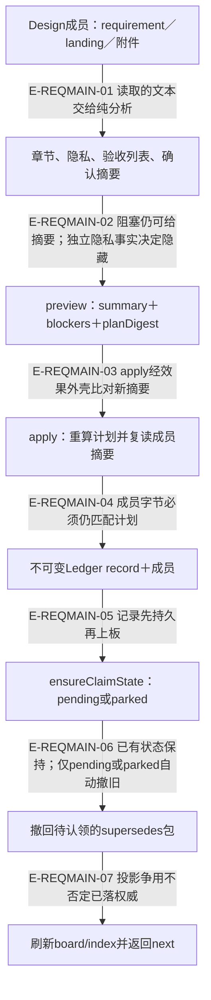

# 需求包：内容、确认、认领的三种事实

> 核验于 2026-10-03，基线 `d8fafff` 加当前未提交工作树。图表达实际源码分支，未提交实现标为进行中；不把开发阶段计划当作运行事实。来源与测试锚点按本文精确范围列出。

需求包是Design到Controller的不可变交接物；认领状态是另一份可CAS推进的事实。发布只产生Ledger记录与板项，Demand创建由另一切片负责。

## 发布纵切：可确认内容到不可变交接物

```mermaid
flowchart TB
  accTitle: 发布纵切：可确认内容到不可变交接物
  accDescr: preview读当前Design成员并分析，apply重算相同计划后先发布Ledger，再补看板并处理被替代包，最后重建人读索引。
  a["Design成员：requirement／landing／附件"]
  b["章节、隐私、验收列表、确认摘要"]
  c["preview：summary＋blockers＋planDigest"]
  d["apply：重算计划并复读成员摘要"]
  e["不可变Ledger record＋成员"]
  f["ensureClaimState：pending或parked"]
  g["撤回待认领的supersedes包"]
  h["刷新board/index并返回next"]
  a -->|"E-REQMAIN-01 读取的文本交给纯分析"| b
  b -->|"E-REQMAIN-02 阻塞仍可给摘要；独立隐私事实决定隐藏"| c
  c -->|"E-REQMAIN-03 apply经效果外壳比对新摘要"| d
  d -->|"E-REQMAIN-04 成员字节必须仍匹配计划"| e
  e -->|"E-REQMAIN-05 记录先持久再上板"| f
  f -->|"E-REQMAIN-06 已有状态保持；仅pending或parked自动撤旧"| g
  g -->|"E-REQMAIN-07 投影争用不否定已落权威"| h
```

### 本图术语说明

| 术语 | 本图含义 |
| --- | --- |
| 需求包 | Ledger中record.json与两份主文档、至多16份文本附件。 |
| summary | 供用户确认的可读摘要；不是认证人类操作身份。 |
| supersedes | 新包引用旧包；旧包claimed或archived时不被改写。 |
| 看板 | 需求包认领状态文件，和不可变内容分别拥有事实。 |

### 节点与源码定位

| 节点 | 文件 / 符号 | 职责 |
| --- | --- | --- |
| a | `src/capabilities/requirement/service.ts#readPackageDocuments` | Design成员：requirement／landing／附件 |
| b | `src/capabilities/requirement/decide.ts#analyzePackageDocuments` | 章节、隐私、验收列表、确认摘要 |
| c | `src/capabilities/requirement/service.ts#planPublish` | preview：summary＋blockers＋planDigest |
| d | `src/capabilities/requirement/service.ts#memberBytes` | apply：重算计划并复读成员摘要 |
| e | `src/capabilities/requirement/service.ts#ensureRecord` | 不可变Ledger record＋成员 |
| f | `src/capabilities/requirement/service.ts#ensureClaimState` | ensureClaimState：pending或parked |
| g | `src/capabilities/requirement/service.ts#withdrawSuperseded` | 撤回待认领的supersedes包 |
| h | `src/capabilities/requirement/service.ts#applyPublish` | 刷新board/index并返回next |

### 本图边级证据

| 编号 | 代码证据 | 测试证据 | 关系依据 |
| --- | --- | --- | --- |
| E-REQMAIN-01 | `src/capabilities/requirement/service.ts#planPublish` | `tests/capabilities/requirement/service.test.ts#executeRequirementPublicationRequest` | 读取的文本交给纯分析 |
| E-REQMAIN-02 | `src/capabilities/requirement/service.ts#planPublish` | `tests/capabilities/requirement/service.test.ts#executeRequirementPublicationRequest` | 阻塞仍可给摘要；独立隐私事实决定隐藏 |
| E-REQMAIN-03 | `src/capabilities/requirement/service.ts#executeRequirementPublicationRequest` | `tests/capabilities/requirement/service.test.ts#executeRequirementPublicationRequest` | apply经效果外壳比对新摘要 |
| E-REQMAIN-04 | `src/capabilities/requirement/service.ts#ensureRecord` | `tests/capabilities/requirement/service.test.ts#executeRequirementPublicationRequest` | 成员字节必须仍匹配计划 |
| E-REQMAIN-05 | `src/capabilities/requirement/service.ts#applyPublish` | `tests/capabilities/requirement/service.test.ts#executeRequirementPublicationRequest` | 记录先持久再上板 |
| E-REQMAIN-06 | `src/capabilities/requirement/service.ts#applyPublish` | `tests/capabilities/requirement/service.test.ts#executeRequirementPublicationRequest` | 已有状态保持；仅pending或parked自动撤旧 |
| E-REQMAIN-07 | `src/capabilities/requirement/service.ts#applyPublish` | `tests/capabilities/requirement/service.test.ts#executeRequirementPublicationRequest` | 投影争用不否定已落权威 |

## 写入准入范围

`executeRequirementPublicationRequest` 的 apply/recover 进入 `shared` 工作区范围后才读取配置与Ledger，维护和Pod配置替换持有exclusive时必须等待。preview与看板查询保持 `read`；范围不替代Ledger逐记录事务、看板CAS或确认摘要。见[工作区准入](../11-kernel/workspace-operation-scope.md)。

## 隐私预览的细节与修复

rc.4 增加 file URI、盘符、UNC、点段与 CSI 路径分类；站内路由仍被需求语境豁免。本轮发现的“重复章节挤掉隐私诊断，blocked 仍回显敏感摘要”已在另一线程修复，并用同一合成公开preview复核：诊断上限仍为64，但独立 `privacyHit` 保证整摘要隐藏。见[需求预览与独立披露判定](./privacy-preview.md)及[内核扫描边界](../11-kernel/privacy-boundary.md)。

## 新发布准入与历史读取

`src/capabilities/requirement/decide.ts#analyzePackageDocuments`当前要求每个非research新包的验收标准H2中至少有一条顶层列表。段落、表格、围栏代码和缺失章节都不能产出验收ID；`src/kernel/requirement-acceptance.ts#parseAcceptanceCriteria`与任务规划/完成覆盖共用ac-1、ac-2顺序。bug、supplement旧必需章节表没有新增项，实际发布额外检查仍会拦住无验收列表的新包；`src/governance/ledger/ledger-authority-record.ts#parseLedgerAuthorityRecord`保留v1历史读取语法。

| 事实 | 唯一写入位置 | 消费者 | 不能代表 |
| --- | --- | --- | --- |
| 成员与recordDigest | Ledger不可变目录 | 任务锚点、Demand来源核验、成员读取 | 需求已认领 |
| confirmedAt与sectionDigest | record头部 | 发布准入、后续追溯 | 已认证的人类身份 |
| status/revision/previousStateDigest | 私有看板JSON | 创建Demand、完成取消续接 | 修改原需求正文 |
| board/index.md | 当前板项确定性重写 | 人读导航 | 状态权威 |

内容变更生成新requirementId；身份摘要涵盖头部、成员摘要、confirmation与supersedes。recordedAt使用确认时间以保证同请求字节稳定；板项publishedAt取首次上板时刻，重试沿用。

## 继续阅读

[隐私预览](./privacy-preview.md) · [文件导入](./file-dependencies.md) · [运行分支](./runtime-call-flow.md) · [本模块总览](./README.md) · [全局入口](../README.md) · [本轮增量审阅](../../plans/review-2026-10-03/coordination.md) · [前轮完整审阅](../../plans/review-2026-10-02/coordination-evidence.md)
