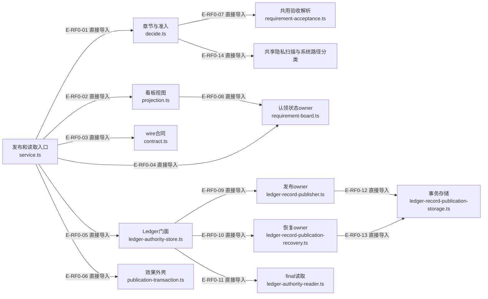

# 需求包：发布、看板与Ledger的静态依赖

> 核验于 2026-10-03，基线 `d8fafff` 加当前未提交工作树。图表达实际源码分支，未提交实现标为进行中；不把开发阶段计划当作运行事实。来源与测试锚点按本文精确范围列出。

本图是从当前TypeScript AST选出的直接导入子图；每条边再对照已读源码用途。它只证明耦合方向，不证明调用顺序、状态转移或Agent授权。

## 需求包：发布、看板与Ledger的静态依赖

```mermaid
flowchart LR
  accTitle: 需求包：发布、看板与Ledger的静态依赖
  accDescr: 文件直接import关系的审阅精选视图，运行调用与状态分支在独立页面。
  f0["发布和读取入口<br/>service.ts"]
  f1["章节与准入<br/>decide.ts"]
  f2["看板视图<br/>projection.ts"]
  f3["wire合同<br/>contract.ts"]
  f4["认领状态owner<br/>requirement-board.ts"]
  f5["共用验收解析<br/>requirement-acceptance.ts"]
  f6["Ledger门面<br/>ledger-authority-store.ts"]
  f7["发布owner<br/>ledger-record-publisher.ts"]
  f8["恢复owner<br/>ledger-record-publication-recovery.ts"]
  f9["final读取<br/>ledger-authority-reader.ts"]
  f10["事务存储<br/>ledger-record-publication-storage.ts"]
  f11["效果外壳<br/>publication-transaction.ts"]
  f12["共享隐私扫描与系统路径分类"]
  f0 -->|"E-RF0-01 直接导入"| f1
  f0 -->|"E-RF0-02 直接导入"| f2
  f0 -->|"E-RF0-03 直接导入"| f3
  f0 -->|"E-RF0-04 直接导入"| f4
  f0 -->|"E-RF0-05 直接导入"| f6
  f0 -->|"E-RF0-06 直接导入"| f11
  f1 -->|"E-RF0-07 直接导入"| f5
  f2 -->|"E-RF0-08 直接导入"| f4
  f6 -->|"E-RF0-09 直接导入"| f7
  f6 -->|"E-RF0-10 直接导入"| f8
  f6 -->|"E-RF0-11 直接导入"| f9
  f7 -->|"E-RF0-12 直接导入"| f10
  f8 -->|"E-RF0-13 直接导入"| f10
  f1 -->|"E-RF0-14 直接导入"| f12
```

### 本图术语说明

| 术语 | 本图含义 |
| --- | --- |
| 直接导入 | 包含实际import或显式re-export；类型依赖同样算结构依赖。 |
| 精选范围 | 按模块入口裁剪；被省略的依赖仍在逐文件台账和全局导入数据中。 |

### 节点与源码定位

| 节点 | 文件 / 符号 | 职责 |
| --- | --- | --- |
| f0 | `src/capabilities/requirement/service.ts` | 发布和读取入口 service.ts |
| f1 | `src/capabilities/requirement/decide.ts` | 章节与准入 decide.ts |
| f2 | `src/capabilities/requirement/projection.ts` | 看板视图 projection.ts |
| f3 | `src/capabilities/requirement/contract.ts` | wire合同 contract.ts |
| f4 | `src/kernel/requirement-board.ts` | 认领状态owner requirement-board.ts |
| f5 | `src/kernel/requirement-acceptance.ts` | 共用验收解析 requirement-acceptance.ts |
| f6 | `src/governance/ledger/ledger-authority-store.ts` | Ledger门面 ledger-authority-store.ts |
| f7 | `src/governance/ledger/ledger-record-publisher.ts` | 发布owner ledger-record-publisher.ts |
| f8 | `src/governance/ledger/ledger-record-publication-recovery.ts` | 恢复owner ledger-record-publication-recovery.ts |
| f9 | `src/governance/ledger/ledger-authority-reader.ts` | final读取 ledger-authority-reader.ts |
| f10 | `src/governance/ledger/ledger-record-publication-storage.ts` | 事务存储 ledger-record-publication-storage.ts |
| f11 | `src/kernel/publication-transaction.ts` | 效果外壳 publication-transaction.ts |
| f12 | `src/kernel/privacy-scan.ts` | 共享隐私扫描与系统路径分类 |

### 本图边级证据

| 编号 | 代码证据 | 测试证据 | 关系依据 |
| --- | --- | --- | --- |
| E-RF0-01 | `src/capabilities/requirement/service.ts` | 未覆盖：此边是静态导入，由源码 AST 校验；运行测试不代替导入证据 | 直接导入 |
| E-RF0-02 | `src/capabilities/requirement/service.ts` | 未覆盖：此边是静态导入，由源码 AST 校验；运行测试不代替导入证据 | 直接导入 |
| E-RF0-03 | `src/capabilities/requirement/service.ts` | 未覆盖：此边是静态导入，由源码 AST 校验；运行测试不代替导入证据 | 直接导入 |
| E-RF0-04 | `src/capabilities/requirement/service.ts` | 未覆盖：此边是静态导入，由源码 AST 校验；运行测试不代替导入证据 | 直接导入 |
| E-RF0-05 | `src/capabilities/requirement/service.ts` | 未覆盖：此边是静态导入，由源码 AST 校验；运行测试不代替导入证据 | 直接导入 |
| E-RF0-06 | `src/capabilities/requirement/service.ts` | 未覆盖：此边是静态导入，由源码 AST 校验；运行测试不代替导入证据 | 直接导入 |
| E-RF0-07 | `src/capabilities/requirement/decide.ts` | 未覆盖：此边是静态导入，由源码 AST 校验；运行测试不代替导入证据 | 直接导入 |
| E-RF0-08 | `src/capabilities/requirement/projection.ts` | 未覆盖：此边是静态导入，由源码 AST 校验；运行测试不代替导入证据 | 直接导入 |
| E-RF0-09 | `src/governance/ledger/ledger-authority-store.ts` | 未覆盖：此边是静态导入，由源码 AST 校验；运行测试不代替导入证据 | 直接导入 |
| E-RF0-10 | `src/governance/ledger/ledger-authority-store.ts` | 未覆盖：此边是静态导入，由源码 AST 校验；运行测试不代替导入证据 | 直接导入 |
| E-RF0-11 | `src/governance/ledger/ledger-authority-store.ts` | 未覆盖：此边是静态导入，由源码 AST 校验；运行测试不代替导入证据 | 直接导入 |
| E-RF0-12 | `src/governance/ledger/ledger-record-publisher.ts` | 未覆盖：此边是静态导入，由源码 AST 校验；运行测试不代替导入证据 | 直接导入 |
| E-RF0-13 | `src/governance/ledger/ledger-record-publication-recovery.ts` | 未覆盖：此边是静态导入，由源码 AST 校验；运行测试不代替导入证据 | 直接导入 |
| E-RF0-14 | `src/capabilities/requirement/decide.ts` | 未覆盖：静态导入由源码 AST 校验；具体隐私分支见独立页面 | 共享扫描与系统路径分类器是直接依赖 |

## 阅读边界

前轮已对Ledger共12个手写文件逐文件审阅；本轮深审隐私消费者并保留原导入关系，精选图省略codec、path和资源声明的细边；它们的职责/消费者在逐文件台账。

Schema是可移植wire源；`tooling/codegen/schema-types.ts`生成`src/contracts/generated/identity/wakeflow-durable-id-kind.generated.ts`等派生合同。生成文件只核实来源与生成链，不计作手写文件语义审阅；`package.json`的schema:build/schema:check负责生成与漂移检测。

## 继续阅读

[文件导入](./file-dependencies.md) · [运行分支](./runtime-call-flow.md) · [本模块总览](./README.md) · [全局入口](../README.md) · [本轮增量审阅](../../plans/review-2026-10-03/coordination.md) · [前轮完整审阅](../../plans/review-2026-10-02/coordination-evidence.md)
