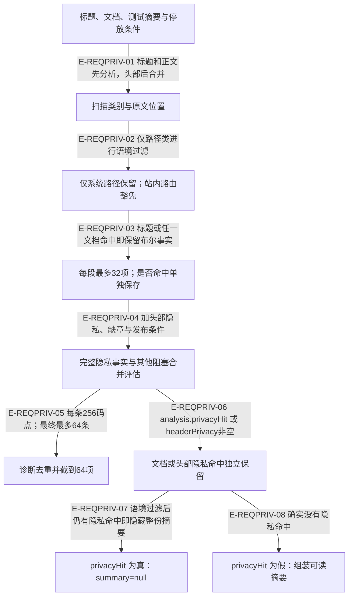

# 需求预览：路由语境与独立隐私披露判定

> rc.4 基线经本轮复核更新到 rc.5 候选工作树。所有扫描样例均为合成内容；扫描属于词法启发式，空命中不能证明任意文本或二进制不含秘密。

需求文档允许讨论站内路由，所以不能直接复用证据捕获的所有绝对路径拒绝策略。`privacyBlockers` 对路径命中重新取原文片段，再调用 `isSystemAbsolutePath`；其余凭证和裸 UUID 类别不经过路由豁免。

## 需求文本的隐私准入与独立披露判定

### 本图术语说明

| 术语 | 含义 |
| --- | --- |
| 系统路径 | 显式file URI、盘符、UNC、HOME/波浪线，或规范化后位于固定系统目录集合的POSIX路径。 |
| summary | 供人确认的标题、测试决定和选定章节；一般blocked结果仍可带摘要，隐私命中则整份隐藏。 |
| 诊断上限 | 每段隐私32项、公开总数64项、每条256码点；只控制展示体积。 |
| privacyHit | 内部分析事实，不是用户可授权绕过的policy字段；PackageAnalysis与PublishAssessment显式携带它。 |

### 节点与源码定位

| 节点 | 文件 / 符号 |
| --- | --- |
| input | `src/capabilities/requirement/decide.ts#analyzePackageDocuments` |
| scan | `src/capabilities/requirement/decide.ts#privacyBlockers` |
| paths | `src/capabilities/requirement/decide.ts#privacyBlockers` |
| parts | `src/capabilities/requirement/decide.ts#analyzePackageDocuments` |
| all | `src/capabilities/requirement/decide.ts#derivePublishAssessment` |
| limited | `src/capabilities/requirement/decide.ts#derivePublishAssessment` |
| flag | `src/capabilities/requirement/decide.ts#derivePublishAssessment` |
| hidden | `src/capabilities/requirement/service.ts#planPublish` |
| shown | `src/capabilities/requirement/service.ts#planPublish` |

### 本图边级证据

| 编号 | 代码证据 | 测试证据 | 具体范围 |
| --- | --- | --- | --- |
| E-REQPRIV-01 | `src/capabilities/requirement/decide.ts#analyzePackageDocuments` | `tests/capabilities/requirement/service.test.ts#executeRequirementPublicationRequest` | 新回归覆盖需求正文、landing、title、testing summary、parked trigger五类来源。 |
| E-REQPRIV-02 | `src/capabilities/requirement/decide.ts#privacyBlockers` | `tests/capabilities/requirement/decide.test.ts#privacyBlockers` | 允许站内路由与类型斜杠列表；URI、盘符、UNC、HOME、点段与CSI系统路径被拦。 |
| E-REQPRIV-03 | `src/capabilities/requirement/decide.ts#analyzePackageDocuments` | `tests/capabilities/requirement/service.test.ts#executeRequirementPublicationRequest` | 每段最多32项不会把非空变成空；原文位置信息保持独立。 |
| E-REQPRIV-04 | `src/capabilities/requirement/decide.ts#derivePublishAssessment` | `tests/capabilities/requirement/decide.test.ts#derivePublishAssessment` | 测试直接核对privacyHit及多种发布阻塞；不把公开字段扩成新政策。 |
| E-REQPRIV-05 | `src/capabilities/requirement/decide.ts#derivePublishAssessment` | `tests/capabilities/requirement/service.test.ts#executeRequirementPublicationRequest` | 64种重复章节与敏感内容同现时，诊断可无privacy项，但摘要仍隐藏。 |
| E-REQPRIV-06 | `src/capabilities/requirement/decide.ts#derivePublishAssessment` | `tests/capabilities/requirement/service.test.ts#executeRequirementPublicationRequest` | 独立事实来自完整扫描结果，不再用展示列表是否保留privacy前缀反推。 |
| E-REQPRIV-07 | `src/capabilities/requirement/service.ts#planPublish` | `tests/capabilities/requirement/service.test.ts#executeRequirementPublicationRequest` | 五类来源在饱和诊断列表下均断言summary=null且JSON无合成凭证；本轮后态探针独立复现。 |
| E-REQPRIV-08 | `src/capabilities/requirement/service.ts#planPublish` | `tests/capabilities/requirement/service.test.ts#executeRequirementPublicationRequest` | 饱和但无隐私的干净草稿仍返回有用摘要，不因64项本身误隐藏。 |

## 本轮发现、修复与复核

RC4-PRIV-01 的前态问题是 `planPublish` 根据截到64项的阻塞列表判断是否隐藏摘要。64种不同重复章节可以挤掉后来加入的隐私项；一次性工作区的公开preview已复现 `blocked` 但摘要仍含被扫描器识别的合成密码。

另一开发线程修复后，本轮重新读取三个生产文件与新增回归，确认 `analyzePackageDocuments` 保存独立 `privacyHit`，`derivePublishAssessment` 把头部扫描事实合入，`planPublish` 直接消费这个事实。后态合成探针仍得到64项诊断、列表中无privacy项，但 `summary=null`、公开结果不再包含合成密码。前后输入与来源摘要分别保留，不改写旧失败证据。

测试证据：`tests/capabilities/requirement/service.test.ts#executeRequirementPublicationRequest` 的新回归实际覆盖需求正文、landing正文、标题、测试摘要、parked触发条件五类，并验证干净的饱和列表仍有摘要。独立探针在当前源码内存转译版执行；关联依赖和一次性fixture使用既有 `.build`，不等于重新运行整个根测试门。

## 其他已核验边界

- 原始行列是 UTF-16 码元；CSI 视图映回后仍从原文提取，避免路径被颜色拆开时误当普通路由。`matchedText` 取命中所在行，路径规则本身不跨换行。
- 附件参与章节及隐私检查，不参与一页摘要；敏感标题或测试摘要也隐藏整页，不只隐藏命中的章节。
- `confirmedAt` 与确认节摘要属于发布输入与不可变记录，不证明经过认证的人类身份。apply 重新读取文档，成员摘要匹配后才交 Ledger。
- 扫描仍是有限启发式；没有命中不是完整内容安全证明。严格已知UUID前缀的修复及其识别边界见[内核扫描页](../11-kernel/privacy-boundary.md)。

[扫描器细节](../11-kernel/privacy-boundary.md) · [发布与恢复](./runtime-call-flow.md) · [前后态探针与覆盖记录](../../plans/review-2026-10-03-rc4/privacy-evidence.md)
