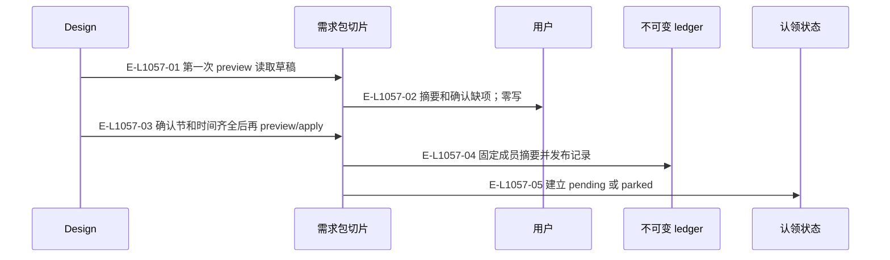
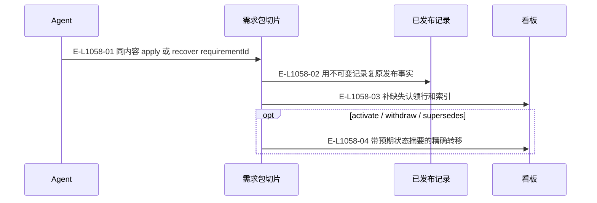

# 需求包：发布与看板恢复

发布、激活、撤回同属需求包入口；认领属于 Demand 创建。

> 核验基线：`1480271`（L1 observation 第十片已落地，20 个公共工具、18 个一次性场景）。工作树另有并行未提交改动（宿主 hook 通道等），本图不描绘；来源指纹按当前工作树计算。本文说明实现事实，未宣称双宿主真实会话已经验证。

## 发布前确认和发布后上板

### 本图术语说明

| 术语 | 本图含义 |
| --- | --- |
| ledger | 长期不可变需求包与归档的存储根。 |
| CAS | 比较已观察的摘要/修订后提交；来源已改变则拒绝。 |

### 节点与实现定位

| 节点 | 文件 / 符号 | 责任 |
| --- | --- | --- |
| design | Agent / 用户 / 外部效果或条件视图 | Design |
| slice | `src/capabilities/requirement/service.ts` | 需求包切片 |
| user | Agent / 用户 / 外部效果或条件视图 | 用户 |
| ledger | `src/governance/ledger/ledger-authority-store.ts` | 不可变 ledger |
| board | `src/kernel/requirement-board.ts` | 认领状态 |

### 本图边级证据

| 编号 | 代码定位 | 测试 / 核验 | 关系依据 |
| --- | --- | --- | --- |
| E-L1057-01 | `src/capabilities/requirement/service.ts#planPublish` | `tests/capabilities/requirement/service.test.ts` | 第一次 preview 读取草稿 |
| E-L1057-02 | `src/capabilities/requirement/decide.ts#derivePublishBlockers` | `tests/capabilities/requirement/service.test.ts` | 摘要和确认缺项；零写 |
| E-L1057-03 | `src/capabilities/requirement/service.ts#executeRequirementPublicationRequest` | `tests/capabilities/requirement/service.test.ts` | 确认节和时间齐全后再 preview/apply |
| E-L1057-04 | `src/capabilities/requirement/service.ts#ensureRecord` | `tests/capabilities/requirement/service.test.ts` | 固定成员摘要并发布记录 |
| E-L1057-05 | `src/capabilities/requirement/service.ts#ensureClaimState` | `tests/capabilities/requirement/service.test.ts` | 建立 pending 或 parked |

## 重放、恢复与撤回

### 本图术语说明

| 术语 | 本图含义 |
| --- | --- |
| CAS | 比较已观察的摘要/修订后提交；来源已改变则拒绝。 |
| projection | 根据权威重建的视图，不反向决定事实。 |

### 节点与实现定位

| 节点 | 文件 / 符号 | 责任 |
| --- | --- | --- |
| agent | Agent / 用户 / 外部效果或条件视图 | Agent |
| slice | `src/capabilities/requirement/service.ts` | 需求包切片 |
| record | `src/governance/ledger/ledger-authority-store.ts` | 已发布记录 |
| board | `src/kernel/requirement-board.ts` | 看板 |

### 本图边级证据

| 编号 | 代码定位 | 测试 / 核验 | 关系依据 |
| --- | --- | --- | --- |
| E-L1058-01 | `src/capabilities/requirement/service.ts#recoverPublish` | `tests/capabilities/requirement/service.test.ts` | 同内容 apply 或 recover requirementId |
| E-L1058-02 | `src/capabilities/requirement/service.ts#recoverPublish` | `tests/capabilities/requirement/service.test.ts` | 用不可变记录复原发布事实 |
| E-L1058-03 | `src/capabilities/requirement/service.ts#ensureClaimState` | `tests/capabilities/requirement/service.test.ts` | 补缺失认领行和索引 |
| E-L1058-04 | `src/kernel/requirement-board.ts#replaceRequirementClaimStateFile` | `tests/capabilities/requirement/service.test.ts` | 带预期状态摘要的精确转移 |

## 守卫、恢复与验证范围

supersedes 的旧包若已被认领，不假定它已被撤回。凭证命中永远阻塞；隐私失败不回显命中的文档正文。

涉及的测试与核验入口：

- `tests/capabilities/requirement/service.test.ts`。

## 下钻与相关视图

- [本专题总览](./README.md)
- [图谱总索引](../README.md)
- [核验与剩余范围](../01-diagram-review-ledger.md)
