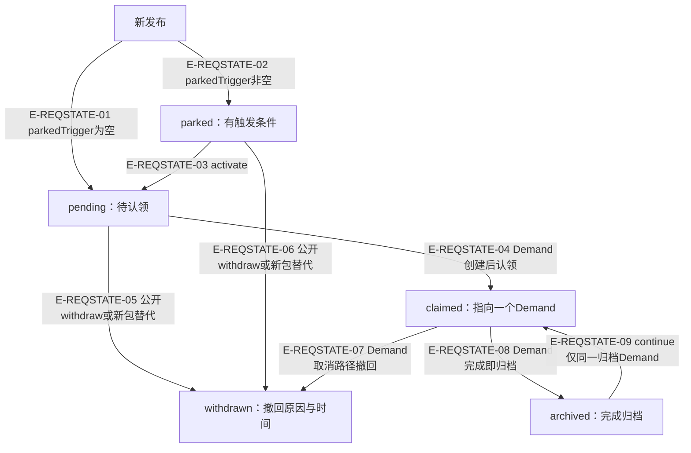
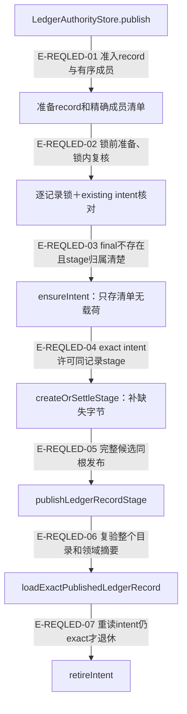
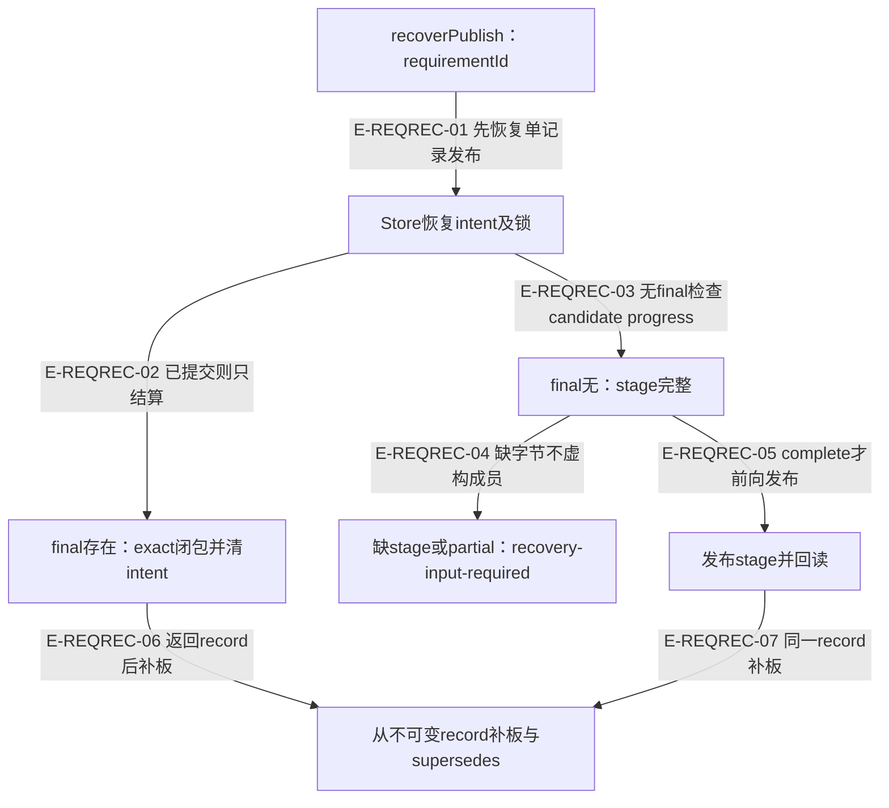

# 需求包：认领状态、Ledger发布与恢复

> 核验于 2026-10-03，基线 `d8fafff` 加当前未提交工作树。图表达实际源码分支，未提交实现标为进行中；不把开发阶段计划当作运行事实。来源与测试锚点按本文精确范围列出。

## 需求板的耐久状态转换

```mermaid
flowchart TB
  accTitle: 需求板的耐久状态转换
  accDescr: 状态由纯转移函数构造，文件写入在每需求锁内复读CAS；归档续接只允许原Demand。
  n["新发布"]
  p["pending：待认领"]
  k["parked：有触发条件"]
  c["claimed：指向一个Demand"]
  w["withdrawn：撤回原因与时间"]
  a["archived：完成归档"]
  n -->|"E-REQSTATE-01 parkedTrigger为空"| p
  n -->|"E-REQSTATE-02 parkedTrigger非空"| k
  k -->|"E-REQSTATE-03 activate"| p
  p -->|"E-REQSTATE-04 Demand创建后认领"| c
  p -->|"E-REQSTATE-05 公开withdraw或新包替代"| w
  k -->|"E-REQSTATE-06 公开withdraw或新包替代"| w
  c -->|"E-REQSTATE-07 Demand取消路径撤回"| w
  c -->|"E-REQSTATE-08 Demand完成即归档"| a
  a -->|"E-REQSTATE-09 continue仅同一归档Demand"| c
```

### 本图术语说明

| 术语 | 本图含义 |
| --- | --- |
| 状态转换 | 图中是认领状态，不是Demand生命周期或智能体决策。 |
| 修订链 | 每次advance递增revision并绑定前一状态的语义摘要。 |
| CAS | 每需求锁内重读摘要再原子替换；两个同快照认领仅一个成功。 |

### 节点与源码定位

| 节点 | 文件 / 符号 | 职责 |
| --- | --- | --- |
| n | `src/kernel/requirement-board.ts#createRequirementClaimState` | 新发布 |
| p | `src/kernel/requirement-board.ts#createRequirementClaimState` | pending：待认领 |
| k | `src/kernel/requirement-board.ts#createRequirementClaimState` | parked：有触发条件 |
| c | `src/kernel/requirement-board.ts#claimRequirementPackage` | claimed：指向一个Demand |
| w | `src/kernel/requirement-board.ts#withdrawRequirementClaim` | withdrawn：撤回原因与时间 |
| a | `src/kernel/requirement-board.ts#archiveRequirementClaim` | archived：完成归档 |

### 本图边级证据

| 编号 | 代码证据 | 测试证据 | 关系依据 |
| --- | --- | --- | --- |
| E-REQSTATE-01 | `src/kernel/requirement-board.ts#createRequirementClaimState` | `tests/kernel/requirement-board.test.ts#createRequirementClaimState` | parkedTrigger为空 |
| E-REQSTATE-02 | `src/kernel/requirement-board.ts#createRequirementClaimState` | `tests/kernel/requirement-board.test.ts#createRequirementClaimState` | parkedTrigger非空 |
| E-REQSTATE-03 | `src/kernel/requirement-board.ts#activateRequirementClaim` | `tests/kernel/requirement-board.test.ts#activateRequirementClaim` | activate |
| E-REQSTATE-04 | `src/kernel/requirement-board.ts#claimRequirementPackage` | `tests/kernel/requirement-board.test.ts#claimRequirementPackage` | Demand创建后认领 |
| E-REQSTATE-05 | `src/kernel/requirement-board.ts#withdrawRequirementClaim` | `tests/kernel/requirement-board.test.ts#withdrawRequirementClaim` | 公开withdraw或新包替代 |
| E-REQSTATE-06 | `src/kernel/requirement-board.ts#withdrawRequirementClaim` | `tests/kernel/requirement-board.test.ts#withdrawRequirementClaim` | 公开withdraw或新包替代 |
| E-REQSTATE-07 | `src/kernel/requirement-board.ts#withdrawRequirementClaim` | `tests/kernel/requirement-board.test.ts#withdrawRequirementClaim` | Demand取消路径撤回 |
| E-REQSTATE-08 | `src/kernel/requirement-board.ts#archiveRequirementClaim` | `tests/kernel/requirement-board.test.ts#archiveRequirementClaim` | Demand完成即归档 |
| E-REQSTATE-09 | `src/kernel/requirement-board.ts#reclaimRequirementPackage` | 间接覆盖：`tests/capabilities/demand/service.test.ts#executeDemandContinuationRequest`，续接用例验证归档包重新claimed | continue仅同一归档Demand |

## Ledger实际发布调用与故障停止点

```mermaid
flowchart TB
  accTitle: Ledger实际发布调用与故障停止点
  accDescr: 发布在逐记录锁内写精简intent，完整stage发布后严格读回再退休intent；字节不完整的恢复必须等待原输入。
  a["LedgerAuthorityStore.publish"]
  b["准备record和精确成员清单"]
  l["逐记录锁＋existing intent核对"]
  i["ensureIntent：只存清单无载荷"]
  s["createOrSettleStage：补缺失字节"]
  f["publishLedgerRecordStage"]
  v["loadExactPublishedLedgerRecord"]
  r["retireIntent"]
  a -->|"E-REQLED-01 准入record与有序成员"| b
  b -->|"E-REQLED-02 锁前准备、锁内复核"| l
  l -->|"E-REQLED-03 final不存在且stage归属清楚"| i
  i -->|"E-REQLED-04 exact intent许可同记录stage"| s
  s -->|"E-REQLED-05 完整候选同根发布"| f
  f -->|"E-REQLED-06 复验整个目录和领域摘要"| v
  v -->|"E-REQLED-07 重读intent仍exact才退休"| r
```

### 本图术语说明

| 术语 | 本图含义 |
| --- | --- |
| intent | 精简发布意图，绑定record、treePlan和派生路径，不能重建缺失载荷。 |
| stage | 私有transactions父目录下的完整候选树；成员采用最终0755/0644模式。 |
| final | 共享的不可变Ledger记录；异内容同身份拒绝覆盖。 |

### 节点与源码定位

| 节点 | 文件 / 符号 | 职责 |
| --- | --- | --- |
| a | `src/governance/ledger/ledger-authority-store.ts#LedgerAuthorityStore.publish` | LedgerAuthorityStore.publish |
| b | `src/governance/ledger/ledger-record-publisher.ts#preparePublication` | 准备record和精确成员清单 |
| l | `src/governance/ledger/ledger-record-publisher.ts#publishLedgerAuthorityRecord` | 逐记录锁＋existing intent核对 |
| i | `src/governance/ledger/ledger-record-publication-storage.ts#ensureLedgerRecordPublicationIntent` | ensureIntent：只存清单无载荷 |
| s | `src/governance/ledger/ledger-record-publisher.ts#createOrSettleStage` | createOrSettleStage：补缺失字节 |
| f | `src/governance/ledger/ledger-record-publication-storage.ts#publishLedgerRecordStage` | publishLedgerRecordStage |
| v | `src/governance/ledger/ledger-record-publication-storage.ts#loadExactPublishedLedgerRecord` | loadExactPublishedLedgerRecord |
| r | `src/governance/ledger/ledger-record-publication-storage.ts#retireLedgerRecordPublicationIntent` | retireIntent |

### 本图边级证据

| 编号 | 代码证据 | 测试证据 | 关系依据 |
| --- | --- | --- | --- |
| E-REQLED-01 | `src/governance/ledger/ledger-record-publisher.ts#publishLedgerAuthorityRecord` | `tests/governance/ledger/ledger-authority-store.test.ts#LedgerAuthorityStore` | 准入record与有序成员 |
| E-REQLED-02 | `src/governance/ledger/ledger-record-publisher.ts#publishLedgerAuthorityRecord` | `tests/governance/ledger/ledger-authority-store.test.ts#LedgerAuthorityStore` | 锁前准备、锁内复核 |
| E-REQLED-03 | `src/governance/ledger/ledger-record-publisher.ts#publishLedgerAuthorityRecord` | `tests/governance/ledger/ledger-authority-store.test.ts#LedgerAuthorityStore` | final不存在且stage归属清楚 |
| E-REQLED-04 | `src/governance/ledger/ledger-record-publisher.ts#publishLedgerAuthorityRecord` | `tests/governance/ledger/ledger-authority-store.test.ts#LedgerAuthorityStore` | exact intent许可同记录stage |
| E-REQLED-05 | `src/governance/ledger/ledger-record-publisher.ts#publishLedgerAuthorityRecord` | `tests/governance/ledger/ledger-authority-store.test.ts#LedgerAuthorityStore` | 完整候选同根发布 |
| E-REQLED-06 | `src/governance/ledger/ledger-record-publisher.ts#publishLedgerAuthorityRecord` | `tests/governance/ledger/ledger-authority-store.test.ts#LedgerAuthorityStore` | 复验整个目录和领域摘要 |
| E-REQLED-07 | `src/governance/ledger/ledger-record-publisher.ts#publishLedgerAuthorityRecord` | `tests/governance/ledger/ledger-authority-store.test.ts#LedgerAuthorityStore` | 重读intent仍exact才退休 |

## recover：由真实残留决定继续或等待

```mermaid
flowchart TB
  accTitle: recover：由真实残留决定继续或等待
  accDescr: 恢复按record身份定位exact intent；已有final前向结算，完整stage可以发布，缺字节只要求原请求重试。
  a["recoverPublish：requirementId"]
  b["Store恢复intent及锁"]
  f["final存在：exact闭包并清intent"]
  s["final无：stage完整"]
  x["缺stage或partial：recovery-input-required"]
  p["发布stage并回读"]
  board["从不可变record补板与supersedes"]
  a -->|"E-REQREC-01 先恢复单记录发布"| b
  b -->|"E-REQREC-02 已提交则只结算"| f
  b -->|"E-REQREC-03 无final检查candidate progress"| s
  s -->|"E-REQREC-04 缺字节不虚构成员"| x
  s -->|"E-REQREC-05 complete才前向发布"| p
  f -->|"E-REQREC-06 返回record后补板"| board
  p -->|"E-REQREC-07 同一record补板"| board
```

### 本图术语说明

| 术语 | 本图含义 |
| --- | --- |
| 恢复 | 按持久事实继续，不能用新草稿覆盖旧发布。 |
| recovery-input-required | 摘要不足以重建成员，需原始发布输入重试。 |
| not-found | 没有intent时上层仍可加载已发布record并补板，不等同包不存在。 |

### 节点与源码定位

| 节点 | 文件 / 符号 | 职责 |
| --- | --- | --- |
| a | `src/capabilities/requirement/service.ts#recoverPublish` | recoverPublish：requirementId |
| b | `src/governance/ledger/ledger-record-publication-recovery.ts#recoverPublication` | Store恢复intent及锁 |
| f | `src/governance/ledger/ledger-record-publication-storage.ts#settleCommittedLedgerIntent` | final存在：exact闭包并清intent |
| s | `src/governance/ledger/ledger-record-publication-recovery.ts#recoverPublication` | final无：stage完整 |
| x | `src/governance/ledger/ledger-record-publication-recovery.ts#recoverPublication` | 缺stage或partial：recovery-input-required |
| p | `src/governance/ledger/ledger-record-publication-recovery.ts#recoverPublication` | 发布stage并回读 |
| board | `src/capabilities/requirement/service.ts#recoverPublish` | 从不可变record补板与supersedes |

### 本图边级证据

| 编号 | 代码证据 | 测试证据 | 关系依据 |
| --- | --- | --- | --- |
| E-REQREC-01 | `src/capabilities/requirement/service.ts#recoverPublish` | `tests/capabilities/requirement/service.test.ts#executeRequirementPublicationRequest` | 先恢复单记录发布 |
| E-REQREC-02 | `src/governance/ledger/ledger-record-publication-recovery.ts#recoverPublication` | `tests/governance/ledger/ledger-authority-store.test.ts#LedgerAuthorityStore` | 已提交则只结算 |
| E-REQREC-03 | `src/governance/ledger/ledger-record-publication-recovery.ts#recoverPublication` | `tests/governance/ledger/ledger-authority-store.test.ts#LedgerAuthorityStore` | 无final检查candidate progress |
| E-REQREC-04 | `src/governance/ledger/ledger-record-publication-recovery.ts#recoverPublication` | `tests/governance/ledger/ledger-authority-store.test.ts#LedgerAuthorityStore` | 缺字节不虚构成员 |
| E-REQREC-05 | `src/governance/ledger/ledger-record-publication-recovery.ts#recoverPublication` | `tests/governance/ledger/ledger-authority-store.test.ts#LedgerAuthorityStore` | complete才前向发布 |
| E-REQREC-06 | `src/capabilities/requirement/service.ts#recoverPublish` | `tests/capabilities/requirement/service.test.ts#executeRequirementPublicationRequest` | 返回record后补板 |
| E-REQREC-07 | `src/capabilities/requirement/service.ts#recoverPublish` | `tests/capabilities/requirement/service.test.ts#executeRequirementPublicationRequest` | 同一record补板 |

公共发布与recover外层共享同一个 `shared` writer范围；以上每需求锁和Ledger事务机制在它内部工作。共享表示普通运行操作可并存，不表示它们没有各自的互斥、CAS或恢复条件。维护日志保留时新writer拒绝进入。

## 读取、并发与覆盖

`src/capabilities/requirement/service.ts#executeBoardInspectionRequest`的list返回总匹配数、过滤后条目、各状态计数；超过limit或板项skipped使truncated=true。package读取板项和完整Ledger记录，给文档摘要与章节锚点，不做认领。`src/kernel/requirement-board.ts#replaceRequirementClaimStateFile`用previousStateDigest绑定旧值，再在每需求锁内重读；失活锁可以精确退休。索引CAS冲突重列最多4轮；成功状态与索引修复分开。

已核验测试包括双认领竞争、已发布record重放、完整stage恢复、partial等待原输入、孤立事务不阻断其他记录、缺确认/隐私/验收列表阻塞。未在此页把用户确认解释为宿主身份认证。

## 继续阅读

[文件导入](./file-dependencies.md) · [运行分支](./runtime-call-flow.md) · [本模块总览](./README.md) · [全局入口](../README.md) · [本轮增量审阅](../../plans/review-2026-10-03/coordination.md) · [前轮完整审阅](../../plans/review-2026-10-02/coordination-evidence.md)
