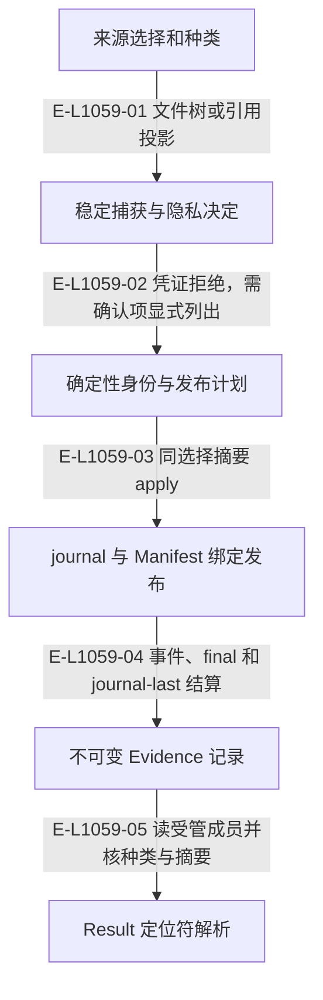

# 受管证据：来源、捕获、发布与读取

四类来源为 managed-path、observation、https link 和 commit。证据种类与来源绑定，结果导入只接受本 Demand 内可解析且摘要一致的受管定位符。

> 核验基线：`1480271`（L1 observation 第十片已落地，20 个公共工具、18 个一次性场景）。工作树另有并行未提交改动（宿主 hook 通道等），本图不描绘；来源指纹按当前工作树计算。本文说明实现事实，未宣称双宿主真实会话已经验证。

## 受管证据从选择到结果消费

### 本图术语说明

| 术语 | 本图含义 |
| --- | --- |
| ledger | 长期不可变需求包与归档的存储根。 |
| commit | 一次不可变事件提交批；文件槽位以预期修订防止并发覆盖。 |
| CAS | 比较已观察的摘要/修订后提交；来源已改变则拒绝。 |

### 节点与实现定位

| 节点 | 文件 / 符号 | 责任 |
| --- | --- | --- |
| select | `src/governance/evidence/managed-evidence-source-selection.ts` | 来源选择和种类 |
| capture | `src/governance/evidence/managed-evidence-capture-planning-service.ts` | 稳定捕获与隐私决定 |
| plan | `src/capabilities/evidence/service.ts` | 确定性身份与发布计划 |
| publish | `src/governance/evidence/managed-evidence-publication-application-service.ts` | journal 与 Manifest 绑定发布 |
| record | `src/governance/evidence/managed-evidence-manifest.ts` | 不可变 Evidence 记录 |
| review | `src/capabilities/result-review/service.ts` | Result 定位符解析 |

### 本图边级证据

| 编号 | 代码定位 | 测试 / 核验 | 关系依据 |
| --- | --- | --- | --- |
| E-L1059-01 | `src/governance/evidence/managed-evidence-capture-planning-service.ts` | `tests/capabilities/evidence/service.test.ts` | 文件树或引用投影 |
| E-L1059-02 | `src/governance/evidence/managed-evidence-capture-planning-service.ts#deriveManagedEvidenceContentBlockers` | `tests/capabilities/evidence/service.test.ts` | 凭证拒绝，需确认项显式列出 |
| E-L1059-03 | `src/capabilities/evidence/service.ts#executeRecordEvidenceRequest` | `tests/capabilities/evidence/service.test.ts` | 同选择摘要 apply |
| E-L1059-04 | `src/governance/evidence/managed-evidence-publication-transaction-settlement.ts#completeManagedEvidencePublicationTransaction` | `tests/capabilities/evidence/service.test.ts` | 事件、final 和 journal-last 结算 |
| E-L1059-05 | `src/capabilities/result-review/service.ts#resolveEvidenceReference` | `tests/capabilities/result-review/service.test.ts` | 读受管成员并核种类与摘要 |

## 守卫、恢复与验证范围

链接和提交来源保存引用投影，不替调用者下载远端或认证远端事实。Pod worktree 来源由配置意图与受管回执定位；无法解析的结果定位符不能升级为有效证据。

涉及的测试与核验入口：

- `tests/capabilities/evidence/service.test.ts`。
- `tests/capabilities/result-review/service.test.ts`。

## 下钻与相关视图

- [文件直接导入](./file-dependencies.md)
- [运行调用与恢复](./runtime-call-flow.md)
- [图谱总索引](../README.md)
- [核验与剩余范围](../01-diagram-review-ledger.md)
