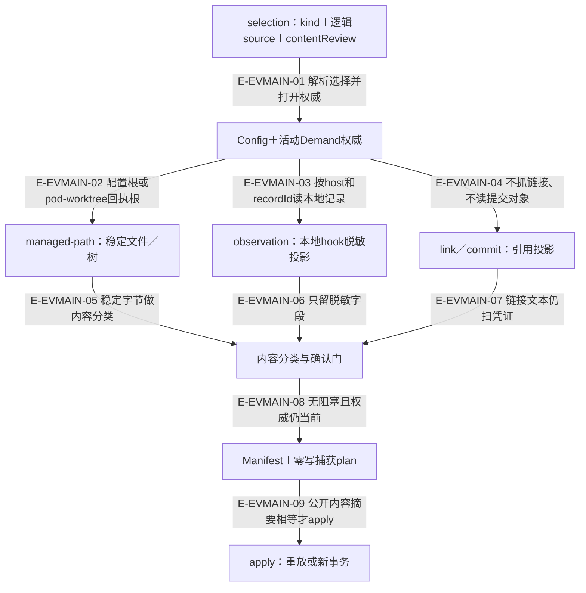

# 受管证据：内容身份、来源与验收边界

> 核验于 2026-10-03，基线 `d8fafff` 加当前未提交工作树。图表达实际源码分支，未提交实现标为进行中；不把开发阶段计划当作运行事实。来源与测试锚点按本文精确范围列出。

受管证据把被捕获的内容与来源保存为不可变记录，并在Demand事件流追加完整Manifest。真实性、充分性和Controller验收仍须独立评审。

## 捕获主线：选择、零写观察、内容门、发布

```mermaid
flowchart TB
  accTitle: 捕获主线：选择、零写观察、内容门、发布
  accDescr: 四类来源分别读取真实字节或渲染引用投影，经内容门和权威复验形成计划，apply才产生发布效果。
  a["selection：kind＋逻辑source＋contentReview"]
  b["Config＋活动Demand权威"]
  c["managed-path：稳定文件／树"]
  d["observation：本地hook脱敏投影"]
  r["link／commit：引用投影"]
  v["内容分类与确认门"]
  p["Manifest＋零写捕获plan"]
  f["apply：重放或新事务"]
  a -->|"E-EVMAIN-01 解析选择并打开权威"| b
  b -->|"E-EVMAIN-02 配置根或pod-worktree回执根"| c
  b -->|"E-EVMAIN-03 按host和recordId读本地记录"| d
  b -->|"E-EVMAIN-04 不抓链接、不读提交对象"| r
  c -->|"E-EVMAIN-05 稳定字节做内容分类"| v
  d -->|"E-EVMAIN-06 只留脱敏字段"| v
  r -->|"E-EVMAIN-07 链接文本仍扫凭证"| v
  v -->|"E-EVMAIN-08 无阻塞且权威仍当前"| p
  p -->|"E-EVMAIN-09 公开内容摘要相等才apply"| f
```

### 本图术语说明

| 术语 | 本图含义 |
| --- | --- |
| managed-path | repository、support-surface或pod-worktree逻辑根下的相对文件/树。 |
| opaque | 无效UTF8，或去CSI后仍含未知控制字符；可解码者仍扫描，未解码者只经内容确认门。 |
| 引用投影 | payload/content存定位元数据，不复制外部正文。 |
| Manifest | 绑定Program、Demand、Authority、来源、载荷identity和内容审阅标记。 |

### 节点与源码定位

| 节点 | 文件 / 符号 | 职责 |
| --- | --- | --- |
| a | `src/governance/evidence/managed-evidence-source-selection.ts#parseManagedEvidenceSourceSelection` | selection：kind＋逻辑source＋contentReview |
| b | `src/governance/evidence/managed-evidence-capture-planning-service.ts#ManagedEvidenceCapturePlanningService.preview` | Config＋活动Demand权威 |
| c | `src/governance/evidence/managed-evidence-capture-planning-service.ts#captureManagedPath` | managed-path：稳定文件／树 |
| d | `src/governance/evidence/managed-evidence-capture-planning-service.ts#captureObservation` | observation：本地hook脱敏投影 |
| r | `src/governance/evidence/managed-evidence-source-projection.ts#encodeManagedEvidenceSourceProjection` | link／commit：引用投影 |
| v | `src/governance/evidence/managed-evidence-capture-planning-service.ts#deriveManagedEvidenceContentBlockers` | 内容分类与确认门 |
| p | `src/governance/evidence/managed-evidence-capture-planning-service.ts#ManagedEvidenceCapturePlanningService.preview` | Manifest＋零写捕获plan |
| f | `src/capabilities/evidence/service.ts#applyEvidence` | apply：重放或新事务 |

### 本图边级证据

| 编号 | 代码证据 | 测试证据 | 关系依据 |
| --- | --- | --- | --- |
| E-EVMAIN-01 | `src/governance/evidence/managed-evidence-capture-planning-service.ts#ManagedEvidenceCapturePlanningService.preview` | `tests/capabilities/evidence/service.test.ts#executeRecordEvidenceRequest` | 解析选择并打开权威 |
| E-EVMAIN-02 | `src/governance/evidence/managed-evidence-capture-planning-service.ts#captureSelectedSource` | `tests/capabilities/evidence/service.test.ts#executeRecordEvidenceRequest` | 配置根或pod-worktree回执根 |
| E-EVMAIN-03 | `src/governance/evidence/managed-evidence-capture-planning-service.ts#captureSelectedSource` | `tests/capabilities/evidence/service.test.ts#executeRecordEvidenceRequest` | 按host和recordId读本地记录 |
| E-EVMAIN-04 | `src/governance/evidence/managed-evidence-capture-planning-service.ts#captureSelectedSource` | `tests/capabilities/evidence/service.test.ts#executeRecordEvidenceRequest` | 不抓链接、不读提交对象 |
| E-EVMAIN-05 | `src/governance/evidence/managed-evidence-capture-planning-service.ts#captureManagedPath` | `tests/capabilities/evidence/service.test.ts#executeRecordEvidenceRequest` | 稳定字节做内容分类 |
| E-EVMAIN-06 | `src/governance/evidence/managed-evidence-capture-planning-service.ts#captureObservation` | `tests/capabilities/evidence/service.test.ts#executeRecordEvidenceRequest` | 只留脱敏字段 |
| E-EVMAIN-07 | `src/governance/evidence/managed-evidence-capture-planning-service.ts#captureProjection` | `tests/capabilities/evidence/service.test.ts#executeRecordEvidenceRequest` | 链接文本仍扫凭证 |
| E-EVMAIN-08 | `src/governance/evidence/managed-evidence-capture-planning-service.ts#ManagedEvidenceCapturePlanningService.preview` | `tests/capabilities/evidence/service.test.ts#executeRecordEvidenceRequest` | 无阻塞且权威仍当前 |
| E-EVMAIN-09 | `src/capabilities/evidence/service.ts#executeRecordEvidenceRequest` | `tests/capabilities/evidence/service.test.ts#executeRecordEvidenceRequest` | 公开内容摘要相等才apply |

## 公共入口范围

`executeRecordEvidenceRequest` 的preview保持只读；apply/recover先入工作区 `shared` 范围再加载配置上下文，Event/CAS/日志的证据权威规则保持独立。该范围防止维护同时替换配置，不证明采集内容充分，也不替代Controller验收。

## 七种kind与四类来源

| 来源 | 允许kind | 实际保存 | 不做的判断 |
| --- | --- | --- | --- |
| managed-path | test-output、diff、document | 文件或目录树字节 | 任意绝对路径；保留根.git/.wakeflow-active/.wakeflow-local |
| observation | hook-observation、transcript | hook脱敏来源投影 | 复制handle/cwd或transcript正文 |
| link | link | https URL和可选调用方digest | 网络抓取或验证链接内容 |
| commit | commit | 已知repositoryId和40/64位OID | Git命令、对象存在性或祖先证明 |

transcript要求hook记录声明transcript存在。凭证类命中始终阻塞；非凭证路径/UUID和opaque成员只能显式controller-confirmed进入记录，隐私命中最多64项。内容确认不是业务验收。

## 内容门与来源复验下钻

[隐私与来源一致性](./privacy-and-source-consistency.md)补齐两张分支图：可解码 opaque 文本仍检查凭证，无效UTF8只标待审阅；文件/树/投影的身份分别核验，apply重新读取来源后才判断已有记录。`controller-confirmed` 不覆盖任何已识别凭证，但也不证明未解码的二进制没有秘密。完整 stage 的恢复是另一条由持久事实推进的路径。

## 身份与摘要

Evidence ID按Demand、来源稳定键、payload artifactDigest派生。同内容同身份；公开planDigest不含capturedAt和流位置，治理capture plan仍绑定expectedDemand四项执行CAS。Event与Commit身份从Evidence派生。Manifest业务摘要与manifest.json文档摘要不能混用。

`src/governance/evidence/managed-evidence-manifest.ts#ManagedEvidenceRecorder`中的recordedBy是配置Controller记录权威，不是经认证的调用窗口或采集来源。

## 继续阅读

[内容门与来源复验](./privacy-and-source-consistency.md) · [文件导入](./file-dependencies.md) · [运行分支](./runtime-call-flow.md) · [本模块总览](./README.md) · [全局入口](../README.md) · [本轮增量审阅](../../plans/review-2026-10-03/coordination.md) · [前轮完整审阅](../../plans/review-2026-10-02/coordination-evidence.md)
