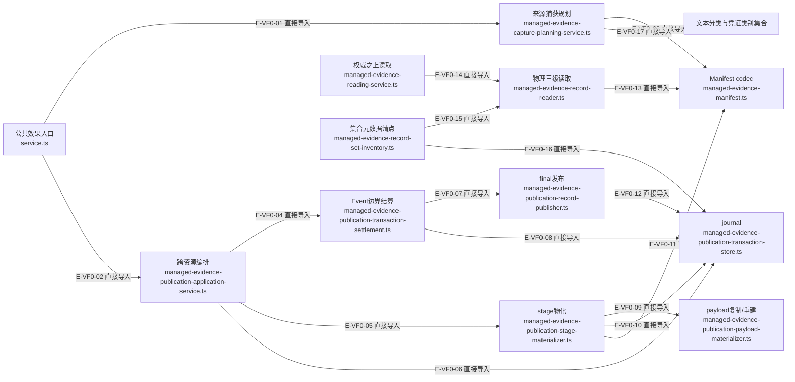

# 证据：捕获、发布与读取的静态依赖

> 核验于 2026-10-03，基线 `d8fafff` 加当前未提交工作树。图表达实际源码分支，未提交实现标为进行中；不把开发阶段计划当作运行事实。来源与测试锚点按本文精确范围列出。

本图是从当前TypeScript AST选出的直接导入子图；每条边再对照已读源码用途。它只证明耦合方向，不证明调用顺序、状态转移或Agent授权。

## 证据：捕获、发布与读取的静态依赖

### 本图术语说明

| 术语 | 本图含义 |
| --- | --- |
| 直接导入 | 包含实际import或显式re-export；类型依赖同样算结构依赖。 |
| 精选范围 | 按模块入口裁剪；被省略的依赖仍在逐文件台账和全局导入数据中。 |

### 节点与源码定位

| 节点 | 文件 / 符号 | 职责 |
| --- | --- | --- |
| f0 | `src/capabilities/evidence/service.ts` | 公共效果入口 service.ts |
| f1 | `src/governance/evidence/managed-evidence-capture-planning-service.ts` | 来源捕获规划 managed-evidence-capture-planning-service.ts |
| f2 | `src/governance/evidence/managed-evidence-publication-application-service.ts` | 跨资源编排 managed-evidence-publication-application-service.ts |
| f3 | `src/governance/evidence/managed-evidence-publication-transaction-settlement.ts` | Event边界结算 managed-evidence-publication-transaction-settlement.ts |
| f4 | `src/governance/evidence/managed-evidence-publication-stage-materializer.ts` | stage物化 managed-evidence-publication-stage-materializer.ts |
| f5 | `src/governance/evidence/managed-evidence-publication-payload-materializer.ts` | payload复制/重建 managed-evidence-publication-payload-materializer.ts |
| f6 | `src/governance/evidence/managed-evidence-publication-record-publisher.ts` | final发布 managed-evidence-publication-record-publisher.ts |
| f7 | `src/governance/evidence/managed-evidence-publication-transaction-store.ts` | journal managed-evidence-publication-transaction-store.ts |
| f8 | `src/governance/evidence/managed-evidence-manifest.ts` | Manifest codec managed-evidence-manifest.ts |
| f9 | `src/governance/evidence/managed-evidence-record-reader.ts` | 物理三级读取 managed-evidence-record-reader.ts |
| f10 | `src/governance/evidence/managed-evidence-reading-service.ts` | 权威之上读取 managed-evidence-reading-service.ts |
| f11 | `src/governance/evidence/managed-evidence-record-set-inventory.ts` | 集合元数据清点 managed-evidence-record-set-inventory.ts |
| f12 | `src/kernel/privacy-scan.ts` | 文本分类与凭证类别集合 |

### 本图边级证据

| 编号 | 代码证据 | 测试证据 | 关系依据 |
| --- | --- | --- | --- |
| E-VF0-01 | `src/capabilities/evidence/service.ts` | 未覆盖：此边是静态导入，由源码 AST 校验；运行测试不代替导入证据 | 直接导入 |
| E-VF0-02 | `src/capabilities/evidence/service.ts` | 未覆盖：此边是静态导入，由源码 AST 校验；运行测试不代替导入证据 | 直接导入 |
| E-VF0-03 | `src/governance/evidence/managed-evidence-capture-planning-service.ts` | 未覆盖：此边是静态导入，由源码 AST 校验；运行测试不代替导入证据 | 直接导入 |
| E-VF0-04 | `src/governance/evidence/managed-evidence-publication-application-service.ts` | 未覆盖：此边是静态导入，由源码 AST 校验；运行测试不代替导入证据 | 直接导入 |
| E-VF0-05 | `src/governance/evidence/managed-evidence-publication-application-service.ts` | 未覆盖：此边是静态导入，由源码 AST 校验；运行测试不代替导入证据 | 直接导入 |
| E-VF0-06 | `src/governance/evidence/managed-evidence-publication-application-service.ts` | 未覆盖：此边是静态导入，由源码 AST 校验；运行测试不代替导入证据 | 直接导入 |
| E-VF0-07 | `src/governance/evidence/managed-evidence-publication-transaction-settlement.ts` | 未覆盖：此边是静态导入，由源码 AST 校验；运行测试不代替导入证据 | 直接导入 |
| E-VF0-08 | `src/governance/evidence/managed-evidence-publication-transaction-settlement.ts` | 未覆盖：此边是静态导入，由源码 AST 校验；运行测试不代替导入证据 | 直接导入 |
| E-VF0-09 | `src/governance/evidence/managed-evidence-publication-stage-materializer.ts` | 未覆盖：此边是静态导入，由源码 AST 校验；运行测试不代替导入证据 | 直接导入 |
| E-VF0-10 | `src/governance/evidence/managed-evidence-publication-stage-materializer.ts` | 未覆盖：此边是静态导入，由源码 AST 校验；运行测试不代替导入证据 | 直接导入 |
| E-VF0-11 | `src/governance/evidence/managed-evidence-publication-stage-materializer.ts` | 未覆盖：此边是静态导入，由源码 AST 校验；运行测试不代替导入证据 | 直接导入 |
| E-VF0-12 | `src/governance/evidence/managed-evidence-publication-record-publisher.ts` | 未覆盖：此边是静态导入，由源码 AST 校验；运行测试不代替导入证据 | 直接导入 |
| E-VF0-13 | `src/governance/evidence/managed-evidence-record-reader.ts` | 未覆盖：此边是静态导入，由源码 AST 校验；运行测试不代替导入证据 | 直接导入 |
| E-VF0-14 | `src/governance/evidence/managed-evidence-reading-service.ts` | 未覆盖：此边是静态导入，由源码 AST 校验；运行测试不代替导入证据 | 直接导入 |
| E-VF0-15 | `src/governance/evidence/managed-evidence-record-set-inventory.ts` | 未覆盖：此边是静态导入，由源码 AST 校验；运行测试不代替导入证据 | 直接导入 |
| E-VF0-16 | `src/governance/evidence/managed-evidence-record-set-inventory.ts` | 未覆盖：此边是静态导入，由源码 AST 校验；运行测试不代替导入证据 | 直接导入 |
| E-VF0-17 | `src/governance/evidence/managed-evidence-capture-planning-service.ts` | 未覆盖：静态导入由源码 AST 校验；内容门的具体断言见独立页面 | 捕获直接复用扫描器及凭证类别集合 |

## 阅读边界

精选关系按捕获、事务、读取分支展开；前轮已对全部19个治理证据文件与3个能力文件逐文件审阅；本轮深审捕获规划、相关消费者与隐私边界。Publisher不直接导入Event提交器，Event-before-final由Settlement调用者保证。

Schema是可移植wire源；`tooling/codegen/schema-types.ts`生成`src/contracts/generated/identity/wakeflow-durable-id-kind.generated.ts`等派生合同。生成文件只核实来源与生成链，不计作手写文件语义审阅；`package.json`的schema:build/schema:check负责生成与漂移检测。

## 继续阅读

[文件导入](./file-dependencies.md) · [运行分支](./runtime-call-flow.md) · [本模块总览](./README.md) · [全局入口](../README.md) · [本轮增量审阅](../../plans/review-2026-10-03/coordination.md) · [前轮完整审阅](../../plans/review-2026-10-02/coordination-evidence.md)
