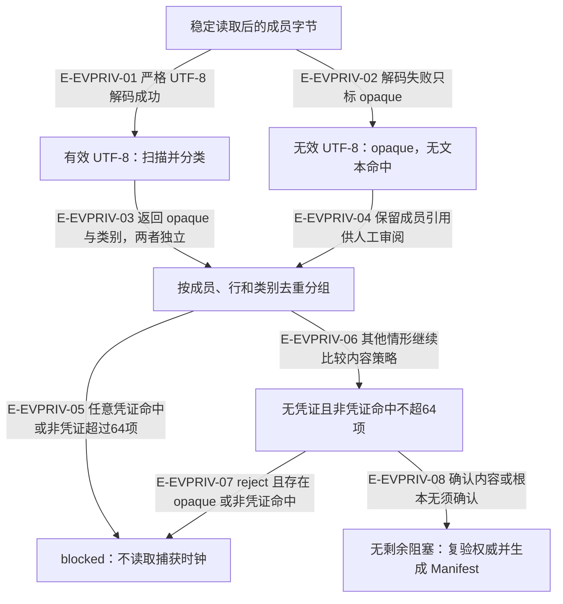
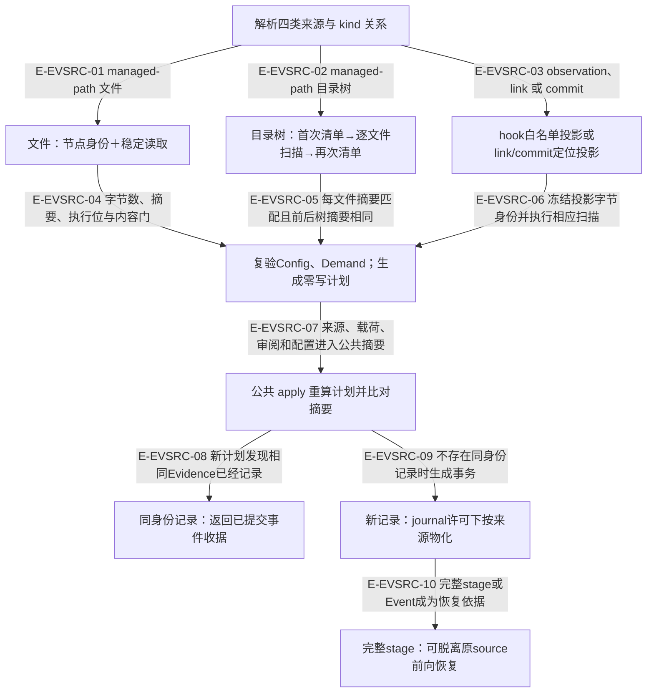

# 受管证据：内容确认边界与来源一致性

> rc.4 基线经本轮复核更新到 rc.5 候选工作树。所有扫描样例均为合成内容；扫描属于词法启发式，空命中不能证明任意文本或二进制不含秘密。

rc.4 的变化是修正可解码文本的隐私分类：颜色格式不再自动使文本 opaque，未知控制字符也不再提前跳过凭证扫描。它没有增加二进制格式解析或外部链接抓取能力。

## 内容门：可解码文本、opaque 与凭证分别判断

### 本图术语说明

| 术语 | 含义 |
| --- | --- |
| opaque | 无效UTF8，或有效UTF8去CSI后仍有未知控制字符。前者不扫描；后者仍扫描。 |
| 凭证类别 | private-key、provider-credential、credential-assignment；仅已识别的命中构成无条件阻塞。 |
| 确认策略 | controller-confirmed 允许记录待人工审阅内容；不是真实性、充分性或Controller业务验收。 |
| 非凭证上限 | 按(ref,line,kind)去重后的路径/UUID命中最多64项；opaque成员容量另由Manifest的成员清单限制。 |

### 节点与源码定位

| 节点 | 文件 / 符号 |
| --- | --- |
| bytes | `src/governance/evidence/managed-evidence-capture-planning-service.ts#classifyContent` |
| scan | `src/governance/evidence/managed-evidence-capture-planning-service.ts#classifyContent` |
| opaque | `src/governance/evidence/managed-evidence-capture-planning-service.ts#classifyContent` |
| review | `src/governance/evidence/managed-evidence-capture-planning-service.ts#reviewOf` |
| blocked | `src/governance/evidence/managed-evidence-capture-planning-service.ts#deriveManagedEvidenceContentBlockers` |
| policy | `src/governance/evidence/managed-evidence-capture-planning-service.ts#deriveManagedEvidenceContentBlockers` |
| ready | `src/governance/evidence/managed-evidence-capture-planning-service.ts#ManagedEvidenceCapturePlanningService.preview` |

### 本图边级证据

| 编号 | 代码证据 | 测试证据 | 具体范围 |
| --- | --- | --- | --- |
| E-EVPRIV-01 | `src/governance/evidence/managed-evidence-capture-planning-service.ts#classifyContent` | `tests/governance/evidence/managed-evidence-capture-planning-service.test.ts#ManagedEvidenceCapturePlanningService` | 新回归覆盖带CSI、NUL与OSC的合成凭证，两种策略均被阻塞。 |
| E-EVPRIV-02 | `src/governance/evidence/managed-evidence-capture-planning-service.ts#classifyContent` | `tests/governance/evidence/managed-evidence-capture-planning-service.test.ts#ManagedEvidenceCapturePlanningService` | 既有二进制fixture需确认；本轮探针另外验证无效UTF8夹带可读合成凭证仍不产生文本命中。 |
| E-EVPRIV-03 | `src/governance/evidence/managed-evidence-capture-planning-service.ts#reviewOf` | `tests/governance/evidence/managed-evidence-capture-planning-service.test.ts#ManagedEvidenceCapturePlanningService` | 同一行同类别去重，路径与UUID可在同一行保留两个类别。 |
| E-EVPRIV-04 | `src/governance/evidence/managed-evidence-capture-planning-service.ts#reviewOf` | `tests/governance/evidence/managed-evidence-capture-planning-service.test.ts#ManagedEvidenceCapturePlanningService` | 无效UTF8并不代表已检查内部格式，确认记录只声明人工内容审阅。 |
| E-EVPRIV-05 | `src/governance/evidence/managed-evidence-capture-planning-service.ts#deriveManagedEvidenceContentBlockers` | `tests/governance/evidence/managed-evidence-capture-planning-service.test.ts#ManagedEvidenceCapturePlanningService` | 凭证不可确认有直接测试；超过64项的服务回归未找到，来自纯函数代码分支。 |
| E-EVPRIV-06 | `src/governance/evidence/managed-evidence-capture-planning-service.ts#deriveManagedEvidenceContentBlockers` | `tests/governance/evidence/managed-evidence-capture-planning-service.test.ts#ManagedEvidenceCapturePlanningService` | 纯文本无命中、非凭证与opaque分别进入相应策略。 |
| E-EVPRIV-07 | `src/governance/evidence/managed-evidence-capture-planning-service.ts#deriveManagedEvidenceContentBlockers` | `tests/governance/evidence/managed-evidence-capture-planning-service.test.ts#ManagedEvidenceCapturePlanningService` | 断言opaque/路径阻塞，blocked不调用时钟；公开最多展示16个blocker。 |
| E-EVPRIV-08 | `src/governance/evidence/managed-evidence-capture-planning-service.ts#ManagedEvidenceCapturePlanningService.preview` | `tests/governance/evidence/managed-evidence-capture-planning-service.test.ts#ManagedEvidenceCapturePlanningService` | 确认仅放行opaque及有限非凭证命中；Manifest显式保存这两种审阅事实。 |

## 捕获到应用：各阶段分别绑定来源与摘要

### 本图术语说明

| 术语 | 含义 |
| --- | --- |
| 两种计划摘要 | 公共摘要绑定内容、source、contentReview、configDigest和authorityDigest；治理capture plan另绑定capturedAt和Demand的CAS四项。 |
| 来源投影 | 引用定位元数据，不能证明链接内容、Git对象存在性或现场执行成功。 |
| 同源检查 | 观察与复制阶段各自复验；来源会变时拒绝或按已完整stage恢复，不等于持有跨所有阶段的单个来源文件锁。 |
| already-recorded | 不追加第二个Event；只在本次重新计算出的Evidence ID已存在时发生。 |

### 节点与源码定位

| 节点 | 文件 / 符号 |
| --- | --- |
| select | `src/governance/evidence/managed-evidence-capture-planning-service.ts#parseSelection` |
| file | `src/governance/evidence/managed-evidence-capture-planning-service.ts#captureFile` |
| tree | `src/governance/evidence/managed-evidence-capture-planning-service.ts#captureTree` |
| projection | `src/governance/evidence/managed-evidence-capture-planning-service.ts#captureProjection` |
| plan | `src/governance/evidence/managed-evidence-capture-planning-service.ts#assertAuthorityCurrent` |
| apply | `src/capabilities/evidence/service.ts#planEvidence` |
| reuse | `src/capabilities/evidence/service.ts#replayRecorded` |
| copy | `src/governance/evidence/managed-evidence-publication-payload-materializer.ts#materializeManagedEvidencePublicationPayload` |
| recover | `src/governance/evidence/managed-evidence-publication-application-service.ts#ManagedEvidencePublicationApplicationService.recover` |

### 本图边级证据

| 编号 | 代码证据 | 测试证据 | 具体范围 |
| --- | --- | --- | --- |
| E-EVSRC-01 | `src/governance/evidence/managed-evidence-capture-planning-service.ts#captureManagedPath` | `tests/governance/evidence/managed-evidence-capture-planning-service.test.ts#ManagedEvidenceCapturePlanningService` | 只允许准入根下实际文件；资源类型不符和缺失有测试。 |
| E-EVSRC-02 | `src/governance/evidence/managed-evidence-capture-planning-service.ts#captureManagedPath` | `tests/governance/evidence/managed-evidence-capture-planning-service.test.ts#ManagedEvidenceCapturePlanningService` | 子根打开前后节点身份核验；目录树实际内容进入位置无关identity。 |
| E-EVSRC-03 | `src/governance/evidence/managed-evidence-capture-planning-service.ts#captureSelectedSource` | `tests/governance/evidence/managed-evidence-capture-planning-service.test.ts#ManagedEvidenceCapturePlanningService` | observation来自本工作区hook；link不网络抓取，commit不读取Git对象。 |
| E-EVSRC-04 | `src/governance/evidence/managed-evidence-capture-planning-service.ts#captureFile` | `tests/governance/evidence/managed-evidence-capture-planning-service.test.ts#ManagedEvidenceCapturePlanningService` | 单文件规范化为content；稳定读取和内容分类均在计划前。 |
| E-EVSRC-05 | `src/governance/evidence/managed-evidence-capture-planning-service.ts#captureTree` | 间接覆盖：`tests/governance/evidence/managed-evidence-capture-planning-service.test.ts#ManagedEvidenceCapturePlanningService` 验证正常整树identity；扫描期间并发替换分支未单独注入 | 分类并发上限4；逐文件比较bytes/digest，最终整树摘要也绑定成员、执行位与清单。 |
| E-EVSRC-06 | `src/governance/evidence/managed-evidence-capture-planning-service.ts#captureProjection` | `tests/governance/evidence/managed-evidence-capture-planning-service.test.ts#ManagedEvidenceCapturePlanningService` | 只有link URL为自由文本并扫凭证；观察投影剥离handle/cwd，不复制transcript正文。 |
| E-EVSRC-07 | `src/capabilities/evidence/service.ts#planEvidence` | `tests/capabilities/evidence/service.test.ts#executeRecordEvidenceRequest` | apply重新观察源；源变动返回plan-drift；capturedAt与流位置不是公共摘要输入。 |
| E-EVSRC-08 | `src/capabilities/evidence/service.ts#applyEvidence` | `tests/capabilities/evidence/service.test.ts#executeRecordEvidenceRequest` | already-recorded会复读派生commit；此前仍经过planEvidence，不能声称公开重试无需源。 |
| E-EVSRC-09 | `src/capabilities/evidence/service.ts#applyEvidence` | `tests/governance/evidence/managed-evidence-publication-stage-materializer.test.ts#materializeManagedEvidencePublicationStage` | 文件streaming copy校验长度摘要；树transfer前后验identity；引用来源按Manifest重建。 |
| E-EVSRC-10 | `src/governance/evidence/managed-evidence-publication-application-service.ts#ManagedEvidencePublicationApplicationService.recover` | `tests/governance/evidence/managed-evidence-publication-application-service.test.ts#ManagedEvidencePublicationApplicationService` | 直接验证Event前完整stage在Config/source后来变化后仍可完成；细节见独立恢复图。 |

## 白名单、内容确认与公开边界

`managedEvidencePrivacyPolicy` 允许工作区的词法/真实根、Ledger根、所有配置repository/support-surface根，以及当前Demand所属Pod记录的worktree路径。路径包含关系只是扫描豁免；实际读取仍由RootedDirectory与已配置来源准入负责。该白名单不能使凭证类命中通过。

内容审阅信息在 `src/governance/evidence/managed-evidence-manifest.ts#parseContentReview` 再做合同复验：opaque引用必须属于payload成员且严格有序，隐私命中按(ref,line,kind)严格递增；`not-required` 当且仅当两张列表均为空。Schema只允许非凭证的路径/UUID类别进入Manifest，没有“确认凭证”字段。

## 不能从通过状态推导的结论

- 无效UTF8不进行文本扫描；本轮合成探针在单个非法字节后放入可读合成凭证，`reject` 被opaque门阻塞，`controller-confirmed` 为ready且凭证命中数为0。此处必须由审阅者理解二进制内容，不能把ready说成机器已排除全部秘密。
- `captureProjection` 不访问网络或Git对象；URL仅检查https、无userinfo和格式，并对原文做隐私扫描，不解码所有查询参数再扫描。
- hook来源中的`turnId`、摘要等受格式合同约束，但该投影不重复扫描全部来源字段。未知宿主字段不会被自动扩展为证据。
- 捕获并不做业务验收。`recordedBy` 是配置Controller的记录权威，不是经过认证的MCP调用窗口身份。

本页对应代码和直接聚焦测试已读；19项修复前既有 `.build` 测试通过；随后新增的摘要溢出和未知UUID前缀回归已逐条读断言，并以当前源码后态探针独立验证。对并发替换与超64项内容门明确保留覆盖缺口，不以符号存在代替断言。

[发布与恢复细节](./runtime-call-flow.md) · [扫描器与词法包含](../11-kernel/privacy-boundary.md) · [本轮审阅证据](../../plans/review-2026-10-03-rc4/privacy-evidence.md)
