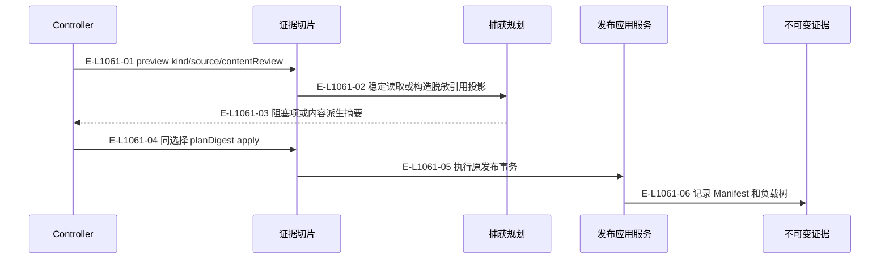
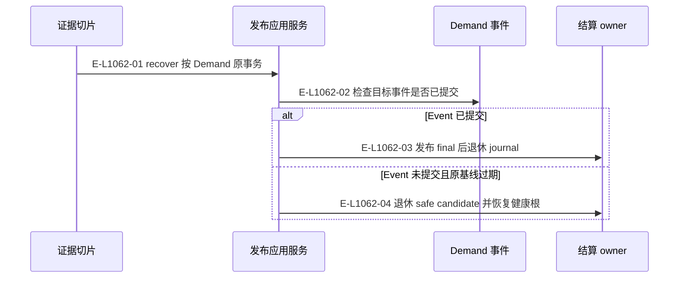

# 证据：捕获、发布与崩溃结算

效果型公开工具复用已有的耐久 Evidence 发布机制。

> 核验基线：`7ba1f38`；核验时实现代码均已提交，本轮图谱更新另列。开发阶段为 L1 九片已落地，observation 尚未开始。本文说明实现事实，未宣称双宿主真实会话已经验证。

## 来源选择、隐私与发布

### 本图术语说明

| 术语 | 本图含义 |
| --- | --- |
| CAS | 比较已观察的摘要/修订后提交；来源已改变则拒绝。 |
| commit | 一次不可变事件提交批；文件槽位以预期修订防止并发覆盖。 |

### 节点与实现定位

| 节点 | 文件 / 符号 | 责任 |
| --- | --- | --- |
| controller | Agent / 用户 / 外部效果或条件视图 | Controller |
| slice | `src/capabilities/evidence/service.ts` | 证据切片 |
| capture | `src/governance/evidence/managed-evidence-capture-planning-service.ts` | 捕获规划 |
| app | `src/governance/evidence/managed-evidence-publication-application-service.ts` | 发布应用服务 |
| record | `src/governance/evidence/managed-evidence-manifest.ts` | 不可变证据 |

### 本图边级证据

| 编号 | 代码定位 | 测试 / 核验 | 关系依据 |
| --- | --- | --- | --- |
| E-L1061-01 | `src/capabilities/evidence/service.ts#executeRecordEvidenceRequest` | `tests/capabilities/evidence/service.test.ts` | preview kind/source/contentReview |
| E-L1061-02 | `src/governance/evidence/managed-evidence-capture-planning-service.ts` | `tests/capabilities/evidence/service.test.ts` | 稳定读取或构造脱敏引用投影 |
| E-L1061-03 | `src/capabilities/evidence/service.ts` | `tests/capabilities/evidence/service.test.ts` | 阻塞项或内容派生摘要 |
| E-L1061-04 | `src/capabilities/evidence/service.ts#executeRecordEvidenceRequest` | `tests/capabilities/evidence/service.test.ts` | 同选择 planDigest apply |
| E-L1061-05 | `src/capabilities/evidence/service.ts` | `tests/capabilities/evidence/service.test.ts` | 执行原发布事务 |
| E-L1061-06 | `src/governance/evidence/managed-evidence-publication-application-service.ts#ManagedEvidencePublicationApplicationService.apply` | `tests/capabilities/evidence/service.test.ts` | 记录 Manifest 和负载树 |

## Evidence 事务的前向恢复

### 本图术语说明

| 术语 | 本图含义 |
| --- | --- |
| commit | 一次不可变事件提交批；文件槽位以预期修订防止并发覆盖。 |
| CAS | 比较已观察的摘要/修订后提交；来源已改变则拒绝。 |

### 节点与实现定位

| 节点 | 文件 / 符号 | 责任 |
| --- | --- | --- |
| slice | `src/capabilities/evidence/service.ts` | 证据切片 |
| app | `src/governance/evidence/managed-evidence-publication-application-service.ts` | 发布应用服务 |
| event | `src/governance/demand/event-sourcing/demand-event-sourcing-repository.ts` | Demand 事件 |
| settle | `src/governance/evidence/managed-evidence-publication-transaction-settlement.ts` | 结算 owner |

### 本图边级证据

| 编号 | 代码定位 | 测试 / 核验 | 关系依据 |
| --- | --- | --- | --- |
| E-L1062-01 | `src/capabilities/evidence/service.ts#executeRecordEvidenceRequest` | `tests/capabilities/evidence/service.test.ts` | recover 按 Demand 原事务 |
| E-L1062-02 | `src/governance/evidence/managed-evidence-publication-application-service.ts#ManagedEvidencePublicationApplicationService.recover` | `tests/capabilities/evidence/service.test.ts` | 检查目标事件是否已提交 |
| E-L1062-03 | `src/governance/evidence/managed-evidence-publication-transaction-settlement.ts#completeManagedEvidencePublicationTransaction` | `tests/capabilities/evidence/service.test.ts` | 发布 final 后退休 journal |
| E-L1062-04 | `src/governance/evidence/managed-evidence-publication-transaction-settlement.ts#retireStaleManagedEvidencePublicationTransaction` | `tests/capabilities/evidence/service.test.ts` | 退休 safe candidate 并恢复健康根 |

## 守卫、恢复与验证范围

证据记录的 payload、manifest 与事件 selector 必须闭合。只读按需读取器由 Result 消费；不能从 metadata 回执推断已经读过任意负载字节。

涉及的测试与核验入口：

- `tests/capabilities/evidence/service.test.ts`。

## 下钻与相关视图

- [本专题总览](./README.md)
- [图谱总索引](../README.md)
- [核验与剩余范围](../01-diagram-review-ledger.md)
