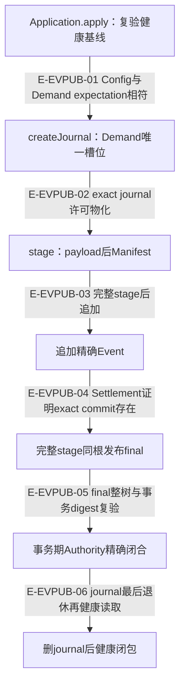
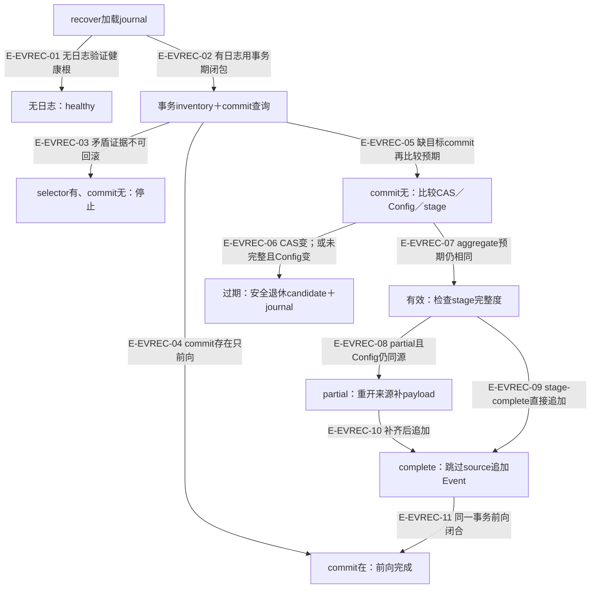
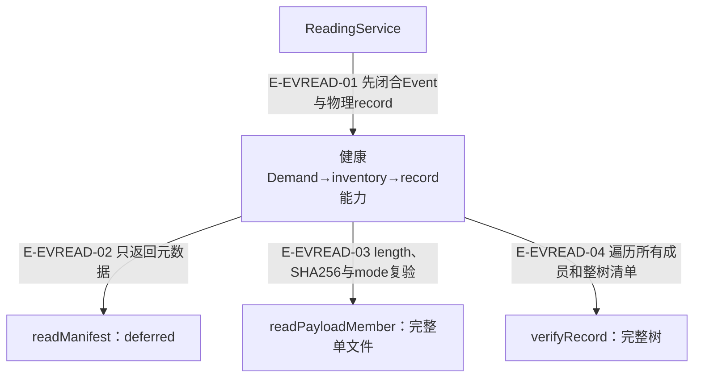

# 受管证据：不可逆发布、恢复与读取深度

> 核验于 2026-10-03，基线 `d8fafff` 加当前未提交工作树。图表达实际源码分支，未提交实现标为进行中；不把开发阶段计划当作运行事实。来源与测试锚点按本文精确范围列出。

## 真实发布调用：Event是不可逆边界

```mermaid
flowchart TB
  accTitle: 真实发布调用：Event是不可逆边界
  accDescr: 先日志和完整stage，后Event和final；只有已有Event才publish final，最后删journal并复验健康Demand。
  a["Application.apply：复验健康基线"]
  j["createJournal：Demand唯一槽位"]
  s["stage：payload后Manifest"]
  e["追加精确Event"]
  f["完整stage同根发布final"]
  c["事务期Authority精确闭合"]
  r["删journal后健康闭包"]
  a -->|"E-EVPUB-01 Config与Demand expectation相符"| j
  j -->|"E-EVPUB-02 exact journal许可物化"| s
  s -->|"E-EVPUB-03 完整stage后追加"| e
  e -->|"E-EVPUB-04 Settlement证明exact commit存在"| f
  f -->|"E-EVPUB-05 final整树与事务digest复验"| c
  c -->|"E-EVPUB-06 journal最后退休再健康读取"| r
```

### 本图术语说明

| 术语 | 本图含义 |
| --- | --- |
| journal | Demand固定单槽日志；absent-only创建，另一事务不能覆盖。 |
| Manifest-last | payload闭合后才写manifest.json；partial但已有Manifest是冲突。 |
| Event | 不可变commit中的完整Manifest，存在后只准前向完成。 |
| 健康闭包 | 身份、Authority、Ledger、事件selector与final inventory互相匹配。 |

### 节点与源码定位

| 节点 | 文件 / 符号 | 职责 |
| --- | --- | --- |
| a | `src/governance/evidence/managed-evidence-publication-application-service.ts#ManagedEvidencePublicationApplicationService.apply` | Application.apply：复验健康基线 |
| j | `src/governance/evidence/managed-evidence-publication-transaction-store.ts#createManagedEvidencePublicationTransactionJournal` | createJournal：Demand唯一槽位 |
| s | `src/governance/evidence/managed-evidence-publication-stage-materializer.ts#materializeManagedEvidencePublicationStage` | stage：payload后Manifest |
| e | `src/governance/evidence/managed-evidence-publication-transaction-settlement.ts#appendManagedEvidencePublicationEvent` | 追加精确Event |
| f | `src/governance/evidence/managed-evidence-publication-record-publisher.ts#publishManagedEvidencePublicationRecord` | 完整stage同根发布final |
| c | `src/governance/evidence/managed-evidence-publication-transaction-settlement.ts#completeManagedEvidencePublicationTransaction` | 事务期Authority精确闭合 |
| r | `src/governance/evidence/managed-evidence-publication-transaction-settlement.ts#completeManagedEvidencePublicationTransaction` | 删journal后健康闭包 |

### 本图边级证据

| 编号 | 代码证据 | 测试证据 | 关系依据 |
| --- | --- | --- | --- |
| E-EVPUB-01 | `src/governance/evidence/managed-evidence-publication-application-service.ts#ManagedEvidencePublicationApplicationService.apply` | `tests/governance/evidence/managed-evidence-publication-application-service.test.ts#ManagedEvidencePublicationApplicationService` | Config与Demand expectation相符 |
| E-EVPUB-02 | `src/governance/evidence/managed-evidence-publication-application-service.ts#ManagedEvidencePublicationApplicationService.apply` | `tests/governance/evidence/managed-evidence-publication-application-service.test.ts#ManagedEvidencePublicationApplicationService` | exact journal许可物化 |
| E-EVPUB-03 | `src/governance/evidence/managed-evidence-publication-application-service.ts#ManagedEvidencePublicationApplicationService.apply` | `tests/governance/evidence/managed-evidence-publication-application-service.test.ts#ManagedEvidencePublicationApplicationService` | 完整stage后追加 |
| E-EVPUB-04 | `src/governance/evidence/managed-evidence-publication-transaction-settlement.ts#completeManagedEvidencePublicationTransaction` | `tests/governance/evidence/managed-evidence-publication-application-service.test.ts#ManagedEvidencePublicationApplicationService` | Settlement证明exact commit存在 |
| E-EVPUB-05 | `src/governance/evidence/managed-evidence-publication-transaction-settlement.ts#completeManagedEvidencePublicationTransaction` | `tests/governance/evidence/managed-evidence-publication-application-service.test.ts#ManagedEvidencePublicationApplicationService` | final整树与事务digest复验 |
| E-EVPUB-06 | `src/governance/evidence/managed-evidence-publication-transaction-settlement.ts#completeManagedEvidencePublicationTransaction` | `tests/governance/evidence/managed-evidence-publication-application-service.test.ts#ManagedEvidencePublicationApplicationService` | journal最后退休再健康读取 |

## 恢复分支：日志、commit与物理清单

```mermaid
flowchart TB
  accTitle: 恢复分支：日志、commit与物理清单
  accDescr: 无日志做健康读取；commit在则前向；Event前基线过期可安全退休；完整stage不再读原source。
  a["recover加载journal"]
  h["无日志：healthy"]
  i["事务inventory＋commit查询"]
  x["selector有、commit无：停止"]
  f["commit在：前向完成"]
  b["commit无：比较CAS／Config／stage"]
  r["过期：安全退休candidate＋journal"]
  s["有效：检查stage完整度"]
  p["partial：重开来源补payload"]
  e["complete：跳过source追加Event"]
  a -->|"E-EVREC-01 无日志验证健康根"| h
  a -->|"E-EVREC-02 有日志用事务期闭包"| i
  i -->|"E-EVREC-03 矛盾证据不可回滚"| x
  i -->|"E-EVREC-04 commit存在只前向"| f
  i -->|"E-EVREC-05 缺目标commit再比较预期"| b
  b -->|"E-EVREC-06 CAS变；或未完整且Config变"| r
  b -->|"E-EVREC-07 aggregate预期仍相同"| s
  s -->|"E-EVREC-08 partial且Config仍同源"| p
  s -->|"E-EVREC-09 stage-complete直接追加"| e
  p -->|"E-EVREC-10 补齐后追加"| e
  e -->|"E-EVREC-11 同一事务前向闭合"| f
```

### 本图术语说明

| 术语 | 本图含义 |
| --- | --- |
| CAS四项 | streamRevision、stateDigest、lastEventId、lastEventDigest。 |
| stage-complete | 即使原source消失或后续Config变化也可继续，仍要求aggregate expectation有效。 |
| 安全退休 | 必须再次证明Event与selector均缺席，只退休本事务candidate/journal。 |

### 节点与源码定位

| 节点 | 文件 / 符号 | 职责 |
| --- | --- | --- |
| a | `src/governance/evidence/managed-evidence-publication-application-service.ts#ManagedEvidencePublicationApplicationService.recover` | recover加载journal |
| h | `src/governance/evidence/managed-evidence-publication-transaction-settlement.ts#loadManagedEvidencePublicationHealthyAuthority` | 无日志：healthy |
| i | `src/governance/evidence/managed-evidence-publication-application-service.ts#ManagedEvidencePublicationApplicationService.recover` | 事务inventory＋commit查询 |
| x | `src/governance/evidence/managed-evidence-publication-application-service.ts#ManagedEvidencePublicationApplicationService.recover` | selector有、commit无：停止 |
| f | `src/governance/evidence/managed-evidence-publication-transaction-settlement.ts#completeManagedEvidencePublicationTransaction` | commit在：前向完成 |
| b | `src/governance/evidence/managed-evidence-publication-application-service.ts#sameExpectedAggregate` | commit无：比较CAS／Config／stage |
| r | `src/governance/evidence/managed-evidence-publication-transaction-settlement.ts#retireStaleManagedEvidencePublicationTransaction` | 过期：安全退休candidate＋journal |
| s | `src/governance/evidence/managed-evidence-publication-application-service.ts#ManagedEvidencePublicationApplicationService.recover` | 有效：检查stage完整度 |
| p | `src/governance/evidence/managed-evidence-publication-application-service.ts#materializeStage` | partial：重开来源补payload |
| e | `src/governance/evidence/managed-evidence-publication-transaction-settlement.ts#appendManagedEvidencePublicationEvent` | complete：跳过source追加Event |

### 本图边级证据

| 编号 | 代码证据 | 测试证据 | 关系依据 |
| --- | --- | --- | --- |
| E-EVREC-01 | `src/governance/evidence/managed-evidence-publication-application-service.ts#ManagedEvidencePublicationApplicationService.recover` | `tests/governance/evidence/managed-evidence-publication-application-service.test.ts#ManagedEvidencePublicationApplicationService` | 无日志验证健康根 |
| E-EVREC-02 | `src/governance/evidence/managed-evidence-publication-application-service.ts#ManagedEvidencePublicationApplicationService.recover` | `tests/governance/evidence/managed-evidence-publication-application-service.test.ts#ManagedEvidencePublicationApplicationService` | 有日志用事务期闭包 |
| E-EVREC-03 | `src/governance/evidence/managed-evidence-publication-application-service.ts#ManagedEvidencePublicationApplicationService.recover` | 未覆盖：当前聚焦测试未单独构造selector在但exact commit缺失分支 | 矛盾证据不可回滚 |
| E-EVREC-04 | `src/governance/evidence/managed-evidence-publication-application-service.ts#ManagedEvidencePublicationApplicationService.recover` | `tests/governance/evidence/managed-evidence-publication-application-service.test.ts#ManagedEvidencePublicationApplicationService` | commit存在只前向 |
| E-EVREC-05 | `src/governance/evidence/managed-evidence-publication-application-service.ts#ManagedEvidencePublicationApplicationService.recover` | `tests/governance/evidence/managed-evidence-publication-application-service.test.ts#ManagedEvidencePublicationApplicationService` | 缺目标commit再比较预期 |
| E-EVREC-06 | `src/governance/evidence/managed-evidence-publication-transaction-settlement.ts#retireStaleManagedEvidencePublicationTransaction` | `tests/governance/evidence/managed-evidence-publication-application-service.test.ts#ManagedEvidencePublicationApplicationService` | CAS变；或未完整且Config变 |
| E-EVREC-07 | `src/governance/evidence/managed-evidence-publication-application-service.ts#ManagedEvidencePublicationApplicationService.recover` | `tests/governance/evidence/managed-evidence-publication-application-service.test.ts#ManagedEvidencePublicationApplicationService` | aggregate预期仍相同 |
| E-EVREC-08 | `src/governance/evidence/managed-evidence-publication-application-service.ts#ManagedEvidencePublicationApplicationService.recover` | `tests/governance/evidence/managed-evidence-publication-application-service.test.ts#ManagedEvidencePublicationApplicationService` | partial且Config仍同源 |
| E-EVREC-09 | `src/governance/evidence/managed-evidence-publication-application-service.ts#ManagedEvidencePublicationApplicationService.recover` | `tests/governance/evidence/managed-evidence-publication-application-service.test.ts#ManagedEvidencePublicationApplicationService` | stage-complete直接追加 |
| E-EVREC-10 | `src/governance/evidence/managed-evidence-publication-application-service.ts#ManagedEvidencePublicationApplicationService.recover` | `tests/governance/evidence/managed-evidence-publication-application-service.test.ts#ManagedEvidencePublicationApplicationService` | 补齐后追加 |
| E-EVREC-11 | `src/governance/evidence/managed-evidence-publication-application-service.ts#ManagedEvidencePublicationApplicationService.recover` | `tests/governance/evidence/managed-evidence-publication-application-service.test.ts#ManagedEvidencePublicationApplicationService` | 同一事务前向闭合 |

## 读取深度：元数据、成员、完整树

```mermaid
flowchart TB
  accTitle: 读取深度：元数据、成员、完整树
  accDescr: 先闭合健康Demand与Event-backed inventory，再选择载荷验证深度，元数据不是完整载荷验证。
  a["ReadingService"]
  b["健康Demand→inventory→record能力"]
  m["readManifest：deferred"]
  p["readPayloadMember：完整单文件"]
  v["verifyRecord：完整树"]
  a -->|"E-EVREAD-01 先闭合Event与物理record"| b
  b -->|"E-EVREAD-02 只返回元数据"| m
  b -->|"E-EVREAD-03 length、SHA256与mode复验"| p
  b -->|"E-EVREAD-04 遍历所有成员和整树清单"| v
```

### 本图术语说明

| 术语 | 本图含义 |
| --- | --- |
| deferred | 尚未验证完整载荷；历史记录集合inventory也采用此深度。 |
| record能力 | 进程内WeakSet签发对象，结构复制品不能绕过准入。 |
| 完整成员 | v1无分块摘要，不提供byte-range独立验证。 |

### 节点与源码定位

| 节点 | 文件 / 符号 | 职责 |
| --- | --- | --- |
| a | `src/governance/evidence/managed-evidence-reading-service.ts#ManagedEvidenceReadingService` | ReadingService |
| b | `src/governance/evidence/managed-evidence-reading-service.ts#withAuthorityRecord` | 健康Demand→inventory→record能力 |
| m | `src/governance/evidence/managed-evidence-reading-service.ts#ManagedEvidenceReadingService.readManifest` | readManifest：deferred |
| p | `src/governance/evidence/managed-evidence-record-reader.ts#readManagedEvidencePayloadMember` | readPayloadMember：完整单文件 |
| v | `src/governance/evidence/managed-evidence-record-reader.ts#verifyManagedEvidenceRecord` | verifyRecord：完整树 |

### 本图边级证据

| 编号 | 代码证据 | 测试证据 | 关系依据 |
| --- | --- | --- | --- |
| E-EVREAD-01 | `src/governance/evidence/managed-evidence-reading-service.ts#withAuthorityRecord` | `tests/governance/evidence/managed-evidence-reading-service.test.ts#ManagedEvidenceReadingService` | 先闭合Event与物理record |
| E-EVREAD-02 | `src/governance/evidence/managed-evidence-reading-service.ts#ManagedEvidenceReadingService.readManifest` | `tests/governance/evidence/managed-evidence-reading-service.test.ts#ManagedEvidenceReadingService` | 只返回元数据 |
| E-EVREAD-03 | `src/governance/evidence/managed-evidence-reading-service.ts#ManagedEvidenceReadingService.readPayloadMember` | `tests/governance/evidence/managed-evidence-reading-service.test.ts#ManagedEvidenceReadingService` | length、SHA256与mode复验 |
| E-EVREAD-04 | `src/governance/evidence/managed-evidence-reading-service.ts#ManagedEvidenceReadingService.verifyRecord` | `tests/governance/evidence/managed-evidence-reading-service.test.ts#ManagedEvidenceReadingService` | 遍历所有成员和整树清单 |

以上事务从公共入口执行时，apply/recover均在 `shared` 工作区范围内。直接调用内部治理owner的测试不等价公共准入测试；范围不会把多个文件写入变成一个原子步骤。

## 失败与验证范围

应用错误的publicationAuthority是unchanged、recoverable、current或unknown，说明落地效果可证明程度，不是业务验收。journal、Manifest、final各自readback保留恢复边界，取消不等于回滚。

已检查测试覆盖：Event前完整stage在Config/source变化后恢复；Event后禁止退休回滚；CAS过期退休partial；无日志healthy；单成员不扫描无关payload而整树verify发现漂移。集合清点只承诺Manifest和顶层结构，不能画成每次status对全部历史载荷散列。

## 继续阅读

[文件导入](./file-dependencies.md) · [运行分支](./runtime-call-flow.md) · [本模块总览](./README.md) · [全局入口](../README.md) · [本轮增量审阅](../../plans/review-2026-10-03/coordination.md) · [前轮完整审阅](../../plans/review-2026-10-02/coordination-evidence.md)
