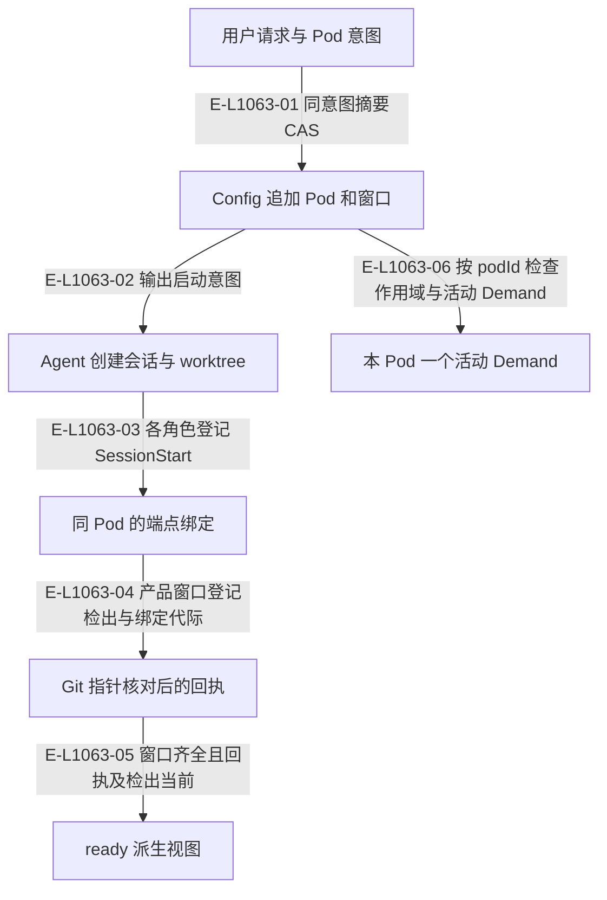

# Pod：完整窗口组与检出回执

main 是 primary Pod；用户要求并发时创建 worktree Pod。配置保存 open/closing，creating/ready/closing/closed 是配置、绑定和检出事实的派生状态，派生函数自本基线起住在治理层 `src/governance/pod/pod-state.ts`。

> 核验基线：`1480271`（L1 observation 第十片已落地，20 个公共工具、18 个一次性场景）。工作树另有并行未提交改动（宿主 hook 通道等），本图不描绘；来源指纹按当前工作树计算。本文说明实现事实，未宣称双宿主真实会话已经验证。

## Pod 配置和端点事实形成执行环境

### 本图术语说明

| 术语 | 本图含义 |
| --- | --- |
| Pod | 完整窗口组与每仓执行位置；main 是 primary Pod。 |
| host | Codex 或 Claude Code；真实会话动作由 Agent 调用宿主完成。 |
| CAS | 比较已观察的摘要/修订后提交；来源已改变则拒绝。 |
| projection | 根据权威重建的视图，不反向决定事实。 |

### 节点与实现定位

| 节点 | 文件 / 符号 | 责任 |
| --- | --- | --- |
| intent | `src/capabilities/pod/service.ts` | 用户请求与 Pod 意图 |
| config | `src/capabilities/pod/service.ts` | Config 追加 Pod 和窗口 |
| host | Agent / 用户 / 外部效果或条件视图 | Agent 创建会话与 worktree |
| binding | `src/capabilities/endpoint/service.ts` | 同 Pod 的端点绑定 |
| receipt | `src/kernel/pod-worktree-receipts.ts` | Git 指针核对后的回执 |
| ready | `src/governance/pod/pod-state.ts#derivePodState` | ready 派生视图 |
| demand | `src/capabilities/demand/service.ts` | 本 Pod 一个活动 Demand |

### 本图边级证据

| 编号 | 代码定位 | 测试 / 核验 | 关系依据 |
| --- | --- | --- | --- |
| E-L1063-01 | `src/capabilities/pod/service.ts#applyCreate` | `tests/capabilities/pod/service.test.ts` | 同意图摘要 CAS |
| E-L1063-02 | `src/capabilities/pod/service.ts#currentViews` | `tests/capabilities/pod/service.test.ts` | 输出启动意图 |
| E-L1063-03 | `src/capabilities/endpoint/service.ts` | `tests/capabilities/pod/service.test.ts` | 各角色登记 SessionStart |
| E-L1063-04 | `src/kernel/pod-worktree-receipts.ts#admitPodWorktreeObservation` | `tests/capabilities/pod/service.test.ts` | 产品窗口登记检出与绑定代际 |
| E-L1063-05 | `src/governance/pod/pod-state.ts#derivePodState` | `tests/capabilities/pod/service.test.ts` | 窗口齐全且回执及检出当前 |
| E-L1063-06 | `src/capabilities/demand/service.ts#planCreate` | `tests/capabilities/pod/service.test.ts` | 按 podId 检查作用域与活动 Demand |

## 守卫、恢复与验证范围

ready 是派生视图，create_demand 当前只检查 Pod 存在、open 与不忙，不以 ready 作机器门。Pod 角色约定由 Agent/skills 执行；公共工具目前不认证调用者就是 main Controller。Wakeflow 不运行 git、不合并分支、不删除宿主检出；回执核对使用 .git 指针与已交回观察。

本基线起，Pod 结果附带 worktree 处置建议：它是给 Agent 与用户读的文本建议（`src/governance/pod/worktree-disposal.ts#worktreeDisposalGuidance`），Wakeflow 自己既不执行也不据此判定关闭完成；实际删除检出仍由宿主或用户完成。全局 Pod 状态与残留报告现在由 observation 的 `wakeflow_status` 读取，见下方下钻。

涉及的测试与核验入口：

- `tests/capabilities/pod/service.test.ts`。

## 下钻与相关视图

- [文件直接导入](./file-dependencies.md)
- [运行调用与恢复](./runtime-call-flow.md)
- [只读观察与核验](../16-observation/README.md)
- [图谱总索引](../README.md)
- [核验与剩余范围](../01-diagram-review-ledger.md)
