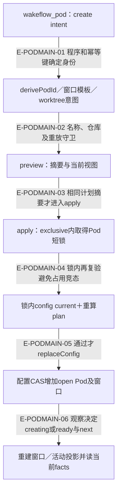

# Pod：配置合同、窗口组与执行位置

> 核验于 2026-10-03，基线 `d8fafff` 加当前未提交工作树。图表达实际源码分支，未提交实现标为进行中；不把开发阶段计划当作运行事实。来源与测试锚点按本文精确范围列出。

Pod是配置中的完整执行窗口组与每仓库worktree意图。Wakeflow创建的是配置合同；Agent再创建宿主窗口和检出，并由endpoint验证后登记回执。运行状态由现有事实派生，不新增Pod状态文件。

## Pod创建的真实调用链

```mermaid
flowchart TB
  accTitle: Pod创建的真实调用链
  accDescr: 效果外壳计算创建计划，apply先在工作区独占范围打开上下文，再在Pod短锁中重验配置和计划，再CAS追加完整窗口组与worktree意图。
  a["wakeflow_pod：create intent"]
  p["derivePodId／窗口模板／worktree意图"]
  v["preview：摘要与当前视图"]
  l["apply：exclusive内取得Pod短锁"]
  c["锁内config current＋重算plan"]
  w["配置CAS增加open Pod及窗口"]
  r["重建窗口／活动投影并读当前facts"]
  a -->|"E-PODMAIN-01 程序和幂等键确定身份"| p
  p -->|"E-PODMAIN-02 名称、仓库及重放守卫"| v
  v -->|"E-PODMAIN-03 相同计划摘要才进入apply"| l
  l -->|"E-PODMAIN-04 锁内再复验避免占用竞态"| c
  c -->|"E-PODMAIN-05 通过才replaceConfig"| w
  w -->|"E-PODMAIN-06 观察决定creating或ready与next"| r
```

### 本图术语说明

| 术语 | 本图含义 |
| --- | --- |
| Pod | controller、design、test各一，加每配置仓库一个product窗口。 |
| primary | 名称main的主Pod；模板来源，不允许close。 |
| 意图 | 建议worktree名称和执行位置合同，尚不是已存在检出的证据。 |
| 短锁 | 内层按podId复验；外层exclusive范围覆盖配置变更，两者都不持锁等待Agent或宿主动作。 |

### 节点与源码定位

| 节点 | 文件 / 符号 | 职责 |
| --- | --- | --- |
| a | `src/capabilities/pod/service.ts#executePodRequest` | wakeflow_pod：create intent |
| p | `src/capabilities/pod/decide.ts#derivePodWindows` | derivePodId／窗口模板／worktree意图 |
| v | `src/capabilities/pod/service.ts#planCreate` | preview：摘要与当前视图 |
| l | `src/capabilities/pod/service.ts#applyPod` | 工作区exclusive内的Pod短锁 |
| c | `src/capabilities/pod/service.ts#applyPod` | 锁内config current＋重算plan |
| w | `src/capabilities/pod/service.ts#applyCreate` | 配置CAS增加open Pod及窗口 |
| r | `src/capabilities/pod/service.ts#currentViews` | 重建窗口／活动投影并读当前facts |

### 本图边级证据

| 编号 | 代码证据 | 测试证据 | 关系依据 |
| --- | --- | --- | --- |
| E-PODMAIN-01 | `src/capabilities/pod/service.ts#planCreate` | `tests/capabilities/pod/service.test.ts#executePodRequest` | 程序和幂等键确定身份 |
| E-PODMAIN-02 | `src/capabilities/pod/service.ts#planCreate` | `tests/capabilities/pod/service.test.ts#executePodRequest` | 名称、仓库及重放守卫 |
| E-PODMAIN-03 | `src/capabilities/pod/service.ts#executePodRequest` | `tests/capabilities/pod/service.test.ts#executePodRequest` | 相同计划摘要才进入apply |
| E-PODMAIN-04 | `src/capabilities/pod/service.ts#applyPod` | `tests/capabilities/demand/pod-concurrency.test.ts#executePodRequest` | 锁内再复验避免占用竞态 |
| E-PODMAIN-05 | `src/capabilities/pod/service.ts#applyPodLocked` | `tests/capabilities/pod/service.test.ts#executePodRequest` | 通过才replaceConfig |
| E-PODMAIN-06 | `src/capabilities/pod/service.ts#assembleResult` | `tests/capabilities/pod/service.test.ts#executePodRequest` | 观察决定creating或ready与next |

## 谁拥有哪种事实

| 对象 | 写入/观察位置 | 消费者 | 约束 |
| --- | --- | --- | --- |
| lifecycle open/closing与分支处置 | Config权威CAS | 创建Demand、关闭、观察 | 只有这两种生命周期存入配置 |
| 窗口Binding | endpoint登记表 | Pod视图 | 同窗口当前代际 |
| Worktree receipt | 私有宿主Pod目录 | state、evidence、任务说明 | 来自已区分的执行根与Git指针核对；Codex项目会话cwd不直接充当检出 |
| creating/ready/closing/closed | `src/governance/pod/pod-state.ts#derivePodState` | status与Pod返回结果 | 纯派生，不另存状态 |
| 检出是否存在 | `src/kernel/pod-worktree-receipts.ts#worktreeCheckoutPresent` | close-complete与status | 当前目录及.git指针文件，不是Git清洁或合并证明 |

create同program/idempotencyKey重放同Pod；同键改名阻塞。name main保留、存活Pod重名阻塞、无仓库阻塞。完整窗口组从primary模板派生，每仓库选第一个product模板。

Pod apply/recover显式声明 `mutationScope: exclusive`，与普通shared运行操作互斥。宿主窗口创建、实际worktree删除与分支处置判断仍是Agent责任。技能中的“main Controller调用”未进入线上调用者身份认证，不应画成服务端权限检查。

## 继续阅读

[文件导入](./file-dependencies.md) · [运行分支](./runtime-call-flow.md) · [本模块总览](./README.md) · [全局入口](../README.md) · [本轮增量审阅](../../plans/review-2026-10-03/coordination.md) · [前轮完整审阅](../../plans/review-2026-10-02/coordination-evidence.md)
