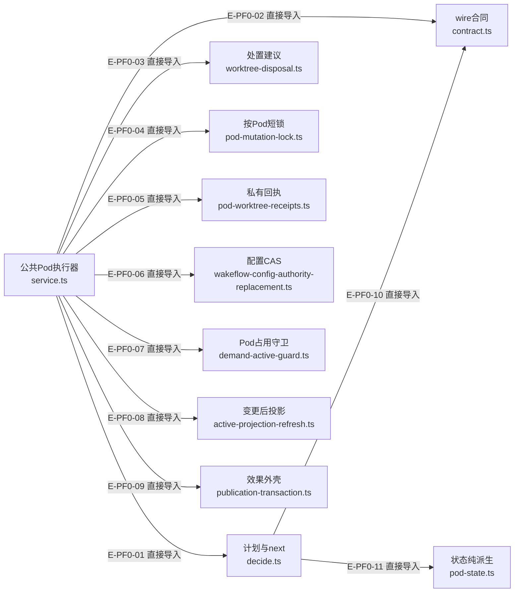

# Pod：配置事务、执行回执与短锁的静态依赖

> 核验于 2026-10-03，基线 `d8fafff` 加当前未提交工作树。图表达实际源码分支，未提交实现标为进行中；不把开发阶段计划当作运行事实。来源与测试锚点按本文精确范围列出。

本图是从当前TypeScript AST选出的直接导入子图；每条边再对照已读源码用途。它只证明耦合方向，不证明调用顺序、状态转移或Agent授权。

## Pod：配置事务、执行回执与短锁的静态依赖

```mermaid
flowchart LR
  accTitle: Pod：配置事务、执行回执与短锁的静态依赖
  accDescr: 文件直接import关系的审阅精选视图，运行调用与状态分支在独立页面。
  f0["公共Pod执行器<br/>service.ts"]
  f1["计划与next<br/>decide.ts"]
  f2["wire合同<br/>contract.ts"]
  f3["状态纯派生<br/>pod-state.ts"]
  f4["处置建议<br/>worktree-disposal.ts"]
  f5["按Pod短锁<br/>pod-mutation-lock.ts"]
  f6["私有回执<br/>pod-worktree-receipts.ts"]
  f7["配置CAS<br/>wakeflow-config-authority-replacement.ts"]
  f8["Pod占用守卫<br/>demand-active-guard.ts"]
  f9["变更后投影<br/>active-projection-refresh.ts"]
  f10["效果外壳<br/>publication-transaction.ts"]
  f0 -->|"E-PF0-01 直接导入"| f1
  f0 -->|"E-PF0-02 直接导入"| f2
  f0 -->|"E-PF0-03 直接导入"| f4
  f0 -->|"E-PF0-04 直接导入"| f5
  f0 -->|"E-PF0-05 直接导入"| f6
  f0 -->|"E-PF0-06 直接导入"| f7
  f0 -->|"E-PF0-07 直接导入"| f8
  f0 -->|"E-PF0-08 直接导入"| f9
  f0 -->|"E-PF0-09 直接导入"| f10
  f1 -->|"E-PF0-10 直接导入"| f2
  f1 -->|"E-PF0-11 直接导入"| f3
```

### 本图术语说明

| 术语 | 本图含义 |
| --- | --- |
| 直接导入 | 包含实际import或显式re-export；类型依赖同样算结构依赖。 |
| 精选范围 | 按模块入口裁剪；被省略的依赖仍在逐文件台账和全局导入数据中。 |

### 节点与源码定位

| 节点 | 文件 / 符号 | 职责 |
| --- | --- | --- |
| f0 | `src/capabilities/pod/service.ts` | 公共Pod执行器 service.ts |
| f1 | `src/capabilities/pod/decide.ts` | 计划与next decide.ts |
| f2 | `src/capabilities/pod/contract.ts` | wire合同 contract.ts |
| f3 | `src/governance/pod/pod-state.ts` | 状态纯派生 pod-state.ts |
| f4 | `src/governance/pod/worktree-disposal.ts` | 处置建议 worktree-disposal.ts |
| f5 | `src/kernel/pod-mutation-lock.ts` | 按Pod短锁 pod-mutation-lock.ts |
| f6 | `src/kernel/pod-worktree-receipts.ts` | 私有回执 pod-worktree-receipts.ts |
| f7 | `src/configuration/wakeflow-config-authority-replacement.ts` | 配置CAS wakeflow-config-authority-replacement.ts |
| f8 | `src/governance/demand/publication/demand-active-guard.ts` | Pod占用守卫 demand-active-guard.ts |
| f9 | `src/governance/observation/active-projection-refresh.ts` | 变更后投影 active-projection-refresh.ts |
| f10 | `src/kernel/publication-transaction.ts` | 效果外壳 publication-transaction.ts |

### 本图边级证据

| 编号 | 代码证据 | 测试证据 | 关系依据 |
| --- | --- | --- | --- |
| E-PF0-01 | `src/capabilities/pod/service.ts` | 未覆盖：此边是静态导入，由源码 AST 校验；运行测试不代替导入证据 | 直接导入 |
| E-PF0-02 | `src/capabilities/pod/service.ts` | 未覆盖：此边是静态导入，由源码 AST 校验；运行测试不代替导入证据 | 直接导入 |
| E-PF0-03 | `src/capabilities/pod/service.ts` | 未覆盖：此边是静态导入，由源码 AST 校验；运行测试不代替导入证据 | 直接导入 |
| E-PF0-04 | `src/capabilities/pod/service.ts` | 未覆盖：此边是静态导入，由源码 AST 校验；运行测试不代替导入证据 | 直接导入 |
| E-PF0-05 | `src/capabilities/pod/service.ts` | 未覆盖：此边是静态导入，由源码 AST 校验；运行测试不代替导入证据 | 直接导入 |
| E-PF0-06 | `src/capabilities/pod/service.ts` | 未覆盖：此边是静态导入，由源码 AST 校验；运行测试不代替导入证据 | 直接导入 |
| E-PF0-07 | `src/capabilities/pod/service.ts` | 未覆盖：此边是静态导入，由源码 AST 校验；运行测试不代替导入证据 | 直接导入 |
| E-PF0-08 | `src/capabilities/pod/service.ts` | 未覆盖：此边是静态导入，由源码 AST 校验；运行测试不代替导入证据 | 直接导入 |
| E-PF0-09 | `src/capabilities/pod/service.ts` | 未覆盖：此边是静态导入，由源码 AST 校验；运行测试不代替导入证据 | 直接导入 |
| E-PF0-10 | `src/capabilities/pod/decide.ts` | 未覆盖：此边是静态导入，由源码 AST 校验；运行测试不代替导入证据 | 直接导入 |
| E-PF0-11 | `src/capabilities/pod/decide.ts` | 未覆盖：此边是静态导入，由源码 AST 校验；运行测试不代替导入证据 | 直接导入 |

`mutationScope: exclusive` 是 service 传给已有 `runPublicationTransaction` 的值；实际工作区范围导入在 command-shell，不虚构一条 service→workspace-operation-scope 的直接import。

## 阅读边界

Pod和observation共用governance/pod的状态规则，两个capability不互相依赖。短锁也是Demand占用入口的共用边界，静态边本身不证明锁覆盖recover。

Schema是可移植wire源；`tooling/codegen/schema-types.ts`生成`src/contracts/generated/identity/wakeflow-durable-id-kind.generated.ts`等派生合同。生成文件只核实来源与生成链，不计作手写文件语义审阅；`package.json`的schema:build/schema:check负责生成与漂移检测。

## 继续阅读

[文件导入](./file-dependencies.md) · [运行分支](./runtime-call-flow.md) · [本模块总览](./README.md) · [全局入口](../README.md) · [本轮增量审阅](../../plans/review-2026-10-03/coordination.md) · [前轮完整审阅](../../plans/review-2026-10-02/coordination-evidence.md)
