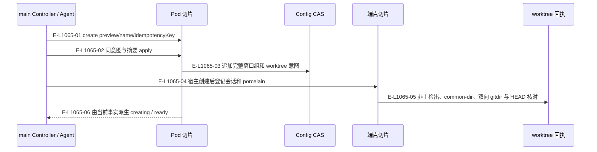
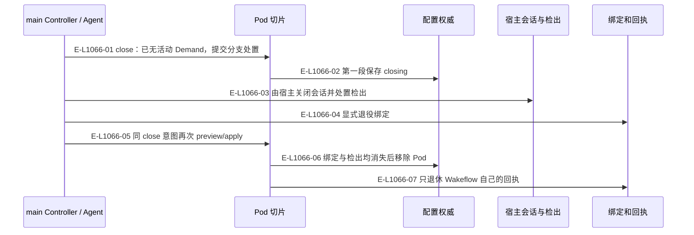

# Pod：创建、就绪与两段关闭

状态是派生结果，创建配置不代表实际窗口已经可用。

> 核验基线：`7ba1f38`；核验时实现代码均已提交，本轮图谱更新另列。开发阶段为 L1 九片已落地，observation 尚未开始。本文说明实现事实，未宣称双宿主真实会话已经验证。

## 创建与 worktree 登记

### 本图术语说明

| 术语 | 本图含义 |
| --- | --- |
| Pod | 完整窗口组与每仓执行位置；main 是 primary Pod。 |
| CAS | 比较已观察的摘要/修订后提交；来源已改变则拒绝。 |
| hook | 宿主回交的会话/提示提交/完成观察记录，保存在宿主本地根。 |

### 节点与实现定位

| 节点 | 文件 / 符号 | 责任 |
| --- | --- | --- |
| controller | Agent / 用户 / 外部效果或条件视图 | main Controller / Agent |
| pod | `src/capabilities/pod/service.ts` | Pod 切片 |
| config | `src/configuration/wakeflow-config-authority-replacement.ts` | Config CAS |
| endpoint | `src/capabilities/endpoint/service.ts` | 端点切片 |
| receipt | `src/kernel/pod-worktree-receipts.ts` | worktree 回执 |

### 本图边级证据

| 编号 | 代码定位 | 测试 / 核验 | 关系依据 |
| --- | --- | --- | --- |
| E-L1065-01 | `src/capabilities/pod/service.ts#planCreate` | `tests/capabilities/pod/service.test.ts` | create preview/name/idempotencyKey |
| E-L1065-02 | `src/capabilities/pod/service.ts#executePodRequest` | `tests/capabilities/pod/service.test.ts` | 同意图与摘要 apply |
| E-L1065-03 | `src/capabilities/pod/service.ts#applyCreate` | `tests/capabilities/pod/service.test.ts` | 追加完整窗口组和 worktree 意图 |
| E-L1065-04 | `src/capabilities/endpoint/service.ts#executeWindowBindingRequest` | `tests/capabilities/pod/service.test.ts` | 宿主创建后登记会话和 porcelain |
| E-L1065-05 | `src/kernel/pod-worktree-receipts.ts#admitPodWorktreeObservation` | `tests/capabilities/pod/service.test.ts` | 非主检出、common-dir、双向 gitdir 与 HEAD 核对 |
| E-L1065-06 | `src/capabilities/pod/decide.ts#derivePodState` | `tests/capabilities/pod/service.test.ts` | 由当前事实派生 creating / ready |

## 归档后两段关闭

### 本图术语说明

| 术语 | 本图含义 |
| --- | --- |
| Pod | 完整窗口组与每仓执行位置；main 是 primary Pod。 |
| CAS | 比较已观察的摘要/修订后提交；来源已改变则拒绝。 |
| host | Codex 或 Claude Code；真实会话动作由 Agent 调用宿主完成。 |

### 节点与实现定位

| 节点 | 文件 / 符号 | 责任 |
| --- | --- | --- |
| controller | Agent / 用户 / 外部效果或条件视图 | main Controller / Agent |
| pod | `src/capabilities/pod/service.ts` | Pod 切片 |
| config | `src/configuration/wakeflow-config-authority-replacement.ts` | 配置权威 |
| host | Agent / 用户 / 外部效果或条件视图 | 宿主会话与检出 |
| endpoint | `src/capabilities/endpoint/service.ts` | 绑定和回执 |

### 本图边级证据

| 编号 | 代码定位 | 测试 / 核验 | 关系依据 |
| --- | --- | --- | --- |
| E-L1066-01 | `src/capabilities/pod/decide.ts#deriveCloseRequestBlockers` | `tests/capabilities/pod/service.test.ts` | close：已无活动 Demand，提交分支处置 |
| E-L1066-02 | `src/capabilities/pod/service.ts#applyCloseRequest` | `tests/capabilities/pod/service.test.ts` | 第一段保存 closing |
| E-L1066-03 | `src/capabilities/pod/service.ts#planClose` | `tests/capabilities/pod/service.test.ts` | 由宿主关闭会话并处置检出 |
| E-L1066-04 | `src/capabilities/endpoint/service.ts#applyDecommission` | `tests/capabilities/pod/service.test.ts` | 显式退役绑定 |
| E-L1066-05 | `src/capabilities/pod/service.ts#executePodRequest` | `tests/capabilities/pod/service.test.ts` | 同 close 意图再次 preview/apply |
| E-L1066-06 | `src/capabilities/pod/service.ts#applyCloseComplete` | `tests/capabilities/pod/service.test.ts` | 绑定与检出均消失后移除 Pod |
| E-L1066-07 | `src/kernel/pod-worktree-receipts.ts#retirePodReceipts` | `tests/capabilities/pod/service.test.ts` | 只退休 Wakeflow 自己的回执 |

## 守卫、恢复与验证范围

primary 不可关闭。有活动 Demand、未交代分支、剩余绑定或仍存在检出时阻塞。recover 只对账过期或孤儿回执；全局 Pod 状态视图和残留报告仍待 observation。

涉及的测试与核验入口：

- `tests/capabilities/pod/service.test.ts`。

## 下钻与相关视图

- [本专题总览](./README.md)
- [图谱总索引](../README.md)
- [核验与剩余范围](../01-diagram-review-ledger.md)
