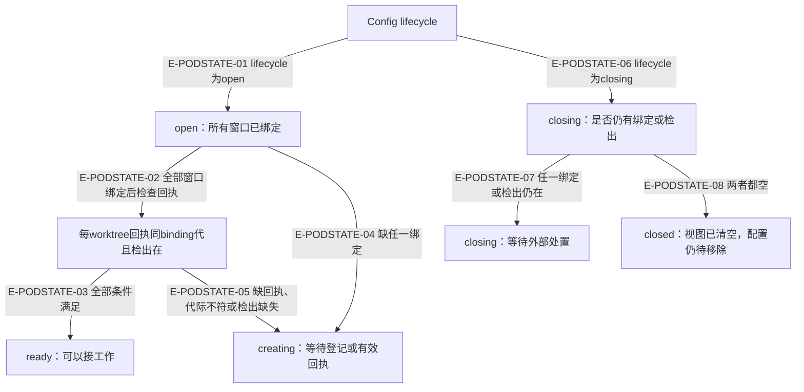
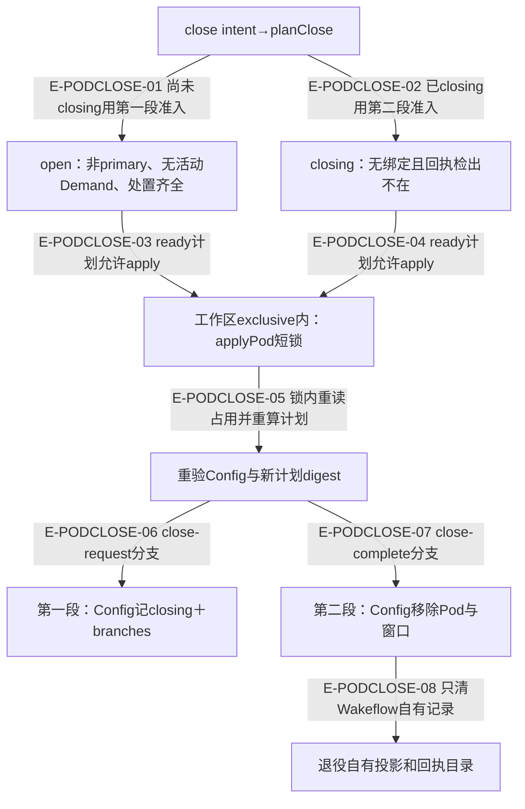

# Pod：派生状态、两段关闭与Pod锁

> 核验于 2026-10-03，基线 `d8fafff` 加当前未提交工作树。图表达实际源码分支，未提交实现标为进行中；不把开发阶段计划当作运行事实。来源与测试锚点按本文精确范围列出。

## 执行环境状态的纯派生

```mermaid
flowchart TB
  accTitle: 执行环境状态的纯派生
  accDescr: open或closing配置与当前绑定、回执和检出事实计算四种视图状态，视图转换本身不写配置。
  a["Config lifecycle"]
  o["open：所有窗口已绑定"]
  r["每worktree回执同binding代且检出在"]
  ready["ready：可以接工作"]
  creating["creating：等待登记或有效回执"]
  cl["closing：是否仍有绑定或检出"]
  busy["closing：等待外部处置"]
  done["closed：视图已清空，配置仍待移除"]
  a -->|"E-PODSTATE-01 lifecycle为open"| o
  o -->|"E-PODSTATE-02 全部窗口绑定后检查回执"| r
  r -->|"E-PODSTATE-03 全部条件满足"| ready
  o -->|"E-PODSTATE-04 缺任一绑定"| creating
  r -->|"E-PODSTATE-05 缺回执、代际不符或检出缺失"| creating
  a -->|"E-PODSTATE-06 lifecycle为closing"| cl
  cl -->|"E-PODSTATE-07 任一绑定或检出仍在"| busy
  cl -->|"E-PODSTATE-08 两者都空"| done
```

### 本图术语说明

| 术语 | 本图含义 |
| --- | --- |
| 派生 | 这些节点是视图分类，不是额外持久状态机。 |
| 同代 | receipt.bindingId等于worktree目标窗口当前Binding。 |
| closed | 还存在配置的closing Pod已经可进行第二段close；移除后结果pod为null。 |

### 节点与源码定位

| 节点 | 文件 / 符号 | 职责 |
| --- | --- | --- |
| a | `src/governance/pod/pod-state.ts#derivePodState` | Config lifecycle |
| o | `src/governance/pod/pod-state.ts#derivePodState` | open：所有窗口已绑定 |
| r | `src/governance/pod/pod-state.ts#worktreeReady` | 每worktree回执同binding代且检出在 |
| ready | `src/governance/pod/pod-state.ts#derivePodState` | ready：可以接工作 |
| creating | `src/governance/pod/pod-state.ts#derivePodState` | creating：等待登记或有效回执 |
| cl | `src/governance/pod/pod-state.ts#derivePodState` | closing：是否仍有绑定或检出 |
| busy | `src/governance/pod/pod-state.ts#derivePodState` | closing：等待外部处置 |
| done | `src/governance/pod/pod-state.ts#derivePodState` | closed：视图已清空，配置仍待移除 |

### 本图边级证据

| 编号 | 代码证据 | 测试证据 | 关系依据 |
| --- | --- | --- | --- |
| E-PODSTATE-01 | `src/governance/pod/pod-state.ts#derivePodState` | `tests/capabilities/pod/decide.test.ts#derivePodState` | lifecycle为open |
| E-PODSTATE-02 | `src/governance/pod/pod-state.ts#derivePodState` | `tests/capabilities/pod/decide.test.ts#derivePodState` | 全部窗口绑定后检查回执 |
| E-PODSTATE-03 | `src/governance/pod/pod-state.ts#derivePodState` | `tests/capabilities/pod/decide.test.ts#derivePodState` | 全部条件满足 |
| E-PODSTATE-04 | `src/governance/pod/pod-state.ts#derivePodState` | `tests/capabilities/pod/decide.test.ts#derivePodState` | 缺任一绑定 |
| E-PODSTATE-05 | `src/governance/pod/pod-state.ts#derivePodState` | `tests/capabilities/pod/decide.test.ts#derivePodState` | 缺回执、代际不符或检出缺失 |
| E-PODSTATE-06 | `src/governance/pod/pod-state.ts#derivePodState` | `tests/capabilities/pod/decide.test.ts#derivePodState` | lifecycle为closing |
| E-PODSTATE-07 | `src/governance/pod/pod-state.ts#derivePodState` | `tests/capabilities/pod/decide.test.ts#derivePodState` | 任一绑定或检出仍在 |
| E-PODSTATE-08 | `src/governance/pod/pod-state.ts#derivePodState` | `tests/capabilities/pod/decide.test.ts#derivePodState` | 两者都空 |

## 两段关闭与并发复验

```mermaid
flowchart TB
  accTitle: 两段关闭与并发复验
  accDescr: 第一段只记录closing及分支处置，第二段要求窗口和检出全清；apply先进入工作区exclusive，再在Pod短锁内复验。
  a["close intent→planClose"]
  b["open：非primary、无活动Demand、处置齐全"]
  c["closing：无绑定且回执检出不在"]
  l["工作区exclusive内：applyPod短锁"]
  v["重验Config与新计划digest"]
  first["第一段：Config记closing＋branches"]
  last["第二段：Config移除Pod与窗口"]
  r["退役自有投影和回执目录"]
  a -->|"E-PODCLOSE-01 尚未closing用第一段准入"| b
  a -->|"E-PODCLOSE-02 已closing用第二段准入"| c
  b -->|"E-PODCLOSE-03 ready计划允许apply"| l
  c -->|"E-PODCLOSE-04 ready计划允许apply"| l
  l -->|"E-PODCLOSE-05 锁内重读占用并重算计划"| v
  v -->|"E-PODCLOSE-06 close-request分支"| first
  v -->|"E-PODCLOSE-07 close-complete分支"| last
  last -->|"E-PODCLOSE-08 只清Wakeflow自有记录"| r
```

### 本图术语说明

| 术语 | 本图含义 |
| --- | --- |
| 分支处置 | Controller报告merged或abandoned；不通过此工具执行Git合并。 |
| 两段关闭 | 中间由Agent退役窗口并处置检出；不能把这个等待画成一次锁内操作。 |
| 并发复验 | Pod配置变更的exclusive阻挡shared运行；内部Pod锁再复验占用，不代表跨Pod配置变更可绕过exclusive。 |

### 节点与源码定位

| 节点 | 文件 / 符号 | 职责 |
| --- | --- | --- |
| a | `src/capabilities/pod/service.ts#planClose` | close intent→planClose |
| b | `src/capabilities/pod/decide.ts#deriveCloseRequestBlockers` | open：非primary、无活动Demand、处置齐全 |
| c | `src/capabilities/pod/decide.ts#deriveCloseCompleteBlockers` | closing：无绑定且回执检出不在 |
| l | `src/capabilities/pod/service.ts#applyPod` | exclusive范围内的Pod短锁 |
| v | `src/capabilities/pod/service.ts#applyPod` | 重验Config与新计划digest |
| first | `src/capabilities/pod/service.ts#applyCloseRequest` | 第一段：Config记closing＋branches |
| last | `src/capabilities/pod/service.ts#applyCloseComplete` | 第二段：Config移除Pod与窗口 |
| r | `src/capabilities/pod/service.ts#applyCloseComplete` | 退役自有投影和回执目录 |

### 本图边级证据

| 编号 | 代码证据 | 测试证据 | 关系依据 |
| --- | --- | --- | --- |
| E-PODCLOSE-01 | `src/capabilities/pod/service.ts#planClose` | `tests/capabilities/pod/service.test.ts#executePodRequest` | 尚未closing用第一段准入 |
| E-PODCLOSE-02 | `src/capabilities/pod/service.ts#planClose` | `tests/capabilities/pod/service.test.ts#executePodRequest` | 已closing用第二段准入 |
| E-PODCLOSE-03 | `src/capabilities/pod/service.ts#executePodRequest` | `tests/capabilities/pod/service.test.ts#executePodRequest` | ready计划允许apply |
| E-PODCLOSE-04 | `src/capabilities/pod/service.ts#executePodRequest` | `tests/capabilities/pod/service.test.ts#executePodRequest` | ready计划允许apply |
| E-PODCLOSE-05 | `src/capabilities/pod/service.ts#applyPod` | `tests/capabilities/demand/pod-concurrency.test.ts#executePodRequest` | 锁内重读占用并重算计划 |
| E-PODCLOSE-06 | `src/capabilities/pod/service.ts#applyPodLocked` | `tests/capabilities/pod/service.test.ts#executePodRequest` | close-request分支 |
| E-PODCLOSE-07 | `src/capabilities/pod/service.ts#applyPodLocked` | `tests/capabilities/pod/service.test.ts#executePodRequest` | close-complete分支 |
| E-PODCLOSE-08 | `src/capabilities/pod/service.ts#applyCloseComplete` | `tests/capabilities/pod/service.test.ts#executePodRequest` | 只清Wakeflow自有记录 |

## recover与残余边界

`src/capabilities/pod/service.ts#recoverPod`只做回执对账：配置无Pod时清孤儿私有目录；仍有Pod时退休检出已消失或bindingId不同代的回执。它不恢复配置事务，不创建/删除实际worktree；recover外层现在也进入工作区exclusive，但仍没有额外包入`src/kernel/pod-mutation-lock.ts#withPodMutation`或`src/governance/observation/active-projection-refresh.ts#afterMutationRefresh`。图只对apply声明内层Pod短锁与活动投影刷新。

`src/governance/pod/worktree-disposal.ts#worktreeDisposalGuidance`按宿主profile的worktree启动方式及登记时locked标记给unlock与remove建议，路径做POSIX引用和512字符限制。输出是建议文本；被截断的异常长路径需Agent从真实回执核对后执行。

并发测试区分两层：普通Demand创建使用shared并按Pod占用锁，同Pod竞争被pod-busy或plan-drift拒绝，不同Pod的Demand创建仍可并行；Pod工具改配置使用exclusive，需要等待在途shared操作。

## 继续阅读

[文件导入](./file-dependencies.md) · [运行分支](./runtime-call-flow.md) · [本模块总览](./README.md) · [全局入口](../README.md) · [本轮增量审阅](../../plans/review-2026-10-03/coordination.md) · [前轮完整审阅](../../plans/review-2026-10-02/coordination-evidence.md)
