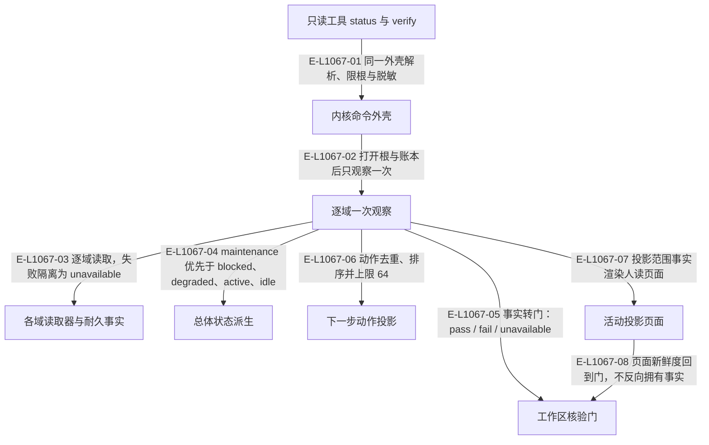

# Observation：一次全局观察、核验门与活动投影

observation 只读。两个公共工具 `wakeflow_status` 与 `wakeflow_verify` 走同一个内核命令外壳，对每个域各观察一次；总体状态、核验门、下一步动作和人读投影都是这次观察的派生结果，不新增任何业务权威。

> 核验基线：`1480271`（L1 observation 第十片已落地，20 个公共工具、18 个一次性场景）。工作树另有并行未提交改动（宿主 hook 通道等），本图不描绘；来源指纹按当前工作树计算。本文说明实现事实，未宣称双宿主真实会话已经验证。

## 一次观察如何派生状态、门与投影

### 本图术语说明

| 术语 | 本图含义 |
| --- | --- |
| observation | 宿主或环境回传的事实；观察不等于验收，也不授权业务结论。 |
| projection | 根据权威重建的视图，不反向决定事实。 |
| gate | 核验门：对一项事实的只读复验结果，分 pass、fail、unavailable。 |
| scope | 观察范围：`full` 含宿主与仓库指针，`projection` 只取渲染页面所需事实。 |
| unavailable | 该域这次读不到；与 fail 分开计数，不冒充通过。 |

### 节点与实现定位

| 节点 | 文件 / 符号 | 责任 |
| --- | --- | --- |
| tools | `src/capabilities/observation/contract.ts#STATUS_TOOL_REGISTRATION` | 只读工具 status 与 verify |
| shell | `src/kernel/command-shell.ts#runCommandShell` | 内核命令外壳 |
| observe | `src/governance/observation/workspace-observation.ts#observeWorkspace` | 逐域一次观察 |
| owners | `src/governance/observation/repository-pointer-observation.ts#observeRepositoryPointers` | 各域读取器与耐久事实 |
| overall | `src/governance/observation/workspace-observation.ts#deriveOverallStatus` | 总体状态派生 |
| gates | `src/capabilities/observation/decide.ts#deriveWorkspaceGates` | 工作区核验门 |
| actions | `src/capabilities/observation/decide.ts#deriveNextActions` | 下一步动作投影 |
| pages | `src/kernel/active-projection.ts#publishActiveProjection` | 活动投影页面 |

### 本图边级证据

| 编号 | 代码定位 | 测试 / 核验 | 关系依据 |
| --- | --- | --- | --- |
| E-L1067-01 | `src/capabilities/observation/service.ts#executeStatusRequest` | `tests/capabilities/observation/service.test.ts#executeStatusRequest` | 同一外壳解析、限根与脱敏 |
| E-L1067-02 | `src/governance/observation/workspace-observation.ts#observeWorkspace` | `tests/governance/observation/workspace-observation.test.ts#observeWorkspace` | 打开根与账本后只观察一次 |
| E-L1067-03 | `src/governance/observation/repository-pointer-observation.ts#observeRepositoryPointers` | `tests/governance/observation/repository-pointer-observation.test.ts#observeRepositoryPointers` | 逐域读取，失败隔离为 unavailable |
| E-L1067-04 | `src/governance/observation/workspace-observation.ts#deriveOverallStatus` | `tests/governance/observation/workspace-observation.test.ts#deriveOverallStatus` | maintenance 优先于 blocked、degraded、active、idle |
| E-L1067-05 | `src/capabilities/observation/decide.ts#deriveWorkspaceGates` | `tests/capabilities/observation/decide.test.ts#deriveWorkspaceGates` | 事实转门：pass / fail / unavailable |
| E-L1067-06 | `src/capabilities/observation/decide.ts#deriveNextActions` | `tests/capabilities/observation/decide.test.ts#deriveNextActions` | 动作去重、排序并上限 64 |
| E-L1067-07 | `src/governance/observation/active-projection-facts.ts#buildActiveProjectionFacts` | 间接覆盖：`tests/scenarios/wakeflow-scenario-acceptance.test.ts#scenarioActiveProjection`（没有测试直接导入 active-projection-facts.ts；渲染半段另见 `tests/kernel/active-projection.test.ts#renderActiveProjectionFiles`，事实由测试手工构造） | 投影范围事实渲染人读页面 |
| E-L1067-08 | `src/capabilities/observation/decide.ts#projectionFreshness` | `tests/capabilities/observation/decide.test.ts#projectionFreshness` | 页面新鲜度回到门，不反向拥有事实 |

## 权威、投影与观察的分责

| 角色 | 本切片中的对象 | 边界 |
| --- | --- | --- |
| 权威 | 配置快照、Demand 事件流、需求看板、工作声明、绑定与回执 | observation 只读它们，任何一个都不由本切片写入 |
| 投影 | `overall`、`nextActions`、核验门、`.wakeflow-active` 页面 | 全部可由权威重建；页面只是导航 |
| 观察 | 宿主 hook 通道、仓库指针文件、宿主资产与设置 | 观察到位不等于验收，读不到记为 unavailable |
| 策略 | `src/governance/observation/observation-policy.ts#WAKEFLOW_OBSERVATION_POLICY` | 结果回报生效常量本身，不在文档里另写一份 |

“测试 / 核验”列按 `testEvidence: anchored` 约定书写：锚定的符号必须在该测试文件里真实出现，否则写明 `间接覆盖：` 或 `未覆盖：`。在本基线，`src/governance/observation/active-projection-facts.ts` 与 `src/governance/observation/active-projection-refresh.ts` 没有任何测试直接导入，只在场景套件里被跑到；工作树里并行任务正在补直接用例，落地后应重新锚定。

`wakeflow_status` 带 `demandId` 时附当前 Route 或归档回执，因此旧的 `wakeflow_inspect_demand_route` 已在本基线删除；`wakeflow_verify` 带 `demandId` 时复用 Demand 切片的同一份门。

## 宿主接缝：Claude Code 状态栏

状态栏脚本的字节与摘要在 TypeScript 中生成，由两个维护操作安装：`claude-statusline-asset:install` 写入 0600 的资产，`claude-statusline-settings:install` 只改 `.claude/settings.local.json` 的单个键并保留其它键；设置读不出时该项贡献被阻塞而不是被覆盖。资产只打印一行“模型 · Pod · 窗口”，不打印工作区根或会话标识。Codex 没有对应资产。

## 守卫、恢复与验证范围

`status` 与 `verify` 不追加事件、不改配置、不创建会话，也不代表 Controller 验收。总体状态里 `maintenance` 表示布局本身需要维护，应先走维护事务再读其余结论；`blocked` 来自 Demand Route 处置或仍在 closing 的 Pod。活动投影是导航面：任一目标不安全时整轮零写，退休只针对每个文件都带标记的页目录。本轮图谱未复跑根测试与场景套件，实际宿主状态栏也未在真实会话中验证。

涉及的测试与核验入口：

- `tests/capabilities/observation/decide.test.ts`。
- `tests/capabilities/observation/service.test.ts`。
- `tests/governance/observation/repository-pointer-observation.test.ts`。
- `tests/governance/observation/workspace-observation.test.ts`。
- `tests/hosts/claude-code/claude-code-statusline-asset.test.ts`。
- `tests/kernel/active-projection.test.ts`。

## 下钻与相关视图

- [文件直接导入](./file-dependencies.md)
- [运行调用与恢复](./runtime-call-flow.md)
- [公共 MCP 与宿主接缝](../09-public-mcp-host-seams/README.md)
- [内核](../11-kernel/README.md)
- [Pod 执行环境](../15-pod/README.md)
- [图谱总索引](../README.md)
- [核验与剩余范围](../01-diagram-review-ledger.md)
