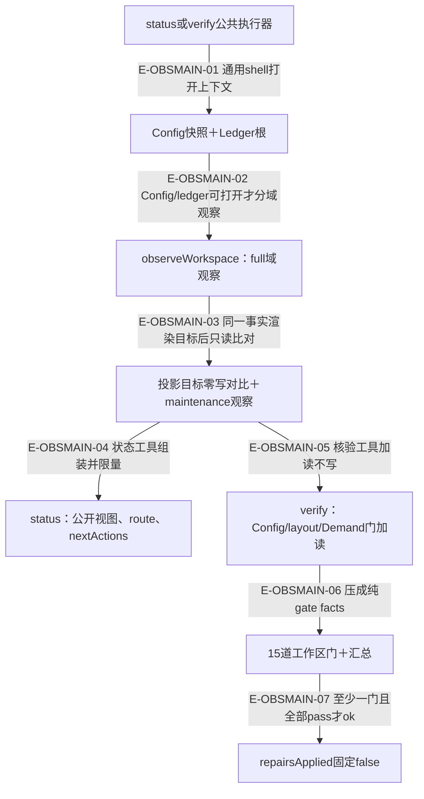

# Observation：一次观察、十五道门与知识边界

> 核验于 2026-10-03，基线 `d8fafff` 加当前未提交工作树。图表达实际源码分支，未提交实现标为进行中；不把开发阶段计划当作运行事实。来源与测试锚点按本文精确范围列出。

Observation提供只读状态v2、严格核验v2和投影事实；请求仍为v1。一次工具调用只构造一份工作区观察，各域失败显式隔离；它不是跨目录原子快照，也不修改运行权威。status和verify各自读取，不共享跨调用token。

## 一次观察，多种只读输出

```mermaid
flowchart TB
  accTitle: 一次观察，多种只读输出
  accDescr: 公共工具先打开配置和Ledger，再构造分域观察；状态输出和严格门集共享这次观察，verify仍做自己的只读复验。
  a["status或verify公共执行器"]
  c["Config快照＋Ledger根"]
  o["observeWorkspace：full域观察"]
  p["投影目标零写对比＋maintenance观察"]
  s["status：公开视图、route、nextActions"]
  v["verify：Config/layout/Demand门加读"]
  g["15道工作区门＋汇总"]
  n["repairsApplied固定false"]
  a -->|"E-OBSMAIN-01 通用shell打开上下文"| c
  c -->|"E-OBSMAIN-02 Config/ledger可打开才分域观察"| o
  o -->|"E-OBSMAIN-03 同一事实渲染目标后只读比对"| p
  p -->|"E-OBSMAIN-04 状态工具组装并限量"| s
  p -->|"E-OBSMAIN-05 核验工具加读不写"| v
  v -->|"E-OBSMAIN-06 压成纯gate facts"| g
  g -->|"E-OBSMAIN-07 至少一门且全部pass才ok"| n
```

### 本图术语说明

| 术语 | 本图含义 |
| --- | --- |
| 分域观察 | observed/value与unavailable/issue分开；空列表不是缺席证明。 |
| full | 含宿主Binding、hook、窗口投影、资产、仓库指针、归档评审。 |
| projection | 省略瞬时宿主、仓库、归档事实；活动页面采用此范围。 |
| 门 | pass/fail/unavailable；严格核验不实施修复。 |

### 节点与源码定位

| 节点 | 文件 / 符号 | 职责 |
| --- | --- | --- |
| a | `src/capabilities/observation/service.ts#executeStatusRequest` | status或verify公共执行器 |
| c | `src/capabilities/observation/service.ts#openContext` | Config快照＋Ledger根 |
| o | `src/governance/observation/workspace-observation.ts#observeWorkspace` | observeWorkspace：full域观察 |
| p | `src/capabilities/observation/service.ts#openContext` | 投影目标零写对比＋maintenance观察 |
| s | `src/capabilities/observation/service.ts#assembleStatus` | status：公开视图、route、nextActions |
| v | `src/capabilities/observation/service.ts#assembleVerify` | verify：Config/layout/Demand门加读 |
| g | `src/capabilities/observation/decide.ts#deriveWorkspaceGates` | 15道工作区门＋汇总 |
| n | `src/capabilities/observation/service.ts#assembleVerify` | repairsApplied固定false |

### 本图边级证据

| 编号 | 代码证据 | 测试证据 | 关系依据 |
| --- | --- | --- | --- |
| E-OBSMAIN-01 | `src/capabilities/observation/service.ts#executeStatusRequest` | `tests/capabilities/observation/service.test.ts#executeStatusRequest` | 通用shell打开上下文 |
| E-OBSMAIN-02 | `src/capabilities/observation/service.ts#openContext` | `tests/capabilities/observation/service.test.ts#executeStatusRequest` | Config/ledger可打开才分域观察 |
| E-OBSMAIN-03 | `src/capabilities/observation/service.ts#openContext` | `tests/capabilities/observation/service.test.ts#executeStatusRequest` | 同一事实渲染目标后只读比对 |
| E-OBSMAIN-04 | `src/capabilities/observation/service.ts#assembleStatus` | `tests/capabilities/observation/service.test.ts#executeStatusRequest` | 状态工具组装并限量 |
| E-OBSMAIN-05 | `src/capabilities/observation/service.ts#assembleVerify` | `tests/capabilities/observation/service.test.ts#executeVerifyRequest` | 核验工具加读不写 |
| E-OBSMAIN-06 | `src/capabilities/observation/service.ts#assembleVerify` | `tests/capabilities/observation/service.test.ts#executeVerifyRequest` | 压成纯gate facts |
| E-OBSMAIN-07 | `src/capabilities/observation/service.ts#assembleVerify` | `tests/capabilities/observation/service.test.ts#executeVerifyRequest` | 至少一门且全部pass才ok |

## 十五道工作区门的实际含义

| 门 | pass／fail／unavailable要点 |
| --- | --- |
| config-authority | 复读digest一致才pass；改变fail；读不出unavailable |
| local-layout | 静态reconcile预览ready且无步骤，加active layout current；维护残留会阻塞 |
| ledger-layout | requirements/transactions/archives固定容器current |
| board-consistency | skipped、索引漂移、claimed无根为问题；Demand集合不可读则unavailable |
| demand-root-audit | 活动Demand自身审计汇总；部分读不出不算健康 |
| append-candidates-clear | append候选与非活动Demand生命周期日志必须清空 |
| evidence-integrity | Demand验证提供的证据完整性结果；不因零记录绕过不可读域 |
| work-claims | orphan或不可读声明失败；无Demand集合无法判断orphan |
| host-hook-channel | 错模式/skipped失败、不可读unavailable；当前host目录缺席或0记录仅code提示 |
| window-identity | 未登记是pass并提示数量；未观察才unavailable |
| window-runtime-projection | Config＋Binding重算与每宿主文档一致；stale/missing/unsafe失败 |
| pod-execution-location | creating待登记、closing待处置只提示；主仓库不可读unavailable |
| host-settings-assets | 当前宿主资产精确字节与设置键一致；同伴宿主不适用 |
| active-projection | stale/missing/非手写unsafe失败；手写目标阻止整轮重写但门pass/handwritten |
| runtime-artifact | 当前服务启动/磁盘摘要不同fail；已注入adapter但任一摘要缺失，或已绑定窗口runtime无关联证据，均unavailable；无adapter且无已绑定窗口才not-applicable |

门的pass不等于所有窗口已启动、所有页面可重写或真实宿主会话测试通过。具体分支见`src/capabilities/observation/decide.ts#deriveWorkspaceGates`及下钻。

## 当前知识边界

Git观察仅读指针，不spawn Git；“已合并”只可推断为目标分支尖端等于另一当前分支HEAD，不能判断祖先提交。branches-incomplete保留未合并条目并标repositoryObserved=false。归档补读只针对仍在配置的worktree Pod，清单最多1024份、评审snapshot最多64份，skipped和unreadable分别可见。

`src/governance/observation/demand-archive-locator.ts#locateLatestDemandArchive`只校验公开摘要字段，不是完整归档包验收器。入口Config或Ledger根打开失败会整体拒绝，不能声称所有错误都分域降级。

[运行身份与观察器证据](./runtime-evidence.md) · [活动投影写入与恢复](./projection-recovery.md) · [Hook完整性](../11-kernel/hook-history.md)

## 继续阅读

[文件导入](./file-dependencies.md) · [运行分支](./runtime-call-flow.md) · [本模块总览](./README.md) · [全局入口](../README.md) · [本轮增量审阅](../../plans/review-2026-10-03/coordination.md) · [前轮完整审阅](../../plans/review-2026-10-02/coordination-evidence.md)
