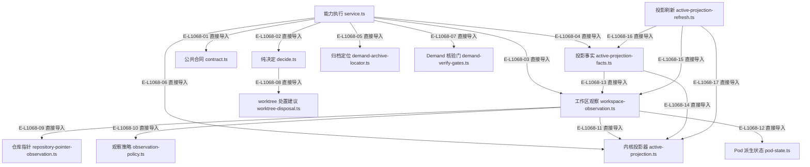

# Observation：文件直接导入

这是当前源码 AST 提取的审阅精选范围，只显示下表文件之间的真实直接导入。Foundation、合同与内核的公共闭包已折叠；此图不证明调用顺序。

> 核验基线：`1480271`（L1 observation 第十片已落地，20 个公共工具、18 个一次性场景）。工作树另有并行未提交改动（宿主 hook 通道等），本图不描绘；来源指纹按当前工作树计算。本文说明实现事实，未宣称双宿主真实会话已经验证。

## Observation 的精选直接导入

### 本图术语说明

| 术语 | 本图含义 |
| --- | --- |
| AST | 源码的语法树；直接导入自动提取，运行时调用顺序另行核实。 |
| 折叠闭包 | 图中未展开但真实存在的公共依赖，列在下方折叠清单。 |

### 节点与实现定位

| 节点 | 文件 / 符号 | 责任 |
| --- | --- | --- |
| f1 | `src/capabilities/observation/service.ts` | 能力执行 service.ts |
| f2 | `src/capabilities/observation/decide.ts` | 纯决定 decide.ts |
| f3 | `src/capabilities/observation/contract.ts` | 公共合同 contract.ts |
| f4 | `src/governance/observation/workspace-observation.ts` | 工作区观察 workspace-observation.ts |
| f5 | `src/governance/observation/active-projection-facts.ts` | 投影事实 active-projection-facts.ts |
| f6 | `src/governance/observation/active-projection-refresh.ts` | 投影刷新 active-projection-refresh.ts |
| f7 | `src/governance/observation/repository-pointer-observation.ts` | 仓库指针 repository-pointer-observation.ts |
| f8 | `src/governance/observation/observation-policy.ts` | 观察策略 observation-policy.ts |
| f9 | `src/governance/observation/demand-archive-locator.ts` | 归档定位 demand-archive-locator.ts |
| f10 | `src/kernel/active-projection.ts` | 内核投影器 active-projection.ts |
| f11 | `src/governance/demand/demand-verify-gates.ts` | Demand 核验门 demand-verify-gates.ts |
| f12 | `src/governance/pod/pod-state.ts` | Pod 派生状态 pod-state.ts |
| f13 | `src/governance/pod/worktree-disposal.ts` | worktree 处置建议 worktree-disposal.ts |

### 本图边级证据

| 编号 | 代码定位 | 测试 / 核验 | 关系依据 |
| --- | --- | --- | --- |
| E-L1068-01 | `src/capabilities/observation/service.ts` | `tests/capabilities/observation/service.test.ts#executeStatusRequest` | 直接导入 |
| E-L1068-02 | `src/capabilities/observation/service.ts` | `tests/capabilities/observation/service.test.ts#executeStatusRequest` | 直接导入 |
| E-L1068-03 | `src/capabilities/observation/service.ts` | `tests/capabilities/observation/service.test.ts#executeStatusRequest` | 直接导入 |
| E-L1068-04 | `src/capabilities/observation/service.ts` | `tests/capabilities/observation/service.test.ts#executeStatusRequest` | 直接导入 |
| E-L1068-05 | `src/capabilities/observation/service.ts` | `tests/capabilities/observation/service.test.ts#executeStatusRequest` | 直接导入 |
| E-L1068-06 | `src/capabilities/observation/service.ts` | `tests/capabilities/observation/service.test.ts#executeStatusRequest` | 直接导入 |
| E-L1068-07 | `src/capabilities/observation/service.ts` | `tests/capabilities/observation/service.test.ts#executeStatusRequest` | 直接导入 |
| E-L1068-08 | `src/capabilities/observation/decide.ts` | `tests/capabilities/observation/decide.test.ts#deriveWorkspaceGates` | 直接导入 |
| E-L1068-09 | `src/governance/observation/workspace-observation.ts` | `tests/governance/observation/workspace-observation.test.ts#observeWorkspace` | 直接导入 |
| E-L1068-10 | `src/governance/observation/workspace-observation.ts` | `tests/governance/observation/workspace-observation.test.ts#observeWorkspace` | 直接导入 |
| E-L1068-11 | `src/governance/observation/workspace-observation.ts` | `tests/governance/observation/workspace-observation.test.ts#observeWorkspace` | 直接导入 |
| E-L1068-12 | `src/governance/observation/workspace-observation.ts` | `tests/governance/observation/workspace-observation.test.ts#observeWorkspace` | 直接导入 |
| E-L1068-13 | `src/governance/observation/active-projection-facts.ts` | 间接覆盖：`tests/scenarios/wakeflow-scenario-acceptance.test.ts#scenarioActiveProjection`（没有测试直接导入该文件，导入关系由 check:structure 的导入校验核验） | 直接导入 |
| E-L1068-14 | `src/governance/observation/active-projection-facts.ts` | 间接覆盖：`tests/scenarios/wakeflow-scenario-acceptance.test.ts#scenarioActiveProjection`（没有测试直接导入该文件，导入关系由 check:structure 的导入校验核验） | 直接导入 |
| E-L1068-15 | `src/governance/observation/active-projection-refresh.ts` | 间接覆盖：`tests/scenarios/wakeflow-scenario-acceptance.test.ts#scenarioActiveProjection`（没有测试直接导入该文件，导入关系由 check:structure 的导入校验核验） | 直接导入 |
| E-L1068-16 | `src/governance/observation/active-projection-refresh.ts` | 间接覆盖：`tests/scenarios/wakeflow-scenario-acceptance.test.ts#scenarioActiveProjection`（没有测试直接导入该文件，导入关系由 check:structure 的导入校验核验） | 直接导入 |
| E-L1068-17 | `src/governance/observation/active-projection-refresh.ts` | 间接覆盖：`tests/scenarios/wakeflow-scenario-acceptance.test.ts#scenarioActiveProjection`（没有测试直接导入该文件，导入关系由 check:structure 的导入校验核验） | 直接导入 |

### 折叠清单

| 折叠范围 | 说明 |
| --- | --- |
| Foundation | `src/foundation/filesystem/*`、`crypto`、`time`、`numeric`、`text` 等根约束与确定性 I/O，被本图多数文件直接导入。 |
| 生成合同 | `src/contracts/generated/entrypoints/*` 四个 status / verify 合同，由对应 Schema 生成，合同权威仍在 Schema。 |
| 内核公共件 | `src/kernel/command-shell.ts`、`error.ts`、`layout.ts`、`next-projection.ts`、`requirement-board.ts`、`work-claims.ts`。 |
| 其它领域 owner | 配置快照、账本、Demand 事件流根权威、窗口绑定存储与 Controller Route，由 `workspace-observation.ts` 与 `service.ts` 直接导入。 |

## 守卫、恢复与验证范围

文件身份采用完整仓库相对路径；同名 service.ts、decide.ts 不靠文件名猜测。`active-projection-refresh.ts` 在本图内没有入边：它的调用方是各变更切片，那条关系属于运行调用图而不是本图范围。

涉及的测试与核验入口：

- `tests/capabilities/observation/decide.test.ts`。
- `tests/capabilities/observation/service.test.ts`。
- `tests/governance/observation/workspace-observation.test.ts`。
- `tests/kernel/active-projection.test.ts`。

## 下钻与相关视图

- [本专题总览](./README.md)
- [运行调用与恢复](./runtime-call-flow.md)
- [图谱总索引](../README.md)
- [核验与剩余范围](../01-diagram-review-ledger.md)
