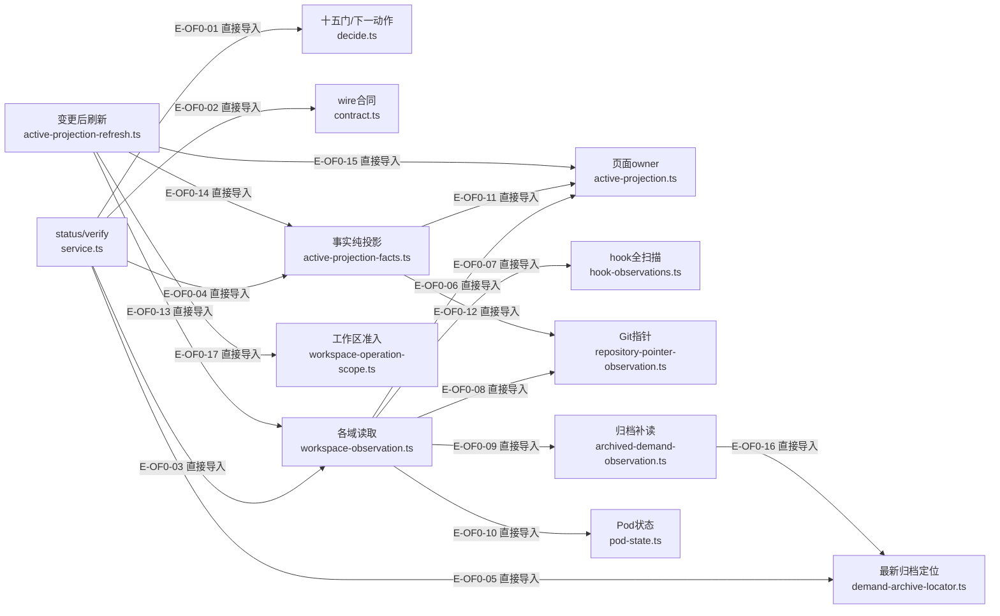

# Observation：读取、纯判断与独立刷新依赖

> 核验于 2026-10-03，基线 `d8fafff` 加当前未提交工作树。图表达实际源码分支，未提交实现标为进行中；不把开发阶段计划当作运行事实。来源与测试锚点按本文精确范围列出。

本图是从当前TypeScript AST选出的直接导入子图；每条边再对照已读源码用途。它只证明耦合方向，不证明调用顺序、状态转移或Agent授权。

## Observation：读取、纯判断与独立刷新依赖

```mermaid
flowchart LR
  accTitle: Observation：读取、纯判断与独立刷新依赖
  accDescr: 文件直接import关系的审阅精选视图，运行调用与状态分支在独立页面。
  f0["status/verify<br/>service.ts"]
  f1["十五门/下一动作<br/>decide.ts"]
  f2["wire合同<br/>contract.ts"]
  f3["各域读取<br/>workspace-observation.ts"]
  f4["事实纯投影<br/>active-projection-facts.ts"]
  f5["变更后刷新<br/>active-projection-refresh.ts"]
  f6["页面owner<br/>active-projection.ts"]
  f7["hook全扫描<br/>hook-observations.ts"]
  f8["Git指针<br/>repository-pointer-observation.ts"]
  f9["归档补读<br/>archived-demand-observation.ts"]
  f10["最新归档定位<br/>demand-archive-locator.ts"]
  f11["Pod状态<br/>pod-state.ts"]
  f12["工作区准入<br/>workspace-operation-scope.ts"]
  f0 -->|"E-OF0-01 直接导入"| f1
  f0 -->|"E-OF0-02 直接导入"| f2
  f0 -->|"E-OF0-03 直接导入"| f3
  f0 -->|"E-OF0-04 直接导入"| f4
  f0 -->|"E-OF0-05 直接导入"| f10
  f3 -->|"E-OF0-06 直接导入"| f6
  f3 -->|"E-OF0-07 直接导入"| f7
  f3 -->|"E-OF0-08 直接导入"| f8
  f3 -->|"E-OF0-09 直接导入"| f9
  f3 -->|"E-OF0-10 直接导入"| f11
  f4 -->|"E-OF0-11 直接导入"| f6
  f4 -->|"E-OF0-12 直接导入"| f8
  f5 -->|"E-OF0-13 直接导入"| f3
  f5 -->|"E-OF0-14 直接导入"| f4
  f5 -->|"E-OF0-15 直接导入"| f6
  f9 -->|"E-OF0-16 直接导入"| f10
  f5 -->|"E-OF0-17 直接导入"| f12
```

### 本图术语说明

| 术语 | 本图含义 |
| --- | --- |
| 直接导入 | 包含实际import或显式re-export；类型依赖同样算结构依赖。 |
| 精选范围 | 按模块入口裁剪；被省略的依赖仍在逐文件台账和全局导入数据中。 |

### 节点与源码定位

| 节点 | 文件 / 符号 | 职责 |
| --- | --- | --- |
| f0 | `src/capabilities/observation/service.ts` | status/verify service.ts |
| f1 | `src/capabilities/observation/decide.ts` | 十五门/下一动作 decide.ts |
| f2 | `src/capabilities/observation/contract.ts` | wire合同 contract.ts |
| f3 | `src/governance/observation/workspace-observation.ts` | 各域读取 workspace-observation.ts |
| f4 | `src/governance/observation/active-projection-facts.ts` | 事实纯投影 active-projection-facts.ts |
| f5 | `src/governance/observation/active-projection-refresh.ts` | 变更后刷新 active-projection-refresh.ts |
| f6 | `src/kernel/active-projection.ts` | 页面owner active-projection.ts |
| f7 | `src/kernel/hook-observations.ts` | hook全扫描 hook-observations.ts |
| f8 | `src/governance/observation/repository-pointer-observation.ts` | Git指针 repository-pointer-observation.ts |
| f9 | `src/governance/observation/archived-demand-observation.ts` | 归档补读 archived-demand-observation.ts |
| f10 | `src/governance/observation/demand-archive-locator.ts` | 最新归档定位 demand-archive-locator.ts |
| f11 | `src/governance/pod/pod-state.ts` | Pod状态 pod-state.ts |
| f12 | `src/kernel/workspace-operation-scope.ts` | 工作区shared准入 |

### 本图边级证据

| 编号 | 代码证据 | 测试证据 | 关系依据 |
| --- | --- | --- | --- |
| E-OF0-01 | `src/capabilities/observation/service.ts` | 未覆盖：此边是静态导入，由源码 AST 校验；运行测试不代替导入证据 | 直接导入 |
| E-OF0-02 | `src/capabilities/observation/service.ts` | 未覆盖：此边是静态导入，由源码 AST 校验；运行测试不代替导入证据 | 直接导入 |
| E-OF0-03 | `src/capabilities/observation/service.ts` | 未覆盖：此边是静态导入，由源码 AST 校验；运行测试不代替导入证据 | 直接导入 |
| E-OF0-04 | `src/capabilities/observation/service.ts` | 未覆盖：此边是静态导入，由源码 AST 校验；运行测试不代替导入证据 | 直接导入 |
| E-OF0-05 | `src/capabilities/observation/service.ts` | 未覆盖：此边是静态导入，由源码 AST 校验；运行测试不代替导入证据 | 直接导入 |
| E-OF0-06 | `src/governance/observation/workspace-observation.ts` | 未覆盖：此边是静态导入，由源码 AST 校验；运行测试不代替导入证据 | 直接导入 |
| E-OF0-07 | `src/governance/observation/workspace-observation.ts` | 未覆盖：此边是静态导入，由源码 AST 校验；运行测试不代替导入证据 | 直接导入 |
| E-OF0-08 | `src/governance/observation/workspace-observation.ts` | 未覆盖：此边是静态导入，由源码 AST 校验；运行测试不代替导入证据 | 直接导入 |
| E-OF0-09 | `src/governance/observation/workspace-observation.ts` | 未覆盖：此边是静态导入，由源码 AST 校验；运行测试不代替导入证据 | 直接导入 |
| E-OF0-10 | `src/governance/observation/workspace-observation.ts` | 未覆盖：此边是静态导入，由源码 AST 校验；运行测试不代替导入证据 | 直接导入 |
| E-OF0-11 | `src/governance/observation/active-projection-facts.ts` | 未覆盖：此边是静态导入，由源码 AST 校验；运行测试不代替导入证据 | 直接导入 |
| E-OF0-12 | `src/governance/observation/active-projection-facts.ts` | 未覆盖：此边是静态导入，由源码 AST 校验；运行测试不代替导入证据 | 直接导入 |
| E-OF0-13 | `src/governance/observation/active-projection-refresh.ts` | 未覆盖：此边是静态导入，由源码 AST 校验；运行测试不代替导入证据 | 直接导入 |
| E-OF0-14 | `src/governance/observation/active-projection-refresh.ts` | 未覆盖：此边是静态导入，由源码 AST 校验；运行测试不代替导入证据 | 直接导入 |
| E-OF0-15 | `src/governance/observation/active-projection-refresh.ts` | 未覆盖：此边是静态导入，由源码 AST 校验；运行测试不代替导入证据 | 直接导入 |
| E-OF0-16 | `src/governance/observation/archived-demand-observation.ts` | 未覆盖：此边是静态导入，由源码 AST 校验；运行测试不代替导入证据 | 直接导入 |
| E-OF0-17 | `src/governance/observation/active-projection-refresh.ts` | 未覆盖：静态导入由源码AST校验；运行测试不代替导入证据 | 直接导入 |

## 阅读边界

读工具导入事实转换器，但不导入refresh模块。刷新由其他变更owner调用；这条方向保证status/verify不借读操作修复页面。

Schema是可移植wire源；`tooling/codegen/schema-types.ts`生成`src/contracts/generated/identity/wakeflow-durable-id-kind.generated.ts`等派生合同。生成文件只核实来源与生成链，不计作手写文件语义审阅；`package.json`的schema:build/schema:check负责生成与漂移检测。

## 继续阅读

[文件导入](./file-dependencies.md) · [运行分支](./runtime-call-flow.md) · [本模块总览](./README.md) · [全局入口](../README.md) · [本轮增量审阅](../../plans/review-2026-10-03/coordination.md) · [前轮完整审阅](../../plans/review-2026-10-02/coordination-evidence.md)
