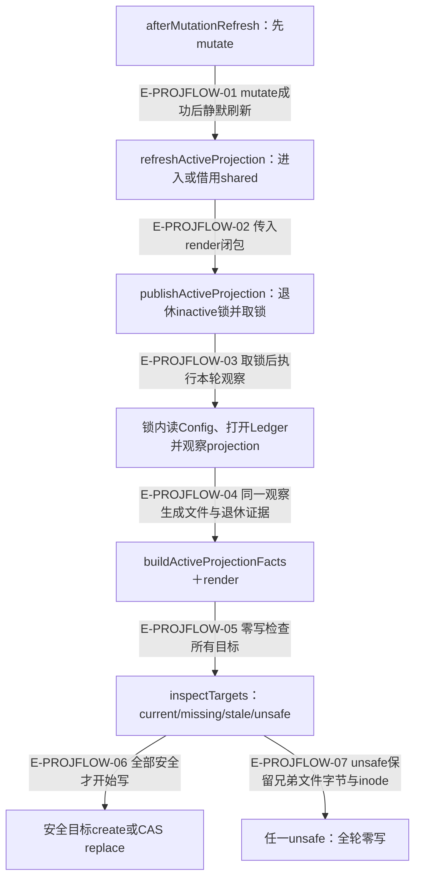
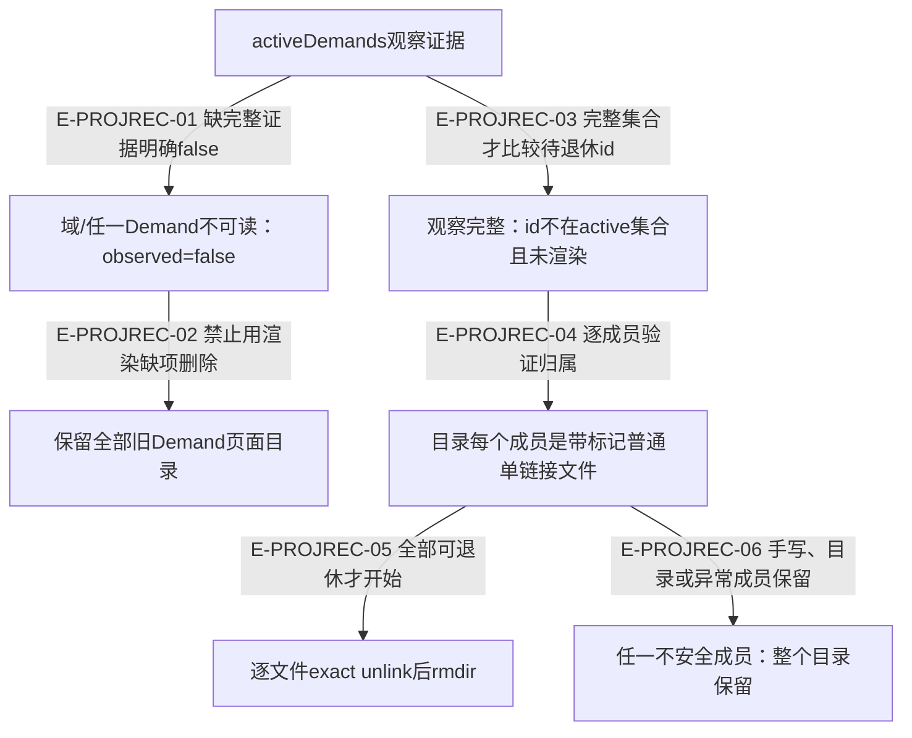

# 活动投影：提交后刷新、完整观察与安全退休

> 核验于 2026-10-03，基线 `d8fafff` 加当前未提交工作树。图表达实际源码分支，未提交实现标为进行中；不把开发阶段计划当作运行事实。来源与测试锚点按本文精确范围列出。

活动页面是可重建的导航。文件存在不证明Demand健康，页面缺项也不证明Demand已归档；删除页面需要本轮正面的完整观察证据。

## 刷新调用：先提交权威，再锁内观察和发布

### 本图术语说明

| 术语 | 本图含义 |
| --- | --- |
| 静默刷新 | 仅吞已归类环境错误；unexpected或非Wakeflow编程错误仍抛。 |
| CAS | 每目标以读到的节点和摘要替换；整组不是原子文件事务。 |
| 锁内观察 | 先取得workspace shared，再取publisher锁；Config快照、Ledger打开和Demand等事实全部在publisher锁内，旧配置不通过闭包带入。 |

### 节点与源码定位

| 节点 | 文件 / 符号 | 职责 |
| --- | --- | --- |
| m | `src/governance/observation/active-projection-refresh.ts#afterMutationRefresh` | afterMutationRefresh：先mutate |
| r | `src/governance/observation/active-projection-refresh.ts#refreshActiveProjection` | 进入或借用shared |
| l | `src/kernel/active-projection.ts#publishActiveProjection` | publishActiveProjection：退休inactive锁并取锁 |
| o | `src/governance/observation/active-projection-refresh.ts#refreshActiveProjection` | publisher回调中读Config、开Ledger再renderRound |
| f | `src/governance/observation/active-projection-refresh.ts#renderRound` | buildActiveProjectionFacts＋render |
| i | `src/kernel/active-projection.ts#publishLocked` | inspectTargets：current/missing/stale/unsafe |
| w | `src/kernel/active-projection.ts#writeTargets` | 安全目标create或CAS replace |
| x | `src/kernel/active-projection.ts#publishLocked` | 任一unsafe：全轮零写 |

### 本图边级证据

| 编号 | 代码证据 | 测试证据 | 关系依据 |
| --- | --- | --- | --- |
| E-PROJFLOW-01 | `src/governance/observation/active-projection-refresh.ts#afterMutationRefresh` | `tests/governance/observation/active-projection-facts.test.ts#afterMutationRefresh` | mutate成功后静默刷新 |
| E-PROJFLOW-02 | `src/governance/observation/active-projection-refresh.ts#refreshActiveProjection` | `tests/governance/observation/active-projection-facts.test.ts#refreshActiveProjection` | 传入render闭包 |
| E-PROJFLOW-03 | `src/governance/observation/active-projection-refresh.ts#refreshActiveProjection`、`src/kernel/active-projection.ts#renderAndPublishLocked` | `tests/capabilities/workspace/operation-scope.test.ts#refreshActiveProjection` | 锁内重读Config和Ledger；在途投影阻挡维护换配置 |
| E-PROJFLOW-04 | `src/governance/observation/active-projection-refresh.ts#renderRound` | `tests/governance/observation/active-projection-facts.test.ts#buildActiveProjectionFacts` | 同一观察生成文件与退休证据 |
| E-PROJFLOW-05 | `src/kernel/active-projection.ts#publishLocked` | `tests/kernel/active-projection.test.ts#publishActiveProjection` | 零写检查所有目标 |
| E-PROJFLOW-06 | `src/kernel/active-projection.ts#publishLocked` | `tests/kernel/active-projection.test.ts#publishActiveProjection` | 全部安全才开始写 |
| E-PROJFLOW-07 | `src/kernel/active-projection.ts#publishLocked` | `tests/kernel/active-projection.test.ts#publishActiveProjection` | unsafe保留兄弟文件字节与inode |

## 页面退休与崩溃恢复：不能从缺项推导删除

### 本图术语说明

| 术语 | 本图含义 |
| --- | --- |
| observed | demands域成功且其中每个Demand可读，不等同渲染结果非空。 |
| 标记 | wakeflow active/demand projection v1加摘要；证明文件由投影器接管。 |
| 保留 | 内容未知时不推断为inactive；页面同时显示覆盖不全提示。 |

### 节点与源码定位

| 节点 | 文件 / 符号 | 职责 |
| --- | --- | --- |
| a | `src/governance/observation/active-projection-facts.ts#demandEvidenceOf` | activeDemands观察证据 |
| u | `src/governance/observation/active-projection-facts.ts#demandEvidenceOf` | 域/任一Demand不可读：observed=false |
| k | `src/kernel/active-projection.ts#retireInactiveDemandProjections` | 保留全部旧Demand页面目录 |
| c | `src/kernel/active-projection.ts#retireInactiveDemandProjections` | 观察完整：id不在active集合且未渲染 |
| m | `src/kernel/active-projection.ts#retirableMembers` | 目录每个成员是带标记普通单链接文件 |
| d | `src/kernel/active-projection.ts#retireDemandProjection` | 逐文件exact unlink后rmdir |
| s | `src/kernel/active-projection.ts#retireDemandProjection` | 任一不安全成员：整个目录保留 |

### 本图边级证据

| 编号 | 代码证据 | 测试证据 | 关系依据 |
| --- | --- | --- | --- |
| E-PROJREC-01 | `src/governance/observation/active-projection-facts.ts#demandEvidenceOf` | `tests/governance/observation/active-projection-facts.test.ts#buildActiveProjectionFacts` | 缺完整证据明确false |
| E-PROJREC-02 | `src/kernel/active-projection.ts#retireInactiveDemandProjections` | `tests/kernel/active-projection.test.ts#publishActiveProjection` | 禁止用渲染缺项删除 |
| E-PROJREC-03 | `src/kernel/active-projection.ts#retireInactiveDemandProjections` | `tests/kernel/active-projection.test.ts#publishActiveProjection` | 完整集合才比较待退休id |
| E-PROJREC-04 | `src/kernel/active-projection.ts#retireDemandProjection` | `tests/kernel/active-projection.test.ts#publishActiveProjection` | 逐成员验证归属 |
| E-PROJREC-05 | `src/kernel/active-projection.ts#retireDemandProjection` | `tests/kernel/active-projection.test.ts#publishActiveProjection` | 全部可退休才开始 |
| E-PROJREC-06 | `src/kernel/active-projection.ts#retireDemandProjection` | `tests/kernel/active-projection.test.ts#publishActiveProjection` | 手写、目录或异常成员保留 |

## 配置切换不能超越在途投影

维护先取得自己的gate，再请求exclusive；已经进入的shared刷新可完成并释放，新的writer看见维护预留后不得入场。维护激活新配置后，自己的刷新从exclusive借用shared，在publisher锁内重读新配置。聚焦交错测试暂停旧轮打开Ledger，确认维护不能先换配置，最后页面仅包含新配置摘要。

## 恢复与取消

正常刷新和维护recover都能退休已证明inactive的projector锁。锁与workspace index同目录，所以锁退休声明关联index stage；stage结算在投影锁内，不与另一写者的活动stage竞争。active或unknown锁不被退休。`src/kernel/active-projection.ts#publishActiveProjection`遇锁争用返回可重试projection-contended。

`src/governance/observation/active-projection-refresh.ts#afterMutationRefresh`在mutation前看到取消则拒绝；mutation已返回后刷新取消只跳过可重建页面，不否定返回结果。后续next或回读仍可独立报错，不能把这个局部保证扩大成“整个公共工具永不在提交后失败”。

每份页面上限8MiB、0600，目录0700。投影指纹有意忽略宿主session、当前检出存在性、仓库分支及归档范围；这些由full status读取，不让外部Git动作永久把页面判stale。

## 继续阅读

[文件导入](./file-dependencies.md) · [运行分支](./runtime-call-flow.md) · [本模块总览](./README.md) · [全局入口](../README.md) · [本轮增量审阅](../../plans/review-2026-10-03/coordination.md) · [前轮完整审阅](../../plans/review-2026-10-02/coordination-evidence.md)
