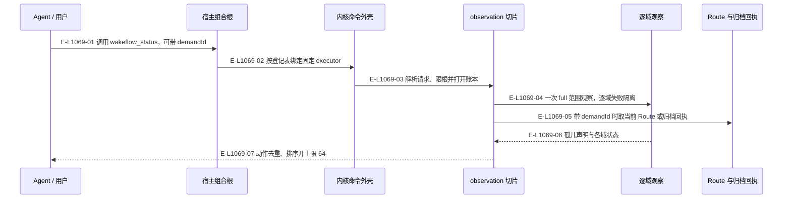
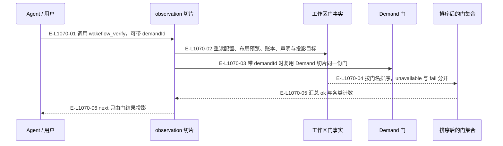
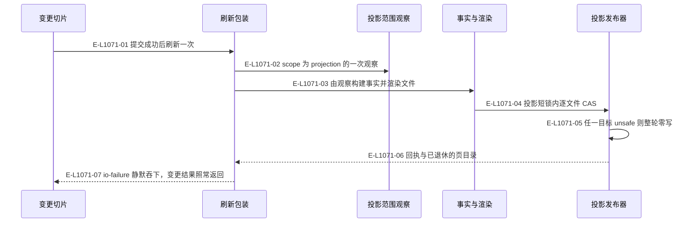

# Observation：status、verify 与活动投影刷新

三条真实调用链：读一次工作区、把事实转成门、在每次变更后重写人读页面。三者都不写业务权威。

> 核验基线：`1480271`（L1 observation 第十片已落地，20 个公共工具、18 个一次性场景）。工作树另有并行未提交改动（宿主 hook 通道等），本图不描绘；来源指纹按当前工作树计算。本文说明实现事实，未宣称双宿主真实会话已经验证。

## status：一次观察出全部结论

### 本图术语说明

| 术语 | 本图含义 |
| --- | --- |
| 组合根 | 固定宿主装配：注入宿主画像与 facade，再绑定公共工具执行器。 |
| scope | 观察范围：`full` 含宿主与仓库指针，`projection` 只取渲染页面所需事实。 |
| 孤儿声明 | 持有者不是活动 Demand，或窗口当前绑定不是声明记下的那一代。 |
| Route | Demand 当前的下一责任派生视图，由治理层 Controller Route 生成。 |

### 节点与实现定位

| 节点 | 文件 / 符号 | 责任 |
| --- | --- | --- |
| agent | Agent / 用户 / 外部效果或条件视图 | Agent / 用户 |
| entry | `src/entrypoints/claude-code-wakeflow-mcp.ts#createClaudeCodeWakeflowMcpServer` | 宿主组合根 |
| shell | `src/kernel/command-shell.ts#runCommandShell` | 内核命令外壳 |
| service | `src/capabilities/observation/service.ts#executeStatusRequest` | observation 切片 |
| observe | `src/governance/observation/workspace-observation.ts#observeWorkspace` | 逐域观察 |
| archive | `src/governance/observation/demand-archive-locator.ts#locateLatestDemandArchive` | Route 与归档回执 |

### 本图边级证据

| 编号 | 代码定位 | 测试 / 核验 | 关系依据 |
| --- | --- | --- | --- |
| E-L1069-01 | `src/entrypoints/claude-code-wakeflow-mcp.ts#createClaudeCodeWakeflowMcpServer` | `tests/entrypoints/wakeflow-public-mcp-catalog.test.ts#createClaudeCodeWakeflowMcpServer` | 调用 wakeflow_status，可带 demandId |
| E-L1069-02 | `src/entrypoints/wakeflow-public-mcp-catalog.ts#WAKEFLOW_PUBLIC_MCP_EXECUTOR_FIELDS` | `tests/entrypoints/wakeflow-public-mcp-catalog-binding.test.ts#WAKEFLOW_PUBLIC_MCP_EXECUTOR_FIELDS` | 按登记表绑定固定 executor |
| E-L1069-03 | `src/capabilities/observation/service.ts#executeStatusRequest` | `tests/capabilities/observation/service.test.ts#executeStatusRequest` | 解析请求、限根并打开账本 |
| E-L1069-04 | `src/governance/observation/workspace-observation.ts#observeWorkspace` | `tests/governance/observation/workspace-observation.test.ts#observeWorkspace` | 一次 full 范围观察，逐域失败隔离 |
| E-L1069-05 | `src/governance/observation/demand-archive-locator.ts#locateLatestDemandArchive` | 间接覆盖：`tests/capabilities/observation/service.test.ts#executeStatusRequest`（归档 Demand 用例经 status 走到定位器；定位器本身没有直接测试） | 带 demandId 时取当前 Route 或归档回执 |
| E-L1069-06 | `src/governance/observation/workspace-observation.ts#orphanWorkClaims` | `tests/governance/observation/workspace-observation.test.ts#orphanWorkClaims` | 孤儿声明与各域状态 |
| E-L1069-07 | `src/capabilities/observation/decide.ts#deriveNextActions` | `tests/capabilities/observation/decide.test.ts#deriveNextActions` | 动作去重、排序并上限 64 |

`unmergedAccepted` 同在这次结果里：只列出已接受结果中分支仍在、且尖端与当前检出尖端不同的项，并带 `acceptedAt` 与 `repositoryObserved`；仓库未观察时不改判为已合并。证据见 `src/governance/observation/active-projection-facts.ts#unmergedAcceptedFacts` 与 `tests/capabilities/observation/service.test.ts#executeStatusRequest`（该用例直接断言 unmergedAccepted 与 repositoryObserved）。

## verify：事实转成排序后的门

### 本图术语说明

| 术语 | 本图含义 |
| --- | --- |
| gate | 核验门：对一项事实的只读复验结果，分 pass、fail、unavailable。 |
| unavailable | 该项这次读不到；与 fail 分开计数，不冒充通过。 |
| 布局预览 | 静态物化的只读预览，用来判断本地布局门，不写任何文件。 |

### 节点与实现定位

| 节点 | 文件 / 符号 | 责任 |
| --- | --- | --- |
| agent | Agent / 用户 / 外部效果或条件视图 | Agent / 用户 |
| service | `src/capabilities/observation/service.ts#executeVerifyRequest` | observation 切片 |
| facts | `src/capabilities/observation/service.ts#gateFacts` | 工作区门事实 |
| demand | `src/governance/demand/demand-verify-gates.ts#evaluateVerifyGates` | Demand 门 |
| gates | `src/capabilities/observation/decide.ts#deriveWorkspaceGates` | 排序后的门集合 |

### 本图边级证据

| 编号 | 代码定位 | 测试 / 核验 | 关系依据 |
| --- | --- | --- | --- |
| E-L1070-01 | `src/capabilities/observation/service.ts#executeVerifyRequest` | `tests/capabilities/observation/service.test.ts#executeVerifyRequest` | 调用 wakeflow_verify，可带 demandId |
| E-L1070-02 | `src/capabilities/observation/service.ts#gateFacts` | 间接覆盖：`tests/capabilities/observation/service.test.ts#executeVerifyRequest`（gateFacts 是切片内未导出的取事实函数，只能经 verify 用例走到） | 重读配置、布局预览、账本、声明与投影目标 |
| E-L1070-03 | `src/governance/demand/demand-verify-gates.ts#evaluateVerifyGates` | `tests/governance/demand/demand-research-completion.test.ts#evaluateVerifyGates` | 带 demandId 时复用 Demand 切片同一份门 |
| E-L1070-04 | `src/capabilities/observation/decide.ts#deriveWorkspaceGates` | `tests/capabilities/observation/decide.test.ts#deriveWorkspaceGates` | 按门名排序，unavailable 与 fail 分开 |
| E-L1070-05 | `src/capabilities/observation/decide.ts#summarizeGates` | `tests/capabilities/observation/decide.test.ts#summarizeGates` | 汇总 ok 与各类计数 |
| E-L1070-06 | `src/capabilities/observation/decide.ts#verifyNext` | `tests/capabilities/observation/decide.test.ts#verifyNext` | next 只由门结果投影 |

## 活动投影：每次变更后的重写与恢复

### 本图术语说明

| 术语 | 本图含义 |
| --- | --- |
| CAS | 比较已观察的摘要/修订后提交；来源已改变则拒绝。 |
| 标记 | 页面首行的 `wakeflow:…-projection:v1:sha256:<指纹>` 注释；没有标记即视为手写。 |
| unsafe | 符号链接、非普通文件、多硬链接、模式或属主不符、超限、读失败或手写。 |
| 退休 | 不再活动的 Demand 页目录，只有每个文件都带标记时才移除。 |

### 节点与实现定位

| 节点 | 文件 / 符号 | 责任 |
| --- | --- | --- |
| mutate | `src/capabilities/pod/service.ts`（八个调用文件之一，取作代表） | 变更切片 |
| refresh | `src/governance/observation/active-projection-refresh.ts#afterMutationRefresh` | 刷新包装 |
| observe | `src/governance/observation/active-projection-refresh.ts#refreshActiveProjection` | 投影范围观察 |
| render | `src/kernel/active-projection.ts#renderActiveProjectionFiles` | 事实与渲染 |
| publish | `src/kernel/active-projection.ts#publishActiveProjection` | 投影发布器 |

本基线下 `afterMutationRefresh` 有八个调用文件：`src/capabilities/demand/service.ts`、`src/capabilities/demand/lifecycle.ts`、`src/capabilities/tasking/service.ts`、`src/capabilities/delivery/service.ts`、`src/capabilities/result-review/service.ts`、`src/capabilities/evidence/service.ts`、`src/capabilities/pod/service.ts` 与 `src/capabilities/workspace/maintain-workspace.ts`（共十三个调用点）。图中 mutate 只取 pod 切片作代表，不表示只有它在提交后刷新。

### 本图边级证据

| 编号 | 代码定位 | 测试 / 核验 | 关系依据 |
| --- | --- | --- | --- |
| E-L1071-01 | `src/governance/observation/active-projection-refresh.ts#afterMutationRefresh` | 间接覆盖：`tests/scenarios/wakeflow-scenario-acceptance.test.ts#scenarioActiveProjection`（登记一份受管证据这次变更之后四份页面被重写；包装函数没有单元测试） | 提交成功后刷新一次 |
| E-L1071-02 | `src/governance/observation/active-projection-refresh.ts#refreshActiveProjection` | 间接覆盖：`tests/governance/observation/workspace-observation.test.ts#observeWorkspace`（projection 作用域裁掉绑定、hook、资产与仓库指针在观察层直接断言；刷新入口本身没有直接测试） | scope 为 projection 的一次观察 |
| E-L1071-03 | `src/governance/observation/active-projection-facts.ts#buildActiveProjectionFacts` | 间接覆盖：`tests/kernel/active-projection.test.ts#renderActiveProjectionFiles`（渲染半段用手工构造的事实直接断言；观察转事实这一段只在场景里跑到） | 由观察构建事实并渲染文件 |
| E-L1071-04 | `src/kernel/active-projection.ts#publishActiveProjection` | `tests/kernel/active-projection.test.ts#publishActiveProjection` | 投影短锁内逐文件 CAS |
| E-L1071-05 | `src/kernel/active-projection.ts#inspectActiveProjectionTargets` | `tests/kernel/active-projection.test.ts#inspectActiveProjectionTargets` | 任一目标 unsafe 则整轮零写 |
| E-L1071-06 | `src/kernel/active-projection.ts#ActiveProjectionPublicationReceipt` | `tests/kernel/active-projection.test.ts#publishActiveProjection` | 回执与已退休的页目录 |
| E-L1071-07 | `src/governance/observation/active-projection-refresh.ts#refreshActiveProjectionQuietly` | 未覆盖：没有任何用例让刷新以 io-failure 失败再检查变更结果照常返回；场景只覆盖 unsafe 整轮零写这条路径 | io-failure 静默吞下，变更结果照常返回 |

## 守卫、恢复与验证范围

投影刷新是变更之后的附加动作：它失败不回滚已提交的变更，也不把变更判为失败；中止与非 `io-failure` 错误仍然上抛。投影页面不是权威，机器记录才是；页面陈旧或缺失由 verify 的投影门报出，而不是由页面自己修正。`status` 与 `verify` 都不创建会话、不发送、不追加事件。本轮图谱未复跑根测试与场景套件。

涉及的测试与核验入口：

- `tests/capabilities/observation/decide.test.ts`。
- `tests/capabilities/observation/service.test.ts`。
- `tests/entrypoints/wakeflow-public-mcp-catalog.test.ts` 与 `tests/entrypoints/wakeflow-public-mcp-catalog-binding.test.ts`。
- `tests/governance/demand/demand-research-completion.test.ts`。
- `tests/governance/observation/workspace-observation.test.ts`。
- `tests/kernel/active-projection.test.ts`。
- `tests/scenarios/wakeflow-scenario-acceptance.test.ts`（场景套件；本轮未复跑）。

本图的“测试 / 核验”列按 `testEvidence: anchored` 约定书写：要么锚定测试文件里真实出现的符号，要么写明 `间接覆盖：`（经哪个入口跑到）或 `未覆盖：`（为什么没有）。刷新包装、事实构建与静默吞下 io-failure 这三处在本基线没有直接单元测试，上表按实情标注，不按同名符号推定覆盖。核验时工作树里有并行任务正在为治理层的投影事实与归档定位补直接用例（尚未提交，不属于本基线）；它们落地后，上面几行间接覆盖应按实际断言重新锚定。

## 下钻与相关视图

- [本专题总览](./README.md)
- [文件直接导入](./file-dependencies.md)
- [图谱总索引](../README.md)
- [核验与剩余范围](../01-diagram-review-ledger.md)
