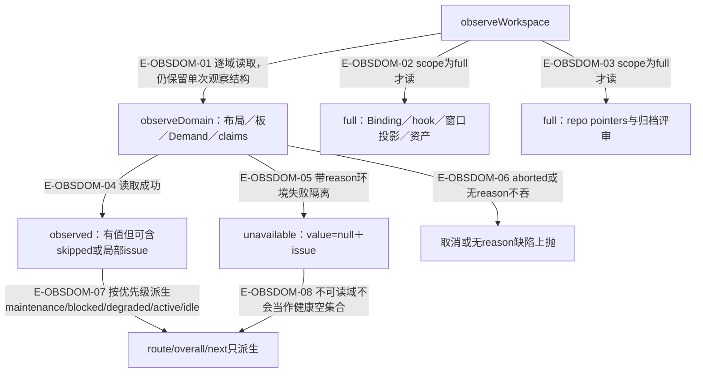
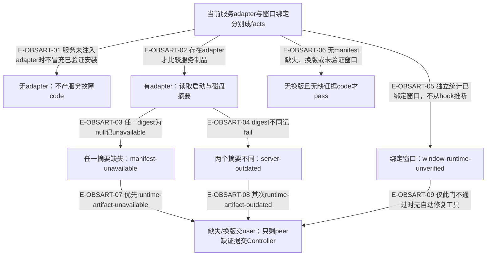

# Observation：域隔离、制品漂移与下一责任

> 核验于 2026-10-03，基线 `d8fafff` 加当前未提交工作树。图表达实际源码分支，未提交实现标为进行中；不把开发阶段计划当作运行事实。来源与测试锚点按本文精确范围列出。

## 分域读取：完整性与局部失败

```mermaid
flowchart TB
  accTitle: 分域读取：完整性与局部失败
  accDescr: 每个可隔离领域捕获有reason错误为unavailable，取消和无reason编程错误继续上抛；hook局部聚合只有扫描完成才可公开。
  a["observeWorkspace"]
  b["observeDomain：布局／板／Demand／claims"]
  h["full：Binding／hook／窗口投影／资产"]
  r["full：repo pointers与归档评审"]
  v["observed：有值但可含skipped或局部issue"]
  u["unavailable：value=null＋issue"]
  x["取消或无reason缺陷上抛"]
  o["route/overall/next只派生"]
  a -->|"E-OBSDOM-01 逐域读取，仍保留单次观察结构"| b
  a -->|"E-OBSDOM-02 scope为full才读"| h
  a -->|"E-OBSDOM-03 scope为full才读"| r
  b -->|"E-OBSDOM-04 读取成功"| v
  b -->|"E-OBSDOM-05 带reason环境失败隔离"| u
  b -->|"E-OBSDOM-06 aborted或无reason不吞"| x
  v -->|"E-OBSDOM-07 按优先级派生maintenance/blocked/degraded/active/idle"| o
  u -->|"E-OBSDOM-08 不可读域不会当作健康空集合"| o
```

### 本图术语说明

| 术语 | 本图含义 |
| --- | --- |
| issue | 说明本轮观察缺口；不是对业务状态的修改。 |
| 局部聚合 | hook扫描中latestBySession先存在函数本地，失败返回空map并显式unavailable；不存在用hook推定目标runtime身份的artifactBySession。 |
| overall | 综合朝向状态，不替代每道verify gate。 |

### 节点与源码定位

| 节点 | 文件 / 符号 | 职责 |
| --- | --- | --- |
| a | `src/governance/observation/workspace-observation.ts#observeWorkspace` | observeWorkspace |
| b | `src/governance/observation/workspace-observation.ts#observeDomain` | observeDomain：布局／板／Demand／claims |
| h | `src/governance/observation/workspace-observation.ts#observeWorkspace` | full：Binding／hook／窗口投影／资产 |
| r | `src/governance/observation/workspace-observation.ts#observeWorkspace` | full：repo pointers与归档评审 |
| v | `src/governance/observation/workspace-observation.ts#observeDomain` | observed：有值但可含skipped或局部issue |
| u | `src/governance/observation/workspace-observation.ts#observeDomain` | unavailable：value=null＋issue |
| x | `src/governance/observation/workspace-observation.ts#observeDomain` | 取消或无reason缺陷上抛 |
| o | `src/governance/observation/workspace-observation.ts#deriveOverallStatus` | route/overall/next只派生 |

### 本图边级证据

| 编号 | 代码证据 | 测试证据 | 关系依据 |
| --- | --- | --- | --- |
| E-OBSDOM-01 | `src/governance/observation/workspace-observation.ts#observeWorkspace` | `tests/governance/observation/workspace-observation.test.ts#observeWorkspace` | 逐域读取，仍保留单次观察结构 |
| E-OBSDOM-02 | `src/governance/observation/workspace-observation.ts#observeWorkspace` | `tests/governance/observation/workspace-observation.test.ts#observeWorkspace` | scope为full才读 |
| E-OBSDOM-03 | `src/governance/observation/workspace-observation.ts#observeWorkspace` | `tests/capabilities/observation/service.test.ts#executeStatusRequest` | scope为full才读 |
| E-OBSDOM-04 | `src/governance/observation/workspace-observation.ts#observeDomain` | `tests/governance/observation/workspace-observation.test.ts#observeWorkspace` | 读取成功 |
| E-OBSDOM-05 | `src/governance/observation/workspace-observation.ts#observeDomain` | `tests/governance/observation/workspace-observation.test.ts#observeWorkspace` | 带reason环境失败隔离 |
| E-OBSDOM-06 | `src/governance/observation/workspace-observation.ts#observeDomain` | `tests/governance/observation/workspace-observation.test.ts#observeWorkspace` | aborted或无reason不吞 |
| E-OBSDOM-07 | `src/governance/observation/workspace-observation.ts#deriveOverallStatus` | `tests/governance/observation/workspace-observation.test.ts#deriveOverallStatus` | 按优先级派生maintenance/blocked/degraded/active/idle |
| E-OBSDOM-08 | `src/governance/observation/workspace-observation.ts#deriveOverallStatus` | `tests/governance/observation/workspace-observation.test.ts#deriveOverallStatus` | 不可读域不会当作健康空集合 |

## 制品身份分支：服务证据与未验证窗口

```mermaid
flowchart TB
  accTitle: 制品身份分支：服务证据与未验证窗口
  accDescr: 服务启动与磁盘摘要属于本进程，已绑定窗口另计未验证；hook摘要不会把任何窗口变成current或stale，缺证据必须使严格核验不可用。
  a["当前服务adapter与窗口绑定分别成facts"]
  n["无adapter：不产服务故障code"]
  d["有adapter：读取启动与磁盘摘要"]
  u["任一摘要缺失：manifest-unavailable"]
  c["两个摘要不同：server-outdated"]
  w["绑定窗口：window-runtime-unverified"]
  p["无换版且无缺证据code才pass"]
  next["缺失/换版交user；只剩peer缺证据交Controller"]
  a -->|"E-OBSART-01 服务未注入adapter时不冒充已验证安装"| n
  a -->|"E-OBSART-02 存在adapter才比较服务制品"| d
  d -->|"E-OBSART-03 任一digest为null记unavailable"| u
  d -->|"E-OBSART-04 digest不同记fail"| c
  a -->|"E-OBSART-05 独立统计已绑定窗口，不从hook推断"| w
  a -->|"E-OBSART-06 无manifest缺失、换版或未验证窗口"| p
  u -->|"E-OBSART-07 优先runtime-artifact-unavailable"| next
  c -->|"E-OBSART-08 其次runtime-artifact-outdated"| next
  w -->|"E-OBSART-09 仅此门不通过时无自动修复工具"| next
```

### 本图术语说明

| 术语 | 本图含义 |
| --- | --- |
| 服务身份 | 组合根注入的当前MCP进程启动摘要；磁盘变化是这一进程的outdated，不是所有窗口的版本。 |
| peer runtime | 其他绑定窗口真正使用的MCP服务和已加载指令；当前缺宿主实例关联证据，只能unverified。 |
| hook观察器 | lastObservation.observerManifestDigest仅描述写hook的观察器；摘要相同或不同都不推出目标运行身份。 |
| 优先级 | 服务换版fail优先于其他unavailable；verifyNext中manifest-unavailable优先于server-outdated，peer缺证据与其他问题共存时先建议维护可修项。 |

### 节点与源码定位

| 节点 | 文件 / 符号 | 职责 |
| --- | --- | --- |
| a | `src/capabilities/observation/service.ts#gateFacts` | 当前服务adapter与窗口绑定分别成facts |
| n | `src/capabilities/observation/decide.ts#runtimeArtifactGate` | 无adapter：不产服务故障code |
| d | `src/capabilities/observation/service.ts#readRuntime` | 有adapter：读取启动与磁盘摘要 |
| u | `src/capabilities/observation/decide.ts#runtimeArtifactGate` | 任一摘要缺失：manifest-unavailable |
| c | `src/capabilities/observation/decide.ts#runtimeArtifactGate` | 两个摘要不同：server-outdated |
| w | `src/capabilities/observation/service.ts#unverifiedRuntimeWindowIds` | 绑定窗口：window-runtime-unverified |
| p | `src/capabilities/observation/decide.ts#runtimeArtifactGate` | 无换版且无缺证据code才pass |
| next | `src/capabilities/observation/decide.ts#verifyNext` | 缺失/换版交user；只剩peer缺证据交Controller |

### 本图边级证据

| 编号 | 代码证据 | 测试证据 | 关系依据 |
| --- | --- | --- | --- |
| E-OBSART-01 | `src/capabilities/observation/decide.ts#runtimeArtifactGate` | `tests/capabilities/observation/decide.test.ts#deriveWorkspaceGates` | 服务未注入adapter时不冒充已验证安装 |
| E-OBSART-02 | `src/capabilities/observation/service.ts#readRuntime` | `tests/capabilities/observation/service.test.ts#executeStatusRequest` | 存在adapter才比较服务制品 |
| E-OBSART-03 | `src/capabilities/observation/decide.ts#runtimeArtifactGate` | `tests/capabilities/observation/decide.test.ts#deriveWorkspaceGates` | 任一digest为null记unavailable |
| E-OBSART-04 | `src/capabilities/observation/decide.ts#runtimeArtifactGate` | `tests/capabilities/observation/decide.test.ts#deriveWorkspaceGates` | digest不同记fail |
| E-OBSART-05 | `src/capabilities/observation/service.ts#unverifiedRuntimeWindowIds` | `tests/capabilities/observation/service.test.ts#executeVerifyRequest` | 独立统计已绑定窗口，不从hook推断 |
| E-OBSART-06 | `src/capabilities/observation/decide.ts#runtimeArtifactGate` | `tests/capabilities/observation/decide.test.ts#deriveWorkspaceGates` | 无manifest缺失、换版或未验证窗口 |
| E-OBSART-07 | `src/capabilities/observation/decide.ts#verifyNext` | `tests/capabilities/observation/decide.test.ts#verifyNext` | 优先runtime-artifact-unavailable |
| E-OBSART-08 | `src/capabilities/observation/decide.ts#verifyNext` | `tests/capabilities/observation/decide.test.ts#verifyNext` | 其次runtime-artifact-outdated |
| E-OBSART-09 | `src/capabilities/observation/decide.ts#verifyNext` | 间接覆盖：`tests/capabilities/observation/decide.test.ts#verifyNext`；该专属peer-only分支当前无独立断言 | 仅此门不通过时无自动修复工具 |

## 确定性降级与动作顺序

status列表分别限量并报告略去条数：Demand256、窗口/claim512、Pod/仓库/worktree64、未合并结果256；不能以截断列表证明不存在。nextActions顺序为当前服务制品缺失/换版→维护→活动Pod未注册窗口→Demand前沿（primary先）→待认领包，去重且最多64条。

带demandId时先要求活动Demand域可观察；活动项读不出不会自动变为归档或not-found。非活动才找最大修订归档；完成归档可建议continue，取消无续接前沿。verify的追加Demand门只是附加字段，工作区ok来自15道工作区门。

## 继续阅读

[文件导入](./file-dependencies.md) · [运行分支](./runtime-call-flow.md) · [本模块总览](./README.md) · [全局入口](../README.md) · [本轮增量审阅](../../plans/review-2026-10-03/coordination.md) · [前轮完整审阅](../../plans/review-2026-10-02/coordination-evidence.md)
