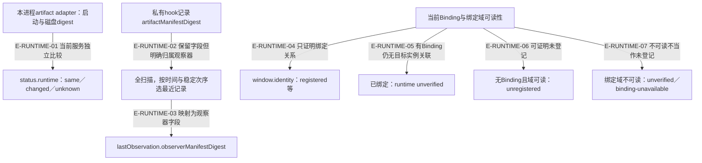

# 运行身份：观察器、服务、指令上下文分别需要证据

status/verify结果升级为v2，修正的是证据主体混淆。当前服务可以证明自身启动时读取的制品摘要以及磁盘是否更换；hook可以证明其观察器摘要；窗口Binding证明逻辑窗口与宿主会话关系。这些证据仍不足以证明其他窗口使用了哪个MCP实例及哪份指令上下文。

## 三种证据分别流向公开字段

### 本图术语说明

| 术语 | 本图含义 |
| --- | --- |
| same | 仅当前服务启动manifest与当前磁盘manifest相同；不是目标窗口已加载新instructions的证明。 |
| observerManifestDigest | 最近一条hook的生产者制品摘要，记录可能是SessionStart或之后其他hook事件。 |
| unverified | 当前实现没有target MCP/指令上下文关联证据，不等于已证明旧版本或故障。 |
| identity与runtime | registered只能证明窗口绑定；不能因登记成功就把runtime标current。 |

### 节点与源码定位

| 节点 | 文件 / 符号 | 职责 |
| --- | --- | --- |
| s | `src/capabilities/observation/service.ts#readRuntime` | 本进程artifact adapter：启动与磁盘digest |
| sv | `src/capabilities/observation/service.ts#assembleStatus` | status.runtime：same／changed／unknown |
| h | `src/kernel/hook-observations.ts#writeHostHookObservation` | 私有hook记录artifactManifestDigest |
| o | `src/governance/observation/workspace-observation.ts#observeHostHooks` | 全扫描，按时间与稳定次序选最近记录 |
| ov | `src/capabilities/observation/service.ts#lastObservationOf` | lastObservation.observerManifestDigest |
| b | `src/capabilities/observation/service.ts#windowBindingOf` | 当前Binding与绑定域可读性 |
| bv | `src/capabilities/observation/service.ts#windowViews` | window.identity：registered等 |
| u | `src/capabilities/observation/service.ts#windowViews` | 已绑定：runtime unverified |
| n | `src/capabilities/observation/service.ts#windowViews` | 无Binding且域可读：unregistered |
| x | `src/capabilities/observation/service.ts#windowViews` | 绑定域不可读：unverified／binding-unavailable |

### 本图边级证据

| 编号 | 代码证据 | 测试证据 | 关系依据 |
| --- | --- | --- | --- |
| E-RUNTIME-01 | `src/capabilities/observation/service.ts#readRuntime` | `tests/capabilities/observation/service.test.ts#executeStatusRequest` | 当前服务独立比较 |
| E-RUNTIME-02 | `src/governance/observation/workspace-observation.ts#observeHostHooks` | `tests/capabilities/observation/service.test.ts#executeStatusRequest` | 保留字段但明确归属观察器 |
| E-RUNTIME-03 | `src/capabilities/observation/service.ts#lastObservationOf` | `tests/capabilities/observation/service.test.ts#executeStatusRequest` | 映射为观察器字段 |
| E-RUNTIME-04 | `src/capabilities/observation/service.ts#windowViews` | `tests/capabilities/observation/service.test.ts#executeStatusRequest` | 只证明绑定关系 |
| E-RUNTIME-05 | `src/capabilities/observation/service.ts#windowViews` | `tests/capabilities/observation/service.test.ts#executeStatusRequest` | 有Binding仍无目标实例关联 |
| E-RUNTIME-06 | `src/capabilities/observation/service.ts#windowViews` | `tests/capabilities/observation/service.test.ts#executeStatusRequest` | 可证明未登记 |
| E-RUNTIME-07 | `src/capabilities/observation/service.ts#windowViews` | `tests/capabilities/observation/service.test.ts#executeStatusRequest` | 不可读不当作未登记 |

## 严格核验如何诚实表达缺口

| 可观察事实 | runtime-artifact门 | 下一责任 |
| --- | --- | --- |
| 服务启动与磁盘digest都已知且不同 | fail / server-outdated | user重连服务 |
| 已有adapter但任一digest缺失 | unavailable / manifest-unavailable | user检查安装或运行制品 |
| 任一已绑定窗口缺目标runtime关联；服务未判换版fail | unavailable / window-runtime-unverified:N | 若只有此门未通过，Controller核对；没有伪造的自动修复tool |
| 无adapter、也无已绑定窗口 | pass / not-applicable | 不宣称安装运行已验证 |
| 服务摘要一致且没有未验证窗口 | pass | 仅证明该门定义的范围 |

`window-runtime-projection`仍是一道独立门，只比较磁盘投影与Config＋Binding的重算；投影current不证明宿主读过这些指令。旧版窗口artifact current/stale字段不再保留，结果Schema严格准入v2，不存在旧字段兼容旁路。服务所有零写与脱敏保证仍须经相应测试，真实宿主实例关联目前没有生产者，不能补一条虚构边。

测试已经构造“hook摘要与当前服务相同”和“换观察器摘要”两种情况，窗口runtime在两者下均保持unverified；服务磁盘换版独立变changed。具体门与动作分支见[运行分支](./runtime-call-flow.md)。

## 继续阅读

[模块总览](./README.md) · [本轮增量审阅](../../plans/review-2026-10-03/coordination.md) · [总入口](../README.md)。
